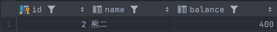
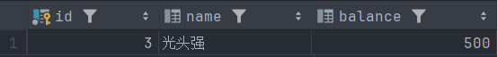
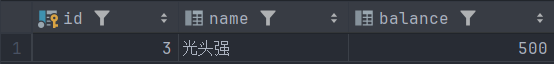
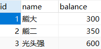
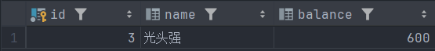
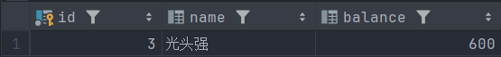
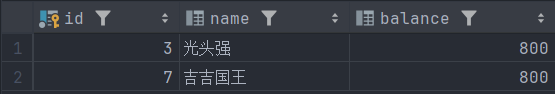

# 1. 什么是数据库事务？

事务（Transaction）是数据库中最小的工作单元，它表示一组必须作为一个整体执行的操作集合（要么全部执行成功，要么全部不执行）

>一个业务的完成可能需要多条 DML 语句（INSERT、UPDATE、DELETE）共同配合才能完成，例如转账业务，需要执行两条 DML 语句，先更新张三账户的余额，再更新李四账户的余额，为了保证转账业务不出现问题，就必须保证要么同时成功，要么同时失败，怎么保证同时成功或者同时失败呢？就需要使用事务机制。

****
# 2. 事务的四大特性

1、原子性（Atomicity）

>事务中的操作要么全部执行成功，要么全部不执行。事务中的所有 SQL 语句是一个整体，不允许只执行一部分，如果其中任何一条语句失败，事务将全部回滚，回到事务开始前的状态

例如：张三转账给李四的事务中，扣款成功但加款失败，整个事务回滚，张三的钱也恢复

2、一致性（Consistency）

>执行事务前后，数据库的数据应始终一致

例如：如果张三和李四总共有 5000 元，无论怎么转账，事务执行后，两人总额仍应为 5000

3、隔离性（Isolation）

>多个并发事务之间互不影响，彼此隔离，数据库通过设置事务隔离级别来控制隔离性的强度（例如：读未提交、读已提交、可重复读、串行化）

例如：A 正在修改账户余额，B 同时查询账户信息，如果没有隔离机制，B 可能读到 A 尚未提交的中间数据

4、持久性（Durability）

>一旦事务提交，对数据的更改就会永久保存，即使系统崩溃也不会丢失，数据库通过日志机制（如 redo log）来保证数据的持久化

例如：用户转账后显示“交易成功”，哪怕服务器突然断电，重启后数据仍然是已转账状态

****
# 3. MySQL 中的事务控制语句

如果 DML 语句执行成功就 COMMIT，否则 ROLLBACK：

```sql
START TRANSACTION;       -- 或 BEGIN;
-- 执行多个 DML 语句
COMMIT;                  -- 提交事务，数据永久生效
-- 或
ROLLBACK;                -- 回滚事务，撤销全部修改
```

需要注意的是：

>事务只作用于 INSERT、UPDATE、DELETE，不适用于 `CREATE`, `DROP`, `ALTER`（这些属于 DDL，执行即生效，不能回滚）

### 自动提交和手动提交

1、自动提交

MySQL 默认开启自动提交模式，每条语句执行后立即生效（自动提交事务）：

```sql
SELECT @@autocommit;  -- 查看是否开启自动提交
SET autocommit = 0;   -- 手动关闭自动提交
```


2、手动提交

当业务逻辑的完整性要求较高时推荐使用手动提交

```sql
SET autocommit = 0;        -- 关闭自动提交
START TRANSACTION;         -- 开始事务
-- 执行操作
COMMIT 或 ROLLBACK;        -- 提交或回滚
SET autocommit = 1;        -- 恢复自动提交
```

****
# 4. 事务的隔离级别

| 隔离级别                       | 脏读  | 不可重复读 | 幻读  | 说明                                         |
| -------------------------- | --- | ----- | --- | ------------------------------------------ |
| **READ UNCOMMITTED**（读未提交） | 可能  | 可能    | 可能  | 最低级别，事务可以读取其他未提交事务的数据，性能高但不安全              |
| **READ COMMITTED**（读已提交）   | 禁止  | 可能    | 可能  | 只能读取其他事务已提交的数据，防止脏读，大多数数据库默认级别（如 Oracle）。  |
| **REPEATABLE READ**（可重复读）  | 禁止  | 禁止    | 可能  | 同一个事务内多次读取的结果一致，防止不可重复读，MySQL InnoDB 的默认级别 |
| **SERIALIZABLE**（可串行化）     | 禁止  | 禁止    | 禁止  | 最严格，所有事务串行执行，防止所有并发问题，但效率最低                |

## 4.1 查看与设置隔离级别

1、查看

```sql
SELECT @@transaction_isolation;
-- 或者
SELECT @@global.transaction_isolation;
```


2、设置

作用范围的设置：

```sql
-- 设置当前会话隔离级别（只影响当前连接）
SET SESSION TRANSACTION ISOLATION LEVEL REPEATABLE READ;

-- 设置全局隔离级别（重启后仍然有效）
SET GLOBAL TRANSACTION ISOLATION LEVEL READ COMMITTED;
```

四种级别的设置：

```sql
-- 读未提交
SET SESSION TRANSACTION ISOLATION LEVEL READ UNCOMMITTED;
SET GLOBAL TRANSACTION ISOLATION LEVEL READ UNCOMMITTED;

-- 读已提交
SET SESSION TRANSACTION ISOLATION LEVEL READ COMMITTED;
SET GLOBAL TRANSACTION ISOLATION LEVEL READ COMMITTED;

-- 可重复读
SET SESSION TRANSACTION ISOLATION LEVEL REPEATABLE READ;
SET GLOBAL TRANSACTION ISOLATION LEVEL REPEATABLE READ;

-- 串行化
SET SESSION TRANSACTION ISOLATION LEVEL SERIALIZABLE;
SET GLOBAL TRANSACTION ISOLATION LEVEL SERIALIZABLE;
```

****
## 4.2 读未提交

将当前终端（A 终端）的事务隔离级别设置为读未提交 read uncommitted：

```sql
begin;  
select * from account where id = 2;
```

在终端 A 开启事务并查询熊二的账户余额


```sql
begin;
update account set balance = balance + 50 where id = 2;
```

在中端 B 开启事务并向熊二的账户余额添加 50 元 


>终端 A 事务读取到了终端 B 事务还未提交的数据，这个问题就是脏读，而终端 A 事务两次读取的数据不一致，这个问题就是不可重复读

****

然后 B 终端回滚数据，而 A 终端的事务对熊二账户余额进行减 50 元：

```sql
B：
rollback;
select * from account where id = 2;
```



```sql
A:
update account set balance = balance - 50 where id = 2;  
commit;  
select * from account where id = 2;
```

>此时可以看到熊二的账户余额变成了 350，并不是 400


整体时间线：

| 时间线 | 终端 A 事务                                                          | 终端 B 事务                                                   |
| --- | ---------------------------------------------------------------- | --------------------------------------------------------- |
| 1   | `begin;`                                                         |                                                           |
| 2   | `select * from account where id = 2; ` <br>读到熊二的账户余额为 400 元      |                                                           |
| 3   |                                                                  | `begin;`                                                  |
| 4   |                                                                  | `update account set balance = balance + 50 where id = 2;` |
| 5   | `select * from account where id = 2; ` <br>读到熊二的账户余额为 450 元 （脏读） |                                                           |
| 6   |                                                                  | `rollback;`                                               |
| 7   |                                                                  | `select * from account where id = 2;`<br>读到熊二的账户余额为 400 元 |
| 8   | `update account set balance = balance - 50 where id = 2;`        |                                                           |
| 9   | `commit;`                                                        |                                                           |
| 10  | `select * from account where id = 2;`<br>读到熊二的账户余额为 350 元 (不受影响) |                                                           |

>在应用程序中，如果一个事务读到脏数据，并作为其他业务逻辑的依据或者进行其他处理，但其并不知道其他会话回滚了事务，那么后续的整个逻辑处理都可能存在问题

****
## 4.3 读已提交

开启两个终端分别为 A 和 B，并将当前终端的事务隔离级别设置为读已提交 read committed：

```sql
set session transaction isolation level read committed;  
select @@session.transaction_isolation;
```


在终端 A 开启事务并查询光头强的账户余额：



在终端 B 开启事务，为光头强的账户余额增加 100 元：

```sql
begin;  
update account set balance = balance + 100 where id = 3;
```

>此时查询的光头强的账户余额仍然是 100 元，说明没有发生脏读问题



在终端 B 提交事务：

```sql
commit;
```

>此时终端 A 事务再次查询光头强的账户余额，查询到余额为 600 元，但因为两次查询的结果不一致，这就是不可重复读问题


整体时间线：

| 时间线 | 终端 A 事务                                                              | 终端 B 事务                                                    |
| --- | -------------------------------------------------------------------- | ---------------------------------------------------------- |
| 1   | `begin;`                                                             |                                                            |
| 2   | `select * from account where id = 3;`  <br>读到光头强的账户余额为 500 元         |                                                            |
| 3   |                                                                      | `begin;`                                                   |
| 4   |                                                                      | `update account set balance = balance + 100 where id = 3;` |
| 5   | `select * from account where id = 3;`  <br>读到光头强的账户余额为 500 元（不存在脏读）  |                                                            |
| 6   |                                                                      | `commit;`                                                  |
| 7   | `select * from account where id = 3;`  <br>读到光头强的账户余额为 600 元 （不可重复读） |                                                            |
| 8   | `commit;`                                                            |                                                            |

****
## 4.4 可重复读

开启两个终端分别为 A 和 B，并将当前终端的事务隔离级别设置为可重复读 repeatable read：

```sql
set session transaction isolation level repeatable read;
select @@session.transaction_isolation;
```


此时熊大、熊二、光头强的账户余额分别为 300 元、350 元、600 元



在终端 B 开启事务，为光头强的账户余额增加 100 元：

```sql
begin;
update account set balance = balance + 100 where id = 3;
```

此时终端 A 事务再次查询光头强的账户余额，查询到余额仍为 600 元，说明不存在脏读问题



在终端 B 提交事务：

```sql
commit;
```

此时终端 A 事务再次查询光头强的账户余额，查询到余额仍为 600 元，说明不存在不可重复读问题（这里可能会出现）



整体时间线：

| 时间线 | 终端 A 事务                                                                 | 终端 B 事务                                                    |
| --- | ----------------------------------------------------------------------- | ---------------------------------------------------------- |
| 1   | `begin;`                                                                |                                                            |
| 2   | `select * from account where id = 3;`  <br>读到光头强的账户余额为 600 元            |                                                            |
| 3   |                                                                         | `begin;`                                                   |
| 4   |                                                                         | `update account set balance = balance + 100 where id = 3;` |
| 5   | `select * from account where id = 3;`  <br>读到光头强的账户余额为 600 元 （不存在脏读）    |                                                            |
| 6   |                                                                         | `commit;`                                                  |
| 7   | `select * from account where id = 3;`  <br>读到光头强的账户余额为 600 元 （不存在不可重复读） |                                                            |
| 8   | `commit;`                                                               |                                                            |

****

**但在可重复读的事务隔离级别下，仍然存在幻读问题**

在终端 A 开启事务并查询 id 大于 2 的账户信息：此时只能查询到光头强的信息

在终端 B 开启事务，插入一条数据并提交，然后终端 A 再查询 id 大于 2 的账户信息：

>任然只读取到一条数据：[快照读解决幻读问题](事务.md#快照读解决幻读问题)


如果此时终端 A 事务执行把 id 大于 2 的账户余额都修改为 800：

>此时就查询到两条数据



整体时间线：

| 时间线 | 终端 A 事务                                                        | 终端 B 事务                                                  |
| --- | -------------------------------------------------------------- | -------------------------------------------------------- |
| 1   | `begin;`                                                       |                                                          |
| 2   | `select * from account where id > 2;`  <br>读到账户信息数据是 1 条       |                                                          |
| 3   |                                                                | `begin;`                                                 |
| 4   |                                                                | `insert into account (name,balance) values('吉吉国王',400);` |
| 5   |                                                                | `commit;`                                                |
| 6   | `select * from account where id > 2;`  <br>读到账户信息数据是 1 条       |                                                          |
| 7   | `update account set balance = 800 where id > 2;`               |                                                          |
| 8   | `select * from account where id > 2;`  <br>读到账户信息数据是 2 条（存在幻读） |                                                          |
| 9   | `commit;`                                                      |                                                          |

****
## 4.5 串行化

开启两个终端分别为 A 和 B，并将当前终端的事务隔离级别设置为串行化 serializable：

在终端 A 开启事务并查询 id 大于 2 的账户信息：

>可以看到查询得到的结果是 2 条数据


在终端 B 开启事务，插入一条数据：

```sql
begin;
insert into account (name,balance) values('蹦蹦',600);
```

>可以看到，在终端 B 事务执行新增操作时，会发生阻塞，锁超时后会抛出异常，需要在终端 A 提交事务后才能进行操作，以此避免幻读。


****
## 4.6 读问题分类

| 读问题类型 | 现象描述                                              | 产生原因              | 举例说明                                                    |
| ----- | ------------------------------------------------- | ----------------- | ------------------------------------------------------- |
| 脏读    | 事务 A 读取了事务 B 未提交的数据，事务 B 回滚后数据不存在                 | 读取了其他事务未提交的修改数据   | 事务 B 修改一条数据但未提交，事务 A 读取到了该未提交的数据                        |
| 不可重复读 | 事务 A 两次读取同一数据，中间被事务 B 修改并提交，导致读取结果不一致             | 同一行数据被其他事务提交的修改覆盖 | 事务 A 第一次查询某用户余额是100，事务 B 修改后变成 200，事务 A 第二次查询变成 200     |
| 幻读    | 事务 A 两次执行相同范围查询，第二次查询结果中出现了事务 B 插入或删除的符合条件的新行或缺少行 | 查询范围内被其他事务插入或删除数据 | 事务A查询年龄大于 30 的人有 5 条记录，事务 B 插入一条新记录满足条件，事务 A 第二次查询到 6 条 |

****
# 5. 当前读和快照读

>当前读是读取数据库中数据的最新版本，即读取的是当前时刻数据的真实值（包括未提交的改动，依隔离级别而定），会加锁（行锁或表锁），以此保证数据一致性；快照读是基于 MVCC 的数据读取方式，读取的是事务开始时数据的快照版本（历史版本），如果设置了自动提交事务那么每次都是读取最新的数据

需要注意的是：一般的 SELECT 语句使用的都是快照读，除非明确表明了使用当前读（`SELECT * FROM account WHERE id = 1 FOR UPDATE;  -- 当前读，对数据加锁`），而 DML 语句使用的都是当前读，底层会自动加锁，读取最新的数据

****
### 快照读解决幻读问题

>每个事务启动时都会创建一个Read View（快照视图），该事务只会在快照视图中查询，所以只能看到事务开始之前提交的数据以及自己事务内的修改，对其他活跃事务尚未提交或之后提交的修改不可见

所以：

- 事务 A 的快照视图已经固定，事务 B 插入的新行事务A看不到，因为可能在事务A启动后才插入并提交的
- 事务 A 第二次执行相同查询，查询结果依旧是第一次快照的那个“时间点”的数据，不会出现新插入的幻影行（多或者少掉的那行记录）

****
### 当前读如何解决幻读问题

>当前读通过加锁来防止其他事务对数据的插入、删除或修改，从而保证在一个事务中多次执行同一条件的查询时，结果不会出现“幻影行”，即解决了幻读问题

**具体锁机制：**

- 间隙锁（Gap Lock）：锁住满足查询条件的范围中可能被插入新行的“间隙”，阻止其他事务在该范围内插入新行
- 记录锁（Record Lock）：锁住具体的数据行，阻止其他事务修改或删除这些行

事务 A 对满足条件的行以及这些行之间的“间隙”加锁：

```sql
begin;
SELECT * FROM orders WHERE amount > 100 FOR UPDATE;  -- 当前读并加锁，锁定了所有金额大于100的行和范围
```

事务 B ：由于事务 A 在金额 > 100 的范围上持有间隙锁，事务 B 插入新的订单金额为 180 时会被阻塞，等待事务 A 提交或回滚

```sql
INSERT INTO orders VALUES (1003, 180);  -- 尝试插入一条满足条件的新行
```

### 出现幻读的情况：

|事务内多次读取类型|幻读风险|说明|
|---|---|---|
|多次快照读|可能出现幻读|不加锁，无法阻止其他事务插入新行|
|多次当前读|不会出现幻读|加锁，阻止其他事务插入/删除新行|
|先快照读再当前读|可能出现幻读|第一次快照读没锁，无法防止幻读|

