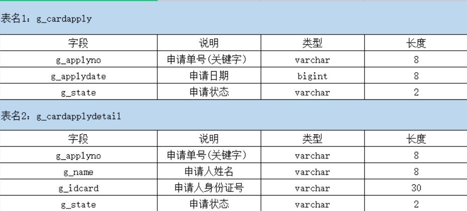

# 1. 用一条 sql 语句查询出每门课都大于 80 分的学生

| name | course | score |
| ---- | ------ | ----- |
| 张三   | 数学     | 85    |
| 张三   | 英语     | 90    |
| 李四   | 数学     | 75    |
| 李四   | 英语     | 88    |
| 王五   | 数学     | 92    |
| 王五   | 英语     | 95    |


```sql
select name from t_student group by name having min(score) > 80;
```

****
# 2. 模拟数据



其中，两个表的关联字段为申请单号。

先把两个表格写出来：

表1：g_cardapply

| g_applyno | g_applydate | g_state |
| --------- | ----------- | ------- |
| 1         | 2008/8/8    | 01      |
| 2         | 2022/10/11  | 01      |
| 3         | 2023/3/23   | 01      |
| 4         | 2007/12/12  | 02      |
| 5         | 2009/12/11  | 02      |

表2：g_cardapplydetail

| g_applyno | g_name | g_idcard        | g_state |
| --------- | ------ | --------------- | ------- |
| 1         | 张三     | 440401430103082 | 01      |
| 2         | 张三     | 440401430103082 | 01      |
| 3         | 张三     | 440401430103082 | 01      |
| 4         | 李四     | 540401265323220 | 02      |
| 5         | 王五     | 550401430103000 | 02      |

1）查询身份证号为 440401430103082 的申请日期。 

```sql
select a.g_applydate from g_cardapply a join g_cardapplydetail b on a.g_applyno = b.g_applyno where b.g_idcard = `440401430103082`
```

2）查询同一个身份证号码有两条以上记录的身份证号码及记录个数。 

```sql
select g_idcard,count(g_idcard) from g_cardapplydetail group by g_idcard having count(g_idcard) > 2;
```

3）将身份证号码为 440401430103082 的记录在两个表中的申请状态均改为 07。 

```sql
update g_cardapply a join g_cardapplydetail b on a.g_applyno = b.g_applyno and a.g_idcard = 440401430103082 set a.g_state = 07,b.g_state = 07;
```

4）删除 g_cardapplydetail 表中所有姓李的记录。

```sql
delete a,b from g_cardapply a join g_cardapplydetail b on a.g_applyno = b.g_applyno where b.g_name like '李%';
```

****
# 3. 统计

| Name | subject | score | studi |
| ---- | ------- | ----- | ----- |
| 张三   | 数学      | 89    | 1     |
| 张三   | 语文      | 80    | 1     |
| 张三   | 英语      | 70    | 1     |
| 李四   | 数学      | 90    | 2     |
| 李四   | 语文      | 70    | 2     |
| 李四   | 英语      | 80    | 2     |

（1）成绩统计：不及格（0-59）？个、良（60-80）？个、优（81-100）？个：

```sql
SELECT
  CASE
    WHEN score BETWEEN 0 AND 59 THEN '不及格'
    WHEN score BETWEEN 60 AND 80 THEN '良'
    WHEN score BETWEEN 81 AND 100 THEN '优'
  END AS 分数等级,
  COUNT(*) AS 人数
FROM stuscore
GROUP BY 分数等级;
```

（2）每科都及格的人的平均成绩：

```sql
select name,avg(score) from stuscore where studi in (select studi from stuscore group by studi having min(score) >= 60);
```

****
# 4. 系统有一个表 WCMEmploy （职工号，姓名，部门名，工种，工资），若需查询不同部门中担任 “钳工” 工种的职工的平均工资：

先画出表：employ

| empno | ename | dept | job | salary |
| ----- | ----- | ---- | --- | ------ |
| E001  | 张三    | 生产部  | 钳工  | 2200   |
| E002  | 李四    | 生产部  | 焊工  | 2000   |
| E003  | 王五    | 装配部  | 钳工  | 1800   |
| E004  | 赵六    | 装配部  | 钳工  | 2100   |
| E005  | 孙七    | 维修部  | 电工  | 2500   |
| E006  | 周八    | 装配部  | 钳工  | 2400   |
| E007  | 吴九    | 生产部  | 钳工  | 2000   |

（1）请用一个 SQL 语句查询出不同部门中担任 “钳工” 的职工平均工资。

```sql
select ename,dept,avg(salary) from employ where job = '钳工' group by dept;
```

（2）请用一个 SQL 语句查询出不同部门中担任 “钳工” 的职工平均工资高于 2 千的部门。

```sql
select ename,dept,avg(salary) from employ where job = '钳工' group by dept having sag(salary) > 2000;
```

****
# 5. 

Employee 是雇员信息表： 

>雇员姓名（主键）：person-name ；街道：street ；城市：city ；

Company 是公司信息表： 

>公司名称（主键）：company-name； 城市：city ；

Works 是雇员工作信息表：

>雇员姓名（主键）：person-name； 公司名称：company-name ；年薪：salary ；

Manages 是雇员工作关系表： 

>雇员姓名（主键）：person-name ；经理姓名：manager-name；

先画出表格：

employee：

| person-name | street       | city    |
|-------------|--------------|---------|
| bob         | 桃园一路     | 天津    |
| frank       | 蒲松龄街道   | 天津    |
| jack        | 南开一街     | 天津    |
| lucy        | 文化园一路   | 天津    |
| 周二        | 长安区       | 石家庄  |
| 张三        | 大兴区       | 北京    |
| 李四        | 海淀区       | 北京    |
| 王五        | 朝阳区       | 北京    |
| 赵六        | 裕华区       | 石家庄  |
| 钱七        | 新华区       | 石家庄  |

company：

| company-name           | city |
| ---------------------- | ---- |
| Small Bank Corporation | 北京   |
| 公司B                    | 石家庄  |
| 公司C                    | 天津   |

works：

| person-name | company-name           | salary   |
| ----------- | ---------------------- | -------- |
| bob         | 公司C                    | 22000.00 |
| frank       | 公司C                    | 99999.00 |
| jack        | 公司C                    | 6000.00  |
| lucy        | 公司C                    | 11000.00 |
| 周二          | 公司B                    | 31000.00 |
| 张三          | Small Bank Corporation | 11000.00 |
| 李四          | Small Bank Corporation | 5000.00  |
| 王五          | Small Bank Corporation | 8000.00  |
| 赵六          | 公司B                    | 12000.00 |
| 钱七          | 公司B                    | 21000.00 |

manages：

| person-name | manager-name |
| ----------- | ------------ |
| bob         | frank        |
| frank       |              |
| jack        | lucy         |
| lucy        | bob          |
| 周二          | jack         |
| 张三          | 李四           |
| 李四          | 王五           |
| 王五          | 赵六           |
| 赵六          | 钱七           |
| 钱七          | 周二           |

（1）找出所有居住地与工作的公司在同一城市的员工的姓名。

```sql
select e.person-name from employ 
join works w on e.person-name = w.person-name
join company c on e.company-name = c.company-name
where e.city = c.city;
```

（2）找出比 Small Bank Corporation 的所有员工收入都高的所有员工的姓名。

```sql
select person-name from works w1 where w1.salary > (select max(w2.salary) from works w2 where w2.company-name = 'Small Bank Corporation') 
```

（3）找出平均年薪在10000美元以上的公司及其平均年薪。

```sql
select company-name,avg(salary) from works group by company-name having avg(salary) > 10000;
```

****
# 6. 

**Client**

| client_id | client_name | phone    | address |
| --------- | ----------- | -------- | ------- |
| 1         | Zhao        | 82880001 | 海淀区     |
| 2         | Wang        | 82880002 | 朝阳区     |
| 3         | Sun         | 82881001 | 西城区     |
| 4         | Li          | 82880004 | 东城区     |

**ClientOrder**

| client_id | order_id |
| --------- | -------- |
| 1         | 11       |
| 1         | 11       |
| 2         | 12       |
| 2         | 13       |


**Order**

| order_id | book_id | quantity |
| -------- | ------- | -------- |
| 11       | 21      | 2        |
| 11       | 22      | 1        |
| 12       | 23      | 1        |
| 13       | 24      | 3        |


**Book**

|book_id|book_name|price|
|---|---|---|
|21|管理学|30.00|
|22|计算机网络|50.00|
|23|国家地理杂志|90.00|
|24|西游记|20.00|

（1）请写出一条SQL语句，查询出每个客户的所有订单并按地址排序。要求输出格式：

```
address  client_name  phone  order_id
```

```sql
select c.address,c.client_name,c.phone,co.order_id from client c join client_order co on c.client_id = co.client_id order by c.address;
```

（2）请写出一条SQL语句，查询出每个客户定购的图书总价。要求输出格式如下：

```
client_name  total_price
```

```sql
select c.client_name,sum(o.quantity * b.price) as total_price from client c 
join client_order co on c.client_id = co.client_id
join `order` o on co.order_id = o.order_id
join book b on o.book_id = b.book_id
group by c.client_name;
```

（3）如果要求每张订单可以包含多种图书，应该如何修改 Order 表的主键？为了保证每张订单只被一个客户拥有，应该在 ClientOrder 表上增加怎么样的约束（提示：使用索引）？

>一张订单中可以有多本图书，每种图书最多出现一次，因此联合主键使用 `PRIMARY KEY (order_id, book_id)`

>因为每张订单只属于一个客户，那么 `order_id` 不应重复出现在多条记录中，所以可以给 `order_id` 字段加上 `unique`

****
# 7. 

student

|s#|sname|sage|ssex|
|---|---|---|---|
|1|学生1|20|男|
|2|学生2|20|男|
|3|学生3|20|男|
|4|学生4|20|男|

course

| c#  | cname | t#  |
| --- | ----- | --- |
| 001 | 数学    | 1   |
| 002 | 语文    | 1   |
| 003 | 英语    | 2   |
| 004 | 政治    | 2   |

sc

| s#  | c#  | score |
| --- | --- | ----- |
| 1   | 1   | 65    |
| 1   | 2   | 66    |
| 1   | 3   | 66    |
| 1   | 4   | 69    |
| 2   | 1   | 55    |
| 2   | 2   | 66    |
| 2   | 3   | 76    |
| 2   | 4   | 86    |
| 3   | 1   | 96    |
| 3   | 2   | 99    |
| 3   | 3   | 70    |
| 3   | 4   | 60    |
| 4   | 3   | 65    |
| 4   | 4   | 99    |

teacher

| t#  | tname |
| --- | ----- |
| 1   | 叶平    |
| 2   | 李白    |


（1）查询"001"课程比"002"课程成绩高的所有学生的学号；

```sql
select s# from sc s1 join sc s2 on s1.s# = s2.s# where s1.c# = 001 and s2.c# = 002 and s1.score > s2.score;
```

（2）查询平均成绩大于60分的同学的学号和平均成绩；

```sql
select s#,avg(score) from sc group by s# having avg(score) > 60;
```

（3）查询所有同学的学号、姓名、选课数、总成绩；

```sql
select s.s#,s.sname,count(sc.c#),sum(sc.score) from studen s join sc on s.s# = sc.s# group by s.s#,s.sname;
```

（4）查询姓"李"的老师的个数；

```sql
select count(*) from teacher where tname like '李%';
```

（5）查询没学过"叶平"老师课的同学的学号、姓名；

```sql
select s.s#,s.sname from student s where s.s# not in 
(
	select sc.s# from sc
	join course c on sc.c# = c.c#
	join teacher t on c.t# = t.t#
	where t.tname = '叶平'
)
```

****
# 8. 

student

|s_id|s_name|
|---|---|
|1|学生1|
|2|学生2|
|3|学生3|
|4|学生4|

course

|c_id|c_name|
|---|---|
|C1|java|
|C2|oracle|
|C3|mysql|

score

|id|s_id|c_id|grade|
|---|---|---|---|
|1|1|C1|66|
|2|2|C1|77|
|3|3|C2|88|
|4|3|C3|99|
|5|3|C1|22|
|7|4|C2|33|
|8|4|C3|56|


（1）没有选修课程编号为"C1"的学生姓名

```sql
select s.s_name from student s where s.s_id not in (select s_id from score where c_id = 'C1');
```

（2）列出每门课程名称和平均成绩，并按照成绩排序

```sql
select c.c_name,avg(sc.grade) from course c join score sc on c.c_id = sc.c_id group by c.c_name order by sc.score desc;
```

（3）选了2门课以上的学生姓名

```sql
select s.s_name from student s 
join score sc on s.s_id = sc.s_id
group by s.s_id,s.s_name having count(sc.c_id) > 2;
```

****
# 9. 

T_TEMP

|year|season|count|
|---|---|---|
|2010|一季度|100|
|2010|二季度|200|
|2010|三季度|300|
|2010|四季度|400|
|2011|一季度|150|
|2011|二季度|250|
|2011|三季度|350|
|2011|四季度|450|

通过一条 sql 语句得出表格中的信息：

| year | 一季度 | 二季度 | 三季度 | 四季度 |
| ---- | --- | --- | --- | --- |
| 2010 | 100 | 200 | 300 | 400 |
| 2011 | 150 | 250 | 350 | 450 |

```sql

```

