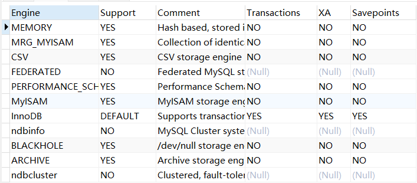

>存储引擎是 MySQL 中负责数据的存储、读取、更新和删除的底层实现模块（MySQL 只是数据库管理的外壳，存储引擎才是真正干活的），每个表在创建时都可以选择一种存储引擎，不同的引擎在性能、功能、事务支持等方面有所区别

指定存储引擎：

```sql
CREATE TABLE test_users (
  id INT PRIMARY KEY,
  name VARCHAR(100)
) ENGINE = InnoDB;
```

查看某张表使用的存储引擎：

```sql
SHOW TABLE STATUS LIKE '表名';
```

修改存储引擎：

```sql
ALTER TABLE 表名 ENGINE = InnoDB;
```

****
# 1. 工作原理

>存储引擎通过一系列的数据结构和算法来实现数据的物理存储和访问，它负责数据的持久化，即在系统关闭后数据不会丢失，并确保数据的完整性和一致性，存储引擎通常包括以下几个关键部分：

- **数据存储**：定义数据在磁盘上的物理结构，如行存储、列存储等
- **索引机制**：提供快速数据检索的方法，如 B+ 树、哈希索引等 
- **事务处理**：支持事务的提交、回滚和并发控制，确保数据的一致性和隔离性 
- **并发控制**：管理多个用户同时访问数据库时的数据一致性，如行级锁、表级锁等 
- **数据恢复**：在系统故障后恢复数据的能力，通常通过日志文件来实现

****
# 2. MySQL 支持的存储引擎类型




****
# 3. InnoDB 存储引擎

InnoDB 是 MySQL 默认的存储引擎：

- **事务支持**：InnoDB 是一个支持 ACID（原子性、一致性、隔离性、持久性）事务的存储引擎，可以确保数据的完整性和一致性
- **行级锁定**：InnoDB 使用行级锁定机制，允许并发处理和高并发读写操作，提供了更好的并发性能和并发控制
- **外键约束**：InnoDB 支持外键约束，可以在数据库级别实施数据完整性，确保关联表之间的数据一致性
- **崩溃恢复**：InnoDB 具有强大的崩溃恢复能力，通过使用重做日志和回滚日志来保证数据的持久性
- **自动增长列**：InnoDB 支持自动增长列，方便地生成唯一标识符
- **存储空间管理**：InnoDB 采用了多版本并发控制（MVCC）技术，可以在不锁定整个表的情况下执行并发读取和写入操作

## 1. 事务支持

InnoDB 是 MySQL 中唯一完全支持 **ACID** 的存储引擎：

- **原子性**：事务操作要么全部成功，要么全部失败
- **一致性**：事务执行前后，数据库都处于一致状态
- **隔离性**：多个事务并发执行时，彼此不互相干扰
- **持久性**：事务提交后，数据永久保存，即使系统崩溃也不会丢失

InnoDB 通过以下机制实现 ACID：

- Undo Log（撤销日志）：用于事务回滚和 MVCC 快照
- Redo Log（重做日志）：用于崩溃恢复，确保已提交数据不会丢失
- 两阶段提交协议（2PC）：协调 Redo 和 Binlog 的一致提交

****
## 2. 行级锁

InnoDB 使用行锁来支持高并发环境，常见的锁类型有：

- 共享锁：多个事务可以并发读取
- 排他锁：一个事务修改时，其他事务不能读写
- 意向锁：用于表示事务对某些行即将加锁，用于提高表级锁与行级锁的兼容性

****
## 3. MVCC（多版本并发控制）

>MVCC 是 InnoDB 实现读写并发的核心技术，基于撤销日志维护数据的多个版本，用于实现非阻塞读（即快照读）

****
## 4. 数据页结构与缓冲池

>InnoDB 的存储单元是页，默认大小 16KB，数据以页为单位读写，页由多个行组成，同一个表的数据行被组织在 B+ 树结构中

>而缓冲池就是用来提高读写效率的：读数据（先从缓冲池查找，找不到再从磁盘加载）；写数据（先写入缓冲池并标记为“脏页”，后台线程异步刷新到磁盘）

****
## 5. B+ 树索引

>InnoDB 中的数据文件本身就是一个主键索引（聚簇索引）的 B+ 树，叶子节点存储了完整的行数据，其他索引称为辅助索引，它们也是用 B+ 树来实现的，但它的叶子节点不存完整数据，而是存主键的值

****
# 6. 外键支持

>InnoDB 是 MySQL 中唯一支持外键约束的存储引擎

****


