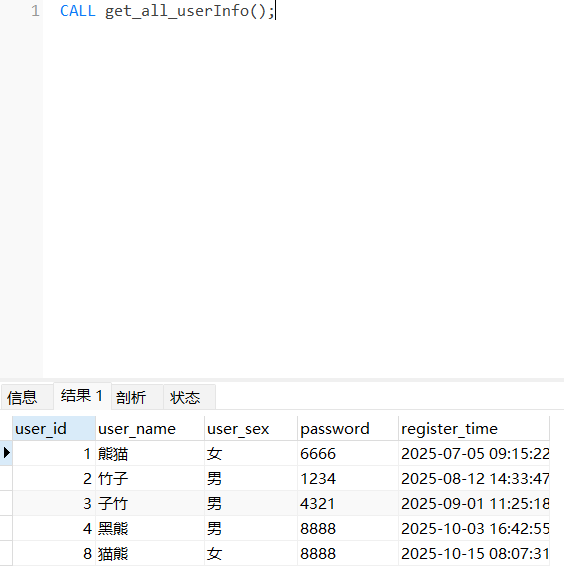
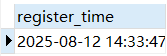
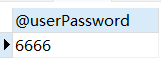
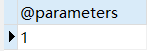
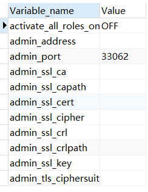
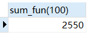

>MySQL 的存储过程（Stored Procedure）是一组预编译好并保存在数据库中的 SQL 语句集合，可以带参数，在需要时通过调用执行，将代码抽象为方法，当之后需要使用时，不需要再重写一遍代码，而是直接根据名称调用相应的方法即可

# 1. 概述

>常规的`SQL`语句在执行时需要先经过编译、分析、优化等过程，最后再执行，而存储过程则不需要，一般存储过程都是预先已经编译过的

### 优点

1、复用性

>存储过程创建一次后便可多次调用，对于数据库结构的变更，只需要修改数据库中的存储过程，无需修改业务代码，这也就意味着不会影响到调用它的应用程序源代码

2、灵活性

>可使用流程控制语句（如 `IF...ELSE`、`WHILE`、`LOOP`），也可定义局部变量、游标，适合复杂计算

3、省资源

>普通的`SQL`一般都会存储在客户端，如 Java 中的 `dao/mapper` 层，每次执行`SQL`需要通过网络将`SQL`语句发送给数据库执行，而存储过程是保存在`MySQL`中的，因此当客户端调用存储过程时，只需要通过网络传送存储过程的调用语句和参数，无需将 `SQL` 语句通过网络传输，从而降低网络负载

4、性能高

>存储过程执行多次后，会将 `SQL` 语句编译成机器码驻留在线程缓冲区，在以后的调用中，只需要从缓冲区中执行机器码即可，无需再次编译执行，从而提高了系统的效率和性能

5、安全性

>对于不同的存储过程，可根据权限设置执行的用户，因此对于一些特殊的 `SQL`，例如清空表这类操作，可以设定 `root、admin` 用户才可执行；同时由于存储过程编写好之后，对于客户端而言是看不见的，因此减小了 `SQL` 被暴露的风险

****
### 缺点

1、CPU 开销大

>MySQL 的核心职责是数据的存储和检索，而不是复杂的业务逻辑计算，存储过程本质上是运行在 MySQL 线程中的脚本，但它无法充分利用多核并发优化，所以对于大量分支判断、循环、临时数据处理等任务，就会造成会 MySQL 单线程处理压力极大，从而影响业务的执行效率

2、内存占用高

>每一个 MySQL 连接（线程）都有自己的内存空间，当一个数据库连接反复调用某个存储过程后，MySQL 会直接将该存储过程的机器码放入到连接的内存空间，当 MySQL 中的大量连接都在频繁调用存储过程时，必然会导致内存占用率飙升

3、维护性差

>一方面是过于复杂的存储过程，毕竟存储过程类似于一门新的语言，不同语言之间跨度较大。另一方面是很少有数据库的存储过程支持 `Debug` 调试，MySQL 的存储过程就不支持，这也就意味着`Bug`出现时，无法像应用程序那样正常调试排查，必须得采取人肉排查模式，即一步步拆解存储过程并排查

****
# 2. 存储过程的语法

```sql
DELIMITER $

CREATE -- 创建的语法
	PROCEDURE 存储过程名 ([IN|OUT|INOUT] 参数名 数据类型, ...)
BEGIN
    -- 存储过程体
END$$

DELIMITER ;
```

`SQL` 的存储过程与方法一样，同样也支持四种定义，主要依赖于 `IN`、`OUT`、`INOUT` 三个关键字来区分：

- 定义存储过程时，没有入参也没有出参，代表无参无返回类型
- 定义存储过程时，仅定义了带有 `IN` 类型的参数，表示有参无返回类型
- 定义存储过程时，仅定义了带有 `OUT` 类型的参数，表示无参有返回类型
- 定义存储过程时，同时定义了带有 `IN`、`OUT` 类型的参数，或定义了带有 `INOUT` 类型的参数，表示有参有返回类型

`DELIMITER $` 干什么的？

>它表示指定结束标识，在 `MySQL` 中默认是以 `;` 分号作为一条语句的结束标识，如果在存储过程的过程体中包含了`SQL`语句，并且 `SQL` 语句以`;`结束时，MySQL 会认为存储过程的定义也结束了，过程体就会和 `;` 结束符冲突，所以一般需要要重新定义结束符，例如 `DELIMITER $`，表示以 `$` 作为结束标识，只有当 MySQL 识别到 `$` 符时，才会认为结束了

但在结束之后，要再次把结束符改回 `;` ，即 `DELIMITER ;` 

存储过程体中可以指定存储过程的约束条件，取值范围有很多（但通常使用默认的），如下：

1、`LANGUAGE SQL`

>说明存储过程中的过程体是否由 `SQL` 语句组成

2、`[NOT] DETERMINISTIC`

>说明存储过程的返回值是否为固定的，没有`[NOT]`表示为固定的，默认为非固定的

3、`{ CONTAINS SQL | NO SQL | READS SQL DATA | MODIFIES SQL DATA }`

>说明过程体使用`SQL`语句的限制：

- `CONTAINS SQL`：表示当前存储过程包含 `SQL` ，但不包含读写数据的 `SQL` 语句
- `NO SQL`：表示当前存储过程中不包含任何 `SQL` 语句
- `READS SQL DATA`：表示当前存储过程中包含读数据的 `SQL` 语句
- `MODIFIES SQL DATA`：表示当前存储过程中包含写数据的 `SQL` 语句

4、`SQL SECURITY { DEFINER | INVOKER }`

>说明哪些用户可以调用当前创建的存储过程：

- `DEFINER`：表示只有定义当前存储过程的用户才能调用
- `INVOKER`：表示任何具备访问权限的用户都能调用

5、`COMMENT '....'`

>注释信息，可以用来描述当前创建的存储过程

****
## 2.1 存储过程的定义

| user_id | user_name | user_sex | password | register_time        |
|---------|-----------|----------|----------|---------------------|
| 1       | 熊猫      | 女       | 6666     | 2025-07-05 09:15:22 |
| 2       | 竹子      | 男       | 1234     | 2025-08-12 14:33:47 |
| 3       | 子竹      | 男       | 4321     | 2025-09-01 11:25:18 |
| 4       | 黑熊      | 男       | 8888     | 2025-10-03 16:42:55 |
| 8       | 猫熊      | 女       | 8888     | 2025-10-15 08:07:31 |

### 1. 查询用户表的所有用户信息

```sql
DELIMITER $

CREATE 
    -- 定义存储过程的名称为：get_all_userInfo()
    PROCEDURE get_all_userInfo()
BEGIN
    -- 存储过程体：由一条查询全表的 SQL 组成
    select * from `users`;
    
END $

DELIMITER ;
```


```sql
CALL get_all_userInfo();
```

>所有存储过程都是通过`CALL`命令来调用



****
### 2. 接收一个用户名，查询用户的注册时间

```sql
DELIMITER $

CREATE 
    -- 在定义存储过程时，用 IN 声明了一个入参
    PROCEDURE get_user_register_time(IN name varchar(255))
BEGIN
    select register_time from `users` where user_name = name;
END $

DELIMITER ;
```

```sql
CALL get_user_register_time("竹子");
```



>在定义带有参数的存储过程时要注意：参数名必须在参数类型的前面，同时参数类型需要定义长度，也就是 `varchar(255)` ，而并非 `varchar` ，否则低版本的 `MySQL` 会出现不兼容的问题

****
### 3. 查询 `ID=1` 的用户密码并返回

```sql
DELIMITER $

CREATE 
    -- 在定义存储过程时，用 OUT 声明了一个返回值
    PROCEDURE get_user_password(OUT userPassword varchar(255))
BEGIN
    select password into userPassword from `users` where user_id = 1;
END $

DELIMITER ;
```

```sql
CALL get_user_password(@userPassword);
select @userPassword;
```



>调用一个带 `OUT` 参数的存储过程时，需要提供一个用于接收返回值的“用户变量”，也就是 `@变量名` ，所以存储过程运行后，会把查出的 `password` 赋值给 `userPassword` ，这个值通过 OUT 机制传回到传进去的 `@userPassword` ，后续通过 `select` 查询

****
### 4. 接收一个用户名，返回该用户名对应的用户 ID

```sql
DELIMITER $

CREATE 
    -- 在定义存储过程时，用 OUT 声明了一个返回值
    PROCEDURE get_user_id(INOUT parameters varchar(255))
BEGIN
    select user_id into parameters from `users` where user_name = parameters;
END $

DELIMITER ;

-- 等价于
PROCEDURE get_user_id(IN userName varchar(255), OUT userId INT)
BEGIN
    SELECT user_id INTO userId FROM zz_users WHERE user_name = userName;
END

```

>上述存储过程中，利用 `INOUT` 定义了一个参数 `parameters` ，在存储过程体当中，使用它作为查询参数，也使用它作为保存返回值的变量

```sql
-- 定义一个变量
set @parameters = "熊猫";
-- 将定义的变量传入
CALL get_user_id(@parameters);
-- 查询定义的变量
select @parameters;

-- 等价于
SET @name = '熊猫';
CALL get_user_id(@name, @id);
SELECT @id;
```



>存储过程中的返回值并不像 Java 语言中的 `return` ，而是通过变量传递的方式来实现

****
# 3. 系统变量、用户变量和局部变量

##### 系统变量

>在 MySQL 启动后，其内部也会存在许多的系统变量，系统的意思是指由 MySQL 定义的，而并非用户自己定义的，一般系统变量要么来自于 MySQL 编译期，要么来自于 `my.ini` 配置文件

查看系统变量：

```sql
-- 查看所有系统变量
SHOW VARIABLES;

-- 查看全局变量
SELECT @@global.xxx;

-- 查看当前会话变量
SELECT @@session.xxx;
```



修改变量：

```sql
-- 修改全局变量（需管理员权限）
SET GLOBAL max_connections = 300;

-- 修改当前会话变量
SET SESSION sql_mode = 'STRICT_ALL_TABLES'; -- 启用严格模式对所有表的严格数据校验
```

>全局变量的修改**不会影响已经建立的连接**，只有新连接才会生效

****
##### 用户变量

>用户变量是自定义的变量，通常用于存储临时值，用于多条 SQL 语句之间共享数据

定义与赋值：

```sql
-- 使用等号赋值
SET @变量名 = '变量值';

-- 使用 := 赋值
SET @age := 20;

-- 在 SELECT 中赋值
SELECT @count := COUNT(*) FROM students;
```

查询变量：

```sql
SELECT @name, @age;
```

>变量名以 `@` 开头，不需要声明数据类型，只在当前会话中有效，断开连接后自动销毁

****
##### 局部变量

>局部变量是在存储过程或函数中定义的变量，仅在该过程或函数的 `BEGIN...END` 块内可见，类似于方法中的定义的变量

必须使用 `DECLARE` 语句，并在过程体内最前面声明：

```sql
DECLARE 变量名 数据类型 DEFAULT 默认值;

DECLARE message varchar(255) default "not message";
```

赋值方式：

```sql
-- 赋值方式一
SET message = 变量值;
SET message := 变量值;

-- 赋值方式二
select 字段名或函数 into message from 表名;
```

```sql
DELIMITER $

CREATE 
    -- 定义了一个 求两数之和 的存储过程
    PROCEDURE add_value(IN number1 int(8), OUT result int(8))
BEGIN
    -- 这里定义了一个局部变量：number2，默认值为 666
    DECLARE number2 int(8) default 666;
    -- 将两个数字相加，计算得到的和放入用户变量 result 中
    SET result := number1 + number2;
END $

DELIMITER ;

-- 定义一个用户变量，接收调用存储过程后得到的和
SET @result = 0;
-- 调用存储过程，传入一个数字 888 以及接收结果的 result 变量
CALL add_value(888,@result);
-- 查询计算后的和
SELECT @result;
```

****
# 4. 流程控制 - IF 判断与 CASE 分支

### 1. 条件判断：IF

```sql
IF 条件判断 THEN
    -- 分支操作.....
ELSEIF 条件判断 THEN
    -- 分支操作.....
ELSE
    -- 分支操作.....
END IF
```

- `IF ... THEN`（必需）
- `ELSEIF ... THEN`（可选，可多个）
- `ELSE`（可选）

```sql
DELIMITER $

CREATE 
    PROCEDURE if_user_age(IN age int, OUT msg varchar(255))
BEGIN		
    IF age < 18 THEN
        SET msg := '未成年';
    ELSEIF age = 18 THEN
        SET msg := '刚成年';
    ELSE
        SET msg := '已成年';
		END IF;
		
END $

DELIMITER ;

SET @msg := "Not Data"; 
CALL if_user_age(16,@msg); 
SELECT @msg; -- 未成年

CALL if_user_age(18,@msg); 
SELECT @msg; -- 刚成年

CALL if_user_age(25,@msg); 
SELECT @msg; -- 已成年
```

****
### 2. 分支判断：CASE

`CASE` 类似于 Java 中的 `switch` ，有两种写法：

```sql
-- 第一种语法
CASE 变量
    WHEN 值1 THEN
        -- 分支操作1....
    WHEN 值2 THEN
        -- 分支操作2....
    .....
    ELSE
        -- 分支操作n....
END CASE;
    
-- 第二种语法
CASE
    WHEN 条件判断1 THEN
        -- 分支操作1....
    WHEN 条件判断2 THEN
        -- 分支操作2....
    .....
    ELSE
        -- 分支操作n....
END CASE;
```

```sql
-- 第一种
DELIMITER $

CREATE 
    PROCEDURE test_case(IN n int)
BEGIN		
    CASE n
		WHEN 1 THEN
			select '竹子好看';
		WHEN 2 THEN
			select '熊猫好看';
		ELSE
			select '两个都好看';
	END CASE;
END $

DELIMITER ;

-- 第二种
DELIMITER $

CREATE PROCEDURE check_score(IN score INT)
BEGIN
    CASE
        WHEN score >= 90 THEN SELECT '优秀';
        WHEN score >= 75 THEN SELECT '良好';
        WHEN score >= 60 THEN SELECT '及格';
        ELSE SELECT '不及格';
    END CASE;
END $

DELIMITER ;

CALL check_score(85);  -- 输出：良好
```

****
# 5. 循环：LOOP、WHILE、REPEAT

### 1. LOOP循环

```sql
循环名称:LOOP
    -- 循环体....
END LOOP 循环名称;
```

>存储过程的循环与其他编程语言的循环不同，在存储过程中可以给每个循环取一个名字，后续可以基于这个名字来跳出循环，但如果想要跳出一个循环，还需要结合 `LEAVE` 这个关键字，否则会令循环成为一个死循环

```sql
DELIMITER $

CREATE 
    PROCEDURE test_loop(IN num int)
BEGIN		
	-- 定义一个局部变量：num
	DECLARE num int(8) default 1;
		
    add_loop:LOOP
        -- 对 num + 1 一直循环
        SET num = num + 1;
        -- 当 num 被加到 100 时
        IF num >= 100 THEN
            -- 跳出循环
            LEAVE add_loop;
        END IF;
    END LOOP add_loop;
		
		select num;
END $

DELIMITER ;
```

****
### 2. WHILE循环

```sql
循环名称:WHILE 循环条件 DO
    -- 循环体....
END WHILE 循环名称;
```

```sql
DELIMITER $

CREATE 
    PROCEDURE test_while()
BEGIN
		-- 定义一个局部变量：num
	DECLARE num int(8) default 1;
		
		-- 对 num + 1 循环，当 num <=10 时退出
    WHILE num <= 10 DO
        -- 一直循环对 num + 1
        SET num = num + 1;
    END WHILE;
		
		-- 最后查询一下 num 值
		SELECT num;
END $

DELIMITER ;
```

****
### 3. REPEAT循环

```sql
循环名称:REPEAT
    -- 循环体....
UNTIL 结束循环的条件判断
END REPEAT 循环名称;
```

```sql
DELIMITER $

CREATE 
    PROCEDURE test_repeat()
BEGIN
    DECLARE num int(8) default 1;
        
    REPEAT
    	SET num = num + 1;
    UNTIL num>=10 
    END REPEAT;		
    
    -- 最后查询一下num值
    SELECT num;
END $

DELIMITER ;
```

>因为 WHILE 和 REPEAT 自带终止条件，所以不用强制命名结束循环

****
# 6. 跳转：LEAVE、ITERATE

>`LEAVE`、`ITERATE` 两个跳转的关键字，其实本质上就和 Java 中的 `break`、`continue` 类似，`LEAVE` 主要功能是结束循环体，当执行循环体时遇到了`LEAVE` 关键字，就会结束当前循环。而`ITERATE` 则是跳出本次循环，继续下次循环的意思，作用与 `continue` 相同

```sql
-- 测试 ITERATE 关键字跳出循环
DELIMITER $

CREATE 
    PROCEDURE test_iterate()
BEGIN
	-- 定义一个局部变量：num
	DECLARE num int(8) default 0;
        -- 定义一个局部变量用来统计偶数和
        DECLARE even_sum int(8) default 0;

		sum_while:WHILE num <= 100 DO
			-- 对 num 持续做 +1
			SET num = num + 1;
			
			IF num % 2 = 0 THEN
				SET even_sum = even_sum + num;
			ELSE
				-- 如果 num 不为偶数则跳过本次循环
				ITERATE sum_while;
			END IF;

		END WHILE sum_while;
		
		-- 最后查询一下偶数之和
		SELECT even_sum;
END $

DELIMITER ;
```

****
# 7. 存储过程的游标

>游标的核心作用就是将查询结果集逐行读取，并对每一行执行相应的逻辑操作，，`SELECT` 查询一次性返回所有结果，而游标的使用可以逐条处理每一行，类似于 Java 中迭代器 `Iterator` 的效果

游标的使用：

```sql
-- 1.声明（创建）游标
DECLARE 游标名称 CURSOR FOR select ...;

-- 2.打开游标
OPEN 游标名称;

-- 3.使用游标
FETCH 游标名称 INTO 变量名称;

-- 4.关闭游标
CLOSE 游标名称;
```

例如：打印每个学生的成绩

```sql
DELIMITER $

CREATE PROCEDURE print_all_scores()
BEGIN
	-- 定义一个变量 done，用于标识游标是否已读取完毕（默认设为 FALSE）
    DECLARE done INT DEFAULT FALSE;
    
    DECLARE sid INT;
    DECLARE cid VARCHAR(10);
    DECLARE g INT;
    
    DECLARE cur CURSOR FOR SELECT s_id, c_id, grade FROM score;
	
	-- 当游标到达末尾，找不到记录时，设置 done = TRUE，用于跳出循环
    DECLARE CONTINUE HANDLER FOR NOT FOUND SET done = TRUE;
    
    OPEN cur;
    read_loop: LOOP
        FETCH cur INTO sid, cid, g;
        IF done THEN
            LEAVE read_loop;
        END IF;
        
        SELECT CONCAT('学生ID:', sid, ' 课程:', cid, ' 成绩:', g);
    END LOOP;
    CLOSE cur;
END$

DELIMITER ;
```

使用游标的场景：

- 需要对结果集每一行进行复杂的逻辑处理（如计算、判断等）
- 对某些值进行逐行判断后分类插入
- 多表联合查询后按行处理或聚合
- 分批处理或定制输出格式

****
# 8. 捕捉异常并处理

在存储过程中可能出现各种异常，比如：

- 主键冲突（重复插入）
- 查询失败
- 游标读取超限
- 没有查到数据（结果为空）
- 数据类型转换错误等

>如果不处理这些异常，存储过程就会中断执行

```sql
DECLARE 处理类型 HANDLER
    FOR 触发条件
    异常触发后的代码;
```

```sql
DECLARE CONTINUE HANDLER FOR SQLEXCEPTION 
BEGIN
    -- 插入错误信息日志
    INSERT INTO error_log(msg) VALUES('执行失败');

    -- 设置用户变量
    SET @error_flag = 1;
END;
```

处理类型：

- `CONTINUE`：继续执行后面的语句（常用）
- `EXIT`：终止当前 `BEGIN...END` 块（类似抛出异常）

触发条件：

- `NOT FOUND`：游标或 `SELECT INTO` 无数据（没找到）
- `SQLEXCEPTION`：执行错误（如插入失败、更新失败）
- `SQLWARNING`：警告类问题

```sql
DELIMITER $

CREATE PROCEDURE get_user_age(IN uname VARCHAR(50), OUT uage INT)
BEGIN
    DECLARE CONTINUE HANDLER FOR NOT FOUND SET uage = -1;

    SELECT age INTO uage FROM users WHERE username = uname;
END $

DELIMITER ;
```

>如果查询不到该用户，则将 `uage` 设置为 -1

****
# 9. 存储函数

>存储函数是自定义的函数，由 MySQL 存储在数据库中，可以在 SQL 语句中调用，用于计算并返回一个值

```sql
DELIMITER $$

CREATE FUNCTION 函数名(参数名 参数类型, ...) -- 输入参数，不能有 OUT 或 INOUT
RETURNS 返回值类型
[DETERMINISTIC | NOT DETERMINISTIC]
[READS SQL DATA | MODIFIES SQL DATA | CONTAINS SQL | NO SQL]
BEGIN
    -- 函数体
    DECLARE 局部变量;
    ...
    RETURN 返回值;
END $$

DELIMITER ;
```

- `DETERMINISTIC` ：表示函数对相同输入总是返回相同结果
- `NOT DETERMINISTIC`：表示可能返回不同结果（默认）
- `READS SQL DATA`：表示函数读取数据但不修改
- `MODIFIES SQL DATA`：表示函数可修改数据
- `CONTAINS SQL`：表示函数体包含 SQL
- `NO SQL`：表示函数不包含 SQL

创建函数：计算 1~n 的所有偶数之和

```sql
-- 删除函数
drop function if exists sum_fun;

-- 创建函数
create function sum_fun(n int)
returns int deterministic 
begin 
	declare result int default 0;
	while n > 0 do 
		if n % 2 = 0 then 
			set result := result + n;
		end if;
		set n := n - 1;
	end while;
	return result;
end;

-- 调用函数
set @result = sum_fun(100); -- select sum_fun(100);
select @result;
```



****


