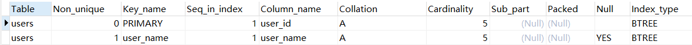

>索引是 MySQL 中用于提高查询效率的关键机制，其本质是数据库表中一列或多列值的有序数据结构，通过索引可以快速定位数据，而不用每次都全表扫描

****
# 1. 概述

## 1.1 索引的创建

1、 使用 CREATE 语句

```sql
-- 普通索引
CREATE INDEX 索引名 ON 表名 (字段名(length) [ASC|DESC]);

-- 唯一索引
CREATE UNIQUE INDEX 索引名 ON 表名(字段名);

-- 组合索引
CREATE INDEX 索引名 ON 表名(字段1, 字段2);
```

2、使用 ALTER 语句

```sql
-- 普通索引
ALTER TABLE 表名 ADD INDEX|KEY 索引名(字段名(length) [ASC|DESC]);

-- 唯一索引
ALTER TABLE 表名 ADD UNIQUE INDEX 索引名(字段名);

-- 组合索引
ALTER TABLE 表名 ADD INDEX 索引名(字段1,字段2);
```

3、建表时 DDL 语句中创建

```sql
CREATE TABLE 表名(  
  字段1 INT(8) NOT NULL,   
  字段2 ....,
  .....,
  INDEX 索引名 (字段名(length))  
);
```

****
## 1.2 查询、删除、指定索引

1、查询索引

```sql
SHOW INDEX FROM 表名;
```



- `Non_unique`：是否唯一索引（0 表示唯一，1 表示非唯一）
- `Key_name`：索引名称（如 PRIMARY）
- `Seq_in_index`：索引中字段的顺序（1 表示第一个字段）
- `Column_name`：被索引的列名
- `Collation`：列在索引中的排序方式：`A` 表示升序，`D` 表示降序，`NULL` 表示未排序
- `Cardinality`：基数，表示索引中唯一值的估计数量（影响查询优化器选择）
- `Sub_part`：索引的前缀长度(如果是部分索引)，`NULL` 表示整列被索引
- `Packed`：键是否被压缩，`NULL` 表示未压缩
- `Null`：列是否允许包含 NULL 值
- `Index_type`：索引类型，如 BTREE、FULLTEXT

2、删除索引

```sql
ALTER TABLE 表名 DROP INDEX 索引名;
```

>需要注意的是：不能通过 `DROP INDEX` 删除主键索引，需要用 `DROP PRIMARY KEY` 

3、指定索引

MySQL 默认由查询优化器选择最优索引，但可以通过以下方式手动指定使用某个索引：

```sql
-- 强制使用某个索引，哪怕优化器认为其他方式更快
SELECT * FROM 表名 FORCE INDEX (索引名) WHERE 条件;

-- 建议使用指定索引，但如果优化器认为不可行，可不使用
SELECT * FROM 表名 USE INDEX (索引名) WHERE 条件;

-- 告诉优化器不要使用某个索引
SELECT * FROM 表名 IGNORE INDEX (索引名) WHERE 条件;
```

****
## 1.3 索引的本质

>索引本质上是磁盘上的一种特殊数据结构文件，它和表一样都是物理数据的一部分，因此与表数据相同，最终创建出的索引也会在磁盘生成本地文件，不过索引文件在磁盘中的存储方式是由索引的数据结构来决定的，同时，由于索引机制最终是由存储引擎实现，因此不同存储引擎下的索引文件保存在本地的格式也并不相同

需要注意的是：

>创建索引并不是单纯的给表添加一个约束，而是基于原表的数据，重新在磁盘中创建新的本地索引文件，假设表中有一千万条数据，那创建索引时，就需要将索引字段上的一千万个值全部拷贝到本地索引文件中，同时做好排序并与表数据产生映射关系

****
# 2. 索引的分类

## 2.1 功能层次

|类型|简要说明|适用场景|
|---|---|---|
|**主键索引（PRIMARY KEY）**|表中唯一的主键，不能重复，不能为空|用于唯一标识一条记录|
|**唯一索引（UNIQUE）**|索引列的值必须唯一，但可以为 `NULL`|限制列值不能重复，如身份证号、邮箱|
|**普通索引（INDEX / KEY）**|没有限制的索引，值可重复可为空|提高普通字段查询效率|
|**组合索引（联合索引）**|多个字段组成一个索引|支持多个字段作为筛选条件的查询|
|**全文索引（FULLTEXT）**|用于文本搜索，可分词匹配|适合对大文本字段（如文章）做模糊搜索|
|**空间索引（SPATIAL）**|用于存储几何数据的字段|多用于地理信息系统（GIS）应用|

### 1. 主键索引（PRIMARY KEY）

>表中只能有一个主键索引，自动具有唯一性约束，不能为 `NULL`，在 InnoDB 中主键索引就是聚簇索引

```sql
CREATE TABLE user (
  id INT PRIMARY KEY,
  name VARCHAR(50)
);
```

****
### 2. 唯一索引（UNIQUE）

>保证列中的数据是唯一不可重复的，但允许 `NULL`（多个 NULL 也是允许的），也可以创建多个唯一索引

```sql
CREATE UNIQUE INDEX 索引名 ON 表名(字段);
```

****
### 3. 普通索引（INDEX / KEY）

>没有唯一性限制，可以重复，主要是提高 `WHERE` 、`ORDER BY` 的查询效率

```sql
CREATE INDEX 索引名 ON 表名(字段);
```

****
### 4. 组合索引

>由多个列组成的索引，常用于多条件查询，遵循最左前缀原则：只要满足索引列的最左边一部分（即满足字段 1），也能被使用

```sql
CREATE INDEX 索引名 ON 表名(字段1, 字段2);

CREATE INDEX name_age ON user(name, age);
SELECT * FROM user WHERE age = 18; -- 这种查询就用不上组合索引
```

****
### 5. 全文索引

>支持自然语言的分词搜索，适合大文本内容，但只支持 `CHAR`、`VARCHAR`、`TEXT`，仅 InnoDB（MySQL 5.6+）和 MyISAM 支持

```sql
CREATE TABLE 表名 (
  id INT PRIMARY KEY,
  content TEXT,
  FULLTEXT(content)
);
```

```sql
SELECT * FROM 表名 WHERE MATCH(字段) AGAINST('具体内容');
```

****
### 6. 空间索引

>用于几何数据类型（如 `POINT`、`LINESTRING`），只能用于 MyISAM 引擎（InnoDB 也在支持中，但受限较多）

****
## 2.2 数据结构层次

| 数据结构       | 索引类型        | 特点              |
| ---------- | ----------- | --------------- |
| **B+ 树索引** | 主键、唯一、普通、组合 | 默认结构，适合范围查找     |
| **哈希索引**   | MEMORY 引擎   | 快速定位，无法排序或做范围查找 |
| **倒排索引**   | 全文索引        | 支持关键字搜索、模糊匹配    |
| **R-Tree** | 空间索引        | 专用于二维空间坐标查找     |

#### 1. 哈希索引

>Hash 索引的底层结构是一个哈希表，它的工作方式是：对插入的索引列做一次哈希函数运算，得出一个哈希码，然后将这个值映射到哈希桶中并存储在对应桶中对应的数据地址

但哈希索引不适合做范围查找：

>因为哈希值是无序的，相近值可能 hash 结果相差极远，并且它不具有比较大小的能力，本质上是用来判断是否相等的，所以适合于精准查询

虽然 InnoDB 不支持哈希索引，但它有一个自适应哈希索引机制，会自动根据热点查询构建 Hash 索引，提高效率。这个过程由引擎自动控制，使用者不需要也无法主动创建

****
#### 2. B+ 树索引

[B+ 树索引](B+%20树索引.md)

****
## 2.3 存储方式层次（聚簇与非聚簇）

从存储方式来看，`MySQL`的索引主要可分为两大类：

- 聚簇索引：也被称为聚集索引、簇类索引
- 非聚簇索引：也叫非聚集索引、非簇类索引、二级索引、辅助索引、次级索引

[4. 聚簇索引与非聚簇索引的查找过程](B+%20树索引.md#4.%20聚簇索引与非聚簇索引的查找过程)

****

## 2.4 其他索引

### 1. 二级索引

>除主键以外的其他索引，比如在 name、email、phone 上建的索引，都是“二级索引”，在 InnoDB 中二级索引 = 非聚簇索引

****
### 2. 覆盖索引

>覆盖索引是指查询需要的所有字段都被某个索引覆盖，不需要回表到聚簇索引中去查询原始数据

```sql
CREATE TABLE users (
  id INT PRIMARY KEY,
  name VARCHAR(50),
  age INT,
  email VARCHAR(100),
  INDEX name_age (name, age)
);
```

```sql
SELECT name, age FROM users WHERE name = '熊猫';

-- 下面这个就不是覆盖索引
SELECT name, age, email FROM users WHERE name = 'Alice';
```

>查询使用 `name_age` 索引，查询的字段 `name` 和 `age` 都在这个索引中，所以 MySQL 不需要回表，直接从 `name_age` 中获取数据

****
# 3. 优缺点

## 1. 优点

1、提高数据查询速度（主要优点）

>通过构建如 B+ 树、哈希表等结构，可以减少数据库查找的磁盘 IO 次数，在没有索引的情况下，全表扫描可能需要读取成千上万条记录；有索引后，只需几次树的遍历即可定位数据

2、加速排序操作

>在 B+ 树中叶子节点内的键值是升序排列的，所有叶子节点之间通过指针连接，形成一个升序的链表结构，所以对有索引的字段进行排序时就可以避免额外的排序开销

3、加速分组和去重操作（GROUP BY、DISTINCT）

>因为 B+ 树的叶子节点存储的键值是按升序排序的，所以当参与分组的字段作为索引时，底层就会自动达到分组的效果，去重同理，避免了先全表扫描再操作的情况

4、提高连接查询效率（JOIN）

>当没有索引时 MySQL 只能根据外键去另一张表全表扫描找到对应的记录，也就是嵌套了一次查询过程，当使用索引时就可用提高这两次查询的效率

5、提高 WHERE 子句中条件过滤效率

>这些字段是过滤条件，查询经常需要通过这些字段定位数据，在这些字段上建立索引可以避免全表扫描。比如 user_id、order_id 通常是唯一或少量重复的，适合索引；如果字段取值只有几种，比如 `sex = '男' or '女'`，则不适合加索引（选择性太低）

6、支持唯一性约束（UNIQUE）

>唯一索引可以防止重复数据的插入，保证字段值的唯一性

****
## 2. 缺点

1、占用磁盘

>每个索引都是独立的数据结构（如 B+ 树、哈希表等），需要额外的存储空间，而多个索引同时存在会显著增加存储成本，尤其在数据量大时

2、降低数据写入性能（INSERT/UPDATE/DELETE）

- **插入：** 插入一条记录时，数据库除了写入数据，还必须更新所有相关索引结构
- **更新：** 若更新的字段是索引字段，可能会导致索引重建或重新排序，成本高
- **删除：** 删除数据时也需要同步更新索引结构
- **总结：** 写操作越频繁，索引带来的负担越明显

>但整体的性能相比其他结构降低的并不多：[B+ 树索引](B+%20树索引.md)

3、管理复杂度增加

>数据库管理员或开发者需要根据查询情况合理设计索引，而索引太多可能会导致优化器选择错误索引，从而降低查询效率

4、查询优化器可能不会使用索引

- **查询条件不合理**：如 `WHERE YEAR(create_time) = 2023` （使用了 `YEAR()` 函数，数据库必须先对每一行的数据都执行一次函数，然后再比较结果），这样做相当于绕开了索引，数据库无法通过索引快速跳转到目标范围，只能一个个比

- **模糊查询失效**：如 `LIKE '%keyword%'` ，`%` 在前，意味着要查找任意位置包含 keyword 的字符串，此时 MySQL 就会每一条记录的 name 字段是否匹配，就不会使用 B+ 树索引（但可用全文索引）

- **类型不匹配或函数处理**：索引列参与函数或类型转换都会导致索引失效

****
# 4. 什么时候使用索引

## 1. 主键字段：必须加索引（隐式）

>主键是记录的唯一标识，因为其查询频率高，必然使用索引，数据库系统会自动在主键字段上创建唯一索引

## 2. 。。。。。。

[1. 优点](索引.md#1.%20优点)

****


