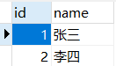
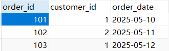
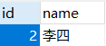
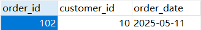

>约束（Constraint）是数据库表中用于限制字段取值范围的规则，用于保证数据的完整性、一致性 和准确性

|约束类型|关键词|作用说明|
|---|---|---|
|主键约束|`PRIMARY KEY`|唯一标识一行记录，不能重复，不能为 NULL|
|非空约束|`NOT NULL`|字段值不能为空|
|唯一约束|`UNIQUE`|字段值必须唯一，可以有 NULL|
|默认值约束|`DEFAULT`|设置字段的默认值|
|外键约束|`FOREIGN KEY`|建立与另一张表的关系|
|检查约束|`CHECK`|限制字段的取值范围（MySQL 8.0+支持）|

# 1. 非空约束

>非空约束（`NOT NULL`）用于确保某个列在插入或更新数据时不能为 NULL（空值）

## 1、创建表时添加非空约束

```sql
CREATE TABLE student (
    id INT PRIMARY KEY,
    name VARCHAR(50) NOT NULL,
    age INT
);
```

>表示 `name` 字段不能为 NULL，而 `age` 可以为 NULL

## 2、修改已有表，添加非空约束

```sql
ALTER TABLE student
MODIFY name VARCHAR(50) NOT NULL;
```

>如果原先字段是 NULL 的，想改成 NOT NULL，该字段的记录中就不能有已有的 NULL 值，否则会报错

## 3、插入或更新数据时的影响

如果某个字段已经使用了非空约束，那么就不能添加 NULL 记录：

```sql
INSERT INTO student (id, name) VALUES (1, NULL); -- 报错
UPDATE student SET name = NULL WHERE id = 1; -- 报错
```

****
# 2. 检查约束

>`CHECK` 约束是一种列级或表级约束，用于限制列中存储的数据必须满足指定的逻辑表达式（通常是布尔条件），即让字段的值必须符合一定条件才能被插入或更新

## 1、在建表时定义 CHECK

1、列级：

```sql
CREATE TABLE student (
    id INT PRIMARY KEY,
    name VARCHAR(50) NOT NULL,
    age INT CHECK (age >= 0 AND age <= 150)
);
```

>限制 `age` 必须在 0 到 150 之间

2、表级：

```sql
CREATE TABLE employee (
    id INT PRIMARY KEY,
    name VARCHAR(50) NOT NULL,
    salary DECIMAL(10,2),
    CHECK (salary >= 0)
);
```

>限制整个表中 `salary` 字段必须大于等于 0

## 2、使用 ALTER TABLE 添加检查约束（默认表级）

```sql
ALTER TABLE employee
ADD CONSTRAINT chk_salary CHECK (salary >= 0);
```

>`chk_salary` 是自定义的约束名

****
# 3. 唯一性约束

>唯一性约束（`UNIQUE`）用于确保表中某个字段的值不能重复，但可为 NULL 

## 1、在建表时添加

1、列级：

```sql
CREATE TABLE student (
    id INT PRIMARY KEY,
    name VARCHAR(50),
    email VARCHAR(100) UNIQUE
);
```

>限制 `email` 字段中的值必须唯一

2、表级：

```sql
CREATE TABLE student (
    id INT,
    name VARCHAR(50),
    email VARCHAR(100),
    CONSTRAINT unq_email UNIQUE (email)
);
```

>`unq_email` 是自定义约束名（不自定义名字就可以省略 CONSTRAINT），它是表级唯一约束，但功能同样是限制 `email` 唯一

## 2、使用 ALTER TABLE 添加约束

```sql
ALTER TABLE student
ADD CONSTRAINT unq_email UNIQUE (email);
```

****
# 4. 主键约束

>主键约束（`PRIMARY KEY`）是用于唯一标识表中每一条记录的约束，保证数据唯一且非空

## 1、创建表时指定单字段主键

1、列级：

```sql
CREATE TABLE student (
    id INT PRIMARY KEY,
    name VARCHAR(50)
);
```

自增主键：

```sql
CREATE TABLE student (
    id INT PRIMARY KEY AUTO_INCREMENT,
    name VARCHAR(50)
);
```

>一个表中只能有一个 `AUTO_INCREMENT` 字段，`AUTO_INCREMENT` 字段必须设为 `PRIMARY KEY` 或 `UNIQUE`

2、表级：

```sql
CREATE TABLE student_course (
    student_id INT,
    course_id INT,
    CONSTRAINT pk_student_course PRIMARY KEY (student_id, course_id)
);
```

>联合主键由两个字段组合而成，两个字段的组合值必须唯一，单独字段可重复

## 2、使用 ALTER TABLE 添加主键

```sql
ALTER TABLE student
ADD CONSTRAINT pk_student PRIMARY KEY (id);
```

## 3、删除主键约束

```sql
ALTER TABLE student
DROP PRIMARY KEY;
```

****
# 5. 外键约束

>外键约束（`FOREIGN KEY`）是用于建立两个表之间关联关系的一种约束，外键列的值必须来自另一个表中某列（通常是主键或唯一键），子表（使用外键的表）中的值必须引用父表中存在的记录

## 1、创建表时定义外键

1、表级：

```sql
CREATE TABLE orders (
    order_id INT PRIMARY KEY,
    customer_id INT,
    CONSTRAINT fk_customer FOREIGN KEY (customer_id)
        REFERENCES customers(id)
);
```

2、列级：

```sql
CREATE TABLE orders (
    order_id INT PRIMARY KEY,
    customer_id INT REFERENCES customers(id)
);
```

>将自己的字段 `customer_id` 声明为外键，引用另一个表的 `id` 字段作为内容

## 2、使用 ALTER TABLE 添加外键

```sql
ALTER TABLE orders
ADD CONSTRAINT fk_customer FOREIGN KEY (customer_id)
REFERENCES customers(id);
```

## 3、删除外键约束

```sql
ALTER TABLE orders
DROP FOREIGN KEY fk_customer;
```

## 4、级联操作

>级联操作是指当父表（被引用表）中的数据发生修改（删除或更新）时，自动影响到子表（引用表）中对应的记录

| 操作类型                 | 说明                                |
| -------------------- | --------------------------------- |
| `ON DELETE CASCADE`  | 当父表中的某行被删除时，自动删除子表中所有引用这行的记录      |
| `ON DELETE SET NULL` | 当父表中的某行被删除时，自动将子表对应的外键列设置为 `NULL` |
| `ON DELETE RESTRICT` | 不允许删除父表中有被子表引用的行（默认行为）            |
| `ON UPDATE CASCADE`  | 当父表中的主键被更新时，自动更新子表对应的外键值          |
| `ON UPDATE SET NULL` | 当父表中的主键被更新时，自动将子表对应的外键列设置为 `NULL` |


### 使用

```sql
CREATE TABLE customers (
    id INT PRIMARY KEY,
    name VARCHAR(50)
);

CREATE TABLE orders (
    order_id INT PRIMARY KEY,
    customer_id INT,
    order_date DATE,
    FOREIGN KEY (customer_id) REFERENCES customers(id)
      ON DELETE CASCADE
      ON UPDATE CASCADE
);
```

- `ON DELETE CASCADE`：当删除 `customers` 中某个 `id` 时，`orders` 中所有 `customer_id` 是这个 `id` 的行都会自动删除
- `ON UPDATE CASCADE`：当更新 `customers` 中某个 `id` 的值时，`orders` 中对应的 `customer_id` 会自动更新

```sql
INSERT INTO customers VALUES (1, '张三'), (2, '李四');
INSERT INTO orders VALUES (101, 1, '2025-05-10'), (102, 2, '2025-05-11'), (103, 1, '2025-05-12');
```





**ON DELETE CASCADE**

```sql
DELETE FROM customers WHERE id = 1;
```

>这条语句会删除 `customers` 中 `id=1` 的记录（张三），同时 `orders` 中所有 `customer_id=1` 的订单（101 和 103）也会被自动删除




**ON UPDATE CASCADE**

```sql
UPDATE customers SET id = 10 WHERE id = 2;
```

- `customers` 表中 id 为 2 的记录，更新为 id = 10
- 由于设置了 `ON UPDATE CASCADE`，`orders` 表中所有 `customer_id=1` 的记录会自动更新为 10



>需要注意的是：级联操作只对定义了外键约束的列有效，级联删除有风险，尤其是误删父表数据时会自动连带删除大量子表数据，`ON DELETE SET NULL` 会将子表中外键字段设置成 NULL，前提是该字段允许为 NULL

****

