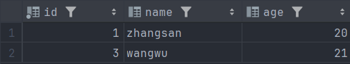

>视图（View）是基于 SQL 查询结果的虚拟表，本身不存储实际数据，而是将一个或多个基础表（或其他视图）的查询结果以表格形式呈现出来。可以像操作普通表那样对视图进行 `SELECT` 查询（在某些情况下也可进行 `INSERT`、`UPDATE`、`DELETE` 操作）。视图其实就是对 SQL 语句的一种封装，让复杂 SQL 简化成可复用的虚拟表，下次使用直接从虚拟表中 SELECT 就行

# 1. 视图的创建与使用

```sql
CREATE VIEW 视图名称 AS
SELECT 查询语句;
```

例如：查询所有大于 18 岁的学生

```sql
CREATE VIEW adult_students AS
SELECT id, name, age
FROM student
WHERE age >= 18;
```

```sql
select * from adult_students;
```



****
# 2. 更新视图

```sql
-- 如果视图不存在就 CREATE，否则就 REPLACE
CREATE OR REPLACE VIEW 视图名 AS
SELECT 新查询语句;
```

```sql
CREATE OR REPLACE VIEW high_score_students AS
SELECT name, score
FROM exam
WHERE score > 95;
```

需要注意的是，视图只有基本表满足以下条件才能更新：

- 只引用一个基本表
- 没有使用 `GROUP BY`、`DISTINCT`、`UNION`、聚合函数
- 没有子查询或窗口函数
- 没有使用 `LIMIT`、`HAVING`
- SELECT 中字段必须能唯一映射到底层表字段

****
# 3. 删除视图

```sql
DROP VIEW 视图名;
```


