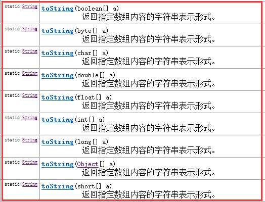
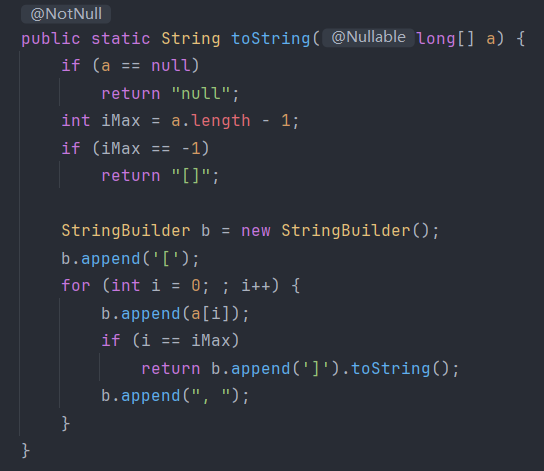

>Arrays工具类中的方法都是静态方法，直接通过`Arrays.方法名`调用方法

### 1.toString方法

>Arrays的toString方法并没有重写Object的，这是Arrays工具类中特有的方法，可以把数组转换成字符串，但是这个方法只能输出一维数组，若是二维数组依然只能输出每个元素的地址

>因为二维数组其实是“一维的数组对象数组”，所以 `toString()` 只是调用了每个内部数组的 `Object.toString()`，就变成了地址打印

**Arrays.deepToString()**

>这个方法是专门用来处理多维数组或嵌套对象数组的，可以通过内部的递归方法来实现深入每一个数组的内部，以此完成数组转换成字符串

### 2.binarySearch方法

>二分查找方法，使用前需要把传入的数组进行排序

>当找不到指定元素时会返回一个负值

### 3.sort方法

>sort方法可以对数组进行排序，也可以指定需要排序的元素的下标

**parallelSort方法**

>它是并行版本的sort方法，可以启动多核运行，适用于大数组排序

### 4.copyOf()方法

>复制数组，也可以选择部分复制或者扩容数组

