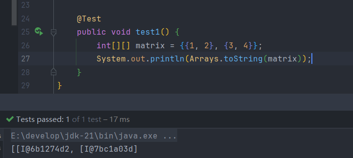

>Arrays工具类中的方法都是静态方法，直接通过`Arrays.方法名`调用方法

### 1.toString方法

>Arrays的toString方法并没有重写Object的，这是Arrays工具类中特有的方法，可以把数组转换成字符串，但是这个方法只能输出一维数组，若是二维数组依然只能输出每个元素的地址

>因为二维数组其实是“一维的数组对象数组”，所以 `toString()` 只是调用了每个内部数组的 `Object.toString()`，就变成了地址打印

**Arrays.deepToString()**

>这个方法是专门用来处理多维数组或嵌套对象数组的，可以通过内部的递归方法来实现深入每一个数组的内部，以此完成数组转换成字符串，如果数组对象是引用类型的话就会自动调用该对象内部的toString方法

### 2.binarySearch方法

>二分查找方法，使用前需要把传入的数组进行排序

>当找不到指定元素时会返回一个负值

### 3.sort方法

>sort方法可以对数组进行排序，也可以指定需要排序的元素的下标

**parallelSort方法**

>它是并行版本的sort方法，可以启动多核运行，适用于大数组排序

### 4.copyOf()方法

>复制数组，也可以选择部分复制(只能从0号位开始)或者扩容数组

>这个copyOf方法返回的是一个新的数组

**数组扩容**

>多余的部分会根据数组的类型自动添加默认值

**System.arraycopy()与Arrays.copyOf()**

>System.arraycopy()方法是把原数组的元素复制到另一个更大的数组中，需要手动创建一个新的更大的数组，但是Arrays.copyOf()可以直接选择把原数组复制成多大的新数组，它会自动创建新数组，但是不能随意选择需要的元素

### 5.copyOfRange()方法

>它和 `copyOf()` 类似，但它允许指定复制的“起止下标范围”，适合做数组截取、切片、范围复制等操作

**更灵活的数组扩容**

>copyOfRange()方法也能用来实现数组扩容，它可以灵活的选择想要的部分元素

### 6.equals()方法

>比较两个数组中的元素是否相等

>如果数组元素是对象，那么就会调用每个对象自己的equals方法进行比较

### 7.fill()方法

>将数组中的所有元素或部分元素设置为同一个值，可以作用于基本数据类型数组和引用类型数组

>可以填充全部数组，也可以指定范围

### 8.asList()方法

>将一个数组转换为一个 固定长度的 List

>用这个方法创建的List是固定大小的，所以不能对这个List进行增和删，只能修改元素

**使用基本数据类型的数组时可能会出错**

>`Arrays.asList()` 方法会将输入数组的元素转化为一个 List，如果传入的是基本数据类型数组，它就无法正确地被拆解成单独的元素，而是将整个数组作为一个对象添加到 `List` 中，因为基本数据类型数组本身是一个对象，所以并不能像引用类型数组那样输出所有元素

>所以基本数据类型的数组可以通过手动添加的方式把数组中的元素添加进List中

### 9.Comparable接口

>这个接口中定义了一个比较对象大小的方法，当要实现自定义对象比较大小时就需要类实现这个接口，然后重写方法自定义比较的规则

>因为一个类中会有很多个属性，一般没办法对这个类的对象进行排序，但是重写了compareTo方法后就可以自定义一个比较的规则，比较该对象的某个属性，根据属性的大小进行排序，所以Comparable接口常和Arrays.sort()和Arrays.binarySearch()搭配使用

**字符串类型的比较**

>String类底层已经自动重写了compareTo方法，所以可以直接实现字符串的比较

>根据名字对对象进行排序

>从这里也能看出Arrays.binarySearch()方法的查找是根据对象的排序属性决定的

**多属性条件**

>根据每个数据类型的比较的返回值来判断当前作为首要判断属性是否相等，相等就判断第二属性，以此类推

>因为使用了多属性条件，所以查询对象时需要填写对应的属性，不然会导致找不到

