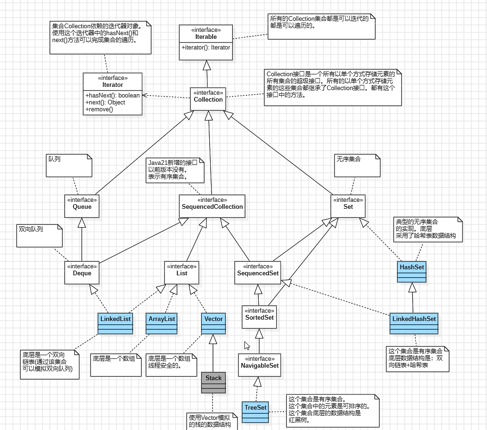

## 1. Collection接口

>`Collection` 是一个接口，位于 `java.util` 包中，它是单列集合的根接口，表示一组元素的集合，是接口，不可以直接实例化，必须使用它的子接口或实现类，如 `List`、`Set`

**单列集合**

>只有值没有键的集合

****
## 2. 常用方法

| 方法名                                 | 功能              |
| ----------------------------------- | --------------- |
| `add(E e)`                          | 添加一个元素          |
| `addAll(Collection<? extends E> c)` | 添加一个集合的所有元素     |
| `remove(Object o)`                  | 删除指定元素          |
| `removeAll(Collection<?> c)`        | 删除所有与参数集合中相同的元素 |
| `retainAll(Collection<?> c)`        | 只保留与参数集合中相同的元素  |
| `clear()`                           | 清空集合            |
| `contains(Object o)`                | 判断是否包含某个元素      |
| `containsAll(Collection<?> c)`      | 判断是否包含集合中所有元素   |
| `isEmpty()`                         | 判断集合是否为空        |
| `size()`                            | 返回集合大小          |
| `iterator()`                        | 返回迭代器，用于遍历      |
| `toArray()`                         | 转为 Object 数组    |
| `toArray(T[] a)`                    | 转为指定类型的数组       |

>集合的底层是重写了 `equals` 方法的，而 `remove(Object o)` 和 `contains(Object o)` 在使用时会调用 `equals` 方法的，所以只要传入的对象的内容相等（对象内部已重写 `equals` 方法），就会返回 `true`

****
## 3. Collection的通用迭代

>就是用统一的方式遍历 `Collection` 中的所有元素，而不依赖于集合的具体类型（如是否有索引等）

```java
Iterator it = collection.iterator();
```

>每次调用 `iterator()`，都会返回一个新的 `Iterator` 对象，它负责获取到 `collection` 集合的大小和当前遍历到的位置 `cursor` 以及上一个返回的元素下标 `lastRet`

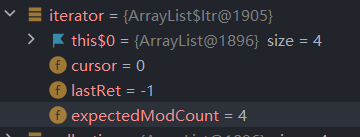

```java
iterator.hasNext()
```

>判断是否还有元素，它的底层代码会判断当前下标 `cursor` 是否等于集合的大小，不等为 ture 即为有下一个元素，相等证明此时的光标已经指向了集合中最后一个元素的下一个位置，代表已经遍历完集合

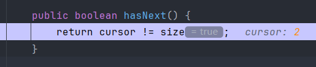

```java
iterator.next()
```

>返回当前 `cursor` 指向的元素，返回的是一个数组元素 `elementData[lastRet = i]`

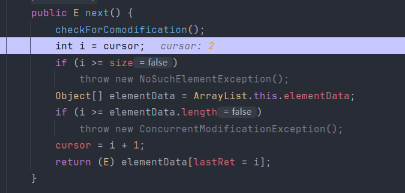

```java
public void test2() {  
    Collection collection = new ArrayList();  
    collection.add("a");  
    collection.add("b");  
    collection.add("c");  
    collection.add("d");  
  
    Iterator iterator = collection.iterator();  
    while (iterator.hasNext()) {  
        System.out.println(iterator.next()); // a b c d  
    }  
}
```

****
## 4. SequencedCollection

>是 Java 21 新增的一个接口，是 `Collection` 接口的子接口，代表一个元素有固定顺序的集合，它同时也是所有有序集合的父接口，在 Java 21 之前，虽然有些集合是“有序的”，但这些类没有统一的接口描述“顺序操作”，所以 Java 21 提出 `SequencedCollection`，为所有有序集合提供统一的顺序操作接口

**常用方法**

**1、`getFirst()` / `getLast()`**

>获取集合中的第一个和最后一个元素

```java
SequencedCollection sequencedCollection = new ArrayList();  
sequencedCollection.add("a");  
sequencedCollection.add("b");  
sequencedCollection.add("c");  
sequencedCollection.add("d");  
System.out.println(sequencedCollection.getFirst()); // a  
System.out.println(sequencedCollection.getLast()); // d
```

****

**2、`addFirst(E e)` / `addLast(E e)`**

>向集合的前面或后面添加元素（双端队列风格）

```java
sequencedCollection.addFirst("start");  
sequencedCollection.addLast("end");  
System.out.println(sequencedCollection); // [start, a, b, c, d, end]
```

****

**3、`removeFirst()` / `removeLast()`**

>从前面或后面删除元素

```java
sequencedCollection.removeFirst();  
sequencedCollection.removeLast();  
System.out.println(sequencedCollection); // [a, b, c, d]
```

****

**4、reversed()**

>`reversed()` 不会修改原集合，而是返回一个反转视图，并不改变原集合

```java
System.out.println(sequencedCollection.reversed()); // [d, c, b, a]
```

****
## 5. 泛型

>泛型是 Java 5 引入的一种机制，允许在类、接口、方法中定义类型参数，用来指定某种类型，而不是在代码里写死具体类型，以此提高代码复用性、提高类型安全性（编译期检查）、避免强制类型转换

```java
List arrayList = new ArrayList();
arrayList.add("aaaa");
arrayList.add(100);

for(int i = 0; i< arrayList.size();i++){
    String item = (String)arrayList.get(i);
    System.out.println(item);
}
```

>`ArrayList` 可以存放任意类型，例子中添加了一个 `String` 类型，添加了一个 `Integer` 类型，再使用时都以 `String` 的方式使用，因此程序崩溃了。为了解决类似这样的问题（在编译阶段就可以解决），就引入了泛型

```java
List<String> arrayList = new ArrayList<>();
arrayList.add("aaaa");
arrayList.add(100);

for(int i = 0; i< arrayList.size();i++){
    String item = (String)arrayList.get(i);
    System.out.println(item);
}
```

>使用泛型后在编译阶段，编译器就会报错

```java
List list = new ArrayList();
list.add("Hello");
list.add(123);
String str = (String) list.get(1);  // 运行时报错：ClassCastException

// 如果使用泛型就不需要考虑强转的问题，但是在运行前就要检查传入的参数类型
```

****
### 5.1 类型擦除

>Java在编译阶段会进行类型检查和类型推导，但在编译完成后（运行时），泛型信息就会被“擦除”掉，程序运行时就无法知道泛型的真实类型了

```java
List<String> list = new ArrayList<>();
list.add("hello");
String str = list.get(0);
```

>在编译阶段，Java 编译器会检查类型，只能往 `list` 中添加 `String` 类型，`get(0)` 得到的类型会被推断为 `String`，但是到了运行阶段，这个泛型信息被擦除，JVM 实际上看到的是

```java
List list = new ArrayList();  // 泛型擦除后
list.add("hello");            // 还是能运行
String str = (String) list.get(0); // 这里自动加了强制类型转换
```

>所以泛型在编译时只会进行类型检查和自动转换（此时的自动强转也被叫做泛型补偿），但运行时并不不会存在泛型类型的信息

```java
List<String> stringList = new ArrayList<>();  
List<Integer> intList = new ArrayList<>();  
System.out.println(stringList.getClass() == intList.getClass()); // true
```

>不管是 `List<String>` 还是 `List<Integer>`，在运行时其实是同一个类，都只是 `ArrayList` 集合，只不过泛型作为了一种限制手段限制用户的输入而已

>Java 的泛型是在 Java 5 引入的，为了保证与 Java 5 之前版本的字节码和 JVM 保持兼容，Java 才采用类型擦除的设计方案，让泛型信息只在编译阶段生效，在这个阶段，编译器会进行类型检查和类型推导，确保类型安全，运行时，所有的泛型类型信息都会被擦除，替换为原始类型（通常是 `Object` ），并自动插入必要的强制类型转换指令，从而使生成的字节码与老版本 JVM 完全兼容

****
### 5.2 在类上自定义泛型

```java
public class 类名<类型参数1, 类型参数2, ...> {
    // 使用这些类型参数作为类的成员、方法返回值或参数类型等
}
```

>定义一个简单的泛型容器

```java
public class Box<T> {
    private T value;

    public void set(T value) {
        this.value = value;
    }

    public T get() {
        return value;
    }
}
```

```java
Box<String> stringBox = new Box<>();  
stringBox.set("Hello");  
System.out.println(stringBox.get()); // Hello  
  
Box<Integer> intBox = new Box<>();  
intBox.set(123);  
System.out.println(intBox.get()); // 123
```

>定义多个泛型参数的类

```java
public class Pair<K, V> {
    private K key;
    private V value;

    public Pair(K key, V value) {
        this.key = key;
        this.value = value;
    }

    public K getKey() { return key; }
    public V getValue() { return value; }
}
```

```java
Pair<String, Integer> pair = new Pair<>("age", 18);
System.out.println(pair.getKey() + ": " + pair.getValue()); // age: 18
```

>自定义泛型类的主要作用是增强代码的通用性、可读性与类型安全性，让程序员口语写出不依赖具体类型但依然能编译检查的通用类或方法，这有点类似于实现一个接口，接口只提供方法的声明，不提供实现

>定义的泛型类，就一定要传入泛型类型实参么？并不是这样，在使用泛型的时候如果传入泛型实参，则会根据传入的泛型实参做相应的限制，此时泛型才会起到本应起到的限制作用。如果不传入泛型类型实参的话，在泛型类中使用泛型的方法或成员变量定义的类型可以为任何的类型

```java
public class Printer<T> {
    public void print(T data) {
        System.out.println(data);
    }
}

new Printer<String>().print("Hello");
new Printer<Integer>().print(123);
new Printer<User>().print(new User());
```

>当使用泛型后，代码的复用性得到了提升，这又有点像多态了，父类型指引用指向子类型对象

****
### 5.3 在方法上自定义泛型

>泛型方法是指在方法定义时引入泛型参数，不依赖于类是否是泛型，在返回类型前使用 `<T>` 是为了告诉编译器我要使用泛型了，具体的返回类型要看使用的是什么

```java
public <T> T 方法名(T 参数) {
    // 方法内部可以使用 T 类型
}
```

>需要注意的是，静态方法使用泛型时必须在返回类型前加上`<T>` 来定义泛型，不能依赖类的泛型，因为静态方法优先于类的实例化

```java
public class Box<T> {
    public void show(T t) {  // 可以
        System.out.println(t);
    }

	public static void display(T t) { // 不可以
		System.out.println(t);
	}
}
```

```java
    public static <T> void show(T t) {
        System.out.println("静态泛型方法：" + t);
    }
```

```java
public class Container<T> {
    // 可以直接用类的 T
    public void set(T t) { }
    // 静态方法不能用类的 T，必须自己写 <U>
    public static <U> void staticShow(U u) {
        System.out.println(u);
    }
    // 实例方法也可以定义自己的泛型，不用类的 T
    public <V> void print(V v) {
        System.out.println(v);
    }
}
```

****
### 5.4 在接口上自定义泛型

```java
public interface AA<F, T> {
    T method(F f);
}

public class BB implements AA<String, Integer> {
    @Override
    public Integer method(String str) {
        return Integer.parseInt(str);
    }
}

public class CC<T> implements AA<T, T> {
    public T method(T t) {
        return t;
    }
}
```

>当不知道具体实现类是什么类型时，就可以使用泛型来实现接口，即使接口有多个泛型类型，但仍然可以只使用一个，但实现类也使用多个泛型时需要对应好接口的泛型位置

****
### 5.5 泛型通配符

#### 5.5.1 无边界通配符 `<?>`

>`<?>` 表示 **任意类型**，它允许接受任何类型的参数，但是它在编译时不能确定具体的类型，所以它不能作为类的属性或者定义一个泛型方法

```java
private List<?> list;  // 编译错误
public void method(<?> m) {  // 编译错误
        System.out.println(m);
    }
```

>`<?>` 主要在于方法的参数类型，它可以表示任何类型，但有一定的限制，通常只能用来读取数据

```java
public static void print(List<?> list) {  
    for (Object o : list) {  
        System.out.println(o);  
    }  
}

List<Integer> list = new ArrayList<>();  
list.add(1);  
list.add(2);  
list.add(3);  
print(list);
```

>但是 `null` 可以添加，因为 `null` 不需要类型，任何类型的列表都可以包含 `null`

```java
public void addNull(List<?> list) {
    list.add(null);  // 合法
    list.add(1); // 不合法
}
```

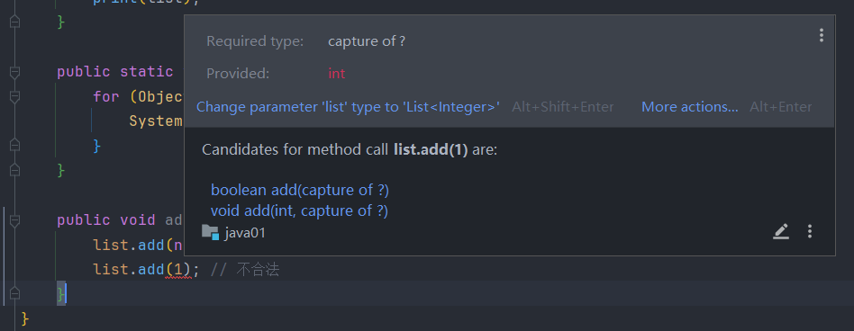

****
#### 5.5.2 上限通配符 `<? extends T>`

>`<? extends T>` 表示某个类型是 `T` 或其子类，适用于只需要读取某个类型及其子类的元素的情况，也就是说上限通配符用于限定泛型的类型范围

```java
List<? extends T> list = new ArrayList<? extends T>();
```

```java
public static void main(String[] args) {  
    List<Integer> intList = new ArrayList<>();  
    intList.add(10);  
    intList.add(20);  
  
    List<Double> doubleList = new ArrayList<>();  
    doubleList.add(3.14);  
    doubleList.add(2.71);  
  
    List<Object> objectList = new ArrayList<>();  
    print(objectList); // 不合法
  
    print(intList);   // 10 20  
    print(doubleList); // 3.14 2.71  
}  
  
public static void print(List<? extends Number> list) {  
    for (Number num : list) {  
        System.out.println(num);  
    }  
}
```

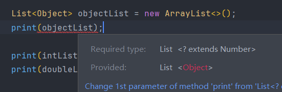

>同样的，这个也只能读取元素（如 `list.get(0)`），但不能在 `print` 方法中向列表中添加元素，因为编译器无法确定此时添加的元素类型是否符合 `Number` 类型的约束

****
#### 5.5.3 下限通配符 `<? super T>`

>`<? super T>` 表示**某个类型是 `T` 或 `T` 的父类**，适用于你需要向集合中写入 `T` 类型及其子类的情况

```java
List<? super T> list = new ArrayList<? super T>();
```

```java
public static void main(String[] args) {  
    List<Integer> numberList = new ArrayList<>();  
    addNumbers(numberList);  // 不合法，Integer是子类 
  
    List<Object> objectList = new ArrayList<>();  
    addNumbers(objectList);  // 也可以向 List<Object> 添加 Integer 
    System.out.println(objectList); // [10]  
}  
  
public static void addNumbers(List<? super Number> list) {  
    list.add(10); // 可以向列表中添加 Integer 或其子类的元素  
}
```

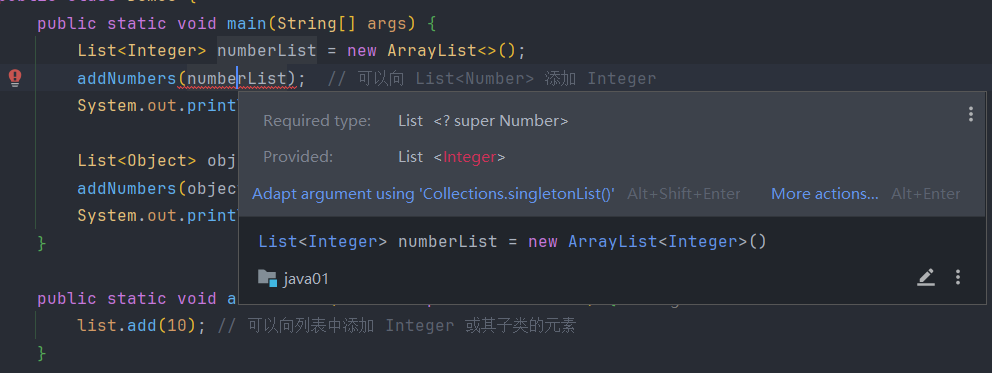

>因为 `<? super T>` 填入的类型一定是 T 的父类，而类只能继承一个父类，所以这个泛型的类型是可以确定的，所以可以对元素进行修改，但是另外两个是不能确定具体的类型的，一个类可以有多个子类，所以没法确定

****
## ## 6. 并发修改问题

>并发修改指的是在一个线程对集合进行遍历的同时，另一个线程或当前线程本身对该集合结构进行了修改，这可能导致遍历出现异常或不确定的结果

### 6.1 结构性修改与并发修改异常的触发条件

**结构性修改**

>结构性修改是指改变集合结构的操作，例如增加元素、删除元素，这些操作会导致集合的 `modCount`（继承自父类）增加

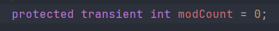

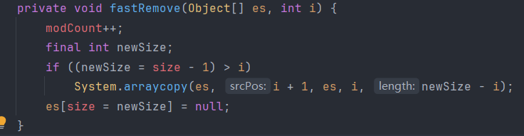

>`AbstractList` 类中定义了方法，当 `modCount != expectedModCount` 就抛出异常

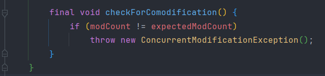

>在遍历迭代器中的元素时，通过集合删除集合中的一个元素，会导致发生 `ConcurrentModificationException` 异常，发生原因肯定是因为此时的 `modCount != expectedModCount` 

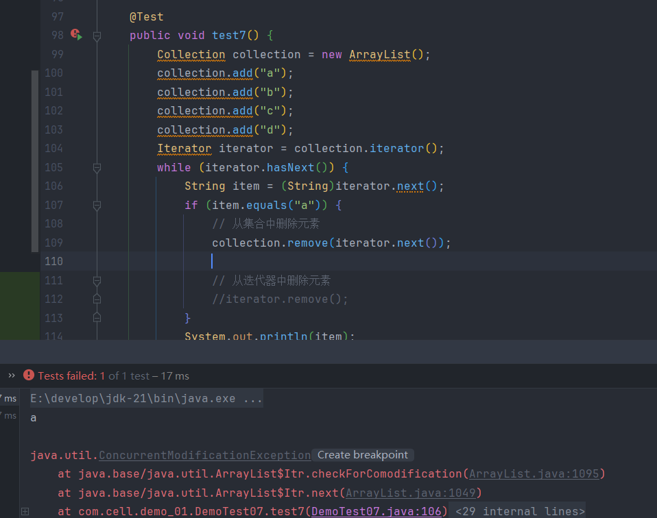

**`expectedModCount` 字段**

>`expectedModCount` 字段并不是集合类本身的成员，而是集合的迭代器内部类的字段

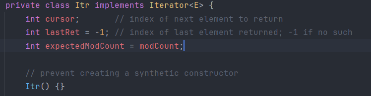

>`Itr` 是 `ArrayList` 的非静态内部类，它可以访问外部类对象的字段，所以创建构造器时可以自动将 `modCount` 赋值给 `expectedModCount` ，在遍历迭代器的期间，如果`modCount != expectedModCount` 就可以抛出异常

****
### 6.2 fail-fast 机制

>每次调用 `Iterator.next()` 或 `Iterator.remove()` 时，都会检查 `modCount` 是否等于 `expectedModCount`，如果不等就抛出异常结束运行

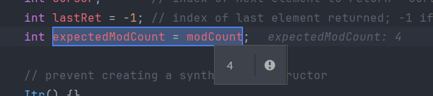

>当创建迭代器时会让 `expectedModCount` 等于当前集合修改的次数

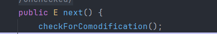

>迭代器的 `next()` 方法中会调用父类的 `checkForComodification()` 判断 `modCount` 是否等于 `expectedModCount`

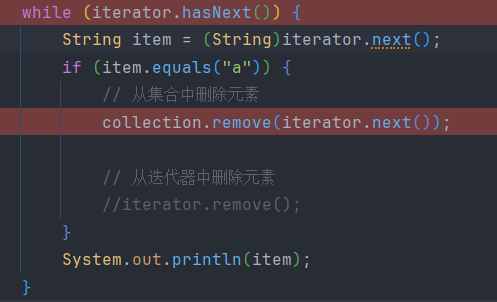

>当使用集合的 `remove` 方法时

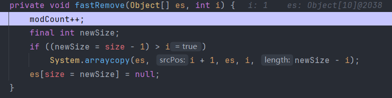

>会进入集合的 `fastRemove` 方法，里面会进行一个 `modCount++` 操作，但是此时迭代器已经创建了，所以不会有再一次赋值的操作，下一次调用 `next()` 方法时一定会抛出异常

>所以 `fail-fast` 也就是设置两个指针，一个指向数组的操作，一个指向迭代器的操作，当两个操作数不同时证明发生了不恰当的并行操作

****
### 6.3 `iterator.remove` 方法

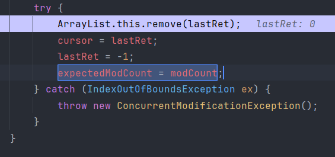

>迭代器的 `remove` 方法中有一行 `modCount != expectedModCount` 代码，在调用完集合的 `remove` 方法后会获取最新的 `modCount` 赋值给 `expectedModCount`，并且有个指针回退的操作

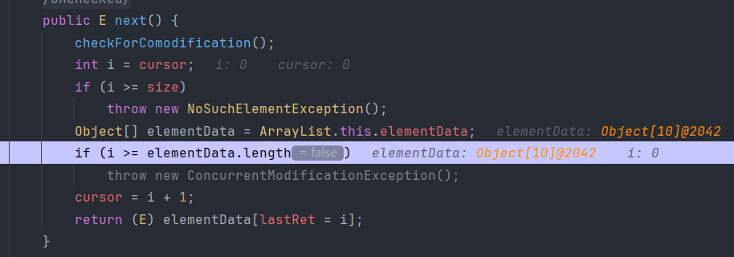

>因为有个 `cursor = i + 1` 操作，所以每次调用 `next()` 方法后 `cursor` 都会指向下一个元素的位置， `lastRet = i` 就代表指向上一个 `cursor` 指向的位置，也就是当前调用 `next()` 方法时真正指向的元素的位置

>当调用迭代器的 `remove()` 方法时，会让 `cursor` 指向 `lastRet` 指向的位置，然后再重置 `lastRet` 的指向位置，达到所有删除元素后面的元素前移的效果

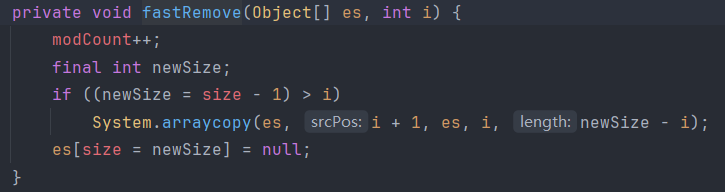

> `ArrayList` 集合的这个方法会将数组的长度减一，然后调用系统的方法，把删除元素的后面的元素全部前移，最后将本集合的最后一个元素置空删除达到删除的操作

>从这里可以看出普通集合的 `remove` 方法没有使用到指针的概念，而是直接将数组的全部元素前移，这可能导致遍历迭代器时 `cursor` 指向的元素位置发生偏移，所以才会引入 `iterator.remove`，保证迭代器遍历时的安全性

****
## 7. List接口

>`List` 是一个继承自 `Collection` 接口的子接口，定义了有序（有下标）、可重复元素集合的行为，不能直接实例化 `List`，需要用它的实现类

### 7.1 ListIterator迭代器

>使用方法和通用的迭代器一样，它作为一种新的迭代器，对通用迭代器进行升级扩展，添加了许多新的方法

```java
ListIterator<String> listIterator = list.listIterator();  
while (listIterator.hasNext()) {  
    String item = listIterator.next();  
    System.out.println(item);  
}
```

#### 7.1.1 hasPrevious()

>常和 `previous` 方法搭配使用，判断是否拥有上一个元素

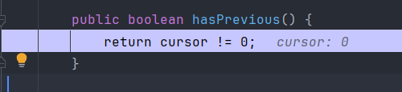

>`ListIterator` 有个有参构造器，可以直接指定 `cursor` 的光标位置

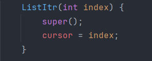

****
#### 7.1.2 previous()

>因为会先执行 `i = cursor - 1` 代码，所以会将 `cursor` 指向当前位置的上一个位置，所以使用时得先将光标移动到 0 号位置以外的地方，否则返回不了元素

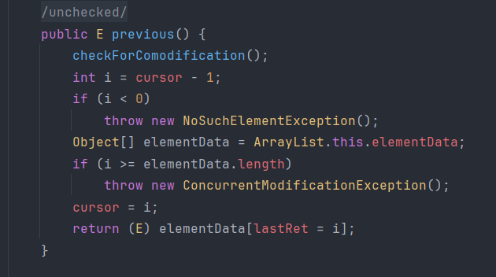

```java
List list = new ArrayList();  
list.add("a");  
list.add("b");  
list.add("c");  
list.add("d");  
ListIterator<String> listIterator = list.listIterator(list.size());
// 调用 previous 方法时 cursor 会自动减一，所以想要遍历到最后一个元素就要让光标指向这个元素的后一个位置
while (listIterator.hasPrevious()) {  
    String item = listIterator.previous();  
    System.out.println(item);  
}
```

****
#### 7.1.3 add()

>将元素添加到光标的位置然后光标后移

```java
    List list = new ArrayList();  
    list.add("a");  
    list.add("b");  
    list.add("c");  
    list.add("d");  
    ListIterator<String> listIterator = list.listIterator();  
    while (listIterator.hasNext()) {  
        String item = listIterator.next();  
        if (item.equals("b")) { // lastRet = 1 
            listIterator.add("B");  
        }  
        System.out.println(item); // a b c d  
    }  
    System.out.println(list); // [a, b, B, c, d]  
}
```

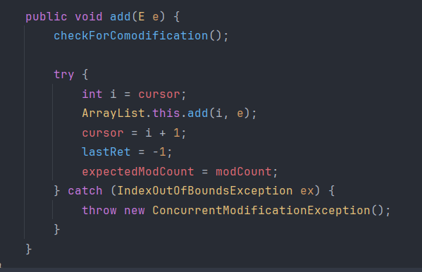

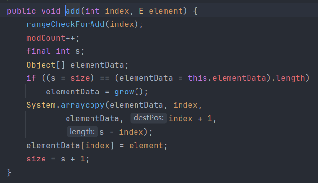

>* 因为每一轮都是先调用的 `next()`，所以第一轮的 `i == 0`，通过迭代器获取到的第一个元素就是 `[0]` 元素（`a`），然后 `cursor + 1 == 1`，
>* 第二轮先调用 `next()`，此时 `lastRet == i == 1`，通过迭代器获取的第二个元素是 `[1]`（`b`），然后`cursor + 1 == 2`，然后判断到此时可以添加元素 `B`，进入迭代器的 `add()` ，将 `cursor` 指向的位置（也就是下标 2 ）传入集合的 `add()` 方法，添加完后 `cursor + 1 == 3`，因为获取元素的地方是在 `next()` 中，所以后面 `cursor` 的改变不会影响到本轮的输出，但是本轮实际上 `cursor` 进行了两次增加，可以看作 `cursor` 指向了本轮输出元素的下下个元素位置
>* 第三轮先调用 `next()`，此时 `lastRet == i == 3`，通过迭代器获取的第三个元素是 `[3]`( c )（实际集合中的元素为{a, b, B, c, d}，正好下标 3 的元素为 c ）
>* ......

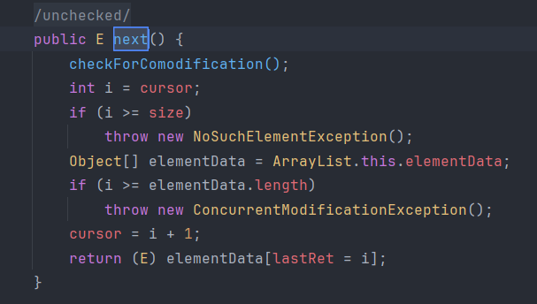

>因为下标移动的特性，添加的元素没有在遍历迭代器时输出并不是没有添加进去，而是调用 `add()` 方法时又进行了一次光标的移动，但是获取数组元素是在光标移动前进行的（可看作跳过新增的元素），所以只能在遍历完集合后再输出才能看到新增的元素

>可以通过使用 `previous()` 来获取添加元素后光标的上一个位置以此获取输出

```java
ListIterator<String> listIterator = list.listIterator();  
int count = -1;  
while (listIterator.hasNext()) {  
    String item = listIterator.next();  
    count++;  
    if (item.equals("b")) {  
        listIterator.add("B");  
        listIterator.previous(); // cursor - 1  
    }  
    System.out.print(count + " ");  
    System.out.println(item); // a b B c d  
}  
System.out.println(list);
```

****
#### 7.1.4 set()

>`set(E e)` 方法用来替换最近一次由 `next()` 或 `previous()` 返回的元素，它不会改变集合的结构，只是把已有位置的值改掉

```java
List list = new ArrayList();  
list.add("a");  
list.add("b");  
list.add("c");  
list.add("d");  
ListIterator<String> listIterator = list.listIterator();  
while (listIterator.hasNext()) {  
    String item = listIterator.next();  
    if (item.equals("b")) { 
        listIterator.set("B");  
    }  
    System.out.println(item); // a b c d 
}  
System.out.println(list); // [a, B, c, d]
```

>同样的，因为 `set()` 方法是在 `next()` 方法后执行的，所以输出元素时是看不到置换后的元素的

**使用 `set()` 要先使用 `next()` 或 `previous()`**

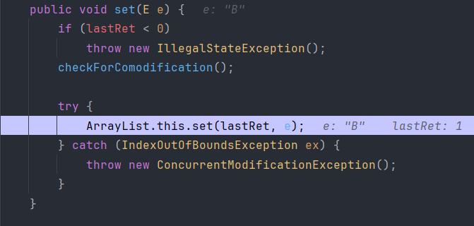

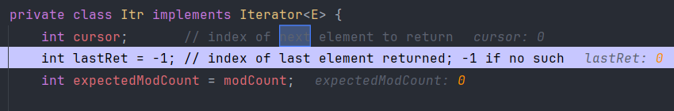

>看图，`set()` 会先判断 `lastRet` 字段是否为负数，然后再进行置换方法，但是 `lastRet` 字段在 `Itr` 类中的默认值是 -1，所以要先使用 `next()` 或 `previous()` 来初始化 `lastRet` 字段，让它能够指向集合中确切的元素位置

**使用 `add()` 和 `remove()` 不能立即使用**

>`add()` 和 `remove()` 方法中都存在 `lastRet = -1` 这个代码，因为 `lastRet` 通常作为返回元素的下标值，所以它关系着是否有元素可以进行操作，在 `next()` 方法中存在 `lastRet` 赋值的代码，用来记录刚才遍历的元素的位置，而 `set()` 和 `remove()` 都是根据 `lastRet` 字段来确定需要操作的位置的

>如果没有重置 `lastRet` 就可能出现下列情况：

```java
List<String> list = new ArrayList<>(List.of("a", "b", "c", "d"));
ListIterator<String> it = list.listIterator();

在 a 元素后面添加一个 A 
此时集合： [a, A, b, c, d]，但是此时的 lastRet = 0
我想将 A 修改掉，这个时候调用 set("X") 方法就会将 lastRet 传入，此时修改的就是 0 号元素，
所以集合变成： [X, A, b, c, d]
```

>所以 `set()` 方法的本质是修改上一次访问的元素位置，当使用 `add()` 、 `remove()` 后就会重置上一次访问的位置

```java
List list = new ArrayList();  
list.add("a");  
list.add("b");  
list.add("c");  
list.add("d");  
ListIterator<String> listIterator = list.listIterator();  
int count = -1;  
while (listIterator.hasNext()) {  
    String item = listIterator.next();  
    count++;  
    if (item.equals("b")) { // lastRet = 1 
        listIterator.add("B"); // cursor = 3，lastRet = -1 
        listIterator.previous(); // cursor = 2，lastRet = 2 
        listIterator.set("X");  
    }  
    System.out.print(count + " ");  
    System.out.println(item); // a b X c d 
}  
System.out.println(list);
```