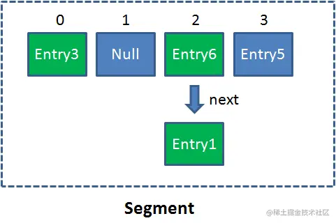
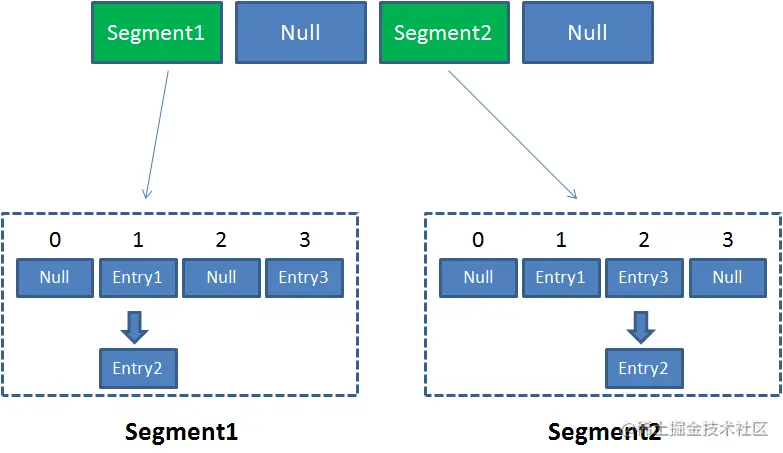
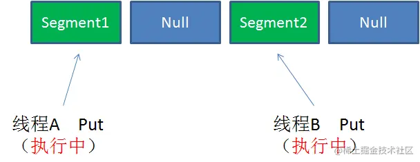
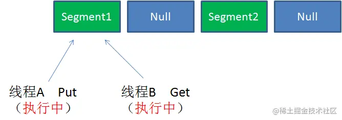
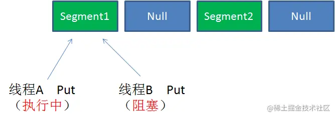

# 1. 相关锁

- [synchronized](多线程.md#12.%20synchronized)

Java 中的关键字，内部实现为监视器锁，主要是通过对象监视器在对象头中的字段来表明的。synchronized 从旧版本到现在已经做了很多优化了，在运行时会有三种存在方式：偏向锁，轻量级锁，重量级锁。

- 偏向锁

是指一段同步代码一直被一个线程访问，那么这个线程会自动获取锁，降低获取锁的代价。

- 轻量级锁

是指当锁是偏向锁时，被另一个线程所访问，偏向锁会升级为轻量级锁，这个线程会通过自旋的方式尝试获取锁，不会阻塞，提高性能。

- 重量级锁

是指当锁是轻量级锁时，当自旋的线程自旋了一定的次数后，还没有获取到锁，就会进入阻塞状态，该锁升级为重量级锁，重量级锁会使其他线程阻塞，性能降低。

- CAS

`Compare And Swap`，一种乐观锁，认为对于同一个数据的并发操作不一定会发生修改，在更新数据的时候，尝试去更新数据，如果失败就不断尝试。

- volatile（非锁）

java中的关键字，当多个线程访问同一个变量时，一个线程修改了这个变量的值，其他线程能够立即看得到修改的值。

- 自旋锁

自旋锁，是指尝试获取锁的线程不会阻塞，而是循环的方式不断尝试，这样的好处是减少线程的上下文切换带来的开锁，提高性能，缺点是循环会消耗 CPU。

- 分段锁

分段锁，是一种锁的设计思路，它细化了锁的粒度，主要运用在 ConcurrentHashMap 中，实现高效的并发操作，当操作不需要更新整个数组时，就只锁数组中的一项就可以了。

- ReentrantLock

可重入锁，是指一个线程获取锁之后再尝试获取锁时会自动获取锁，可重入锁的优点是避免死锁。其实，synchronized 也是可重入锁。

****
# 2. JDK 1.7 中的 ConcurrentHashMap

## 2.1 概念

Segment 本身就相当于一个 HashMap 对象，Segment 包含一个 HashEntry 数组，数组中的每一个 HashEntry 既是一个键值对，也是一个链表的头节点。

ConcurrentHashMap 的核心成员：

```java
// Segment 数组，存放数据时首先需要定位到具体的 Segment 中。
// 逻辑上相当于分段的 HashMap，每个 Segment 管一个子表
// 可以类比成 HashMap 中的一个“大桶”被切分成了多个“小桶”，每个 Segment 就是一个小 HashMap，锁粒度被降到了 Segment 级别。
final Segment<K,V>[] segments;
transient Set<K> keySet;
transient Set<Map.Entry<K,V>> entrySet;
```

Segment 是 ConcurrentHashMap 的一个内部类，主要的组成如下：

```java
static final class Segment<K,V> extends ReentrantLock implements Serializable {
	private static final long serialVersionUID = 2249069246763182397L;
	transient volatile HashEntry<K,V>[] table;
	transient int count; // 当前元素数量
	transient int modCount; // 修改次数（用于 fail-fast）
	transient int threshold; // 扩容门槛
	final float loadFactor; // 负载因子
}
```

```java
// 和 HashMap 中的 HashEntry 作用一样，真正存放数据的桶
// 但 value ，以及链表都是 volatile 修饰的
static final class HashEntry<K,V> {
    final int hash;
    final K key;
    volatile V value;
    volatile HashEntry<K,V> next;
}
```

原理上来说：ConcurrentHashMap 采用了分段锁技术，其中 Segment 继承于 ReentrantLock，每个  Segment 就是一个可重入锁，每个 Segment 内部的结构和 `HashMap` 类似，但对并发做了优化，所以不会像 HashTable 那样不管是 put 还是 get 操作都需要做同步处理，理论上 ConcurrentHashMap 支持 16 个（Segment 数组数量，默认为 16）线程并发。每当一个线程占用锁访问一个 Segment 时，不会影响到其他的 Segment。

单一的 Segment 结构如下：



像这样的 Segment 对象，在 ConcurrentHashMap 集合中有 2<sup>N</sup> 次方个（Segment 数量必须是 2 的次方），共同保存在一个名为 segments 的数组当中， 因此整个 ConcurrentHashMap 的结构如下：



所以 ConcurrentHashMap 可以看作是一个二级哈希表，在一个总的哈希表下面，有多个子哈希表，解决哈希冲突的办法与 HashMap 也一致。

****
## 2.2 put 与 get 方法

**put 方法**：

```java
public V put(K key, V value) {
	Segment<K,V> s;
	if (value == null)
		throw new NullPointerException();
	int hash = hash(key);
	// 这个位运算方式只有在 segment 数量是 2 的次方时才有效
	int j = (hash >>> segmentShift) & segmentMask; // 定位到具体的 Segment[j] 桶
	if ((s = (Segment<K,V>)UNSAFE.getObject          
		 (segments, (j << SSHIFT) + SBASE)) == null) 
		s = ensureSegment(j);
	return s.put(key, hash, value, false); // 此时才是调用真正的 put 方法，进入加锁写入流程
}
```

首先是在外层的 put 方法中通过 key 定位到 Segment，之后在对应的 Segment 中进行具体的 put。首先第一步的时候会尝试获取锁，如果获取失败肯定就有其他线程存在竞争，则利用 `scanAndLockForPut()` 自旋获取锁。

```java
final V put(K key, int hash, V value, boolean onlyIfAbsent) {
	// 优先用 tryLock() 尝试获取锁，避免阻塞
	HashEntry<K,V> node = tryLock() ? null :
		scanAndLockForPut(key, hash, value);
	V oldValue;
	try {
		HashEntry<K,V>[] tab = table;
		// 该操作与 HashMap 中的相似，通过该操作找到桶头节点 first，准备遍历链表
		int index = (tab.length - 1) & hash;
		HashEntry<K,V> first = entryAt(tab, index);
		for (HashEntry<K,V> e = first;;) {
			// 判断 key 是否存在
			if (e != null) {
				K k;
				// 如果 key 存在
				if ((k = e.key) == key ||
					(e.hash == hash && key.equals(k))) {
					oldValue = e.value;
					// 此时判断是否 onlyIfAbsent 是否为 false，是则选择覆盖旧值，否则就跳过
					if (!onlyIfAbsent) {
						e.value = value;
						++modCount;
					}
					break;
				}
				e = e.next;
			}
			else { // key 不存在，准备插入新节点
				if (node != null)
					node.setNext(first);
				else
					// 使用头插法创建节点
					node = new HashEntry<K,V>(hash, key, value, first);
				int c = count + 1;
				if (c > threshold && tab.length < MAXIMUM_CAPACITY)
					// 判断是否需要进行 rehash 进行扩容
					rehash(node);
				else
					setEntryAt(tab, index, node);
				++modCount;
				count = c;
				oldValue = null;
				break;
			}
		}
	} finally {
		unlock();
	}
	return oldValue;
}
```

整体流程：

1. 将当前 Segment 中的 table 通过 key 的 hashcode 定位到 HashEntry。
2. 遍历该 HashEntry，如果不为空则判断传入的 key 和当前遍历的 key 是否相等，相等则覆盖旧的 value。
3. 不为空则需要新建一个 HashEntry 并加入到 Segment 中，同时会先判断是否需要扩容。
4. 最后会解除在 1 中所获取当前 Segment 的锁。

**get 方法**：

将 Key 通过 Hash 之后定位到具体的 Segment ，再通过一次 Hash 定位到具体的元素上。由于 HashEntry 中的 value 属性是用 volatile 关键词修饰的，保证了内存可见性，所以每次获取时都是最新值。ConcurrentHashMap 的 get 方法是非常高效的，因为整个过程都不需要加锁。

```java
public V get(Object key) {
	Segment<K,V> s; 
	HashEntry<K,V>[] tab;
	int h = hash(key);
	// 计算 Segment 的下标
	long u = (((h >>> segmentShift) & segmentMask) << SSHIFT) + SBASE;
	if ((s = (Segment<K,V>)UNSAFE.getObjectVolatile(segments, u)) != null &&
		(tab = s.table) != null) {
		for (HashEntry<K,V> e = (HashEntry<K,V>) UNSAFE.getObjectVolatile
				 (tab, ((long)(((tab.length - 1) & h)) << TSHIFT) + TBASE);
			 e != null; e = e.next) {
			K k;
			if ((k = e.key) == key || (e.hash == h && key.equals(k)))
				return e.value;
		}
	}
	return null;
}
```

并发读写举例：

1、不同 Segment 的并发写入（可以并发执行）



2、同一Segment的一写一读（可以并发执行）



3、同一 Segment 的并发写入，因为 put 方法执行时加锁，所以会阻塞，并自旋获取锁。



****
# 3. JDK 1.8 中的 ConcurrentHashMap

## 3.1 概念

JDK 1.7 版本已经解决了并发问题，但依然存在 HashMap 在 1.7 版本中的问题，即查询遍历链表（segments 数组中的 HashEntry 数组的链表）效率太低。在 JDK 1.8 中，HashMap 引入了[红黑树](树.md#3.%20红黑树(简版))，当冲突的链表长度大于 8 时（即 HashEntry 数组的某一个下标处挂了 8 个元素），会将链表转化成红黑二叉树结构，红黑二叉树又被称为平衡二叉树，在查询效率方面，又提升了不少。

Java 8 对比 Java 7 有很大的不同，比如取消了 Segments 数组，用 `Node<K,V>[] table` 代替了 HashEntry，并且允许并发扩容：

```java
public class ConcurrentHashMap<K,V> extends AbstractMap<K,V>
    implements ConcurrentMap<K,V>, Serializable {
    // 核心数组，存放桶（Node）或树（TreeNode）
    transient volatile Node<K,V>[] table;
    // 延迟初始化或扩容时使用的数组
    private transient volatile Node<K,V>[] nextTable;
    // 用于控制并发扩容的标志位
    private transient volatile int sizeCtl;
}
```

但 Java 8 中的 ConcurrentHashMap 对节点 `Node` 类中的共享变量和 Java 7 一样，仍然使用 `volatile`关键字以保证多线程操作时变量的可见性。

```java
static class Node<K,V> implements Map.Entry<K,V> {
	final int hash; // 用来标记当前使用的结构是什么，>= 0 表示链表，== -1 表示在扩容，< -1 表示红黑树
	final K key;
	volatile V val;
	volatile Node<K,V> next;

	Node(int hash, K key, V val, Node<K,V> next) {
		this.hash = hash;
		this.key = key;
		this.val = val;
		this.next = next;
	}
	...
}
```

****
## 3.2 put 与 get 方法

**put 方法**：

```java
public V put(K key, V value) {  
	// 传入的 onlyIfAbsent 为 false，即默认覆盖
    return putVal(key, value, false);  
}

final V putVal(K key, V value, boolean onlyIfAbsent) {  
	// key 和 value 都不能为 null
    if (key == null || value == null) throw new NullPointerException();  
    int hash = spread(key.hashCode());  
    int binCount = 0;  
    // 这是个无限循环，用于失败重试
    for (Node<K,V>[] tab = table;;) {  
        Node<K,V> f; int n, i, fh; K fk; V fv;  
        if (tab == null || (n = tab.length) == 0)  
	        // 如果 tab 未初始化或者个数为 0，则初始化 node 数组(懒加载，首次 put 才创建)
            tab = initTable();  
        else if ((f = tabAt(tab, i = (n - 1) & hash)) == null) {  
	        // 如果使用 CAS 插入元素时，发现已经有元素了，则进入下一次循环，重新操作 
	        // 插入元素成功的话则 break 跳出循环，流程结束
            if (casTabAt(tab, i, null, new Node<K,V>(hash, key, value)))  
                break;                   
        }  
        else if ((fh = f.hash) == MOVED)  
	        // 如果要插入的元素所在的 tab 的第一个元素的 hash 是 MOVED（-1），
	        // 表示正在扩容，则当前线程帮忙一起迁移元素
            tab = helpTransfer(tab, f);  
        else if (onlyIfAbsent   
                 && fh == hash  
                 && ((fk = f.key) == key || (fk != null && key.equals(fk)))  
                 && (fv = f.val) != null)  
            return fv;  
        else {  
	        // 如果这个 tab 不为空且不在迁移元素，则锁住这个 tab（分段锁） 
	        // 并查找要插入的元素是否在这个 tab 中 
	        // 存在，则替换值（onlyIfAbsent=false） 
	        // 不存在，则插入到链表结尾或插入树中
            V oldVal = null;  
            synchronized (f) {
	            // 再次检测第一个元素是否有变化，如果有变化则进入下一次循环，从头来过  
                if (tabAt(tab, i) == f) { 
	                // 如果第一个元素的 hash 值大于等于 0（说明不是在迁移，也不是树） 
	                // 那 tab 中的元素使用的是链表方式存储 
                    if (fh >= 0) { 
	                    // 记录链表长度，因为存在头元素，所以链表长度至少为 1 
                        binCount = 1;
                        // 遍历整个 tab，每次结束 binCount 加 1  
                        for (Node<K,V> e = f;; ++binCount) {  
                            K ek;  
                            if (e.hash == hash &&  
                                ((ek = e.key) == key ||  
                                 (ek != null && key.equals(ek)))) {
                                // 如果找到了这个元素，则覆盖旧值，并退出循环  
                                oldVal = e.val;  
                                if (!onlyIfAbsent)  
                                    e.val = value;  
                                break;  
                            }  
                            Node<K,V> pred = e;  
                            if ((e = e.next) == null) {
	                            // 如果到链表尾部还没有找到元素 
	                            // 就把它插入到链表结尾并退出循环  
                                pred.next = new Node<K,V>(hash, key, value);  
                                break;  
                            }  
                        }  
                    }  
                    // 如果是红黑树结构，则调用 TreeBin 的 putTreeVal 方法实现插入
                    else if (f instanceof TreeBin) {  
                        Node<K,V> p;  
                        binCount = 2;  
                        if ((p = ((TreeBin<K,V>)f).putTreeVal(hash, key,  
                                                       value)) != null) {  
                            oldVal = p.val;  
                            if (!onlyIfAbsent)  
                                p.val = value;  
                        }  
                    }  
                    else if (f instanceof ReservationNode)  
                        throw new IllegalStateException("Recursive update");  
                }  
            }  
            if (binCount != 0) {
	            // 当链表中的元素大于 8，转换成红黑树结构  
                if (binCount >= TREEIFY_THRESHOLD)  
                    treeifyBin(tab, i);  
                if (oldVal != null)  
                    return oldVal;  
                break;  
            }  
        }  
    }  
    // 插入成功后更新元素个数并进行扩容判断
    addCount(1L, binCount);  
    return null;  
}
```

```java
private final Node<K,V>[] initTable() {
    Node<K,V>[] tab; int sc;
    // 如果还没初始化或者是空数组，就一直尝试初始化
    // 多线程可能同时进入，所以要通过 CAS 竞争初始化权
    while ((tab = table) == null || tab.length == 0) {
	    // 控制 table 初始化与扩容行为，是整个并发控制的关键变量
        // sizeCtl 小于 0 表示正在被其他线程初始化或扩容，当前线程让出执行权
        if ((sc = sizeCtl) < 0)
	        // 让出 CPU，稍后重试
            Thread.yield();
        // CAS 操作将 sizeCtl 值改为 -1
        // 返回 true 表示抢占成功
        else if (U.compareAndSwapInt(this, SIZECTL, sc, -1)) {
            try {
	            // 检查是否还需要初始化
                if ((tab = table) == null || tab.length == 0) {
	                // 进行初始化，如果 sc > 0 则表示 sizeCtl 被赋值为期望的初始 Node 容量
                    int n = (sc > 0) ? sc : DEFAULT_CAPACITY;
                    @SuppressWarnings("unchecked")
                    // 默认创建大小为 16 的数组
                    Node<K,V>[] nt = (Node<K,V>[])new Node<?,?>[n];
                    table = tab = nt;
                    // 将 sizeCtl 设置为下一次扩容的门槛值
                    sc = n - (n >>> 2); // 初始化后变成 16 - 16 / 4 = 12
                }
            } finally {
                // 初始化完再改回来
                sizeCtl = sc;
            }
            break;
        }
    }
    return tab;
}
```

Java 8 中，`ConcurrentHashMap` 默认不会立刻初始化 `table`（主数据数组），而是在第一次 `put()` 时懒加载。

```java
if (tab == null || (n = tab.length) == 0)  
	// 如果 tab 未初始化或者个数为 0，则初始化 node 数组(懒加载，首次 put 才创建)
	tab = initTable(); 
```

`ConcurrentHashMap` 中有一个 sizeCtl 字段，为 0 代表 table 尚未初始化，需要调用 `initTable()`；> 0 代表当前容量下的扩容阈值或期望的初始容量；< 0 代表正在初始化或扩容中，其他线程需等待。

初始化时会先判断 `sizeCtl` 的值，而 `sizeCtl` 是被 `volatile` 修饰，所以当一个线程设置 `sizeCtl = -1` 后，其他线程都能立刻感知，所以各个线程都依赖这个来进行抢占权限，抢到的线程就把它置为 -1，初始化完成后， `sizeCtl`  会变成容量的值，所以它此时 >= 0，代表其它线程可以重新抢占了

```java
while ((tab = table) == null || tab.length == 0) {
	if ((sc = sizeCtl) < 0) Thread.yield();
	else if (U.compareAndSwapInt(this, SIZECTL, sc, -1)) {
	...
```

不管是链表还是红黑树，确定之后总的节点数会加 1，可能会引起扩容，Java 8 的ConcunrrentHashMap 改进为多线程协助迁移，

```java
else if ((fh = f.hash) == MOVED)  
	// 如果要插入的元素所在的 tab 的第一个元素的 hash 是 MOVED（-1），
	// 表示正在扩容，则当前线程帮忙一起迁移元素
	tab = helpTransfer(tab, f); 
```

之前扩容总是由一个线程将旧数组中的键值对转移到新的数组中，支持并发的话，转移所需要的时间就可以缩短了。

**get 方法**：

```java
public V get(Object key) {
    Node<K,V>[] tab; Node<K,V> e, p; int n, eh; K ek;
    // 计算 hash
    int h = spread(key.hashCode());
    // 判断数组是否为空，通过 key 定位到数组下标是否为空
    if ((tab = table) != null && (n = tab.length) > 0 &&
            (e = tabAt(tab, (n - 1) & h)) != null) {
        // 如果第一个元素就是要找的元素，直接返回
        if ((eh = e.hash) == h) {
            if ((ek = e.key) == key || (ek != null && key.equals(ek)))
                return e.val;
        }
        else if (eh < 0)
            // hash 小于 0，说明是树或者正在扩容
            // 使用 find 寻找元素，find 的寻找方式依据 Node 的不同子类有不同的实现方式
            // 若为 TreeBin，使用树查找；若为 ForwardingNode，会从新表查找
            return (p = e.find(h, key)) != null ? p.val : null;
        // 遍历整个链表寻找元素
        // 这部分和普通的 HashMap 非常像，但这里是线程安全的
        while ((e = e.next) != null) {
            if (e.hash == h &&
                    ((ek = e.key) == key || (ek != null && key.equals(ek))))
                return e.val;
        }
    }
    return null;
}
```

虽然读操作不加锁，但能感知写操作的最新结果，因为它的链表节点 `next` 和 `val` 都是 `volatile` 修饰的，一旦改变就会被其他线程立即发现，

****
## 3.3 `ConcurrentHashMap` 的 key 和 value 不能为 null

`ConcurrentHashMap` 的 key 和 value 不能为 null 主要是为了避免二义性。null 是一个特殊的值，表示没有对象或没有引用。如果用 null 作为键，那么就无法区分这个键是否存在于 `ConcurrentHashMap` 中，或者说还是根本没有这个键。同样，如果用 null 作为值，那么就无法区分这个值是否是真正存储在 `ConcurrentHashMap` 中，或是因为找不到对应的键而返回的。

多线程环境下，存在一个线程操作该 `ConcurrentHashMap` 时，其他的线程修改该 `ConcurrentHashMap` 的情况，例如：线程 A 执行 `containsKey(key)` -> 返回 true，此时线程 B 把这个 `key` 从 `map` 中删除了，然后线程 A 继续执行 `map.get(key)` → 得到的是 `null`，由于本身存的就是 `null`，所以无法区分是被删了还是没被删。

与此形成对比的是，`HashMap` 是可以存储为 null 的 key 和 value 的，但 null 作为键只能有一个，而 null 作为值可以有多个。如果传入 null 作为参数，就会返回 hash 值为 0 的位置的值。单线程环境下，不存在一个线程操作该 `HashMap` 时，其他的线程将该 `HashMap` 修改的情况，所以可以通过 `contains(key)` 来做判断是否存在这个键值对，从而做相应的处理，也就不存在二义性问题。

也就是说，多线程下无法正确判定键值对是否存在（存在其他线程修改的情况），单线程是可以的（不存在其他线程修改的情况）。

****
# 4. ConcurrentHashMap 的并发安全问题

