>Java I/O 流是 Java 提供的一个用于处理数据输入和输出的机制，使用“流（Stream）”来抽象表示数据的传输通道，流就是一条“数据通道”，数据从一个地方“流”到另一个地方，比如：从文件中读入（输入流）、从程序写到文件（输出流）等

>从大脑输出到书上，就是输出流，从树上输入到大脑，就是输入流，大脑就是内存，书就是本地文件

Java IO 流的 40 多个类都是从下面 4 个抽象类基类中派生出来的：

- `InputStream`/`Reader`: 所有的输入流的基类，前者是字节输入流，后者是字符输入流。
- `OutputStream`/`Writer`: 所有输出流的基类，前者是字节输出流，后者是字符输出流。

****
# 1. IO流的分类

## 1.1 根据数据流向不同分为：输入流和输出流

>输入：读取外部数据（磁盘、光盘等存储设备的数据）到程序（内存）中，例如 `InputStream`，`Reader`  
>
>输出：把程序（内存）中的内容输出到磁盘、光盘等存储设备中，如 `OutputStream`、`Writer`

****
## 1.2 根据处理数据类型的不同分为：字节流和字符流

- 字节流：可以用于读写二进制文件及任何类型文件，处理原始的二进制数据
- 字符流：可以用于读写文本文件，处理“文本语义”的字符数据（基于字符编码）

**字节流和字符流的区别**

>字符流的由来：Java 中字符是采用 Unicode 标准，一个字符是 16 位，即一个字符使用两个字节来表示。  
>然而在实际开发中读取文件或网络数据时，底层传输的数据本质上是字节流，相同的字节组合在不同编码下对应的字符可能不同，所以 Java 引入了字符流，用来解决以下两个问题：

**1、解决“一个字符多个字节”的读取问题**  

>字节流是一位一位地处理数据，不懂字符的编码规则，如果使用字节流直接读取文字数据，容易出现中文乱码、字符拆分错误等问题

```java
// 手动读取字节，并且需要知道编码方式，手动转换成字符
InputStream is = new FileInputStream("text.txt");
byte[] buffer = new byte[1024];
int len = is.read(buffer);
String content = new String(buffer, 0, len, "UTF-8");
```

**2、自动进行“字符编码 <-> 字节编码”的转换**  

>字符流在底层其实是基于字节流实现的，它会根据指定的编码方式将字节解码为字符，或将字符编码为字节，而它就是为了解决“处理文本数据复杂、容易出错”的问题而引入的，例如：  
>
>`InputStreamReader`：将字节流转为字符输入流（解码）
>
>`OutputStreamWriter`：将字符流转为字节输出流（编码）

```java
// 不需要关心编码（使用系统默认或手动指定），也不用手动转字符
BufferedReader reader = new BufferedReader(new FileReader("text.txt"));
String line = reader.readLine();
```

**所以可以把字符流看作是对字节流的一种封装，读取时使用字节流+编码表，写入时将字符根据编码表转为字节**

| 方向  | 字节流类               | 字符流类       | 作用说明            |
| --- | ------------------ | ---------- | --------------- |
| 输入  | InputStream        | Reader     | 基础抽象类           |
|     | FileInputStream    | FileReader | 读文件内容           |
|     | InputStreamReader  | 字符转换桥梁类    | 将字节流转为字符流（需要编码） |
| 输出  | OutputStream       | Writer     | 基础抽象类           |
|     | FileOutputStream   | FileWriter | 写文件内容           |
|     | OutputStreamWriter | 字符转换桥梁类    | 将字符流转为字节流（需要编码） |

****
## 1.3 根据功能的不同分为：节点流和处理流

>节点流：直接与数据源（如文件、内存、网络）建立连接的流，用于实际的数据读写操作，也就是直接操作“数据的来源”或“数据的去向”  

|类型|字节流|字符流|
|---|---|---|
|输入流|`FileInputStream`（文件）|`FileReader`（文件）|
|输出流|`FileOutputStream`（文件）|`FileWriter`（文件）|
|其他节点|`ByteArrayInputStream`（内存）|`CharArrayReader`（内存）等|

>处理流：处理流并不直接连接数据源，而是封装在其他流（通常是节点流）之上，对其功能进行增强，如缓冲、转换、压缩、加密等

| 功能类型 | 示例类（基于字节/字符）                               | 作用          |
| ---- | ------------------------------------------ | ----------- |
| 缓冲流  | `BufferedInputStream` / `BufferedReader`   | 提高读写效率（带缓存） |
| 转换流  | `InputStreamReader` / `OutputStreamWriter` | 字节流与字符流的桥梁  |
| 数据流  | `DataInputStream` / `DataOutputStream`     | 支持基本类型数据读写  |
| 对象流  | `ObjectInputStream` / `ObjectOutputStream` | 支持对象序列化读写   |
| 打印流  | `PrintWriter` / `PrintStream`              | 提供格式化输出功能   |
****


****
# 2. FileInputStream

>`FileInputStream` 是 Java IO 包中用于“字节输入”的类，属于字节输入流的一部分，主要用于从文件中读取数据，它是 `InputStream` 的子类，适合读取二进制数据，比如图片、音频、视频等，也可以读取文本文件，但要注意编码问题

## 2.1 read() 方法

1、 `int read()`

>从输入流中读取单个字节（8 位），以 `int` 返回（范围 0~255），若已到达文件末尾，返回 `-1`

```java
FileInputStream fis = null;  
try {  
    fis = new FileInputStream("E:\\IOStream\\test01.txt");  
    int data;  
    while ((data = fis.read()) != -1) {  
        System.out.print((char) data); // 转换为字符输出  
    }  
} catch (IOException e) {  
    e.printStackTrace();  
} finally {  
    try {  
        if (fis != null) fis.close();  
    } catch (IOException e) {  
        e.printStackTrace();  
    }  
}
```

>利用循环，将文件中的字节依次读出，因为每个字节的二进制数据实际是 0~255 的无符号值，不能直接返回 `byte` 类型，所以返回的是 `int` 类型，然后根据对应的二进制码使用强制转型将它转换成字符

****

2、` int read(byte[] b)`

>从输入流中读取最多 `b.length` 个字节并填充到数组中，并返回实际读取的字节数量（0 到 b.length），如果没读到数据就返回 `-1`

```java
FileInputStream fis = null;  
    try {  
        int len;  
        byte[] b = new byte[1024];  
        fis = new FileInputStream("E:\\IOStream\\test01.txt");  
        while ((len = fis.read(b)) != -1) {  
            System.out.print(new String(b, 0, len)); // 以字符串输出  
        }  
    } catch (IOException e) {  
        throw new RuntimeException(e);  
    } finally {  
        try {  
            if (fis != null) fis.close();  
        } catch (IOException e) {  
            e.printStackTrace();  
        }  
    }  
}
```

> `read(byte[] b)` 方法本身不返回字节，只是把一些字节装进一个数组，然后显示地调用 `String` 的方法将这些字节进行解码

****

3、 `int read(byte[] b, int off, int len)`

>在输入流中从 `off` 下标开始读取最多 `len` 个字节并存入 `byte` 数组中，返回实际读取的字节数，没读到数据就返回 `-1`，调用 `String` 的方法转换成字符串输出

```java
FileInputStream fis = null;  
try {  
    fis = new FileInputStream("E:\\IOStream\\test01.txt");  
    byte[] b = new byte[1024];  
    int len;  
    while ((len = fis.read(b, 100, 500)) != -1) {  
        // 从 buffer[100] 开始才有数据  
        System.out.print(new String(b, 100, len));  
    }  
} catch (IOException e) {  
    e.printStackTrace();  
} finally {  
    try {  
        if (fis != null) fis.close();  
    } catch (IOException e) {  
        e.printStackTrace();  
    }  
}
```

4、 `long skip(long n)`

>从输入流中跳过指定数量的字节或字符，然后再读取后面的数据，适用于 **`InputStream`** 和 **`Reader`** 这类“读取型”流对象

```java
fis.skip(100); // 跳过前100个字节
```

>当设置的跳过长度大于实际长度时 `skip(n)` 可能无法跳过指定长度，当返回值是 0 时表示没有进行跳过操作

>但是有些流是不支持这个方法的，如果某个流重写了 `InputStream` 中的 `skip()` 方法，则证明它本身是不允许跳过的，所以只能模拟跳过的方法，可能会反复读取并丢弃字节

5、 `available()`

>判断当前流中还剩下多少个字节可以被立即读取

```java
int availableBytes = in.available();
if (availableBytes > 0) {
    byte[] bytes = new byte[availableBytes];
    in.read(bytes);
    System.out.println(new String(buffer));
}
```

****
# 3. FileOutputStream

>`FileOutputStream` 是 Java IO 中用于“将数据以字节形式写入文件”的类，属于字节输出流（`OutputStream` 的子类），适用于写入文本、二进制数据（如图片、音频）等文件内容

```java
new FileOutputStream(String name)
new FileOutputStream(String name, boolean append)
```

>如果文件不存在，会自动创建，如果文件存在，默认会清空原内容（覆盖写入），当第二个参数设为 `true` 时表示追加写入，就不会覆盖原文件

****
## 3.1 write() 方法

1、 `void write(int b)`

>只写入一个字节（低 8 位），可以等价于写入一个 ASCII 字符

```java
fos.write(97); // 写入一个字节，97 对应 'a'
```

****

2、 `void write(byte[] b)`

>一次写入整个字节数组

```java
byte[] data = "hello".getBytes();
fos.write(data);
```

****

3、 `void write(byte[] b, int off, int len)`

>从第 `off` 个下标开始写入 `len` 个字节到数组 `b` 中

```java
byte[] data = "hello world".getBytes();
fos.write(data, 6, 5); // 只写入 "world"
```

```java
FileOutputStream fos = null;  
try {  
    fos = new FileOutputStream("E:\\IOStream\\test02.txt");  
    String content = "Hello, FileOutputStream!";  
    byte[] bytes = content.getBytes();  
    fos.write(bytes); // 转换为字节数组写入  
    fos.flush(); // 强制刷新缓冲区（通常可省略）  
} catch (IOException e) {  
    e.printStackTrace();  
} finally {  
    try {  
        if (fos != null) fos.close();  
    } catch (IOException e) {  
        e.printStackTrace();  
    }  
}
```

****
## 3.2 文件复制

>从源文件中读取数据（输入流）-> 写入目标文件（输出流）

```java
FileInputStream fis = null;  
FileOutputStream fos = null;  
try {  
    fis = new FileInputStream("E:\\IOStream\\test01.txt");  
    fos = new FileOutputStream("E:\\IOStream\\test03.txt");  
    byte[] bytes = new byte[1024];  
    int len;  
    while ((len = fis.read(bytes)) != -1) {  
        fos.write(bytes, 0, len);  
    }  
    fos.flush();  
} catch (IOException e) {  
    throw new RuntimeException(e);  
} finally {  
    try {  
        if (fis != null) fis.close();  
    } catch (IOException e) {  
        e.printStackTrace();  
    }  
    try {  
        if (fos != null) fos.close();  
    } catch (IOException e) {  
        e.printStackTrace();  
    }  
}
```

****
## 3.3 flush() 方法

>`flush()` 是强制将内存缓冲区中的数据立即写出到目标设备（如文件、网络、控制台等）的方法

>因为很多 IO 流具有缓冲机制，为了提高性能，这些流不会每次 `write()` 都立刻写入文件或网络，而是先写入内存缓冲区，等缓冲区满了再调用 `flush()` 或者调用 `close()` 时才真正输出，但是某些情况下需要及时地把数据输出出去，所以就需要提前手动调用 `flush()`

>所以 `close()` 方法中是包含 `flush()` 的，关闭资源时会自动使用

****
## 3.4 close() 方法

>关闭流并释放相关资源，通常位于操作 IO 资源的最后一步，表示“收尾”操作

 **1、 释放资源**

>每个 IO 流在底层都会打开系统资源（如文件描述符、socket 句柄等），不关闭就会导致资源泄漏

 **2、 刷新缓冲区**

>某些输出流（如 `BufferedWriter`、`BufferedOutputStream`）在关闭时会自动调用 `flush()`，确保缓存中的数据完整写出

**3、防止文件被锁定**

>文件流不关闭的话可能导致该文件在其他程序中被“占用”或“锁定”，不能访问或删除

****
## 3.5 try-with-resources

>Java 7 之后新增的自动关闭资源的语法结构，只有实现了 `AutoCloseable` 接口才能使用，可以在一个 try 中定义多个资源，它们会按定义的相反顺序依次关闭

```java
try (
    FileInputStream fis = new FileInputStream("a.txt");
    FileOutputStream fos = new FileOutputStream("b.txt");
) {
    // 使用 fis 和 fos
}
// fos.close() 会在 fis.close() 之前被调用
```

****
# 4. FileReader

>与 `FileInputStream` 类似，只不过是读取 `char[]` 数组

> `read()` 方法返回的都是 `int` 类型的数据；
> 
> `int read()` 读取一个字符（返回 Unicode 编码的 int 值）；
> 
> `int read(char[] cbuf)` 读取多个字符到字符数组；  
> 
> `int read(char[] cbuf, int offset, int length)` 读取指定长度的字符到数组

```java
int ch;
    while ((ch = reader.read()) != -1) {
        System.out.print((char) ch);
    }
```

```java
char[] buffer = new char[1024];
    int len;
    while ((len = reader.read(buffer)) != -1) {
        System.out.print(new String(buffer, 0, len));
    }
```

>`FileReader` 默认使用系统编码，如果读取到乱码，说明编码不匹配

****
# 5. FileWriter

>有个新增的 `void write(String str)`  方法，可以直接将字符串输入到文件中

> `Writer` 中有个 `append` 方法，需要在创建 `FileWriter` 时传入 `append = true`，然后就可以实现实现“文件末尾追加”

```java
try(FileWriter writer = new FileWriter("E:\\IOStream\\test04.txt", true)) {  
    //writer.write("海的那边是什么");  
    writer.append("\n追加？");  
} catch (IOException e) {  
    throw new RuntimeException(e);  
}
```

**普通文本文件的复制**

>这种方式只适合复制 `.txt` 文件

```java
File sourceFile = new File("source.txt");
File destFile = new File("copy.txt");
try (
    FileReader reader = new FileReader(sourceFile);
    FileWriter writer = new FileWriter(destFile)
) {
    char[] buffer = new char[1024];
    int len;
    while ((len = reader.read(buffer)) != -1) {
        writer.write(buffer, 0, len);
    }
    writer.flush(); // 可选，close 时也会自动 flush
    System.out.println("文本文件复制完成！");
} catch (IOException e) {
    e.printStackTrace();
}
```

****
# 6. 缓冲流

>它不是直接操作文件，而是对底层节点流进行包装，读写操作时不再直接访问磁盘，而是一次性读写较大块数据放入/取出自内存的缓冲区，减少磁盘操作次数来提升性能

## 6.1 BufferedInputStream

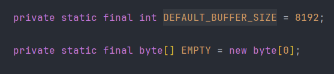

>默认缓冲区大小为 8129，正好 8 kb ，或者在创建缓冲流时手动输入缓冲区的大小

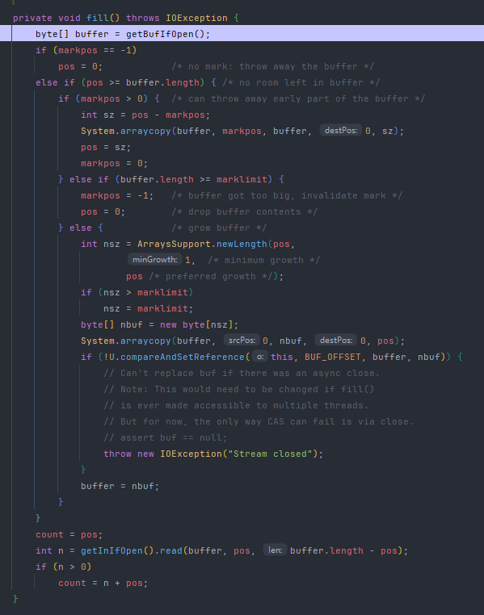

>这个就是底层真实创建的缓冲区，首先创建一个 8 kb 的 `byte[]` 数组，然后调用父类 `InputStream` 的 `read` 方法获取文件中的字节并存在 `byte[]` 数组中，

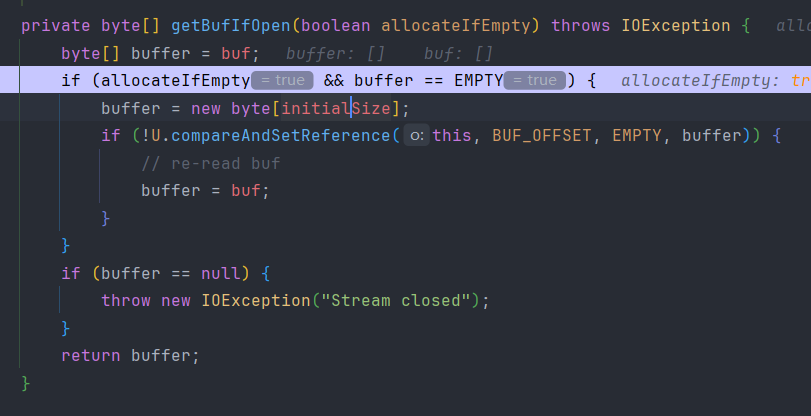

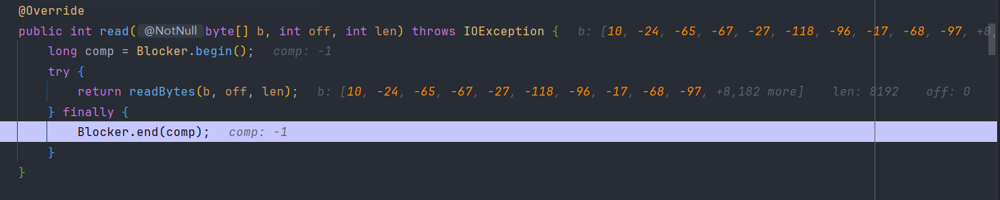

>手动创建的 `byte[] bytes = new byte[1024]` 是在代码中使用的缓冲数组，从缓冲区的 `buf[]` 中复制最多 1024 个字节到这个 `bytes[]` 中，提高循环调用 `read()` 的效率，避免每次只能读取一个字节

****
## 6.2 包装流的关闭


>看图，它内部定义了一个 `InputStream input = in`，这个 `in` 就是创建流时传进来的，包装类中 new 了什么就传什么，然后依次调用它们的 `close` 方法，所以只需要手动关闭最外层的流，它的内部就会自动调用每个流的 `close`

****
## 6.3 BufferedReader

### 6.3.1 readLine()

>读取一整行文本（不含换行符），到文件末尾返回 `null`

```java
try (BufferedReader br = new BufferedReader(new FileReader("test.txt"))) {
    String line;
    while ((line = br.readLine()) != null) {
        System.out.println(line);
    }
} catch (IOException e) {
    e.printStackTrace();
}
``` 

>这个方法的本质还是调用了 `read` 方法，从 `fill()` 获取的缓冲区中一次性读取很多个字符，就有点类似于使用了字节流的 `byte[]` 数组，一次性接收多个然后直接输出，所以会比直接使用 `read` 方法更高效

****
# 7. mark 和 reset

>`mark()` 和 `reset()` 是 `InputStream`（以及它的子类，如 `BufferedReader`、`FileInputStream`）和 `Reader` 类中提供的方法，通常用于回溯读取数据，即标记一个特定位置，然后在读取流数据时能够跳回到标记的位置重新读取

**1、 mark(int readLimit)**

>将流的当前位置标记为一个参考点，之后可以通过 `reset()` 方法回到这个标记的位置。  
>
>`mark()` 方法接受一个参数 `readLimit`，该参数指定在标记之后可以继续读取的最大字节数或字符数，如果流中的数据超过了这个范围，则标记失效

**2、 reset()**

>调用 `reset()` 后，读取的数据将从标记的位置开始重新读取，如果流没有被标记过或者标记已经失效，则此时会抛出 `IOException` 异常

**3、 并不是所有的流都支持这两个方法**

>`InputStream` 类是所有字节流的父类，但并不是所有的 `InputStream` 的子类都实现了 `mark()` 和 `reset()`，比如 `FileInputStream` 默认不支持标记和重置，而 `BufferedInputStream` 支持这两个方法，并且要做到可以临时回溯读取，就要求读取的数据不是事实输出的，而是可以存在一个地方随时读的，所以标记回溯操作通常是用在缓冲流中（具有缓冲区）

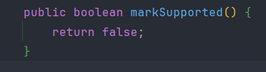

>可以看到 `InputStream` 类中定义了一个 `markSupported()` 方法，但是它默认返回的是 `false`，而 `BufferedInputStream` 中就是默认为 `true` 的

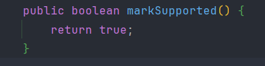

```java
protected volatile byte buf[];    // 缓冲区
protected int pos;                // 当前读取的位置（指向 buf 中的索引）
protected int count;              // buf 中有效字节数
protected int markpos = -1;       // mark 标记位置
protected int marklimit;          // 最大允许读取的字节数
```

> `pos` 表示当前缓冲区读取的指针，记录读取缓冲的位置， `markpos` 表示上次调用 `mark(int readlimit)` 时记录的 `pos` 值，初始值为 -1 表示没有标记，`marklimit` 表示自 `mark()` 调用后允许读取的最大字节数

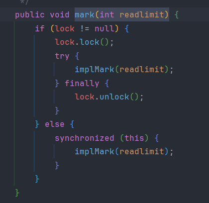

>这个源码就是把 `pos` 赋值给 `markpos` 用来记录当前的“标记点”，并从这个位置计算最多可以读取的字节数，然后把 `readlimit` 赋值给 `marklimit`

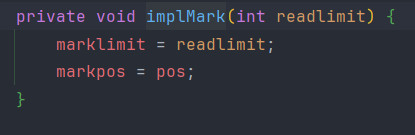

>调用 `reset` 方法后会进入 `implReset` 去判断 `markpos` 是否存在，然后让读取过文件进行过增加的 `pos` 恢复到之前的记录，也就是上面提到的 `markpos = pos`

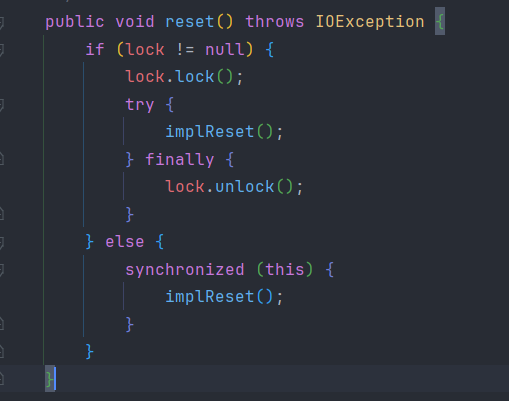

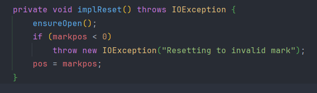

>主要的整合还是在获取缓冲区的 `fill()` 方法中

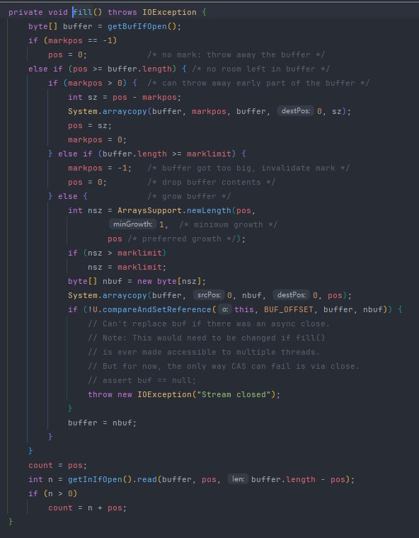

>根据 `markpos` 和 `pos` 的位置，把这些字节通过 `arraycopy` 方法放到缓冲区的头部，因为后续可能会重新读入数据到缓冲区，防止这些数据被覆盖或者使用一些麻烦的操作东新增一些西新增一些，干脆直接放头部，而缓冲区剩余的空间，则可以被完全用来装入新读取的数据

```java
try (BufferedInputStream bis = new BufferedInputStream(new FileInputStream("E:\\IOStream\\test05.txt"))) {  
    // 先读取一部分数据  
    bis.mark(100); // 标记当前的位置，最多读取100个字节  
    byte[] buffer1 = new byte[50]; // 每次读取50个字节 
    int bytesRead = bis.read(buffer1);  
    System.out.println("First read: " + new String(buffer1, 0, bytesRead));  
  
    // 再读取一些数据  
    byte[] buffer2 = new byte[50];  
    bytesRead = bis.read(buffer2);  
    System.out.println("Second read: " + new String(buffer2, 0, bytesRead));  
  
    // 通过 reset() 回到之前标记的位置  
    bis.reset();  
    byte[] buffer3 = new byte[50];  
    bytesRead = bis.read(buffer3);  
    System.out.println("After reset: " + new String(buffer3, 0, bytesRead));  
} catch (IOException e) {  
    e.printStackTrace();  
}
```

****
# 8. 解决乱码

>如果一个文件是用UTF-8 编码写入的，却使用默认编码 GBK来读取，就会把几个 UTF-8 字节错误地解释为一个字符，导致乱码

## 8.1 InputStreamReader 指定解码方式

>文件（UTF-8 编码）->  InputStreamReader（解码为字符） -> BufferedReader（按行读取）

```java
try (  
        BufferedReader br = new BufferedReader(new InputStreamReader(new FileInputStream("E:\\IOStream\\test05.txt"), "UTF-8"))  
) {  
    String line;  
    while ((line = br.readLine()) != null) {  
        System.out.println(line);  
    }  
} catch (IOException e) {  
    e.printStackTrace();  
}
```

>通过手动设置编码方式让编码与解码使用的是一样的

****
## 8.2 OutputStreamWriter 指定编码方式

```java
String content = "你好，世界！";  
  
// 写入（指定 UTF-8 编码）  
try (OutputStreamWriter writer = new OutputStreamWriter(  
        new FileOutputStream("E:\\IOStream\\test06.txt"), "UTF-8")) {  
    writer.write(content);  
} catch (IOException e) {  
    e.printStackTrace();  
}  
  
// 读取（也用 UTF-8 编码）  
try (BufferedReader reader = new BufferedReader(  
        new InputStreamReader(new FileInputStream("E:\\IOStream\\test06.txt"), "UTF-8"))) {  
    String line;  
    while ((line = reader.readLine()) != null) {  
        System.out.println(line);  
    }  
} catch (IOException e) {  
    e.printStackTrace();  
}
```

>字符数据（如字符串）-> BufferedWriter -> OutputStreamWriter（按照指定编码将字符转换成字节） -> 文件（以指定编码方式保存）

****
# 9. 包装流

>包装流是“功能增强版”的 IO 流，它们不能单独使用，需依附于节点流，并提供缓冲、编码、数据结构等高级功能，是实际开发中更常用的流类型

****
# 10. 数据输出流

## 10.1 DataOutputStream

>主要用于将基本数据类型和字符串以可移植的方式写入到输出流中，它是面向二进制数据的输出流，而不是面向字符的，所以它直接把 Java 中的数据以二进制的方式写进文件，避免中途数据的转码，效率更高

```java
try (DataOutputStream dos = new DataOutputStream(new FileOutputStream("E:\\IOStream\\test07.dat"))) {  
    dos.writeInt(2025);                 // 写入整数  
    dos.writeDouble(3.14159);           // 写入双精度浮点数  
    dos.writeBoolean(true);             // 写入布尔值  
    dos.writeUTF("你好，世界");          // 写入UTF字符串  
} catch (IOException e) {  
    e.printStackTrace();  
}
```

>因为每种类型都有明确的写入方式，所以在读取时可以确保类型一致，避免了类型转换的错误

****
## 10.2 DataInputStream

>使用 `DataOutputStream` 写入数据就只能用 `DataInputStream` 读取数据，读取数据时应该符合数据的结构，不能随便使用方法

```java
try (DataInputStream dis = new DataInputStream(new FileInputStream("E:\\IOStream\\test07.dat"))) {  
    int year = dis.readInt();  
    double pi = dis.readDouble();  
    boolean flag = dis.readBoolean();  
    String msg = dis.readUTF();  
  
    System.out.println(year);  
    System.out.println(pi);  
    System.out.println(flag);  
    System.out.println(msg);  
} catch (IOException e) {  
    e.printStackTrace();  
}
```

****
# 11. 序列化与反序列化

>序列化是指把一个 Java 对象转换为字节序列的过程，以便将其保存到磁盘上或通过网络传输，反序列化 则是将字节序列恢复为 Java 对象的过程

>序列化最终的目的是为了对象可以跨平台存储和进行网络传输，进行跨平台存储和网络传输的方式就是 IO ，而 IO 支持的数据格式就是字节数组，所以要把 Java 对象转换成字节数组才行（二进制），但是单方面的只把对象转成字节数组还不行，因为没有规则的字节数组是没办法把对象的本来面目还原回来的，所以必须在把对象转成字节数组的时候就制定一种规则（序列化），从IO流里面读出数据的时候再以这种规则把对象还原回来（反序列化）

常见场景：

- 对象在进行网络传输（比如远程方法调用 RPC 的时候）之前需要先被序列化，接收到序列化的对象之后需要再进行反序列化；
- 将对象存储到文件之前需要进行序列化，将对象从文件中读取出来需要进行反序列化；
- 将对象存储到数据库（如 Redis）之前需要用到序列化，将对象从缓存数据库中读取出来需要反序列化；
- 将对象存储到内存之前需要进行序列化，从内存中读取出来之后需要进行反序列化。

**序列化协议对应于 TCP/IP 4 层模型的哪一层？**

>OSI 七层协议模型中，表示层做的事情主要就是对应用层的用户数据进行处理转换为二进制流。反过来的话，就是将二进制流转换成应用层的用户数据。因为 OSI 七层协议模型中的应用层、表示层和会话层对应的都是 TCP/IP 四层模型中的应用层，所以序列化协议属于 TCP/IP 协议应用层的一部分

****
## 11.1 序列化的实现

>想要将对象序列化，就需要让对象实现可序列化接口 `implements Serializable`，如果对象的实例变量中包含引用类型，则这个引用类型也需要实现可序列化接口

```java
Person p = new Person("Alice", 30);  
  
// 序列化  
try (ObjectOutputStream oos = new ObjectOutputStream(new FileOutputStream("E:\\IOStream\\person.ser"))) {  
    oos.writeObject(p);  
    System.out.println("序列化完成。");  
} catch (IOException e) {  
    e.printStackTrace();  
}  
  
// 反序列化  
try (ObjectInputStream ois = new ObjectInputStream(new FileInputStream("E:\\IOStream\\person.ser"))) {  
    Person restored = (Person) ois.readObject();  
    System.out.println("反序列化结果：" + restored);  
} catch (IOException | ClassNotFoundException e) {  
    e.printStackTrace();  
}
```

****
## 11.2 常见问题

**1、 static 属性不能序列化**

>因为静态字段属于类级别的，而序列化是对实例对象进行的，所以静态字段不能被序列化

**2、 transient 关键字（只能修饰字段） —— 不参与序列化**

>如果一个对象中的某个字段被 `transient` 修饰，那么当这个对象被序列化（写入磁盘或通过网络传输）时，这个字段的值不会被写入序列化流中；而当反序列化时，该字段会被自动初始化为默认值，通常用于保护敏感数据，例如密码、临时缓存，但是不能修饰方法、类或局部变量；`static`变量因为不属于任何对象(Object)，所以无论有没有 `transient` 关键字修饰，均不会被序列化

```java
private transient String password; // 不希望序列化密码字段
```

**3、序列化版本号**

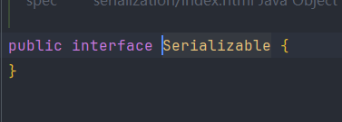

> `Serializable` 是一个空的接口，它主要的作用就是作为一种标记，真正的序列化操作其实是由 `ObjectOutputStream` 和 `ObjectInputStream` 共同实现的，写的操作就是序列化，读的操作就是反序列化

>当类中没有显式声明 `serialVersionUID` 时JVM 会调用 `ObjectStreamClass.computeDefaultSUID()` 来生成一个版本号，这个版本号通常是不显示的，但是当类中的代码发生改变，就会导致这个类的序列化版本号发生改变，当调用 `readObject()` 通过类名读取类时获取到的 `serialVersionUID` 和写入的 `serialVersionUID` 就不同，就会导致反序列化发生错误

>所以后续需要修改类中的代码的话，最好手动设置一个序列化版本号

```java
@Serial  
private static final long serialVersionUID = -4328296663656809026L;
```

****
## 11.3 重写 writeObject 和 readObject

>可以通过重写这两个方法对对象中的某些字段进行自定义规则，例如加密等操作

**标准写法**

```java
private void writeObject(ObjectOutputStream out) throws IOException {
    // 1. 写入非 transient 的默认字段
    out.defaultWriteObject();

    // 2. 写入 transient 字段或自定义数据（加密、转换等）
    out.writeObject(想控制的字段);
    // out.writeInt() / writeUTF() / writeBoolean() ... 
}

private void readObject(ObjectInputStream in) throws IOException, ClassNotFoundException {
    // 1. 读取非 transient 的默认字段（顺序必须匹配）
    in.defaultReadObject();

    // 2. 读取刚才手动写入的字段，要求顺序一致
    字段 = (类型) in.readObject(); // 与写入顺序匹配
}
```

>这两个方法必须是私有的、无返回值、固定参数类型，否则不会被调用

```java
private void writeObject(ObjectOutputStream out) throws IOException {  
    out.defaultWriteObject(); // 写入 name 和 age    
    // 模拟加密密码  
    String encryptedPwd = "ENC(" + password + ")";  
    out.writeUTF(encryptedPwd);  
}  
  
private void readObject(ObjectInputStream in) throws IOException, ClassNotFoundException {  
    in.defaultReadObject(); // 读取 name 和 age    
    String encryptedPwd = in.readUTF();  
    password = encryptedPwd.replace("ENC(", "").replace(")", "");  
}
```

>自动序列化时不会把 password 写入，但是可以手动将加密后的密码写入，只要读取时采用对应的解密方法就行

****
## 11.4 Externalizable：强制自定义序列化

>这是较老的一种序列化机制，用来实现完全手动控制序列化和反序列化过程，它继承了 `Serializable` 接口，但不使用默认的序列化机制，它要求类必须实现两个方法

```java
public class MyClass implements Externalizable {
    public void writeExternal(ObjectOutput out) throws IOException {
        // 手动写出字段
    }

    public void readExternal(ObjectInput in) throws IOException, ClassNotFoundException {
        // 手动读入字段
    }
}
```

>也就是说，这个接口让序列化的操作完全由使用者来定义，而不是在底层就写好，不过自定义的实现序列化让每个字段都能得到更好的控制，

>无论是实现 `Externalizable` 还是在 `Serializable` 下重写 `writeObject` / `readObject` 方法，目的都是“自定义序列化行为”，只不过重写方法更灵活，保留默认的字段，自己手动操作一些字段，可读性和扩展性更高

****
# 12. File类

> File 类是用于表示文件或目录（文件夹）路径的类，它并不直接表示文件的内容，而是对文件或目录路径的一种抽象

```java
File file = new File("E:\\IOStream\\test08.dat");  
  
// 创建文件  
if (!file.exists()) { // 文件或目录是否存在 
    try {  
        file.createNewFile();  
    } catch (IOException e) {  
        e.printStackTrace();  
    }  
    System.out.println("文件已创建");  
}  
  
// 文件属性  
System.out.println("文件名：" + file.getName());  
System.out.println("是否是文件：" + file.isFile());  
System.out.println("是否是目录：" + file.isDirectory());  
System.out.println("文件路径：" + file.getPath());  
System.out.println("绝对路径：" + file.getAbsolutePath());  
System.out.println("文件大小：" + file.length() + " 字节");  
  
// 删除文件  
// file.delete();
```

```java
File file = new File("E:\\IOStream\\test08.dat");
if (!file.exists()) {
    boolean created = file.createNewFile(); // 创建文件
    System.out.println("文件创建成功: " + created);
}

File dir1 = new File("E:\\IOStream\\singleDir");
dir1.mkdir(); // 创建单级目录
File dir2 = new File("E:\\IOStream\\parent\\child\\grandchild");
dir2.mkdirs(); // 创建多级目录
```

|功能|方法|
|---|---|
|创建文件|`createNewFile()`|
|创建目录|`mkdir()` / `mkdirs()`|
|删除文件或空目录|`delete()`|
|判断类型|`isFile()` / `isDirectory()`|
|判断是否存在|`exists()`|
|获取名称和路径|`getName()` / `getPath()` / `getAbsolutePath()`|
|获取目录下文件|`list()` / `listFiles()`|
|重命名或移动|`renameTo(File)`|

****
# 13. 装饰器模式

>装饰模式是一种结构型设计模式，它允许在不改变对象自身结构的前提下，动态地扩展对象的功能

>一般为了扩展一个类经常使用继承方式实现，但随着扩展功能的增多，子类会很膨胀，这时候期望在不改变类对象及其类定义的情况下，为对象添加额外功能，也就是说创建一个“装饰器类”来包装原始对象，并在保持其接口不变的情况下添加新的行为

## 13.1 自定义装饰器类

```java
public interface Coffee {  
    String description();  
    double cost();  
}
```

```java
public class SimpleCoffee implements Coffee {  
    @Override  
    public String description() {  
        return "普通咖啡";  
    }  
  
    @Override  
    public double cost() {  
        return 5.0;  
    }  
}
```

```java
public class CoffeeDecorator implements Coffee{  
    private Coffee coffeeDecorator;  
  
    CoffeeDecorator(Coffee coffeeDecorator) {  
        this.coffeeDecorator = coffeeDecorator;  
    }  
  
    @Override  
    public String description() {  
        return coffeeDecorator.description();  
    }  
  
    @Override  
    public double cost() {  
        return coffeeDecorator.cost();  
    }  
}
```

```java
public class MilkDecorator extends CoffeeDecorator{  
    MilkDecorator(Coffee coffeeDecorator) {  
        super(coffeeDecorator);  
    }  
  
    @Override  
    public String description() {  
        return super.description() + " + milk";  
    }  
  
    @Override  
    public double cost() {  
        return super.cost() + 5.0;  
    }  
}

public class SugarDecorator extends CoffeeDecorator{  
    SugarDecorator(Coffee coffeeDecorator) {  
        super(coffeeDecorator);  
    }  
  
    @Override  
    public String description() {  
        return super.description() + " + sugar";  
    }  
  
    @Override  
    public double cost() {  
        return super.cost() + 3.0;  
    }  
}
```

```java
public static void main(String[] args) {  
    CoffeeDecorator coffeeDecorator = new CoffeeDecorator(new MilkDecorator(new SimpleCoffee()));  
    System.out.println(coffeeDecorator.description()); // 普通咖啡 + milk  
    System.out.println(coffeeDecorator.cost()); // 10.0 

	CoffeeDecorator coffeeDecorator1 = new CoffeeDecorator(new SugarDecorator(new SimpleCoffee()));  
	System.out.println(coffeeDecorator1.description()); // 普通咖啡 + sugar 
	System.out.println(coffeeDecorator1.cost()); // 8.0
}
```

>自定义了一个装饰器类，一个基本类实现接口中的方法，但是当后续需要进行扩展时直接在装饰器类中进行扩展


>先定义一个父类的装饰器类，是接口的实现类，然后定义了一个接口类型的变量，给后续的子类使用，而重写的方法里面直接调用定义的变量的方法，也就是创建对象时子类的方法，然后创建一些子装饰器类，提高每个方法的不同扩展，然后具体的基本类在创建时当作装饰器类的实例

> `CoffeeDecorator coffeeDecorator = new CoffeeDecorator(new MilkDecorator(new SimpleCoffee()));` ， `CoffeeDecorator` 和 `MilkDecorator` 的继承关系让扩展的功能更多样化， `SimpleCoffee` 与装饰器类的包装关系让功能的扩展更动态，耦合度更低

>在装饰器模式中，利用组合可以把装饰器混合使用，而且在任何时候可以动态实现新的装饰器并增加新的行为，这些都是在对象已经创建出来的前提下完成的，所以这种模式实际上是基于运行时的，


****

## 13.2 IO流的装饰器模式

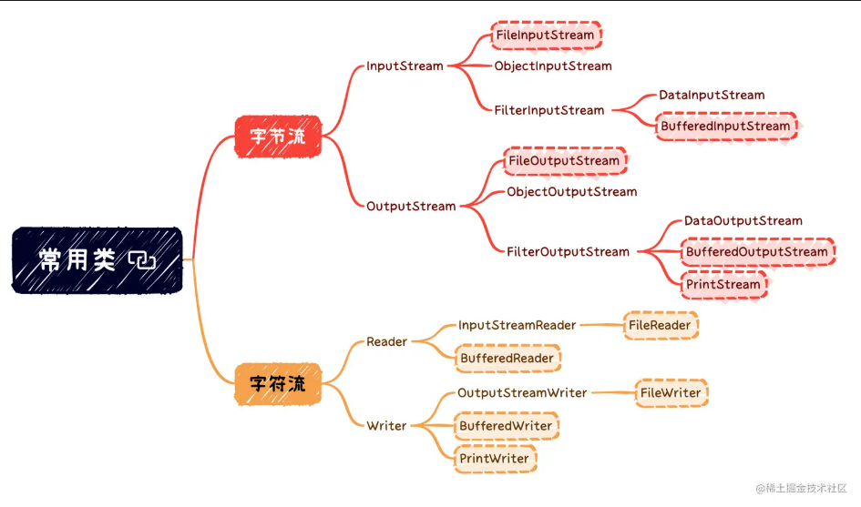

>如果说 `InputStream` 只有一个子类 `FileInputStream` 的话，那么在 `InputStream` 基础上再设计一个孙子类 `BufferedFileInputStream` 也不算复杂，毕竟继承结构比较简单还能接受

>但是继承 `InputStream` 的子类非常多，那么就需要给每一个 `InputStream` 的子类都派生一个支持缓存读取的子类，这数量就会十分庞大，而且支持缓存也只是拓展功能之一，还要对其他功能进行增强，比如 `DataInputStream` 类，它支持按照所有 Java 基本数据类型来读取数据，如果把这些扩展功能封装到一起，让其他的类继承或者实现，就会非常方便，所以 Java 就引入了组合（composition）和委托（delegation）来达到继承的效果，基于这种状态，可以动态地组合对象，写新的代码添加新的功能却不用修改现有代码

****
## 13.3 装饰器模式的标准类图

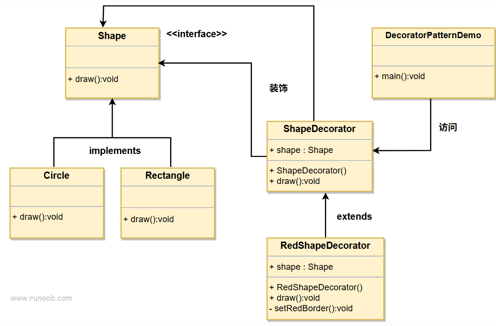

- 抽象组件（Component）：定义了原始对象和装饰器对象的公共接口或抽象类，可以是具体组件类的父类或接口。
- 具体组件（Concrete Component）：是被装饰的原始对象，它定义了需要添加新功能的对象。
- 抽象装饰器（Decorator）：继承自抽象组件，它包含了一个抽象组件对象，并定义了与抽象组件相同的接口，同时可以通过组合方式持有其他装饰器对象。
- 具体装饰器（Concrete Decorator）：实现了抽象装饰器的接口，负责向抽象组件添加新的功能。具体装饰器通常会在调用原始对象的方法之前或之后执行自己的操作。

>根据图所示，创建了一个 `Shape` 接口和实现了 `Shape` 接口的实体类，然后创建一个实现了 `Shape` 接口的抽象装饰类 `ShapeDecorator`，并把 `Shape` 对象作为它的实例变量，`RedShapeDecorator` 是实现了 `ShapeDecorator` 的实体类。`DecoratorPatternDemo` 类使用 `RedShapeDecorator` 来装饰 `Shape` 对象

****
## 13.4 装饰流程

>IO 流中每一个“子类”并不是继承链中的“重写”，而是将另一个 InputStream 包装起来

```
InputStream（抽象类） <- 抽象组件
   ↑
FileInputStream（读取文件字节） <- 具体组件
   ↑
FilterInputStream（中转功能） <- 抽象的装饰者
   ↑
BufferedInputStream（提供缓冲）<- 具体的装饰者
   ↑
DataInputStream（按数据类型读取，如int、double）<- 具体的装饰者
```

```java
InputStream in = new DataInputStream(
                     new BufferedInputStream(
                         new FileInputStream("test.txt")));

// 先通过 BufferedInputStream 提高读取效率
// 然后通过 DataInputStream 按数据类型读取
int number = ((DataInputStream) in).readInt();
```

**1、 InputStream（抽象组件）**

>所有输入流的抽象父类，定义了 `read()` 等方法

**2、FileInputStream（具体组件）**

>实现了 `read()`，底层通过本地方法（C/C++）从文件系统读取，功能的实现逻辑与 `InputStream` 的实现逻辑不同，是新的行为

**3、 FilterInputStream（抽象装饰器）**

>是个“半成品”：本身不增强功能，只是中转委托，组合 + 委托模式的典型实现：持有一个 `InputStream`，所有方法都交给它处理，为具体装饰器打基础

```java
public class FilterInputStream extends InputStream {  
   protected volatile InputStream in;  
  
    protected FilterInputStream(InputStream in) {  
        this.in = in;  
    }  
  
    @Override  
    public int read() throws IOException {  
        return in.read();  
    }  
  
    @Override  
    public int read(byte[] b) throws IOException {  
        return read(b, 0, b.length);  
    }  
  
    @Override  
    public int read(byte[] b, int off, int len) throws IOException {  
        return in.read(b, off, len);  
    }  
  
    @Override  
    public long skip(long n) throws IOException {  
        return in.skip(n);  
    }  
  
    @Override  
    public int available() throws IOException {  
        return in.available();  
    }  
    
    @Override  
    public void close() throws IOException {  
        in.close();  
    }  
  
    @Override  
    public void mark(int readlimit) {  
        in.mark(readlimit);  
    }  
  
    @Override  
    public void reset() throws IOException {  
        in.reset();  
    }  
  
   @Override  
    public boolean markSupported() {  
        return in.markSupported();  
    }
```

>这里面基本都是重写的方法，主要还是靠具体的实现类实现具体的方法，然后靠自己的子装饰器类来实现具体的扩展

**4、BufferedInputStream（具体装饰器）**

>还是调用 `in.read(...)`，只是包装了缓冲逻辑，仍然保留原有接口，完全兼容 `InputStream`

```java
private int read1(byte[] b, int off, int len) throws IOException {  
    int avail = count - pos;  
    if (avail <= 0) {  
        int size = Math.max(getBufIfOpen(false).length, initialSize);  
        if (len >= size && markpos == -1) {  
            return getInIfOpen().read(b, off, len);  
        }  
        fill();  
        avail = count - pos;  
        if (avail <= 0) return -1;  
    }  
    int cnt = (avail < len) ? avail : len;  
    System.arraycopy(getBufIfOpen(), pos, b, off, cnt);  
    pos += cnt;  
    return cnt;  
}
```

**5、DataInputStream（具体装饰器）**

>仍然基于 `InputStream` 的 `read()` 方法，只不过封装成更高级的接口，更适合读取结构化数据，比如数据文件、网络协议

```java
public final int read(byte[] b) throws IOException {  
    return in.read(b, 0, b.length);  
}
```

>这个还是封装的父类的具体的实现方法

```java
public final int readInt() throws IOException {  
    readFully(readBuffer, 0, 4);  
    return ByteArray.getInt(readBuffer, 0);  
}

public final void readFully(byte[] b, int off, int len) throws IOException {  
    Objects.checkFromIndexSize(off, len, b.length);  
    int n = 0;  
    while (n < len) {  
        int count = in.read(b, off + n, len - n);  
        if (count < 0)  
            throw new EOFException();  
        n += count;  
    }  
}
```

>这个就是扩展的读整数型的方法

****
# 14. 压缩流

>压缩流指的是用于压缩和解压缩数据的流，它允许在读写数据的同时对其进行压缩或解压缩处理

**1、压缩单个文件为 `.gz`**

```java
try (  
        FileInputStream fis = new FileInputStream("E:\\IOStream\\test08.dat");  
        GZIPOutputStream gzipOut = new GZIPOutputStream(new FileOutputStream("E:\\IOStream\\test09.gz"));  
) {  
    byte[] buffer = new byte[1024];  
    int len;  
    while ((len = fis.read(buffer)) != -1) {  
        gzipOut.write(buffer, 0, len);  
    }  
} catch (IOException e) {  
    e.printStackTrace();  
}  
  
try {  
    GZIPInputStream gzipIn = new GZIPInputStream(new FileInputStream("E:\\IOStream\\test09.gz"));  
    byte[] buffer = new byte[1024];  
    int len;  
    while ((len = gzipIn.read(buffer)) != -1) {  
        System.out.println(new String(buffer, 0, len));  
    }  
} catch (IOException e) {  
    e.printStackTrace();  
}
```

**2、 压缩多个文件为 `.zip`**

```java
try (  
        ZipOutputStream zipOut = new ZipOutputStream(new FileOutputStream("E:\\IOStream\\test10.zip"))  
) {  
    String[] filePaths = {"E:\\IOStream\\test05.txt", "E:\\IOStream\\test06.txt"};  
    byte[] buffer = new byte[1024];  
    for (String filePath : filePaths) {  
        File file = new File(filePath);  
        try (FileInputStream fis = new FileInputStream(file)) {  
            zipOut.putNextEntry(new ZipEntry(file.getName()));  
            int len;  
            while ((len = fis.read(buffer)) != -1) {  
                zipOut.write(buffer, 0, len);  
            }  
            zipOut.closeEntry();  
        }  
    }  
}  catch (IOException e) {  
    e.printStackTrace();  
}
```

****
# 15. 字节数组流

>字节数组流是一种基于内存中字节数组的数据流，它不涉及文件、网络等外部设备，而是直接在内存中进行读写操作，常用于在内存中临时存储数据、实现数据格式转换、多种流组合使用时的中间缓冲容器

```java
byte[] data = "Hello ByteArray".getBytes();  
  
ByteArrayInputStream bais = new ByteArrayInputStream(data);  
  
int ch;  
while ((ch = bais.read()) != -1) {  
    System.out.print((char) ch);  
}
```

## 15.1 应用

**1、 在内存中合并多个字节数组**

```java
ByteArrayOutputStream baos = new ByteArrayOutputStream();
    for (byte[] arr : arrays) {
        baos.write(arr);
    }
    return baos.toByteArray();
```

>创建一个字节数组输出流 `baos`，它会在内存中维护一个可变大小的字节缓冲区，所以在实际应用中它十分灵活，如果使用手动的创建字节数组，就需频繁的进行手动扩容并复制数组，所以

**2、 数据传输前对数据进行编码和压缩**

```java
String text = "这是一段要通过网络传输的文本数据，可能很长...";  
  
ByteArrayOutputStream baos = new ByteArrayOutputStream();  
try (  
        GZIPOutputStream gzipOut = new GZIPOutputStream(baos);  
        OutputStreamWriter writer = new OutputStreamWriter(gzipOut, "UTF-8")  
) {  
    writer.write(text); // 写入原始数据到内存字节数组中  
} catch (IOException e) {  
    e.printStackTrace();  
}  
  
byte[] compressed = baos.toByteArray(); // 通过 toByteArray() 获取流中的数组  
  
try {  
    System.out.println("压缩前长度: " + text.getBytes("UTF-8").length);  
} catch (UnsupportedEncodingException e) {  
    e.printStackTrace();  
}  
System.out.println("压缩后长度: " + compressed.length);
```

**3、 配合 `ObjectOutputStream` 做序列化**

```java
public class Demo3 {  
    public static void main(String[] args) throws IOException, ClassNotFoundException {  
        Teacher teacher = new Teacher("张三", 25);  
        // 内存中创建一个字节数组输出流  
        ByteArrayOutputStream baos = new ByteArrayOutputStream();  
  
        // 创建对象输出流，将对象写入到字节数组流中  
        ObjectOutputStream oos = new ObjectOutputStream(baos);  
        oos.writeObject(teacher);  
        oos.close();  
  
        // 获取序列化后的字节数组  
        byte[] serialized = baos.toByteArray();  
  
        System.out.println("序列化后字节长度：" + serialized.length);  
  
        ByteArrayInputStream bais = new ByteArrayInputStream(serialized);  
        ObjectInputStream ois = new ObjectInputStream(bais);  
        Teacher restored = (Teacher) ois.readObject();  
        ois.close();  
  
        System.out.println("还原对象：" + restored.getName() + ", " + restored.getAge());  
    }  
}  
  
class Teacher implements Serializable {  
    @Serial  
    private static final long serialVersionUID = -7608239609620267020L;  
  
    private String name;  
    private int age;  
  
    public Teacher(String name, int age) {  
        this.name = name;  
        this.age = age;  
    }  
}
```

**4、 深克隆**

```java
public static void main(String[] args) {  
    // 创建原始对象  
    Address address = new Address("Beijing");  
    People originalPeople = new People("Tom", address);  
  
    // 使用字节数组流进行深克隆  
    People clonedPeople = (People) deepClone(originalPeople);  
  
    // 修改克隆对象的地址  
    clonedPeople.getAddress().setCity("Shanghai");  
  
    System.out.println("原始地址: " + originalPeople.getAddress().getCity());  
    // Beijing  
    System.out.println("克隆地址: " + clonedPeople.getAddress().getCity());    
    // Shanghai  
}  
  
public static Object deepClone(Object obj) {  
    try {  
        // 序列化对象到字节数组  
        ByteArrayOutputStream baos = new ByteArrayOutputStream();  
        ObjectOutputStream oos = new ObjectOutputStream(baos);  
        oos.writeObject(obj);  // 将对象写入字节数组流  
        oos.flush();           // 刷新流  
  
        // 从字节数组中反序列化为新对象  
        ByteArrayInputStream bais = new ByteArrayInputStream(baos.toByteArray());  
        ObjectInputStream ois = new ObjectInputStream(bais);  
        return ois.readObject();  // 返回新克隆的对象  
  
    } catch (IOException | ClassNotFoundException e) {  
        e.printStackTrace();  
        return null;  
    }  
}
```

>通过序列化和反序列化的方式，可以自动克隆所有的成员对象，对于复杂的对象结构，只需要实现 `Serializable`，不需要递归克隆每一个字段，节省了大量手动操作

****
## 15.2 总结

**1、 数据的统一表示**

>字节数组是最基本、最通用的数据表示形式，在 Java 中所有类型的数据，包括对象、文本、图片、音频等，都可以最终表示为字节数组。所以，无论是文本、二进制数据还是复杂的对象，字节数组都可以作为统一的处理方式，即对不同的数据类型使用相同的处理机制，便于扩展

**2、 灵活的数据处理操作**

- **切割和合并**：字节数组可以直接进行切割或合并（如使用 `System.arraycopy()` 或通过流读取和写入），例如，将一个大的字节数组分成多个小的字节数组，或者将多个字节数组合并为一个

- **压缩和加密**：字节数组作为数据的通用表示，便于进行各种处理操作，比如压缩或加密，这些操作通常直接作用于字节数组

- **数据转换**：字节数组可以方便地转换为其他数据格式

>将数据转换为字节数组后，它就可以方便地进行扩展和各种操作，作为一种 IO 流，它天生的可以和其他的包装流进行搭配使用，让灵活性和可扩展性更高

****
# 16. 流

>Java 中的流是通过抽象类（如 `InputStream` 和 `OutputStream`）和封装机制构建的一种工具类结构，它封装了底层的数据传输细节，使程序员可以更方便地进行输入和输出操作

......


