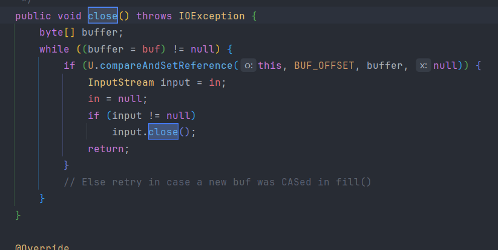

>Java I/O 流是 Java 提供的一个用于处理数据输入和输出的机制，使用“流（Stream）”来抽象表示数据的传输通道，流就是一条“数据通道”，数据从一个地方“流”到另一个地方，比如：从文件中读入（输入流）、从程序写到文件（输出流）等

>从大脑输出到书上，就是输出流，从树上输入到大脑，就是输入流，大脑就是内存，书就是本地文件

****
# 1. IO流的分类

## 1.1 根据数据流向不同分为：输入流和输出流

>输入：读取外部数据（磁盘、光盘等存储设备的数据）到程序（内存）中，例如 `InputStream`，`Reader`  
>
>输出：把程序（内存）中的内容输出到磁盘、光盘等存储设备中，如 `OutputStream`、`Writer`

****
## 1.2 根据处理数据类型的不同分为：字节流和字符流

>字节流：可以用于读写二进制文件及任何类型文件  
>
>字符流：可以用于读写文本文件

**字节流和字符流的区别**

>字符流的由来：Java 中字符是采用 Unicode 标准，一个字符是 16 位，即一个字符使用两个字节来表示。  
>然而在实际开发中读取文件或网络数据时，底层传输的数据本质上是字节流，相同的字节组合在不同编码下对应的字符可能不同，所以 Java 引入了字符流，用来解决以下两个问题：

**1、解决“一个字符多个字节”的读取问题**  

>字节流是一位一位地处理数据，不懂字符的编码规则，如果使用字节流直接读取文字数据，容易出现中文乱码、字符拆分错误等问题

**2、自动进行“字符编码 <-> 字节编码”的转换**  

>字符流在底层其实是基于字节流实现的，它会根据指定的编码方式将字节解码为字符，或将字符编码为字节，例如：  
>
>`InputStreamReader`：将字节流转为字符输入流（解码）
>
>`OutputStreamWriter`：将字符流转为字节输出流（编码）

**所以可以把字符流看作是对字节流的一种封装，读取时使用字节流+编码表，写入时将字符根据编码表转为字节**

| 方向  | 字节流类               | 字符流类       | 作用说明            |
| --- | ------------------ | ---------- | --------------- |
| 输入  | InputStream        | Reader     | 基础抽象类           |
|     | FileInputStream    | FileReader | 读文件内容           |
|     | InputStreamReader  | 字符转换桥梁类    | 将字节流转为字符流（需要编码） |
| 输出  | OutputStream       | Writer     | 基础抽象类           |
|     | FileOutputStream   | FileWriter | 写文件内容           |
|     | OutputStreamWriter | 字符转换桥梁类    | 将字符流转为字节流（需要编码） |

****
## 1.3 根据功能的不同分为：节点流和处理流

>节点流：直接与数据源（如文件、内存、网络）建立连接的流，用于实际的数据读写操作，也就是直接操作“数据的来源”或“数据的去向”  

|类型|字节流|字符流|
|---|---|---|
|输入流|`FileInputStream`（文件）|`FileReader`（文件）|
|输出流|`FileOutputStream`（文件）|`FileWriter`（文件）|
|其他节点|`ByteArrayInputStream`（内存）|`CharArrayReader`（内存）等|

>处理流：处理流并不直接连接数据源，而是封装在其他流（通常是节点流）之上，对其功能进行增强，如缓冲、转换、压缩、加密等

| 功能类型 | 示例类（基于字节/字符）                               | 作用          |
| ---- | ------------------------------------------ | ----------- |
| 缓冲流  | `BufferedInputStream` / `BufferedReader`   | 提高读写效率（带缓存） |
| 转换流  | `InputStreamReader` / `OutputStreamWriter` | 字节流与字符流的桥梁  |
| 数据流  | `DataInputStream` / `DataOutputStream`     | 支持基本类型数据读写  |
| 对象流  | `ObjectInputStream` / `ObjectOutputStream` | 支持对象序列化读写   |
| 打印流  | `PrintWriter` / `PrintStream`              | 提供格式化输出功能   |
****
# 2. 装饰模式

>装饰模式是一种结构型设计模式，它允许在不改变对象自身结构的前提下，动态地扩展对象的功能

>它有点类似于高级的封装，只是封装是隐藏实现的细节，只暴露必要的接口给外部使用，而装饰模式是动态的扩展功能，不在类的内部进行限制条件，封装是对内部封装，装饰模式是对外部进行扩展，所以装饰模式也像是接口，外部的具体扩展就像是给接口的方法提供具体的实现

```java
Reader reader = new FileReader("data.txt");
int ch;
while ((ch = reader.read()) != -1) {
    System.out.print((char) ch);
}
reader.close();
```

加上装饰器：`BufferedReader`

```java
Reader reader = new BufferedReader(new FileReader("data.txt"));
String line;
while ((line = ((BufferedReader) reader).readLine()) != null) {
    System.out.println(line);
}
reader.close();
```

>虽然目前还看不太懂装饰模式，但是通过这两段代码的对比可以看出第二个代码看上去更牛一点

****
# 3. FileInputStream

>`FileInputStream` 是 Java IO 包中用于“字节输入”的类，属于字节输入流的一部分，主要用于从文件中读取数据，它是 `InputStream` 的子类，适合读取二进制数据，比如图片、音频、视频等，也可以读取文本文件，但要注意编码问题

## 3.1 read() 方法

1、 `int read()`

>从输入流中读取单个字节（8 位），以 `int` 返回（范围 0~255），若已到达文件末尾，返回 `-1`

```java
FileInputStream fis = null;  
try {  
    fis = new FileInputStream("E:\\IOStream\\test01.txt");  
    int data;  
    while ((data = fis.read()) != -1) {  
        System.out.print((char) data); // 转换为字符输出  
    }  
} catch (IOException e) {  
    e.printStackTrace();  
} finally {  
    try {  
        if (fis != null) fis.close();  
    } catch (IOException e) {  
        e.printStackTrace();  
    }  
}
```

>利用循环，将文件中的字节依次读出，因为每个字节的二进制数据实际是 0~255 的无符号值，不能直接返回 `byte` 类型，所以返回的是 `int` 类型，然后根据对应的二进制码使用强制转型将它转换成字符

****

2、` int read(byte[] b)`

>从输入流中读取最多 `b.length` 个字节并填充到数组中，并返回实际读取的字节数量（0 到 b.length），如果没读到数据就返回 `-1`

```java
FileInputStream fis = null;  
    try {  
        int len;  
        byte[] b = new byte[1024];  
        fis = new FileInputStream("E:\\IOStream\\test01.txt");  
        while ((len = fis.read(b)) != -1) {  
            System.out.print(new String(b, 0, len)); // 以字符串输出  
        }  
    } catch (IOException e) {  
        throw new RuntimeException(e);  
    } finally {  
        try {  
            if (fis != null) fis.close();  
        } catch (IOException e) {  
            e.printStackTrace();  
        }  
    }  
}
```

> `read(byte[] b)` 方法本身不返回字节，只是把一些字节装进一个数组，然后显示地调用 `String` 的方法将这些字节进行解码

****

3、 `int read(byte[] b, int off, int len)`

>在输入流中从 `off` 下标开始读取最多 `len` 个字节并存入 `byte` 数组中，返回实际读取的字节数，没读到数据就返回 `-1`，调用 `String` 的方法转换成字符串输出

```java
FileInputStream fis = null;  
try {  
    fis = new FileInputStream("E:\\IOStream\\test01.txt");  
    byte[] b = new byte[1024];  
    int len;  
    while ((len = fis.read(b, 100, 500)) != -1) {  
        // 从 buffer[100] 开始才有数据  
        System.out.print(new String(b, 100, len));  
    }  
} catch (IOException e) {  
    e.printStackTrace();  
} finally {  
    try {  
        if (fis != null) fis.close();  
    } catch (IOException e) {  
        e.printStackTrace();  
    }  
}
```

4、 `long skip(long n)`

>从输入流中跳过指定数量的字节或字符，然后再读取后面的数据，适用于 **`InputStream`** 和 **`Reader`** 这类“读取型”流对象

```java
fis.skip(100); // 跳过前100个字节
```

>当设置的跳过长度大于实际长度时 `skip(n)` 可能无法跳过指定长度，当返回值是 0 时表示没有进行跳过操作

>但是有些流是不支持这个方法的，如果某个流重写了 `InputStream` 中的 `skip()` 方法，则证明它本身是不允许跳过的，所以只能模拟跳过的方法，可能会反复读取并丢弃字节

5、 `available()`

>判断当前流中还剩下多少个字节可以被立即读取

```java
int availableBytes = in.available();
if (availableBytes > 0) {
    byte[] bytes = new byte[availableBytes];
    in.read(bytes);
    System.out.println(new String(buffer));
}
```

****
# 4. FileOutputStream

>`FileOutputStream` 是 Java IO 中用于“将数据以字节形式写入文件”的类，属于字节输出流（`OutputStream` 的子类），适用于写入文本、二进制数据（如图片、音频）等文件内容

```java
new FileOutputStream(String name)
new FileOutputStream(String name, boolean append)
```

>如果文件不存在，会自动创建，如果文件存在，默认会清空原内容（覆盖写入），当第二个参数设为 `true` 时表示追加写入，就不会覆盖原文件

****
## 4.1 write() 方法

1、 `void write(int b)`

>只写入一个字节（低 8 位），可以等价于写入一个 ASCII 字符

```java
fos.write(97); // 写入一个字节，97 对应 'a'
```

****

2、 `void write(byte[] b)`

>一次写入整个字节数组

```java
byte[] data = "hello".getBytes();
fos.write(data);
```

****

3、 `void write(byte[] b, int off, int len)`

>从第 `off` 个下标开始写入 `len` 个字节到数组 `b` 中

```java
byte[] data = "hello world".getBytes();
fos.write(data, 6, 5); // 只写入 "world"
```

```java
FileOutputStream fos = null;  
try {  
    fos = new FileOutputStream("E:\\IOStream\\test02.txt");  
    String content = "Hello, FileOutputStream!";  
    byte[] bytes = content.getBytes();  
    fos.write(bytes); // 转换为字节数组写入  
    fos.flush(); // 强制刷新缓冲区（通常可省略）  
} catch (IOException e) {  
    e.printStackTrace();  
} finally {  
    try {  
        if (fos != null) fos.close();  
    } catch (IOException e) {  
        e.printStackTrace();  
    }  
}
```

****
## 4.2 文件复制

>从源文件中读取数据（输入流）-> 写入目标文件（输出流）

```java
FileInputStream fis = null;  
FileOutputStream fos = null;  
try {  
    fis = new FileInputStream("E:\\IOStream\\test01.txt");  
    fos = new FileOutputStream("E:\\IOStream\\test03.txt");  
    byte[] bytes = new byte[1024];  
    int len;  
    while ((len = fis.read(bytes)) != -1) {  
        fos.write(bytes, 0, len);  
    }  
    fos.flush();  
} catch (IOException e) {  
    throw new RuntimeException(e);  
} finally {  
    try {  
        if (fis != null) fis.close();  
    } catch (IOException e) {  
        e.printStackTrace();  
    }  
    try {  
        if (fos != null) fos.close();  
    } catch (IOException e) {  
        e.printStackTrace();  
    }  
}
```

****
## 4.3 flush() 方法

>`flush()` 是强制将内存缓冲区中的数据立即写出到目标设备（如文件、网络、控制台等）的方法

>因为很多 IO 流具有缓冲机制，为了提高性能，这些流不会每次 `write()` 都立刻写入文件或网络，而是先写入内存缓冲区，等缓冲区满了再调用 `flush()` 或者调用 `close()` 时才真正输出，但是某些情况下需要及时地把数据输出出去，所以就需要提前手动调用 `flush()`

>所以 `close()` 方法中是包含 `flush()` 的，关闭资源时会自动使用

****
## 4.4 close() 方法

>关闭流并释放相关资源，通常位于操作 IO 资源的最后一步，表示“收尾”操作

 **1、 释放资源**

>每个 IO 流在底层都会打开系统资源（如文件描述符、socket 句柄等），不关闭就会导致资源泄漏

 **2、 刷新缓冲区**

>某些输出流（如 `BufferedWriter`、`BufferedOutputStream`）在关闭时会自动调用 `flush()`，确保缓存中的数据完整写出

**3、防止文件被锁定**

>文件流不关闭的话可能导致该文件在其他程序中被“占用”或“锁定”，不能访问或删除

****
## 4.5 try-with-resources

>Java 7 之后新增的自动关闭资源的语法结构，只有实现了 `AutoCloseable` 接口才能使用，可以在一个 try 中定义多个资源，它们会按定义的相反顺序依次关闭

```java
try (
    FileInputStream fis = new FileInputStream("a.txt");
    FileOutputStream fos = new FileOutputStream("b.txt");
) {
    // 使用 fis 和 fos
}
// fos.close() 会在 fis.close() 之前被调用
```

****
# 5. FileReader

>与 `FileInputStream` 类似，只不过是读取 `char[]` 数组

> `read()` 方法返回的都是 `int` 类型的数据；
> 
> `int read()` 读取一个字符（返回 Unicode 编码的 int 值）；
> 
> `int read(char[] cbuf)` 读取多个字符到字符数组；  
> 
> `int read(char[] cbuf, int offset, int length)` 读取指定长度的字符到数组

```java
int ch;
    while ((ch = reader.read()) != -1) {
        System.out.print((char) ch);
    }
```

```java
char[] buffer = new char[1024];
    int len;
    while ((len = reader.read(buffer)) != -1) {
        System.out.print(new String(buffer, 0, len));
    }
```

>`FileReader` 默认使用系统编码，如果读取到乱码，说明编码不匹配

****
# 6. FileWriter

>有个新增的 `void write(String str)`  方法，可以直接将字符串输入到文件中

> `Writer` 中有个 `append` 方法，需要在创建 `FileWriter` 时传入 `append = true`，然后就可以实现实现“文件末尾追加”

```java
try(FileWriter writer = new FileWriter("E:\\IOStream\\test04.txt", true)) {  
    //writer.write("海的那边是什么");  
    writer.append("\n追加？");  
} catch (IOException e) {  
    throw new RuntimeException(e);  
}
```

**普通文本文件的复制**

>这种方式只适合复制 `.txt` 文件

```java
File sourceFile = new File("source.txt");
File destFile = new File("copy.txt");
try (
    FileReader reader = new FileReader(sourceFile);
    FileWriter writer = new FileWriter(destFile)
) {
    char[] buffer = new char[1024];
    int len;
    while ((len = reader.read(buffer)) != -1) {
        writer.write(buffer, 0, len);
    }
    writer.flush(); // 可选，close 时也会自动 flush
    System.out.println("文本文件复制完成！");
} catch (IOException e) {
    e.printStackTrace();
}
```

****
# 7. 缓冲流

>它不是直接操作文件，而是对底层节点流进行包装，读写操作时不再直接访问磁盘，而是一次性读写较大块数据放入/取出自内存的缓冲区，减少磁盘操作次数来提升性能

## 7.1 BufferedInputStream


>默认缓冲区大小为 8129，正好 8 kb ，或者在创建缓冲流时手动输入缓冲区的大小


>这个就是底层真实创建的缓冲区，首先创建一个 8 kb 的 `byte[]` 数组，然后调用父类 `InputStream` 的 `read` 方法获取文件中的字节并存在 `byte[]` 数组中，


>手动创建的 `byte[] bytes = new byte[1024]` 是在代码中使用的缓冲数组，从缓冲区的 `buf[]` 中复制最多 1024 个字节到这个 `bytes[]` 中，提高循环调用 `read()` 的效率，避免每次只能读取一个字节

****
## 7.2 包装流的关闭



>看图，它内部定义了一个 `InputStream input = in`，这个 `in` 就是创建流时传进来的，包装类中 new 了什么就传什么，然后依次调用它们的 `close` 方法，所以只需要手动关闭最外层的流，它的内部就会自动调用每个流的 `close`

****
## 7.3 BufferedReader

### 7.3.1 readLine()

>读取一整行文本（不含换行符），到文件末尾返回 `null`

```java
try (BufferedReader br = new BufferedReader(new FileReader("test.txt"))) {
    String line;
    while ((line = br.readLine()) != null) {
        System.out.println(line);
    }
} catch (IOException e) {
    e.printStackTrace();
}
``` 

>这个方法的本质还是调用了 `read` 方法，从 `fill()` 获取的缓冲区中一次性读取很多个字符，就有点类似于使用了字节流的 `byte[]` 数组，一次性接收多个然后直接输出，所以会比直接使用 `read` 方法更高效

****
# 8. mark 和 reset

>`mark()` 和 `reset()` 是 `InputStream`（以及它的子类，如 `BufferedReader`、`FileInputStream`）和 `Reader` 类中提供的方法，通常用于回溯读取数据，即标记一个特定位置，然后在读取流数据时能够跳回到标记的位置重新读取

**1、 mark(int readLimit)**

>将流的当前位置标记为一个参考点，之后可以通过 `reset()` 方法回到这个标记的位置。  
>
>`mark()` 方法接受一个参数 `readLimit`，该参数指定在标记之后可以继续读取的最大字节数或字符数，如果流中的数据超过了这个范围，则标记失效

**2、 reset()**

>调用 `reset()` 后，读取的数据将从标记的位置开始重新读取，如果流没有被标记过或者标记已经失效，则此时会抛出 `IOException` 异常

**3、 并不是所有的流都支持这两个方法**

>`InputStream` 类是所有字节流的父类，但并不是所有的 `InputStream` 的子类都实现了 `mark()` 和 `reset()`，比如 `FileInputStream` 默认不支持标记和重置，而 `BufferedInputStream` 支持这两个方法，并且要做到可以临时回溯读取，就要求读取的数据不是事实输出的，而是可以存在一个地方随时读的，所以标记回溯操作通常是用在缓冲流中（具有缓冲区）


>可以看到 `InputStream` 类中定义了一个 `markSupported()` 方法，但是它默认返回的是 `false`，而 `BufferedInputStream` 中就是默认为 `true` 的


```java
protected volatile byte buf[];    // 缓冲区
protected int pos;                // 当前读取的位置（指向 buf 中的索引）
protected int count;              // buf 中有效字节数
protected int markpos = -1;       // mark 标记位置
protected int marklimit;          // 最大允许读取的字节数
```

> `pos` 表示当前缓冲区读取的指针，记录读取缓冲的位置， `markpos` 表示上次调用 `mark(int readlimit)` 时记录的 `pos` 值，初始值为 -1 表示没有标记，`marklimit` 表示自 `mark()` 调用后允许读取的最大字节数


>这个源码就是把 `pos` 赋值给 `markpos` 用来记录当前的“标记点”，并从这个位置计算最多可以读取的字节数，然后把 `readlimit` 赋值给 `marklimit`


>调用 `reset` 方法后会进入 `implReset` 去判断 `markpos` 是否存在，然后让读取过文件进行过增加的 `pos` 恢复到之前的记录，也就是上面提到的 `markpos = pos`


>主要的整合还是在获取缓冲区的 `fill()` 方法中


>根据 `markpos` 和 `pos` 的位置，把这些字节通过 `arraycopy` 方法放到缓冲区的头部，因为后续可能会重新读入数据到缓冲区，防止这些数据被覆盖或者使用一些麻烦的操作东新增一些西新增一些，干脆直接放头部，而缓冲区剩余的空间，则可以被完全用来装入新读取的数据

```java
try (BufferedInputStream bis = new BufferedInputStream(new FileInputStream("E:\\IOStream\\test05.txt"))) {  
    // 先读取一部分数据  
    bis.mark(100); // 标记当前的位置，最多读取100个字节  
    byte[] buffer1 = new byte[50]; // 每次读取50个字节 
    int bytesRead = bis.read(buffer1);  
    System.out.println("First read: " + new String(buffer1, 0, bytesRead));  
  
    // 再读取一些数据  
    byte[] buffer2 = new byte[50];  
    bytesRead = bis.read(buffer2);  
    System.out.println("Second read: " + new String(buffer2, 0, bytesRead));  
  
    // 通过 reset() 回到之前标记的位置  
    bis.reset();  
    byte[] buffer3 = new byte[50];  
    bytesRead = bis.read(buffer3);  
    System.out.println("After reset: " + new String(buffer3, 0, bytesRead));  
} catch (IOException e) {  
    e.printStackTrace();  
}
```

****
# 9. 解决乱码

>如果一个文件是用UTF-8 编码写入的，却使用默认编码 GBK来读取，就会把几个 UTF-8 字节错误地解释为一个字符，导致乱码

## 9.1 InputStreamReader 指定解码方式

>文件（UTF-8 编码）->  InputStreamReader（解码为字符） -> BufferedReader（按行读取）

```java
try (  
        BufferedReader br = new BufferedReader(new InputStreamReader(new FileInputStream("E:\\IOStream\\test05.txt"), "UTF-8"))  
) {  
    String line;  
    while ((line = br.readLine()) != null) {  
        System.out.println(line);  
    }  
} catch (IOException e) {  
    e.printStackTrace();  
}
```

>通过手动设置编码方式让编码与解码使用的是一样的

****
## 9.2 OutputStreamWriter 指定编码方式

```java
String content = "你好，世界！";  
  
// 写入（指定 UTF-8 编码）  
try (OutputStreamWriter writer = new OutputStreamWriter(  
        new FileOutputStream("E:\\IOStream\\test06.txt"), "UTF-8")) {  
    writer.write(content);  
} catch (IOException e) {  
    e.printStackTrace();  
}  
  
// 读取（也用 UTF-8 编码）  
try (BufferedReader reader = new BufferedReader(  
        new InputStreamReader(new FileInputStream("E:\\IOStream\\test06.txt"), "UTF-8"))) {  
    String line;  
    while ((line = reader.readLine()) != null) {  
        System.out.println(line);  
    }  
} catch (IOException e) {  
    e.printStackTrace();  
}
```

>字符数据（如字符串）-> BufferedWriter -> OutputStreamWriter（按照指定编码将字符转换成字节） -> 文件（以指定编码方式保存）

****
# 10. 包装流

>包装流是“功能增强版”的 IO 流，它们不能单独使用，需依附于节点流，并提供缓冲、编码、数据结构等高级功能，是实际开发中更常用的流类型

****
# 11. 数据输出流

## 11.1 DataOutputStream

>主要用于将基本数据类型和字符串以可移植的方式写入到输出流中，它是面向二进制数据的输出流，而不是面向字符的，所以它直接把 Java 中的数据以二进制的方式写进文件，避免中途数据的转码，效率更高

```java
try (DataOutputStream dos = new DataOutputStream(new FileOutputStream("E:\\IOStream\\test07.dat"))) {  
    dos.writeInt(2025);                 // 写入整数  
    dos.writeDouble(3.14159);           // 写入双精度浮点数  
    dos.writeBoolean(true);             // 写入布尔值  
    dos.writeUTF("你好，世界");          // 写入UTF字符串  
} catch (IOException e) {  
    e.printStackTrace();  
}
```


