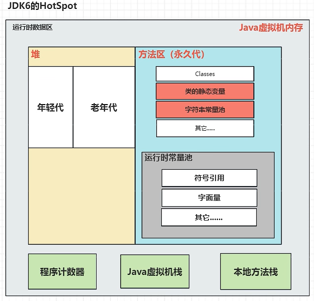
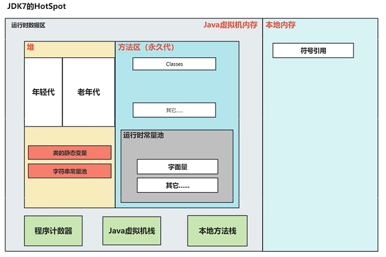
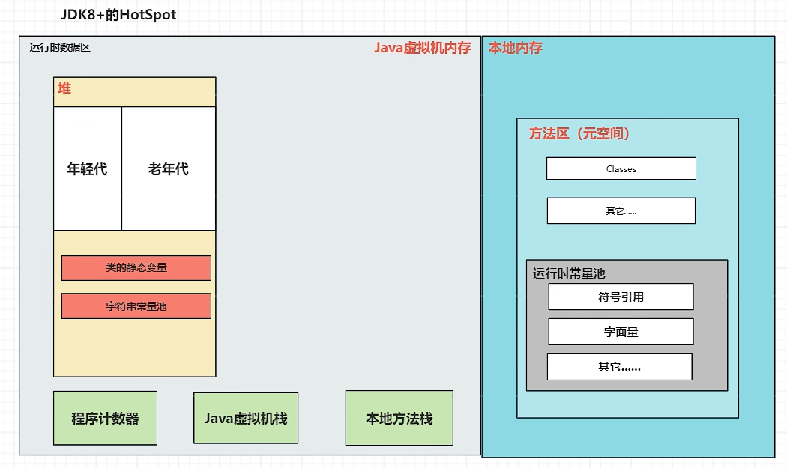

# 一.JVM规范中的运行时数据区

>1. The PC Register(程序计数器):记录正在执行的虚拟机字节码指令的地址
>2. Java Virtual Machine Stacks(Java虚拟机栈):存储栈帧.栈帧里面存储局部变量表,操作数栈,动态链接,方法出口信息等.
>3. Heap(堆):Java虚拟机管理的最大一块内存,存放Java对象实例和数组,堆是垃圾收集器收集垃圾的主要区域
>4. Method Area(方法区):存储已被虚拟机加载的类的信息,常量,静态变量等
>5. Run-Time Constant Pool(运行时常量池):方法区的一部分,存放编译期生成的字面量与符号引用(方法区中)
>6. Native Method Stacks(本地方法栈):在本地方法的执行过程中会使用到,与Java虚拟机栈十分相似,

**HotSpot**

>HotSpot是Oracle公司开发的,目前最常用的虚拟机实现,也是默认的Java虚拟机
# 二.jdk6的HotSpot

>刚new出来的对象就放在年轻代中,经过垃圾回收后,有些对象可能没有被释放,就会被放在老年代中

>jkd6时的永久代和方法区在物理上是相邻的(使用连续的物理内存),但逻辑上是隔离的(内存空间)

>永久代的垃圾收集和老年代捆绑在一起,无论谁满了都会触发垃圾收集

# 三.jdk7的HotSpot

>因为在jdk6中,很多东西都放在永久代中,当写的程序足够大时,就容易发生内存溢出(Out Of Memory),所以把一些东西从永久代中拿走了

>主要就是引入了本地内存,为jdk8打基础

# 四.jdk8的HotSpot

>在JVM的规范中类的信息,常量,静态变量是放在方法区的,但是每个语言有自己的一套实现方法,所以Java语言选择了把这些信息放在了堆中,但是类的字节码信息还是在方法区中
# 五.垃圾回收机制

>JVM释放无用对象所占内存的过程,Java会自动释放,无需手动

