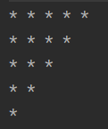

# 一.基本操作

## 1.scanner

>这个操作只需要注意一点,就是next和nextLine

```Java
Scanner sc = new Scanner(System.in);  
System.out.println("请输入数字:");  
int date1 = sc.nextInt();  
System.out.println("date1 = " + date1);  
  
//nextLien可以接收空格内容  
System.out.println("请输入字符串");  
String date3 = sc.nextLine();  
System.out.println("date3 = " + date3);  
  
//next在接收到空格时就停止了  
System.out.println("请输入字符串(不带空格)");  
String date2 = sc.next();  
System.out.println("date2 = " + date2);
```

>因为next()等方法在接收完数据后会留下一个\r回车符,所以第一次调用nextLine()方法是读取缓存中遗留的\r回车符,第二次调用才会真正接收用户的输入

>用scanner和random写一个猜数字

```Java
Scanner sc = new Scanner(System.in);  
Random random = new Random();  
//随机数1~10  
int actualNum = random.nextInt(10) + 1;  
System.out.println("请输入一个数字(1~10):");  
int guessNum = sc.nextInt();  
while (guessNum != actualNum) {  
    if (guessNum > actualNum) {  
        System.out.println("您输入的数字大了,请重新输入数字:");  
    } else {  
        System.out.println("您输入的数字小了,请重新输入数字:");  
    }  
    guessNum = sc.nextInt();  
}  
System.out.println("恭喜您猜对了");
```


## 2.if

>if语句里面放Boolean类型,ture就执行,false就不执行,如果if语句后面只跟一个代码通常可以省略大括号,但不建议

```
if (ture) sout("hello");
```

```
产生报错的是else语句,因为第二个sout被看作了正常的语句,跟if没关系,但是else就没有先街道if,所以会报错
if (true) 
	sout("hello");
	sout("hello2");
else
	sout("hello3");
```


## 3.switch

>switch()里面只能放int,枚举和字符串,然后拿这些值和case比对,相等才执行,所以case里面也只能放这些对应的类型

>不过也可以使用byte或者short类型,因为这些类型在Java的底层会进行自动转换,变成int,所以还是int在里面,但是大于int类型的就不行了,例如long,就会报错

>switch可以省略一些case中的内容,只要这些内容的输出一样就行,例如输出季节,比用if方便一点,注意的是,switch具有穿透性,如果不适用break,就会一直运行下去,直到走完switch中的内容

```java
 switch (month) {
            case 3:
            case 4:
            case 5:
                System.out.println("春季");
                break;
            case 6:
            case 7:
            case 8:
                System.out.println("夏季");
                break;
            case 9:
            case 10:
            case 11:
                System.out.println("秋季");
                break;
            case 12:
            case 1:
            case 2:
                System.out.println("冬季");
                break;
            default:
                System.out.println("输入无效，请输入1到12之间的数字。");
        }
```

>比较特殊的是case后面可以跟char类型,因为Java底层可以把char转换成int类型,例如'A'对应65,但是case后面不能跟变量,会报错,所以case后面只能跟字面量的值

>Java12后switch引入了新特性,解决了原先的穿透问题

```Java
switch(x) {
case 1 -> sout();
case 2 -> sout();
default -> sout();
}

switch(x) {
case 1,2,3 -> sout();
}

switch(x) {
	case 1 -> {
		sout();
		sout();
	}
}
```

## 4.for循环

```
for(初始化表达式;条件表达式;更新表达式)
初始表达式最先执行,并指执行一次
条件表达式必须是一个boolean类型
更新表达式负责更新某个变量的值,让他控制循环的结束
```

**for循环执行原理:**

```
     1          2         4
for(初始化表达式;条件表达式;更新表达式) {
	3
	循环体;
}
1->2->3->4,直到更新表达式让条件表达式变成false
```

**嵌套循环:**

```
当外层循环的套件表达式为true时,会执行循环体,这时可以把里面嵌套的循环当作一个循环体,执行嵌套的循环,嵌套的循环执行完后才会执行外部循环的更新表达式,判断外部的循环是否结束,没有结束的话就继续执行内部的循环体,也就是被嵌套的循环

for(初始化表达式1;条件表达式1;更新表达式1) {
	for(初始化表达式2;条件表达式2;更新表达式2) {
		...;
	}
}
```

**九九乘法表:**

```java
    for (int i = 1; i <= 9; i++) {  
        for (int j = 1; j <= i; j++) {  
            System.out.print(j + "*" + i + "=" + j * i + " ");  
        }  
        System.out.println();  
    }  
}
```


**使用for循环写出四个三角形**

```Java
/*左三角*/  
@Test  
public void test3() {  
    for (int i = 1; i < 6; i++) {  
        for (int j = 0; j < i; j++) {  
            System.out.print("* ");  
        }  
        System.out.println();  
    }  
}
```


```Java
/*右三角*/  
@Test  
public void test4() {  
    for (int i = 4; i >= 0; i--) {//i等于几就是要输出几个*  
        for (int j = 0; j < 5; j++) {  
            if (j - i >= 0) {  
                System.out.print("* ");  
            } else {  
                System.out.print("  ");  
            }  
        }  
        System.out.println();  
    }  
}
```


```Java
/*左下三角*/  
@Test  
public void test5() {  
    for (int i = 0; i < 5; i++) {  
        for (int j = 5; j > i; j--) {  
            System.out.print("* ");  
        }  
        System.out.println();  
    }  
}
```



```Java
/*右下三角*/  
@Test  
public void test6() {  
    for (int i = 5; i > 0; i--) {  
        for (int j = 5; j > 0; j--) {  
            if (i - j >= 0) {  
                System.out.print("* ");  
            } else {  
                System.out.print("  ");  
            }  
        }  
        System.out.println();  
    }  
}
```


## 5.while循环

```
while(布尔表达式) {
	循环体;
}
当布尔表达式为false时,结束循环,可能循环0~n次
```

## 6.do...while循环

```
do {
	循环体;
} while(布尔表达式);
一定会执行一遍循环体,然后再判断布尔类型,所以可能循环1~n次
```

## 7.break,continue,return

### 1.break

>通常用来终止循环,如果是在嵌套循环中,只会终止里面的循环,外面的会继续运行,当符合break的条件出现时,终止全部的循环

### 2.continue

>用来终止本次循环,也就是本来要循环十次,在某一次符合你要求的continue条件,那么就终止这一次的循环,也可以看作跳过,然后执行下一次循环,也就是整体循环了九次

### 3.return

>通常用在方法中,这个终止的等级更高,直接终止这个方法