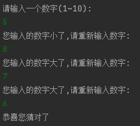
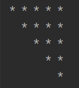

# 一.模糊概念回顾

## 1.算术运算符的自增自减

```java
//自增自减,需要注意的是运算符在前的先进行自运算,然后再赋值
a++
a--
++a
--a
================
int a = 10;
int b = 0;
b = a++;//b = 10,a = 11
================
int a = 10;
int b = 0;
b = ++a;//b = 11,a = 11
```

>需要注意的是,在变量自增或者自减的时候,编译器会把这个值存入一个临时变量,查看下例

```java
int a = 10;
a = a++;
sout(a);//此时输出的 a 为10,因为自增符在后,所以a是先将10赋值给一个临时变量,然后把这个临时变量赋值给a,最后a的自增就会用另一个新的临时变量接收
```

```java
//底层逻辑
int a = 10;
byte var1 = a;
int var2 = a + 1;
a = var1;
```

```java
int a = 10;
a = ++a;
sout(a);//a = 11;因为自增符在前,所以是先增再赋值,即使将这个值赋值给临时变量,这个临时变量的值也是11
```
## 2.短路与

>**&  与  &&的区别**
>单个&不论前面的值是true还是false,都会继续执行后面的内容,所以a和b都可以自增

```Java
public void test8() {  
    int a = 10;  
    int b = 20;  
    boolean result = (++a > 100) & (++b > 100);  
    System.out.println("result:" + result);//false  
    System.out.println(a);//11  
    System.out.println(b);//21  
}
```
## 3.三元运算符

```Java
boolean?a():b()//boolean是否为true?是的话就运行a(),不是的化就运行b()
```
# 二.基本操作

## 1.scanner

>这个操作只需要注意一点,就是next和nextLine

```Java
Scanner sc = new Scanner(System.in);  
System.out.println("请输入数字:");  
int date1 = sc.nextInt();  
System.out.println("date1 = " + date1);  
  
//nextLien可以接收空格内容  
System.out.println("请输入字符串");  
String date3 = sc.nextLine();  
System.out.println("date3 = " + date3);  
  
//next在接收到空格时就停止了  
System.out.println("请输入字符串(不带空格)");  
String date2 = sc.next();  
System.out.println("date2 = " + date2);
```

>第一次调用nextLine()方法是读取缓存中遗留的\r回车符,第二次调用才会真正接收用户的输入

>用scanner和random写一个猜数字

```Java
Scanner sc = new Scanner(System.in);  
Random random = new Random();  
//随机数1~100  
int actualNum = random.nextInt(10) + 1;  
System.out.println("请输入一个数字(1~10):");  
int guessNum = sc.nextInt();  
while (guessNum != actualNum) {  
    if (guessNum > actualNum) {  
        System.out.println("您输入的数字大了,请重新输入数字:");  
    } else {  
        System.out.println("您输入的数字小了,请重新输入数字:");  
    }  
    guessNum = sc.nextInt();  
}  
System.out.println("恭喜您猜对了");
```



## 2.for循环

>使用for循环写出四个三角形

```Java
/*左三角*/  
@Test  
public void test3() {  
    for (int i = 1; i < 6; i++) {  
        for (int j = 0; j < i; j++) {  
            System.out.print("* ");  
        }  
        System.out.println();  
    }  
}
```


```Java
/*右三角*/  
@Test  
public void test4() {  
    for (int i = 4; i >= 0; i--) {//i等于几就是要输出几个*  
        for (int j = 0; j < 5; j++) {  
            if (j - i >= 0) {  
                System.out.print("* ");  
            } else {  
                System.out.print("  ");  
            }  
        }  
        System.out.println();  
    }  
}
```


```Java
/*左下三角*/  
@Test  
public void test5() {  
    for (int i = 0; i < 5; i++) {  
        for (int j = 5; j > i; j--) {  
            System.out.print("* ");  
        }  
        System.out.println();  
    }  
}
```


```Java
/*右下三角*/  
@Test  
public void test6() {  
    for (int i = 5; i > 0; i--) {  
        for (int j = 5; j > 0; j--) {  
            if (i - j >= 0) {  
                System.out.print("* ");  
            } else {  
                System.out.print("  ");  
            }  
        }  
        System.out.println();  
    }  
}
```


