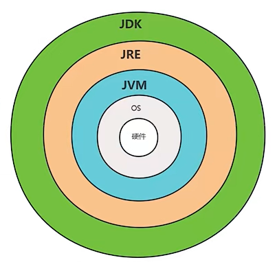
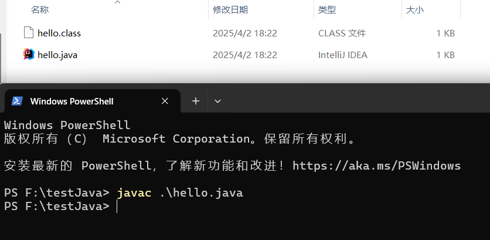
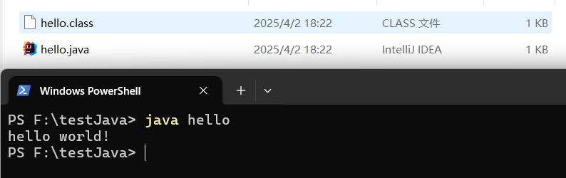
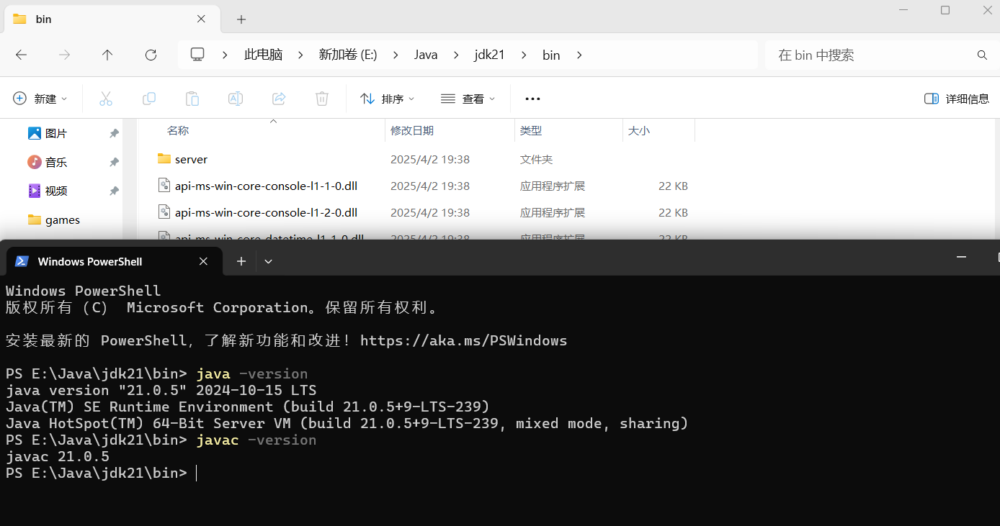
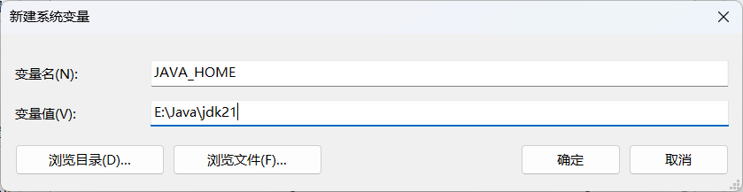
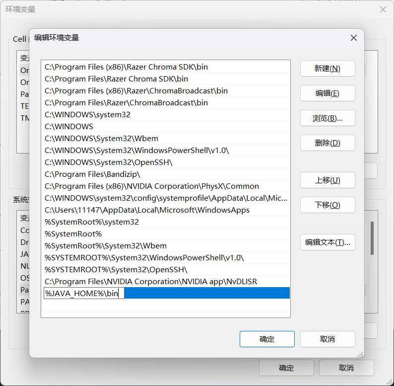
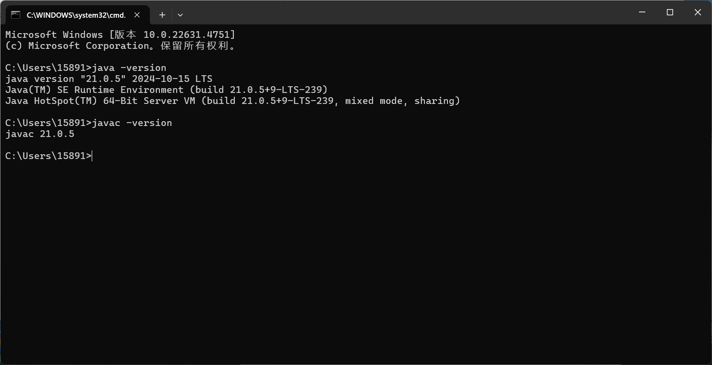

# 一.Java环境

## 1.jre

>Java运行时环境,包含jvm(Java虚拟机)标准实现和Java核心类库(API),是支持Java程序运行的标准环境

## 2.jdk

>Java开发工具包,包含编译、调试和运行(开发和运行环境)使用 Java 平台开发的程序所需的所有工具,是支持Java程序开发的最小环境.

>* bin目录主要存放命令
>* lib目录主要jdk的类库

## 3.jvm

>支持Java语言实现跨平台的基础.不同的操作系统需要下载对应的jvm.jvm需要通过类加载器将.class字节码文件加载到内存,然后通过解释器将字节码转换成机器码,然后提交给cpu执行

## 4.Java的加载与执行

>Java程序分为两个阶段:编译与运行.这两个阶段可以在不同的操作系统上完成.   
> 
>编译阶段:  
>
>* 在编译器中编写Java源代码,通过javac命令生成.class文件,这个文件包含了类的信息,在jvm加载后成为类
>* 编译成功后,使用java命令,运行已经编译好的.class文件,此时jvm才能加载出.class文件  
>
>运行阶段:  
>
>* 将加载的.class文件存到内存中,通过一系列的处理(==后续补充,现在有点看不懂==),将二进制文件翻译成操作系统对应的可操作的二进制码,然后与硬件交互

**javac命令**

>负责编译并检查语法是否正确
>
>* javac java源文件的路径,可以是相对路径也可以是绝对路径(带根目录,例如:E:\develop\jdk\bin)

**java命令**

>java命令后面跟类名,也就是.class文件的名字.Java命令会启动jvm,classloader(类加载器)会在环境变量的路径(Classpath)中根据类名找到这个.class文件
>
>* java 类名

**字节码作用**

>如果直接将Java语言编译成机器码的化就无法实现跨平台了,因为这样需要对不同的操作系统重新编译,如果先编译成字节码,Java的编译过程就更具有可读性和灵活性

**.class文件**

>字节码文件,不是一个完整的Java类,它只是包含了类中的各种信息(二进制数据),等待jvm解析完后,就是一个类了

**二进制文件**

>以二进制格式存储的数据(图片、音频、视频、字节码、数据库文件),二进制文件不一定可以直接运行,一般都是用来存储数据,然后再解释成机器码,再运行  
>二进制文件有点类似于外国语言,需要我们把他翻译成中文后,cpu才能读懂,然后执行,而jvm就担当了这个翻译的角色

**机器码文件**

>机器码文件是CPU可以直接运行的二进制文件,比如常见的.exe文件,使用这些文件不需要用到解释器什么的,直接点击就运行.==机器码文件都是二进制文件,但二进制文件不一定是机器码文件,因为机器码文件都是以二进制的格式存储数据的,但二进制文件可以存储任何数据==
## 5.Path环境变量

>当widows操作系统执行命令的时候,需要让他知道当前执行的命令是哪个路径,可以直接在这个命令的目录下执行它(默认从当前目录开始寻找,然后才到path中找),但是这样很麻烦,所以配置了path环境变量后,电脑就知道了这些命令的位置,然后自动执行,就不需要手动进入目录

## 6.classpath环境变量

>这个环境变量是属于Java的,用来给classloader指路,让他可以找到.class文件,与path原理类似,如果没有配置classpath环境变量的话,想要找到.class文件,就需要手动进入.class文件所在目录

# 二.软件的下载

## 1.jdk的安装

>下载地址: https://www.oracle.com/cn/java/technologies/downloads/archive/
>
>安装路径不要有空格和中文,用_代替

>下载好后进入\bin目录,打开命令提示符,查看是否安装成功

>出现版本号证明安装成功,接下来要配置环境变量,方便idea自动查找jdk

>环境变量配置成功后,直接输入命令就可以使用了.

## 2.tomcat下载

>下载地址: https://tomcat.apache.org/whichversion.html