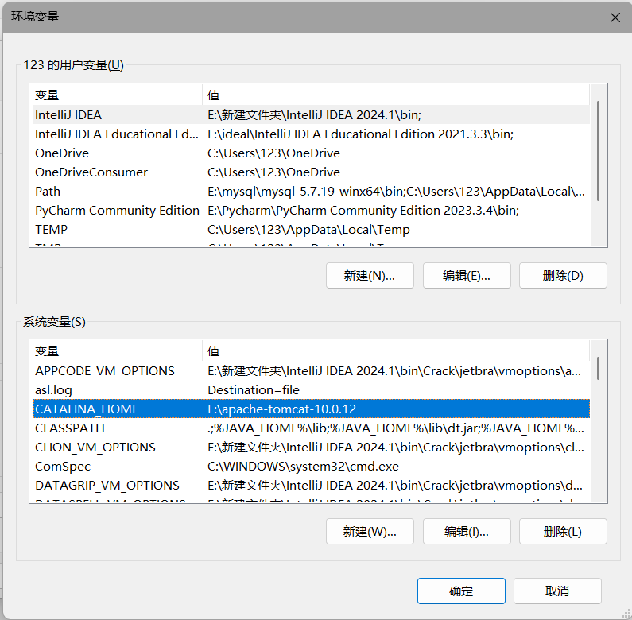

# 1. Java环境

## 1.1 JKD 和 JRE

**JDK**

>JDK（Java Development Kit）是一个功能齐全的 Java 开发工具包，供开发者使用，用于创建和编译 Java 程序。它包含了 JRE（Java Runtime Environment），以及编译器 javac 和其他工具，如 javadoc（文档生成器）、jdb（调试器）、jconsole（监控工具）、javap（反编译工具）等，是支持Java程序开发的最小环境。

****

**JRE**

>JRE 是运行已编译 Java 程序所需的环境，主要包含以下两个部分：

>1. JVM : 也就是 Java 虚拟机
>
>2. Java 基础类库（Class Library）：一组标准的类库，提供常用的功能和 API（如 I/O 操作、网络通信、数据结构等）。

>简单来说，JRE 只包含运行 Java 程序所需的环境和类库，而 JDK 不仅包含 JRE，还包括用于开发和调试 Java 程序的工具，是支持Java程序运行的标准环境。

>如果需要编写、编译 Java 程序或使用 Java API 文档，就需要安装 JDK。某些需要 Java 特性的应用程序（如 JSP 转换为 Servlet 或使用反射）也可能需要 JDK 来编译和运行 Java 代码。因此，即使不进行 Java 开发工作，有时也可能需要安装 JDK。

>从 JDK 9 开始，Java 推出了模块化机制，结合 `jlink` 工具，开发者可以根据实际需要构建精简的运行时环境；而从 JDK 11 起，Oracle 停止发布独立的 JRE，整个 Java 的运行机制和工具链变得更现代、更灵活

---
## 1.2 jvm

[JVM虚拟机规范(简略版)](JVM虚拟机规范(简略版).md)

>支持Java语言实现跨平台的基础.不同的操作系统需要下载对应的jvm.jvm需要通过类加载器将.class字节码文件加载到内存,然后通过解释器将字节码转换成机器码,然后提交给cpu执行

## 1.3 Java的加载与执行

>Java程序分为两个阶段:编译与运行.这两个阶段可以在不同的操作系统上完成.   
> 
>编译阶段:  
>
>* 在编译器中编写Java源代码,通过javac命令生成.class文件,这个文件包含了类的信息,在jvm加载后成为类
>* 编译成功后,使用java命令,运行已经编译好的.class文件,此时jvm才能加载出.class文件  
>
>运行阶段: 
>
>* 将加载的.class文件存到内存中,通过一系列的处理,将二进制文件翻译成操作系统对应的可操作的二进制码,然后与硬件交互

**javac命令**

>负责编译并检查语法是否正确
>
>* javac java源文件的路径,可以是相对路径也可以是绝对路径(带根目录,例如:E:\develop\jdk\bin)

**java命令**

>java命令后面跟类名,也就是.class文件的名字.Java命令会启动jvm,classloader(类加载器)会在环境变量的路径(Classpath)中根据类名找到这个.class文件
>
>* java 类名

**字节码** ^5e7eb9

>在 Java 中，JVM 可以理解的代码就叫做字节码（即扩展名为 `.class` 的文件），它不面向任何特定的处理器，只面向虚拟机。Java 语言通过字节码的方式，在一定程度上解决了传统解释型语言执行效率低的问题，同时又保留了解释型语言可移植的特点。所以， Java 程序运行时相对来说还是高效的（不过，和 C、 C++，Rust，Go 等语言还是有一定差距的），而且，由于字节码并不针对一种特定的机器，因此，Java 程序无须重新编译便可在多种不同操作系统的计算机上运行。

>如果直接将 Java 语言编译成机器码的话就无法实现跨平台了，因为这样需要对不同的操作系统重新编译，如果先编译成字节码，Java的编译过程就更具有可读性和灵活性

****
**.class文件**

>字节码文件,不是一个完整的Java类,它只是包含了类中的各种信息(二进制数据),等待jvm解析完后,就是一个类了

**二进制文件**

>以二进制格式存储的数据(图片、音频、视频、字节码、数据库文件),二进制文件不一定可以直接运行,一般都是用来存储数据,然后再解释成机器码,再运行  
>二进制文件有点类似于外国语言,需要我们把他翻译成中文后,cpu才能读懂,然后执行,而jvm就担当了这个翻译的角色

**机器码文件**

>机器码文件是CPU可以直接运行的二进制文件,比如常见的.exe文件,使用这些文件不需要用到解释器什么的,直接点击就运行.==机器码文件都是二进制文件,但二进制文件不一定是机器码文件,因为机器码文件都是以二进制的格式存储数据的,但二进制文件可以存储任何数据==
## 1.4 Path环境变量

>当widows操作系统执行命令的时候,需要让他知道当前执行的命令是哪个路径,可以直接在这个命令的目录下执行它(默认从当前目录开始寻找,然后才到path中找),但是这样很麻烦,所以配置了path环境变量后,电脑就知道了这些命令的位置,然后自动执行,就不需要手动进入目录

## 1.5 classpath环境变量

>这个环境变量是属于Java的,用来给classloader指路,让他可以找到.class文件,与path原理类似,如果没有配置classpath环境变量的话,想要找到.class文件,就需要手动进入.class文件所在目录

# 二.软件的下载

## 1.jdk

>下载地址: https://www.oracle.com/cn/java/technologies/downloads/archive/
>
>安装路径不要有空格和中文,用_代替

>下载好后进入\bin目录,打开命令提示符,查看是否安装成功

>出现版本号证明安装成功,接下来要配置环境变量,方便idea自动查找jdk

>环境变量配置成功后,直接输入命令就可以使用了.

## 2.tomcat

>下载地址: https://tomcat.apache.org/whichversion.html  

>进入bin目录,在终端中输入startup.bat,出现相关信息证明安装成功,在浏览器输入:http://localhost:8080/ ,如果能看到tomcat的官网,证明配置成功

>通常idea可以直接把tomcat整合进项目中,不需要配置环境变量也可以使用,不过配置了也方便,配置成功后可以在任何位置使用tomcat的命令了

## 3.maven

>下载地址: https://maven.apache.org/download.cgi

>能够看到版本号证明配置成功

>配置镜像文件,进入settings文件,配置本地仓库和远程镜像,idea中导入jar包会现在本地仓库找,没找到就到远程下,下好后保存在本地仓库

>安装完成后,在idea中进行配置

>如果只像上面这样配置maven的话,这个配置只能保存在当前的项目中,可以按照下面设置一下,这样每次创建maven项目都会使用我们本地的maven

