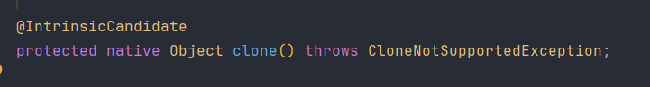
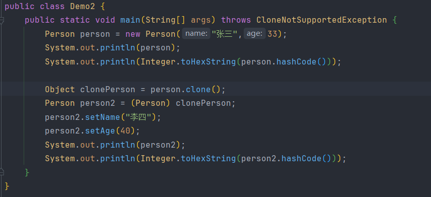
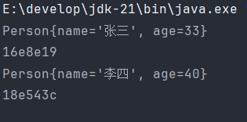
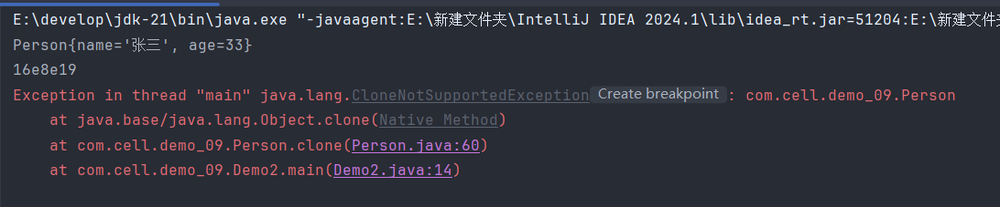
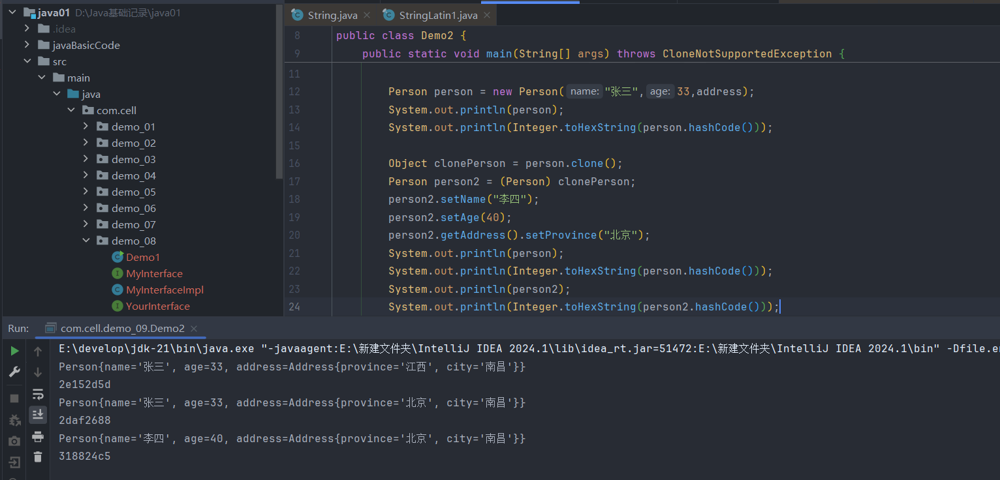
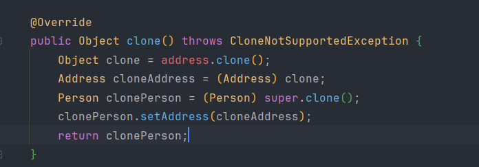
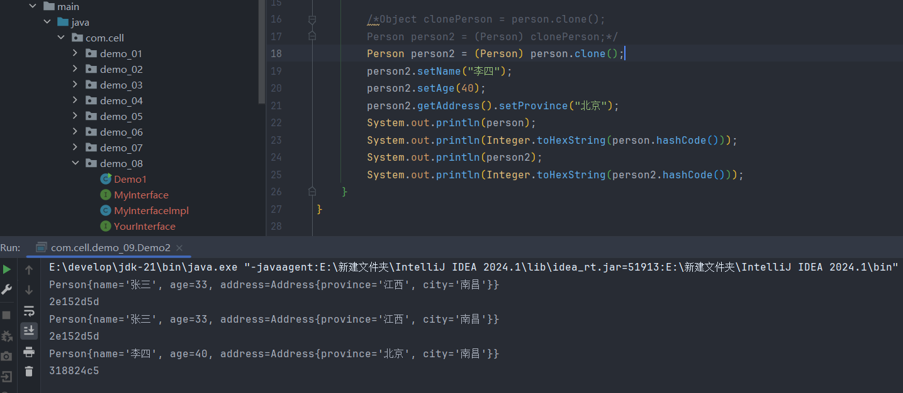

# 一.toString()

>`toString`是属于`Object`类中的方法,因为所有的类默认继承它,所以每个类都默认拥有`toString`并且可以重写它
>
>这个方法的作用是将对象转换成字符串的形式表现

>返回格式:对象的全限定名 + @ + 十六进制(哈希码),这个可以看作对象的地址

****

**(1) 当输出对象时会自动调用toString**

>在`System.out.println();`输出对象的原码中会先对将要输出的对象进行判断是否为空,如果为空就输出`null`,否则调用`toString`

>因此直接输出对象和对象调用`toString`是不一样的,直接调用没有判断是否为空的过程

>因为这个特性,在类中定义一个对象为属性时,在`toString`中输出这个字段的时候也会自动调用`toString`方法,所以如果这个字段中没有重写`toString`就会输出类名@哈希值,这也是为什么建议重写`toString`方法

****

**(2) 设计原理**

>默认的`toString`的输出更像一种身份标识  
>
>`getClass().getName()`用来获取当前对象的名称
>
>`hashCode()`返回的是对象的内存身份标识,它代表的不是真实的内存地址

****

**(3) 方便调式**

>当没有重写`toString`时输出的对象只能知道当前对象是哪个类的,非常不方便,但是在类中重写后就可以非常清楚的看到对象中的每个字段了,可读性大大提升

****

**(4) String重写toString**

>因为String本身就是字符串的最终表示,所以可以直接用`this`引用指向内存中的地址,这个地址存的就是字符串(学完数组详细介绍String)

****
# 二.equals

>判断两个对象是否相等

****

**(1) equals的实现**

>`equals`方法的本质是`==`的比较,所以两个对象比较的其实是引用的地址,也就是当前对象的引用和传入的引用,如果两个对象的引用指向同一个地址就返回`true`
>
>所以equals通常是要进行重写的,不然这个方法和`==`就没什么区别

****

**(2) String重写equals**

>因为`String`是一个类,所以所有的字符串其实都是一个对象,如果还是使用没有重写的`equals`的话就会出现`"hello".equals("hello") == false`的情况,这不是我们想看到的,所以String类中会默认重写`equals`方法,对字符串是进行内容的比较,这也是为什么字符串为什么不能用`==`比较的原因

****

**(3) 写法顺序**

>因为`equals`是作为一个方法存在的,它必须由对象来调用才行,所以`.equals`前面不能为空对象,因此在使用的时候尽量把字符串放在`.`前面,确保这个方法能正常执行避免空指针异常

****

**(4) 类中重写equals**

>因为`equals`的特性,需要对它进行重写才能比较类中的内容而不是引用的指向

>因为是重写父类的方法,所以接收的值其实是`Object`类型,所以这里面必须进行一次向下转型才能访问当前对象中的字段

****

# 三.hashCode

>每个对象中都有一个默认的哈希码,哈希码主要是用来帮助快速查找对象,确定对象在哈希表中的哪个位置,`hashCode`方法就是用来返回对象的内存地址的哈希值的

**(1) 重写equals往往伴随重写hashCode**

>在类中重写`equals`方法时通常需要一起重写`hashCode`方法,因为Java官方规定两个对象相等的话它们的哈希值也要相等,所以重写`equals`方法让它们在逻辑上相等时也需要让它们的`hashCode`方法返回相等的哈希值

>这两个对象只是在逻辑上相等,实际上在内存空间拥有独立的地址,但是重写的`hashCode`不管,因为你们在逻辑上相等,所以就必须有相同的哈希码,如果两个相同的对象拥有不同的哈希值时Java就会认为它们不是同一个对象,就会返回`false`

>`String`类中也有重写`hashCode`方法,就是为了防止两个相等的字符串拥有不同的哈希值

****

# 四.clone

>用来创建并返回当前对象的一个“副本”,这个副本是一个新的对象,在堆内存中有独立的内存地址

****

**(1) 使用方法**

>`Object`类中的`clone`方法是受保护的,只有它的子类可以使用,所以没有办法在别的类中通过new的对象来使用这个方法克隆当前对象,要想使用就必须在子类中重写,因为重写了所以可以更改它的访问权限,手动扩大它的访问范围,设置成`public`

>因为是`Object`的方法,所以克隆的对象默认是`Object`类型,所以要进行一次向下转型才能修改类的属性

>通过打印的对象地址可以看到两个对象的地址不同,证明它们在堆内存中是各自独立存在的

****

**(2) 使用clone方法必须实现Cloneable接口**

>Java是一门注重安全性的语言,有些类不应该可以被克隆,但是`clone`方法是直接把对象的内存复制出来的,它不做初始化逻辑,不会被类中封装的各种限制条件制约,所以这是一个十分危险的行为,如果不给当前的类打上可克隆的标签,那所有的类都可以被克隆,这会导致数据的泄露,带来安全风险

****

**(3) 深克隆**

>当一个类中的属性是引用类型时,克隆这个类的实例对象后更改它的应用类新的属性会导致所有对象的引用类型的属性全部改变

>出现这一现状的原因是因为person的address属性指向的是address的地址,克隆时把它的地址一起克隆过来了,而address对象是没有被克隆的,所以所有对象是共享同一个address的地址的,克隆的对象修改address里的内容会导致所有对象的address的内容都改变,想要把address也克隆一遍就得在Address类中也添加`clone`方法,然后在`Person`类中进行克隆

