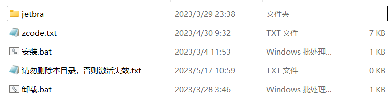
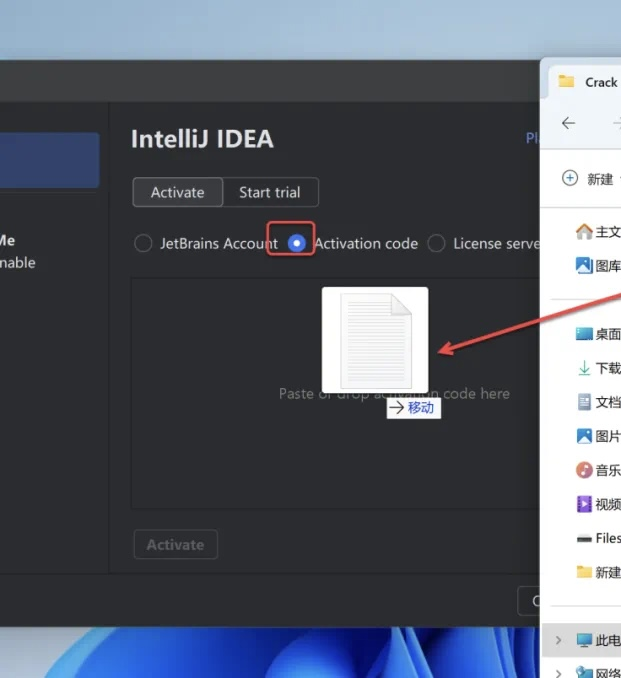
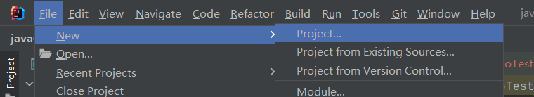
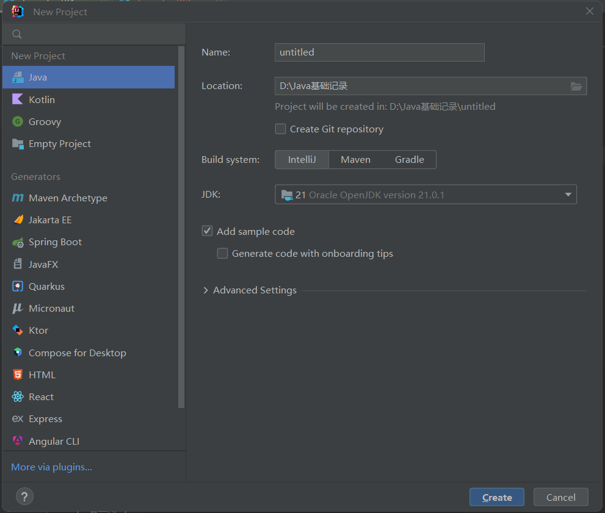
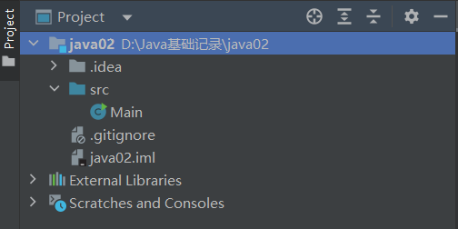
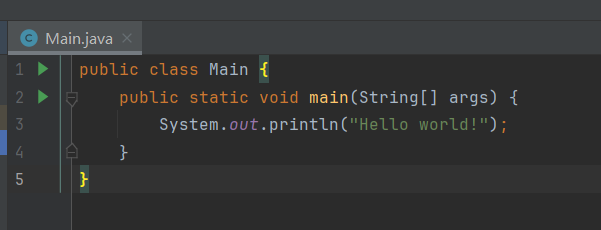
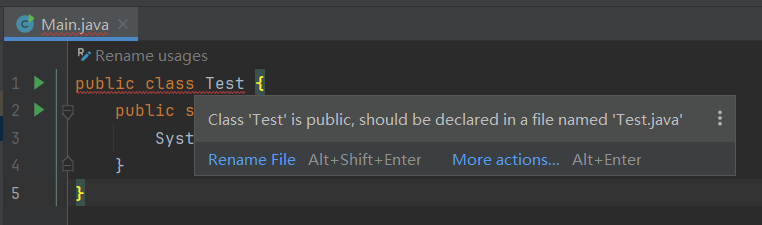
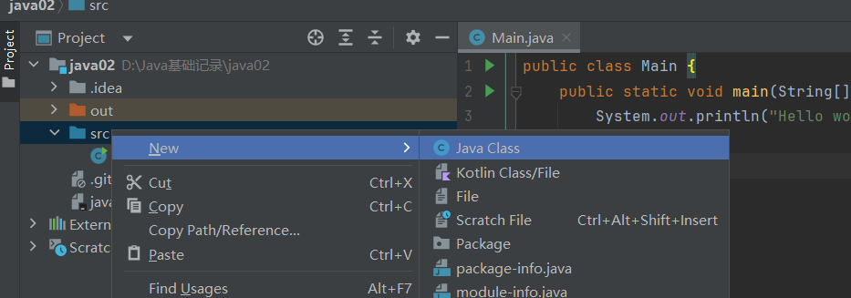
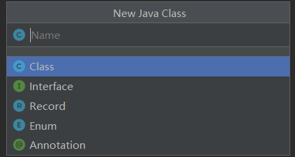

# 一.安装

>点击安装,安装成功后解压破解码,然后点击破解码中的"安装",安装成功后将zcode破解码放入idea的初始界面,安装成功.






# 二.创建project

## 1.创建基本Java项目

>刚开始可以创建一个空的project,后面可以根据需要,添加不同的module,一个module对应一个项目



>一个项目的搭建,缺少不了jdk,所以一定要选择好jdk



>基本project的目录



## 2.Java命名规范

### 1.类名

>使用大驼峰命名法

```Java
public class HelloWorld {}
```

### 2.方法名

>使用小驼峰命名法

```java
public void printMessage() {}
```

### 3.一些注意

>文件名应该和类名一致,否则报错





>可以善用idea的警告或者报错,这些信息可以告诉我当前出现的问题,看不懂的可以直接百度或者ai,很大概率都能解决问题
## 3.类型的创建

>将鼠标右键点击src,出现new,点击Java class,然后选择对应的类型就行了





# 三.创建模块

