# 一.安装

>点击安装,安装成功后解压破解码,然后点击破解码中的"安装",安装成功后将zcode破解码放入idea的初始界面,安装成功.


# 二.创建project

## 1.创建基本Java项目

>刚开始可以创建一个空的project,后面可以根据需要,添加不同的module,一个module对应一个项目


>一个项目的搭建,缺少不了jdk,所以一定要选择好jdk


>基本project的目录


## 2.Java命名规范

### 1.类名

>使用大驼峰命名法

```Java
public class HelloWorld {}
```

### 2.方法名

>使用小驼峰命名法

```java
public void printMessage() {}
```

### 3.一些注意

>文件名应该和类名一致,否则报错


>可以善用idea的警告或者报错,这些信息可以告诉我当前出现的问题,看不懂的可以直接百度或者ai,很大概率都能解决问题
## 3.类型的创建

>将鼠标右键点击src,出现new,点击Java class,然后选择对应的类型就行了


# 三.创建模块

## 1.创建maven项目

### 1.Java项目

>新建项目,选择maven项目,配置好jdk和位置就可以了

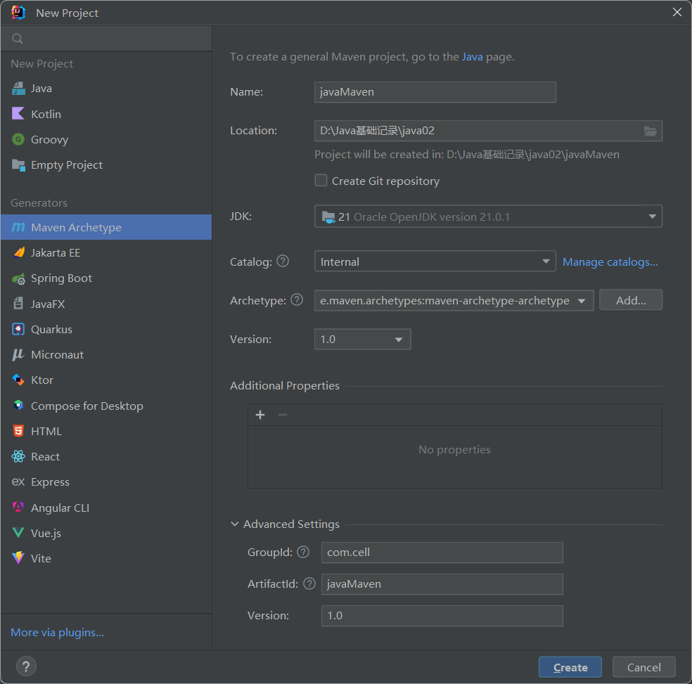

>项目创建成功后可以看到一个pom文件,就是在这个文件里面配置各种jar包,每次添加都需要刷新一下maven

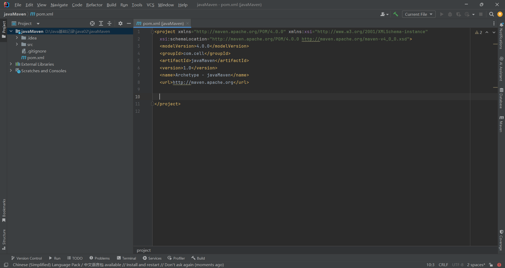

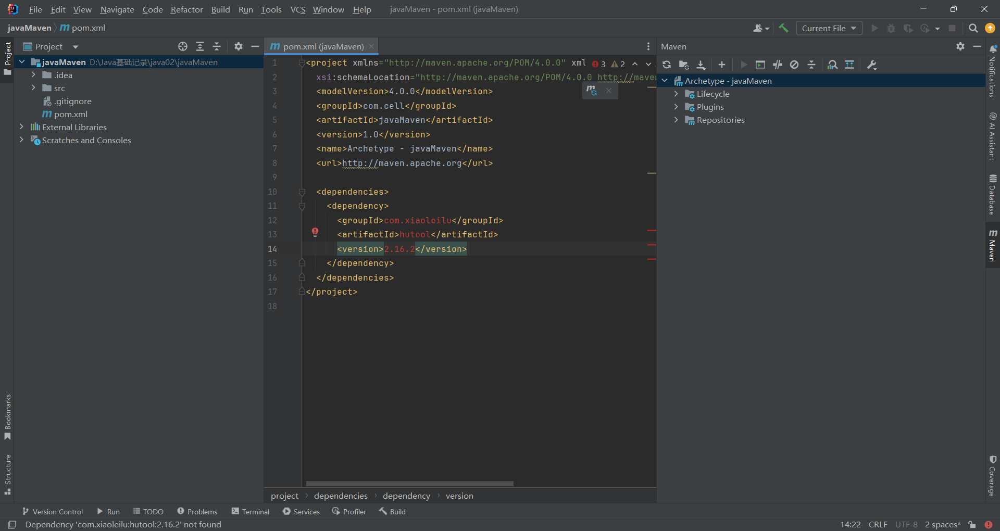

>当依赖中出现了刚添加的,证明添加成功

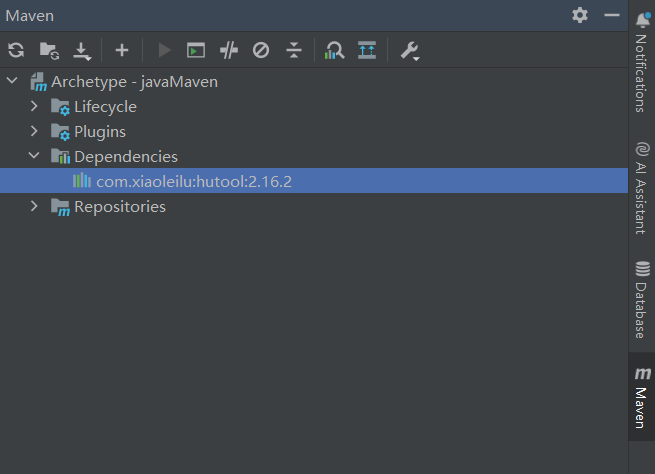

### 2.web项目

>创建maven web项目需要选择web框架

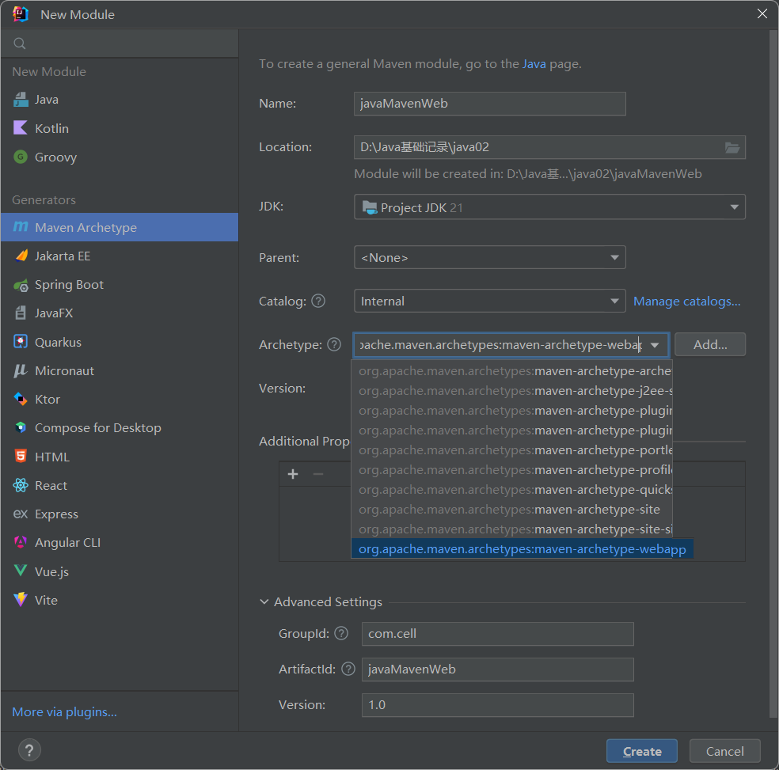

>创建好后一般需要手动创建java包

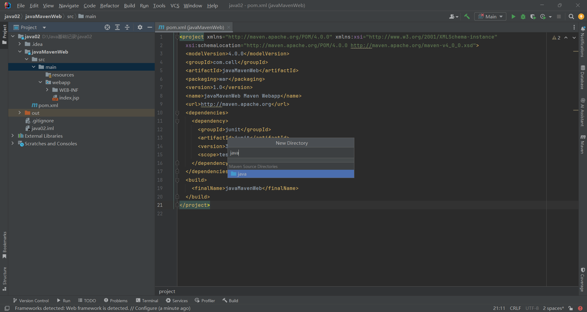

>web项目一般需要配置tomcat

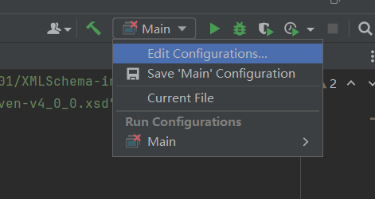

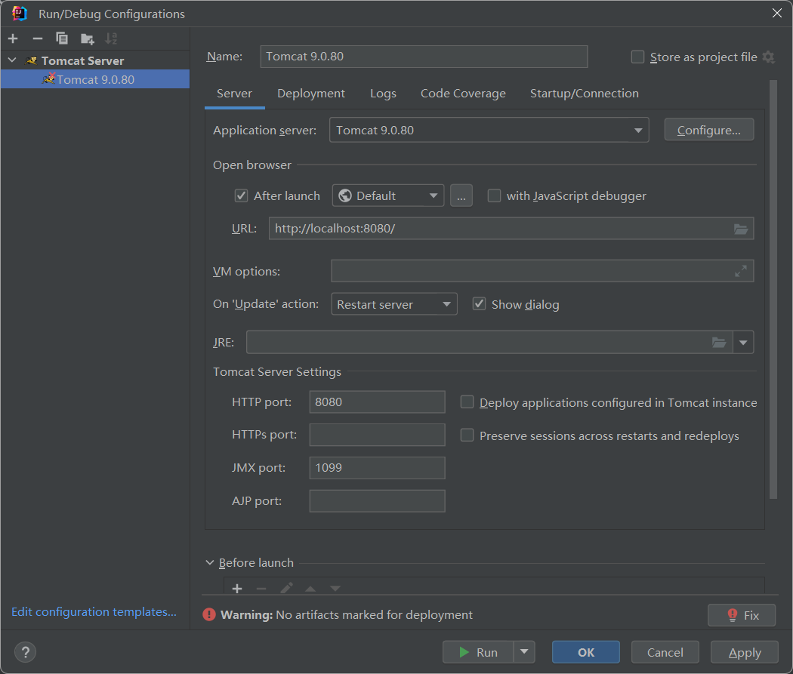

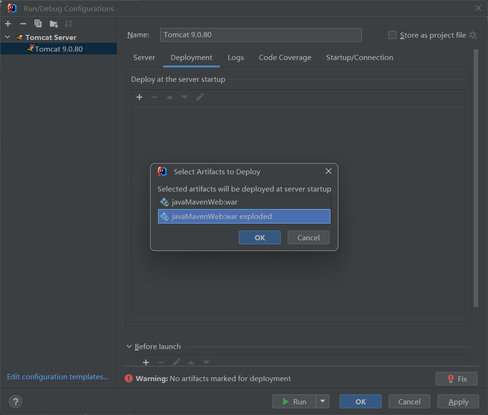

>配置成功后点击运行,浏览器输入配置的地址: http://localhost:8080/javaMavenWeb/

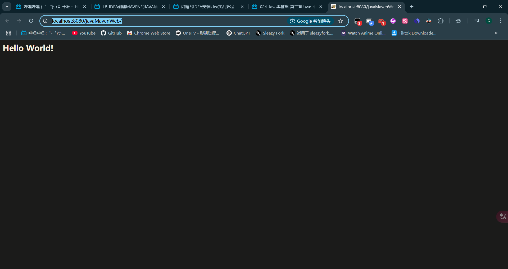

### 3.创建springboot项目

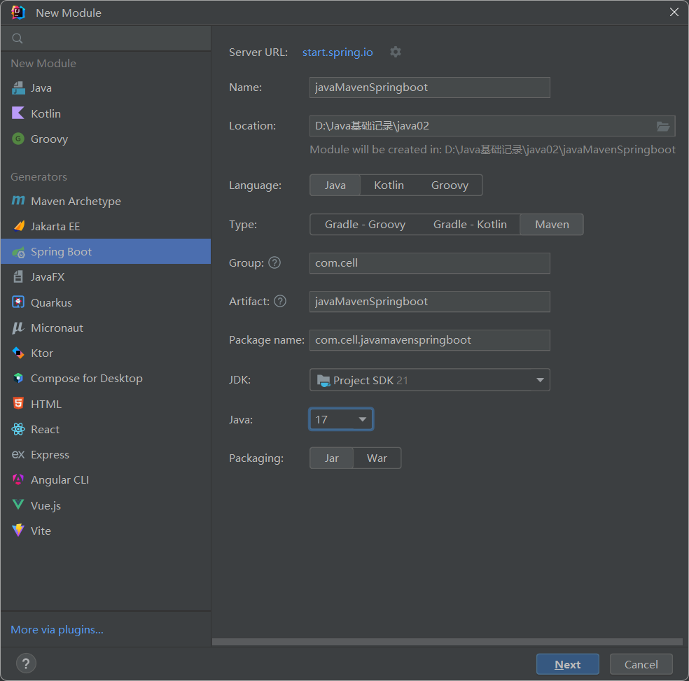

>根据自己创建的项目选择依赖

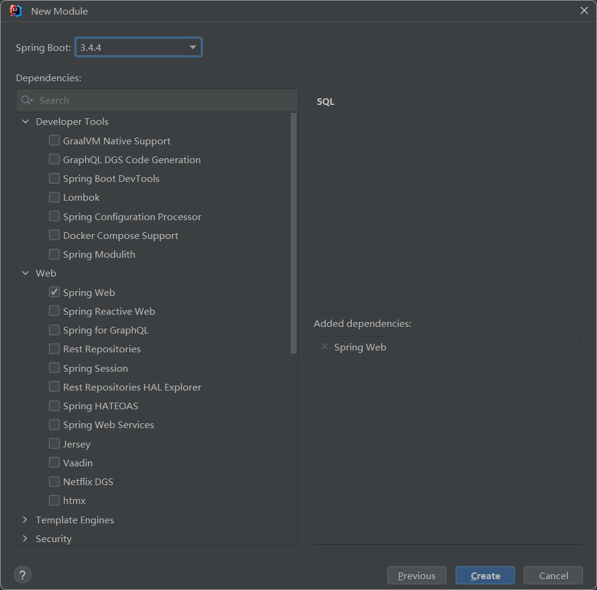

>如果pom文件是红色的,只需要把他添加成maven项目然后再刷新一下依赖就可以了

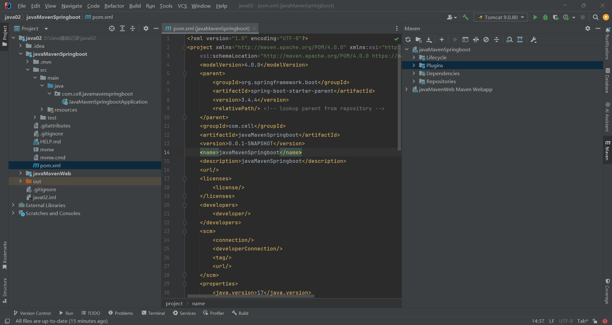


# 四.连接数据库

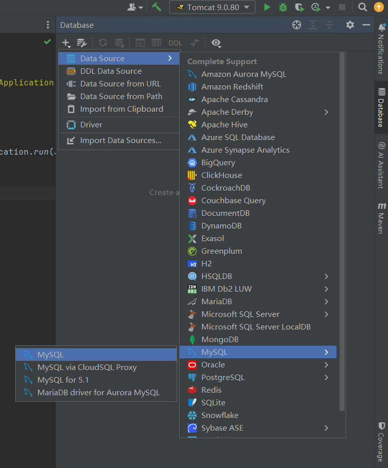

>输入用户账号密码后测试连接,连接成功


>可以在这里选择需要连接的数据库

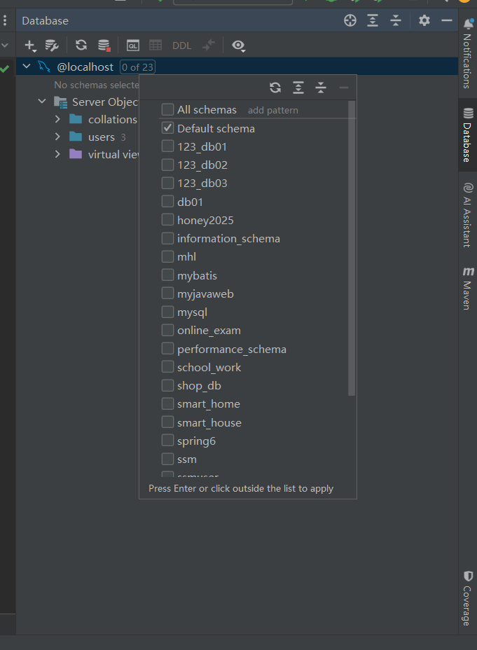

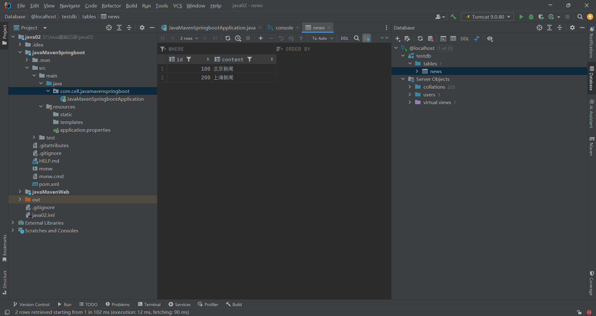