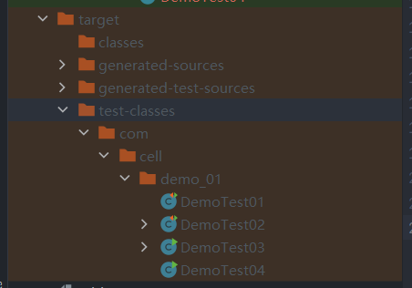

# 一.package

>写在Java源码有效代码的第一行,用来声明当前代码属于哪个包

```Java
package com.cell.demo_01;
```

>命名规范:  
>公司域名的倒写 + 项目名称 + 模块名 + 功能名: com.example.myapp.service

**jvm是否依靠package来找到当前的类?**

>寻找当前的类需要用到包的地址,但不是只需要package,还需要classpath,这个package定义的一个包的地址(也就是当前这个类放在哪个文件夹下)是Java编译后生成的.class文件存放的地方,类加载器就会在这个指定的地址寻找.class文件

**既然package可以把目录结构告诉jvm,那为什么类加载器不直接在这个包里面找类,反而还是需要通过classpath去找呢?**

>从产生这个问题到寻找答案,我发现我之前对于classpath没有理解,classpath和package的本质区别就是classpath是.class文件的起始路径,而package定义的包名是.class文件的相对路径,也就是classpath是父亲,package是儿子

>这是创建的一个Java项目,idea会自动把.java文件编译到target/classes里,这个目录就是classpath



>知道了classpath的作用后也就知道了为什么要用package来定义包了,因为classpath是一个很大的空间,里面会放各种各样的项目,每个项目都会有.class文件,jvm就需要分辨当前需要找到的.class文件是哪个,所以就需要把包名转换成对应的地址,然后在classpath里找到这个地址在哪

**总结:**

>jvm运行时只关心.class字节码文件的位置,不关系写的.java文件和包名,classpath和package是用来辅助jvm找到.class文件的,classpath是查找范围,jvm只会在这个范围里面查找.class文件,package则是用来标明某个.class文件在classpath的哪个地方,也就是让jvm更精确的找到.class文件


# 二.import

>以前只知道这个玩意用来导包,不导有些东西就用不了,现在发现它是用来告诉编译器,我要用到某个类,你需要帮我在这个地方找到它对应的.class文件,所以import是在编译阶段运行的

**为什么要使用import**

>Java的底层有很多写好的类,这些类辅助我们完成一些基本的功能,不需要手动编写,直接现拿现用,如果要使用这些类,就需要写出完整的类名(例如:java.util.Scanner),使用import可以简化这一步骤

**既然import用来导入某些包,那为什么有些功能不需要导包就能简写使用呢?**

>Java会默认导入一个lang包,这是一个几乎涵盖所有Java程序需要用到的核心类的包

**静态导包**

```
import static
这种操作类似于静态方法,使用方法的时候不再需要加上类名,这个也是一样的,使用后不需要再使用某些前缀,例如:
Math,System.out
当然,我感觉这种写法不常用,我感觉这样可读性就变低了,Java底层肯定是知道不适用某些前缀会更方便,但是它没这样设计,就是为了让程序员知道某个功能是属于谁的,比如sqrt(),不加前缀看上去就不知道干嘛的,加上前缀Math.sqrt()就比较显而易见了
```

