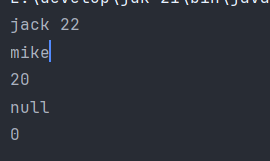
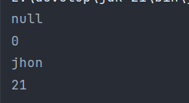

>super代表的是当前对象中的父类型的特征,当子类继承了父类时,super可以看作当前对象的一部分,所以super不能使用在静态上下文中

>当子类声明了一个和父类相同的字段时,父类的字段依然存在,并且会被分配在子类的对象的内存中,所以子类的对象中包含了两个同名的字段,分别独立存在,通过不同的编译类型来访问对应的字段,所以想要在子类中访问同名的父类的字段,可以选择父类引用指向子类或者使用super.字段名来访问

```Java
public class Person {  
    private String name;  
    private int age;  
  
    public Person() {  
  
    }  
    public Person(String name, int age) {  
        this.name = name;  
        this.age = age;  
    }  
  
    public String getName() {  
        return name;  
    }  
  
    public void setName(String name) {  
        this.name = name;  
    }  
  
    public int getAge() {  
        return age;  
    }  
  
    public void setAge(int age) {  
        this.age = age;  
    }  
}

public class Teacher extends Person{  
    private String name;  
    private int age;  
  
    public Teacher() {  
  
    }  
    public Teacher(String name, int age) {  
        this.name = name;  
        this.age = age;  
    }  
  
    public void dispaly() {  
        System.out.println(this.name);  
        System.out.println(this.age);  
  
        System.out.println(super.getName());  
        System.out.println(super.getAge());  
    }  
}
```

```Java
public static void main(String[] args) {  
    Teacher teacher = new Teacher();  
    teacher.setName("jack");  
    teacher.setAge(22);  
    System.out.println(teacher.getName() + " " + teacher.getAge());//jack 22  
  
    Teacher teacher1 = new Teacher("mike",20);  
    teacher1.dispaly();//mike 20 null 0  
}
```



>查看上面程序的输出,子类和类有相同的字段,当创建子类对象是,会给子类和父类的字段都赋值,只不过一个是默认值,一个是初始值,但是他们都存在子类对象的内存中,如果子类没有重写get和set方法,那么在子类对象赋值时,赋的就是父类的字段,如果子类没有写有参构造器的话,赋的也是父类的字段

>需要注意的是,每个子类对象都拥有自己独立的一份父类字段,通过super查看到的父类字段不过是它的默认值(创建时调用的无参构造器),这些父类字段是复制出来的,并不会和其他子类对象共享

```Java
public class Teacher extends Person{  
    private String name;  
    private int age;  
  
    public Teacher() {  
  
    }  

    public void dispaly() {  
        System.out.println(this.name);  
        System.out.println(this.age);  
  
        System.out.println(super.getName());  
        System.out.println(super.getAge());  
    }  
}

Teacher teacher2 = new Teacher();  
teacher2.setName("jhon");  
teacher2.setAge(21);  
teacher2.dispaly();//null 0 jhon 21
```



>当子类里面不存在set,get和有参构造器时,想要给字段赋值就只能利用父类的set和get方法,此时给赋值的字段就变成了父类的字段,所以输出的当前对象的字段是null和0(成员变量默认值)

**子类的构造器中默认隐含一个super()**

>子类继承父类后能够使用父类的前提是父类的结构完整,也就是需要在父类的字段完成初始化后才能把父类的字段给到子类的对象,但是这个过程并不会创建一个父类的对象而是直接作为子类对象的一部分存进内存中

**方法也是在调用super()时放进子类对象中的吗?**
