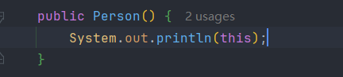
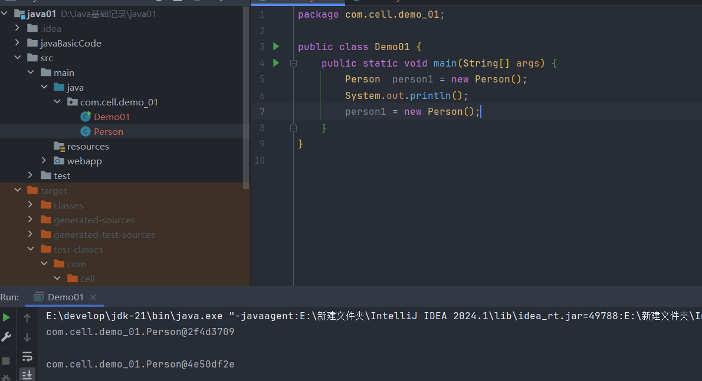
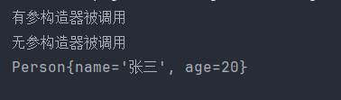

>出现在实例方法中,用来表示当前对象的引用

>当new了一个对象后,main方法的栈帧会用一个引用来存对象的地址,当使用这个引用来方法对象的实例方法后,会产生一个压栈操作,也就是这个对象的实例方法会获得一个栈帧,这个栈帧的0号槽位会存名为this的引用,用来存当前对象的地址,这个this会根据当前对象的改变而改变

```
main{
	Person person = new Person();
	perosn.name = "张三";
}
class Person{
	study() {
		sout(this.name + "正在study");//这个this就是用来获取当前对象的信息的,不过通过可以省略
	}
}
```

>但是,当实例方法中传入的形参名和对象的实例变量名一样时,就需要调用this来访问当前对象的属性,所以当存在static修饰时,不能使用this

>在构造器中添加一个输出语句,看看this是什么





>这个输出的东西可以等同看作对象的内存地址,每次new都是一个新的地址

**this()**

>通过这种语法可以在构造方法中调用其他构造方法,只能出现在构造方法的第一行,且只能出现一次

```Java
public class Person {
    private String name;
    private int age;
    // 无参构造器
    public Person() {
        this("未命名", 0);//调用另一个构造器
        System.out.println("无参构造器被调用");
    }
    // 有参构造器
    public Person(String name, int age) {
        this.name = name;
        this.age = age;
        System.out.println("有参构造器被调用");
    }
}
//在创建对象时,会通过无参构造器区调用有参构造器
```



>this()语法是为了减少代码复用而存在的,把构造器一层一层接力到最后的构造器中,这样可以实现统一的初始化管理

```Java
//定义一个具有三个构造器的类,无论创建对象时调用哪个构造器,都可以给其余属性附上初始值
//无论调用哪个,最终都会调用到全参
public Student() {  
    this("小明",0);  
}  
  
public Student(String name) {  
    this(name,0);  
    this.name = name;  
}  
  
public Student(String name, int grade) {  
    this.name = name;  
    this.grade = grade;  
}
```


