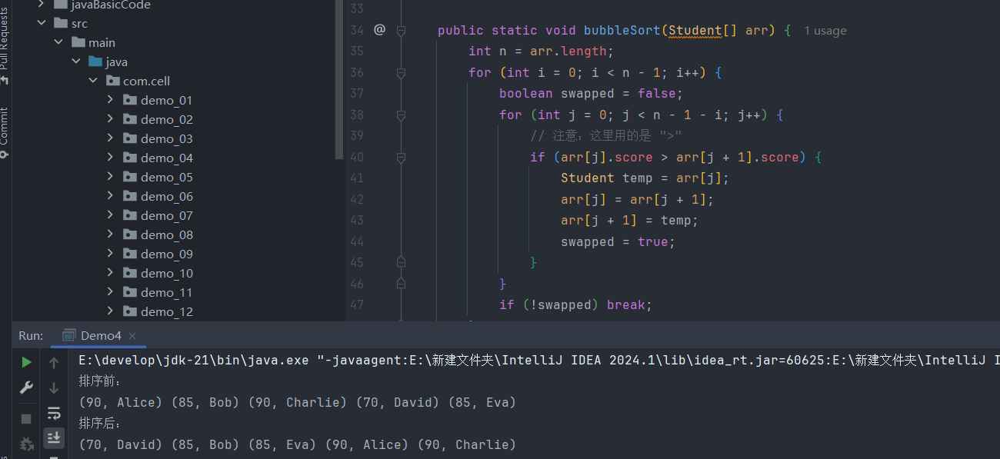

>相邻的两个元素对比，大的往后排

```
[6, 4, 8, 3, 7, 9]

第1轮

1. 比较 6 和 4 → 换 → [4, 6, 8, 3, 7, 9]
2. 比较 6 和 8 → 不换 → [4, 6, 8, 3, 7, 9]
3. 比较 8 和 3 → 换 → [4, 6, 3, 8, 7, 9]
4. 比较 8 和 7 → 换 → [4, 6, 3, 7, 8, 9]
5. 比较 8 和 9 → 不换 → [4, 6, 3, 7, 8, 9] 9就位

第2论

1. 比较 4 和 6 → 不换 → [4, 6, 3, 7, 8, 9]
2. 比较 6 和 3 → 换 → [4, 3, 6, 7, 8, 9]
3. 比较 6 和 7 → 不换 → [4, 3, 6, 7, 8, 9] 
4. 比较 7 和 8 → 不换 → [4, 3, 6, 7, 8, 9] 8就位

第3轮

1. 比较 4 和 3 → 换 → [3, 4, 6, 7, 8, 9]
2. 比较 4 和 6 → 不换 → [3, 4, 6, 7, 8, 9]
3. 比较 6 和 7 → 不换 → [3, 4, 6, 7, 8, 9] 7就位

第4轮

1. 比较 3 和 4 → 不换 → [3, 4, 6, 7, 8, 9] 
2. 比较 4 和 6 → 不换 → [3, 4, 6, 7, 8, 9] 6就位

第5轮

1. 比较 3 和 4 → 不换 → [3, 4, 6, 7, 8, 9] 4就位，冒泡结束
```

>第一轮需要对比5次，第二轮需要对比4次，第三轮需要对比3次，第四轮需要对比2次，第五轮需要对比1次，因为每轮至少把一个最大值送到最后，所以长度为n的数组最多只需要 n - 1 轮，每第 i 趟证明已经对比好了i - 1个元素，所以只需要再对比 n - 1 - (i - 1)  = n - i 次，从这种关系中可以看出需要进行两次循环，外层循环轮数，内层循环比较次数

```
int arr[] = {6, 4, 8, 3, 7, 9};

for (int i = 0; i < arr.length - 1; i++) {
	for (int j = 0; j < arr.length - 1 - i; j++) {
		if (arr[j] > arr[j + 1]) {
			int temp = arr[j];
			arr[j] =  arr[j + 1];
			arr[j + 1] = temp;
		}
	}
}
```

>如果一个数组中的元素是已经排序好了的话，只需要进行一轮的对比就可以确定好，所以此时的时间复杂度为O(n)，取决于输入的规模有多大，最坏情况当然是倒序的，每轮都要对比满才行，所以需要对比(n - 1) + (n - 2) + ... + 2 + 1 = n<sup>2</sup>/2 + n/2，时间复杂度为O(n<sup>2</sup>)

**冒泡排序的优化**

>因为某些情况下存在部分有序的元素，对于这部分元素其实没必要进行对比和交换，当排序时在某处发生最后一次交换，证明这个位置之后的元素都是有序的，例如`[3, 2, 1, 4, 5]`，最后一次交换是2和1，下一次最后的交换只会是3和2，交换后3不会再和4对比，如果是普通的冒泡排序还会有一次3和4的对比

>再比如`[1,2,3,4,5]`，优化后的冒泡没有进行比较，所以可以直接输出原数组，但是原始的冒泡就会依次进行比较

```java 
public static void bubbleSort(int[] arr) {  
    int n = arr.length;  
    // 外循环控制总轮数  
    for (int i = 0; i < n - 1; i++) {  
        boolean swapped = false;  
        int lastSwapIndex = n - 1; //初始为最后一个元素的位置  
        // 内循环进行比较和交换  
        for (int j = 0; j < lastSwapIndex; j++) {  
            if (arr[j] > arr[j + 1]) {  
                // 交换元素  
                int temp = arr[j];  
                arr[j] = arr[j + 1];  
                arr[j + 1] = temp;  
                swapped = true;  
                lastSwapIndex = j; //记录最后一次交换的位置  
            }  
        }  
        //如果没有发生交换，说明数组已经有序，提前结束  
        if (!swapped) {  
            break;  
        }  
    }  
}
```

**冒泡排序是稳定排序**

>当两个元素值相等时，经过排序后，它们仍有之前的前后关系，即相对位置不会改变


