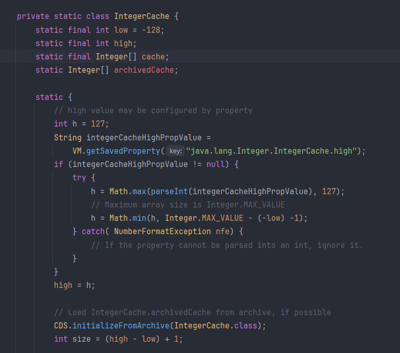

## 1. 基本数据类型与包装类的对应关系

```
 byte       Byte      
 short      Short     
 int        Integer   
 long       Long      
 float      Float     
 double     Double    
 char       Character 
 boolean    Boolean   
```

****
## 2. 为什么引入包装类

### 2.1 让基本数据类型可以像对象一样使用

>Java是面向对象的编程，这就导致基本数据类型不能直接参与面向对象的操作，例如集合（`List`、`Map`）只能存储对象，不能存储基本类型，所以引入包装类，让基本数据类型具有对象的特性

****
### 2.2 允许null值

>基本类型不能为`null`，而包装类可以表示“**值缺失**”或“**未定义**”的场景：

```java
Integer age = getUserAgeFromDatabase(); 

if (age == null) {
    System.out.println("年龄未填写");
}
```

****

## 3. 装箱与拆箱

>装箱：将基本数据类型转换为对应的包装类对象  
>拆箱：将包装类对象转换回基本数据类型

### 3.1 自动装箱与拆箱

```java
int num = 10;

Integer i = num;        // 自动装箱：int → Integer
                        // 等于Integer obj = Integer.valueOf(num)
int val = i;            // 自动拆箱：Integer → int
                        // 等于int val = obj.intValue()
```

>在集合中就存在自动装箱与拆箱的过程

```java
List<Integer> list = new ArrayList<>();
list.add(123);        // 自动装箱
int n = list.get(0);  // 自动拆箱
```

>需要注意的是Java 为了优化内存和性能，对于频繁使用的小整数对象（`Integer` 类型）进行了缓存机制，Java 默认缓存的是 -128 到 127 之间的整数对象

```Java
Integer a = 127;
Integer b = 127;
System.out.println(a == b);      // true（引用同一个对象）
Integer x = 128;
Integer y = 128;
System.out.println(x == y);      // false（超出缓存范围）
System.out.println(x.equals(y)); // true（比较内容）
```





>这些缓存实际上是存放在一个数组中的，当 Integer 类初始化时缓存就被初始化了

| 包装类              | 是否有缓存机制 | 默认缓存范围              |
| ---------------- | ------- | ------------------- |
| **Integer**      | 是       | -128 ~ 127（可调）      |
| **Short**        | 是       | -128 ~ 127          |
| **Byte**         | 是       | 所有值（-128 ~ 127）     |
| **Long**         | 是       | -128 ~ 127          |
| **Character**    | 是       | 0 ~ 127（ASCII）      |
| **Boolean**      | 是       | `true` / `false` 两个 |
| **Float/Double** | 否       | 没有缓存机制（使用频率低）       |

****
## 4. 常用方法

### 4.1 valueOf()

>将基本类型或字符串转换为包装类对象（优先使用缓存）


**与 new 的区别**

>通过 `new` 来装箱一定会创建一个新的对象，但是如果值在缓存范围内，使用 `valueOf` 就不会创建对象，而是直接从数组中获取，大部分的自动装箱使用的都是 `valueOf` 


****
### 4.2 parseXxx()

>将字符串转换为基本类型


****
### 4.3 xxxValue()

>将包装类对象转换为基本类型


****
### 4.4 toString()

>包装类中重写了 `toString()` 方法，所以直接输出封装好的基本数据类型时不会输出一个地址，而是准确的数据


>因为包装类的本质是对象，所以它声明的变量是引用型的，即使重写了 `toString` 方法它输出的内容也是字符串类型的

****
## 5. 与String类的关系与区别

### 5.1 关系

>String类和包装类（如Integer、Boolean等）在Java中都属于不可变对象，且都提供了一些工具方法用于数据转换和操作，它们都作为一种封装类来简化代码，都具有常量池机制

****
### 5.2 区别

#### 5.2.1 设计目的不同

>String类：专为处理字符序列设计，提供字符串拼接、分割、替换等文本操作功能  
>
>包装类：将基本数据类型（如int、boolean）包装为对象，使其能用于面向对象场景（如集合、泛型）

****
#### 5.2.2 运算符

>String类可以使用 `+` 运算符来实现字符串的拼接，但是包装类使用 `+` 时必须拆箱成基本数据类型才行

****

## 6. 包装类、String、基本数据类型相互转换

### 6.1 基本数据类型与包装类

>装箱与拆箱的过程就是它们的转换过程

****
### 6.2 包装类与String

**包装类转String**

>通过 `toString` 进行转换，或者使用 String 类的 valueOf 方法


**String转包装类**

>通过包装类的 `valueOf()` 方法或者 `parseXXX()` 方法来实现


****

**基本数据类型与String**

>使用 `String.valueOf()` 或者 `+` 运算符


