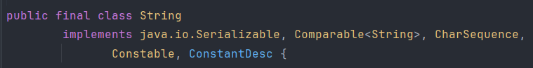

# 1. 获取 Class 的三种方式

## 1.1 使用 `.class` 语法获取 `Class` 对象（编译期静态获取）

```java
Class<?> clazz = ClassName.class;

Class<String> stringClass = String.class;
```

**特点：**

- 在编译期就能确定类型，安全性好。

- 不需要对象或字符串名，适合静态类型已知的情况。

- 即使类没有被实例化，也能获取它的 `Class`。

****
## 1.2 使用 `对象.getClass()` 方法获取（运行时动态获取）

```java
Class<?> clazz = obj.getClass();

String str = "Hello";
Class<?> clazz = str.getClass();

// 或者
Class<?> clazz = (new 对象).getClass();
```

**特点：**

- **通过对象获取，属于运行时行为**。

- 安全性较好，不易出错。

- 常用于处理对象时，动态判断类型。

****
## 1.3 使用 `Class.forName(String className)` 方法（动态加载）

```java
Class<?> clazz = Class.forName("java.lang.String");
```

**特点：**

- 通过类的完全限定名动态加载类，是在运行时加载类。

- 会触发类的加载、连接、初始化（即执行静态代码块等）。

- 若类名写错或类不存在，会抛出 `ClassNotFoundException`。

****

```java
public class Test {  
    static {  
        System.out.println("Person：静态代码块");  
    }  
  
    {        System.out.println("Person：动态代码块");  
    }  
  
    public Test() {  
        System.out.println("Person：构造方法");  
    }  
}
```

```java
Class<?> clazz1 = Test.class;  
System.out.println("---------------");  
Class<?> clazz2 = Class.forName("com.cell.demo_23.Test");  
System.out.println("---------------");  
Class<?> clazz3 = new Test().getClass();
```

```
---------------
Person：静态代码块
---------------
Person：动态代码块
Person：构造方法
```

>通过 `Test.class` 的方法获取对象的Class对象，不会调用对象中任何的代码块或代码， `Class.forName()` 会调用静态代码块的内容，`对象.getClass()` 则会打印所有内容，因为它需要先创建一个对象

| 获取方式                   | 是否初始化类 | 是否执行静态代码块   | 是否执行实例代码块和构造器 |
| ---------------------- | ------ | ----------- | ------------- |
| `Test.class`           | 否      | 不执行         | 不执行           |
| `Class.forName("xxx")` | 是      | 执行          | 不执行           |
| `对象.getClass()`        | 是      | 执行（如果还没执行过） | 执行            |

>`Test.class` 是被动引用，不会触发类初始化；`Class.forName()` 是主动使用类，会执行静态代码块；`new Test()` 创建对象，会执行所有代码块（先静态 -> 实例 -> 构造方法）

****
# 2. Field

## 2.1 获取字段

1、 `getField(String name)` ：获取 public 字段（包括继承的）

```java
class Parent {  
    public String parentField = "parentField";  
    public int parentValue = 100;  
}  
  
class Child extends Parent {  
    public String childField = "childField";  
    public int childValue = 200;  
}  
  
public class Demo3 {  
    public static void main(String[] args) throws Exception {  
        // 获取 Child 类的 public 字段，包括继承自 Parent 类的 public 字段  
        Field field1 = Child.class.getField("parentField");  
        Field field2 = Child.class.getField("childField");  
  
        // 输出字段值  
        Child child = new Child();  
        System.out.println("parentField: " + field1.get(child)); // parentField: parentField  
        System.out.println("childField: " + field2.get(child)); // childField: childField 
    }  
}
```

2、`getDeclaredField(String name)` ：获取当前类声明的字段（包含 private，但不包含父类的字段）

```java
class People {  
    private String name = "Alice";  
}  
  
public class Demo4 {  
    public static void main(String[] args) throws Exception {  
        Field f = People.class.getDeclaredField("name");  
        f.setAccessible(true); // 让私有值可以得到访问  
        People p = new People();  
        System.out.println("字段值：" + f.get(p));  
    }  
}
```

3、读取和修改 public 字段

```java
class User {  
    public String username = "guest";  
}  
  
public class Demo5 {  
    public static void main(String[] args) throws Exception {  
        User u = new User();  
        Field f = User.class.getField("username");  
        System.out.println("原始值：" + f.get(u));  
  
        f.set(u, "admin");  
        System.out.println("修改后：" + f.get(u));  
    }  
}
```

4、读取和修改 private 字段

```java
class Product {  
    private double price = 99.99;  
}  
  
public class Demo6 {  
    public static void main(String[] args) throws Exception {  
        Product p = new Product();  
        Field f = Product.class.getDeclaredField("price");  
        f.setAccessible(true);  
  
        System.out.println("原始价格：" + f.get(p));  
        f.set(p, 49.99);  
        System.out.println("新价格：" + f.get(p));  
    }  
}
```

5、获取字段与类型

```java
class Dad {  
    public String parentField = "父类字段";  
}  
  
class Son extends Parent {  
    public String name;  
    private int age;  
    protected String address;  
    boolean active;  
}  
  
public class Demo7 {  
    public static void main(String[] args) {  
        Class<?> clazz = Son.class;   
        Field[] fields = clazz.getDeclaredFields();  
        for (Field field : fields) {  
            System.out.println(field.getName() + "（类型：" + field.getType().getSimpleName() + "）");  
        }  
    }  
}
```

```
name（类型：String）
age（类型：int）
address（类型：String）
active（类型：boolean）
```

>如果使用的是 `field.getType().getName()`

```
name（类型：java.lang.String）
age（类型：int）
address（类型：java.lang.String）
active（类型：boolean）
```

6、getModifiers() 获取修饰符

>这个方法返回的是一个 `int` 类型的数据，代表该成员的各种修饰符，可以通过 `Modifier.toString()` 将 `int` 转换成真实的修饰符

```java
class Examples {  
    public int publicField;  
    private String privateField;  
    protected double protectedField;  
    static int staticField;  
    final int finalField = 100;  
    public static final String constField = "常量";  
}  
  
public class Demo8 {  
    public static void main(String[] args) {  
        Class<?> clazz = Examples.class;  
        Field[] fields = clazz.getDeclaredFields();  // 包括 private 字段  
  
        for (Field field : fields) {  
            int mod = field.getModifiers();  
            String modStr = Modifier.toString(mod);  
            System.out.println("修饰符：" +  modStr + " " + "类型：" + field.getType().getSimpleName());  
        }  
    }  
}
```

```
修饰符：public 类型：int
修饰符：private 类型：String
修饰符：protected 类型：double
修饰符：static 类型：int
修饰符：final 类型：int
修饰符：public static final 类型：String
```

****
## 2.2  反编译类的字段



