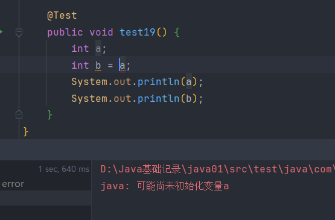

>在Java中,变量必须先定义后使用

# 一.成员变量和局部变量

## 1.成员变量

>成员变量是定义在类中,但是在方法外的变量,是类的一部分,也是对象的特征属性

```Java
public class Person {
    String name;   //成员变量
    int age;       //成员变量
    public void sayHello() {
        String message = "Hi!"; //局部变量
    }
}
```

>1. 成员变量定义在类中,整个类都可以被访问,并且具有默认值  
>2. 成员变量随着对象的建立而建立,随着对象的消失而消失,存在于对象所在的堆内存中,跟着对象走 
>3. 通过 对象.变量 名访问  
>4. 可以添加访问修饰符

**实例变量:**

>实例变量是成员变量的一种,属于对象本身,跟成员变量的区别也就是能不能加static的区别,所以对象中不能声明静态变量


## 2.局部变量

>在方法、构造器或代码块中定义的变量

```Java
public class Demo {
    public static void main(String[] args) {
        int a = 10; //局部变量
        System.out.println(a);
    }
}
```

>1. 局部变量只定义在局部范围内,不属于类或对象，如：函数内，语句内等，只在所属的区域有效  
>2. 局部变量存在于栈内存中，随着方法的调用而创建,方法结束就销毁
>3. 局部变量没有默认初始化值  
>4. 不可以添加访问修饰符


## 3.静态变量

>由static修饰的变量称为静态变量,其本质上就是一个全局变量,属于整个类,被类中的所有对象共享,如果某个内容是被所有对象所共享,那么该内容就应该用静态修饰,没有被静态修饰的内容其实是属于对象的特殊描述

>静态变量存放在方法区,类加载时初始化,程序结束后销毁  后续可以补充堆,栈方法区等概念

>使用 类名.变量名 访问,虽然也可以使用 对象.变量名 访问,但是这样不太好,因为静态变量本质上是属于类的,不是对象的,直接使用 对象.变量名 访问容易混淆

```Java
public class Counter {
    static int count = 0; //所有对象共享这个计数器
    public Counter() {
        count++;
    }
    public static void showCount() {
        System.out.println("创建了 " + count + " 个对象");
    }
}

public static void main(String[] args) {
    new Counter();
    new Counter();
    Counter.showCount(); //创建了 2 个对象
}
```

>==静态变量在类加载时就会初始化,优先于对象的创建==

# 二.final变量

>在 Java 中,被final修饰的变量 只能被赋值一次,值确定后不能再改变.

>final可以修饰大多变量,但不能修饰类中的构造器/构造方法

>虽然说final修饰的变量不能改,但是如果修饰的是对象的话,还是可以通过对象里面的set方法来修改数据

```Java
final Person p = new Person("张三");
p.name = "李四"; 
```

>还有一种情况,那就是引用传递的时候,在方法里是可以修改这个对象的,因为此对象非彼对象,只是一个副本


# 三.基本类型变量

>基本类型变量存储的是具体的值

```
在定义变量的时候可以手动给他一个初始值,看似是初始值,实际上算是一种赋值
int a = 10;
如果不手动给他初始值的话,Java就会自动给他赋值,这也就是为什么基本数据类型中每个数据类型都有自己的默认值
int a;
```

>变量可以被赋值,也可以赋值给其他变量,其实都是被赋值...

```
int a = 10;
int b = a;//b = 10
```

>不过需要注意的是,当没有手动给某个变量赋初始值的话,是不允许把这个变量赋给其他变量的,也不能直接输出,简单地说就是不能直接用,为什么呢?虽然基本数据类型都有Java给他的默认值,但是这个默认值只有成员变量才能使用,局部变量是没有默认值的,那为什么在main方法中也没有默认值呢?因为main方法也是一个方法,他里面定义的变量也都是局部变量,在底层,jvm会调用这个main方法,不能把main方法跟实体类搞错了



```
实体类中定义的变量就是成员变量
class Test {
    int a;
    boolean b;
    String name;
}
```

# 四.引用类型变量

>引用类型变量存储的是对象的地址

```
常见的引用类型:
类class:String,Scanner,自定义的类(Person)
接口interface:List,Map
数组Array:int[],String[]
枚举Enum
```

>简单介绍一下,后面会详细补充