| 数据类型        | 占用字节数 | 取值范围                              | 具体取值范围                                                 | 默认值      |
| ----------- | ----- | --------------------------------- | ------------------------------------------------------ | -------- |
| **byte**    | 1     | \( -2^7 \) ~ \( 2^7-1 \)          | -128 ~ 127                                             | 0        |
| **short**   | 2     | \( -2^{15} \) ~ \( 2^{15}-1 \)    | -32,768 ~ 32,767                                       | 0        |
| **int**     | 4     | \( -2^{31} \) ~ \( 2^{31}-1 \)    | -2,147,483,648 ~ 2,147,483,647                         | 0        |
| **long**    | 8     | \( -2^{63} \) ~ \( 2^{63}-1 \)    | -9,223,372,036,854,775,808 ~ 9,223,372,036,854,775,807 | 0L       |
| **float**   | 4     | 1.4E-45 ~ 3.4028235E38            | 1.4E-45 ~ 3.4028235E38                                 | 0.0f     |
| **double**  | 8     | 4.9E-324 ~ 1.7976931348623157E308 | 4.9E-324 ~ 1.7976931348623157E308                      | 0.0d     |
| **boolean** | 1     | true / false                      | true / false                                           | false    |
| **char**    | 2     | \( 0 \) ~ \( 2^{16}-1 \)          | 0 ~ 65,535                                             | '\u0000' |

==byte<short<int<long<float<double==

所有的引用数据类型的默认值是:null

****
# 一.整数型

>Java中任何一个整数型变量都会默认被当作int类型处理,例如 `int a = 100`
>
>因为Java中,等号右边先执行,所以100会先被存入一个临时变量,不管怎么样,都给他四个字节的存储空间,因为a是int类型,刚好四个字节,不存在类型转换,但是如果是`long a = 100`,就是把四个字节的内容放到八个字节中,小容量自动赋值给大容量,这就叫自动类型转换

>但是,如果在整数型后面加上了L,Java就会把他识别为long类型,直接给他8个字节的空间,而不是默认类型,那么`long a = 100`就不存在类型转换

>如果这个值超出了int类型的范围,并且后面没有加上L,那么就会报错,因为等号右边先执行,Java把他默认为了int类型,可是这个数超过了范围,那么用int就无法表示,就只能报错了,但并不是long存不下

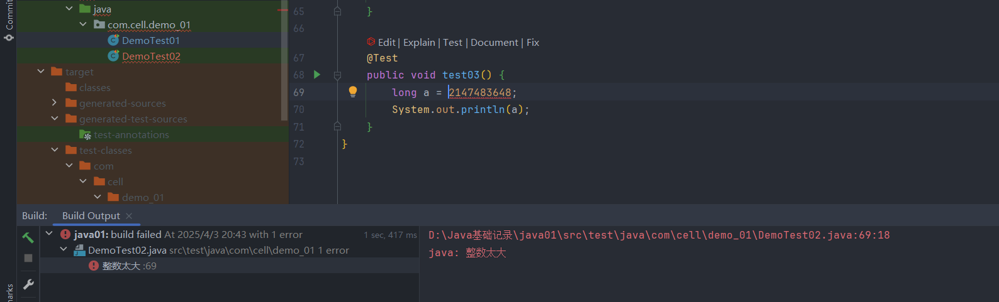

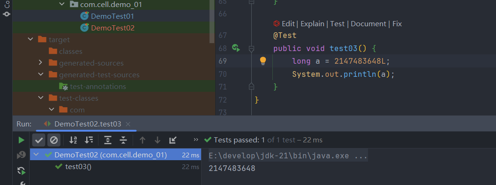

>两个int类型的数据进行运算后,仍然是int类型  
>==多种类型的数据运算时,先转换成最大的再运算==

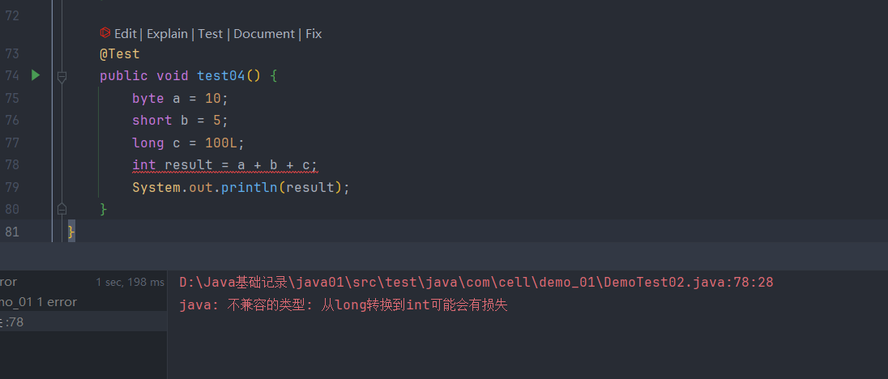

>byte 和 short运算时,会各自转换成int类型再运算  
>byte+byte -> int  
>short+short -> int

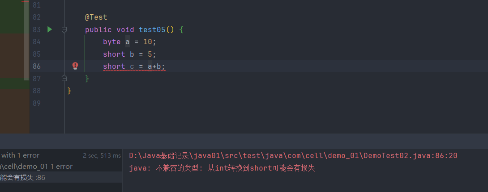

****
## BigInteger

>`long` 的范围

```
long min = -9223372036854775808L;
long max =  9223372036854775807L;
```

>如果某个数超过了 `long` 能表示的最大范围，就需要用其他的方式来存储，推荐使用 `BigInteger` 的字符串构造

```java
BigInteger big = new BigInteger("123456789012345678901234567890");
```

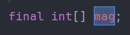

>这个就是底层用来存储的数组


****
# 二.浮点型

<a id="float-todo"></a>

>float单精度,精度为7位小数  
>double双精度,精度为15位小数

>浮点型字面量默认被当作double类型处理,想要用float类型就要加上F

>浮点型可以用科学计数法表示:`double a = 1.23E10`=1.23x10<sup>10</sup>, 123E-2=123x10<sup>-2</sup>=1.23

**==为什么float的容量比long还要大?==**

>虽然float只有32位,但是这些二进制位表示的东西和long的不同,long的64位全部用来存放二进制,而float的第一位表示正负,2~9位存的是指数位,剩下的23位存位数位,只有这23位是和long一样,虽然放的少,但它以指数级增长,范围肯定更大

>浮点型数据参与运算得出的结果不要与其他值用`==`比较,因为计算机底层存储的浮点型是它的近似值,通常使用极小误差来判断相等

^f63714

>计算机是二进制的，而且计算机在表示一个数字时，宽度是有限的，无限循环的小数存储在计算机时，只能被截断，所以就会导致小数精度发生损失的情况

```
// 0.2 转换为二进制数的过程为，不断乘以 2，直到不存在小数为止，
// 在这个计算过程中，得到的整数部分从上到下排列就是二进制的结果。
0.2 * 2 = 0.4 -> 0
0.4 * 2 = 0.8 -> 0
0.8 * 2 = 1.6 -> 1
0.6 * 2 = 1.2 -> 1
0.2 * 2 = 0.4 -> 0（发生循环）
...
```

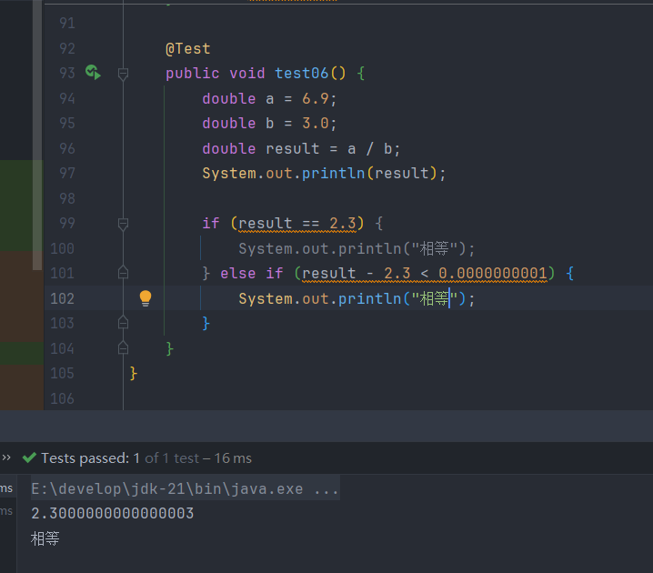

****
## BigDecimal

>为了避免精度丢失，可以使用 `BigDecimal` 来进行浮点数的运算，推荐使用字符串构造（避免精度误差）

>BigDecimal 是使用十进制的字符串来表示浮点数的，它不会转换成二进制，也不近似，所以不存在精度丢失问题（和手算一样）

### 1. 加法

```java
BigDecimal a = new BigDecimal("1.1");
BigDecimal b = new BigDecimal("2.2");
BigDecimal result = a.add(b); // 3.3
```

### 2. 减法

```java
BigDecimal result = a.subtract(b); // -1.1
```

### 3. 乘法

```java
BigDecimal result = a.multiply(b); // 2.42
```

### 4. 除法

>除法是最复杂的一个，因为可能无限小数，所以必须指定舍入方式和精度

```java
BigDecimal a = new BigDecimal("10");
BigDecimal b = new BigDecimal("3");

// 保留 2 位小数，四舍五入
BigDecimal result = a.divide(b, 2, RoundingMode.HALF_UP); // 输出 3.33
```

>这里需要注意的是，在使用 `divide` 方法的时候尽量使用 3 个参数版本，并且 `RoundingMode` 不要选择 `UNNECESSARY`，否则很可能会遇到 `ArithmeticException`（无法除尽出现无限循环小数的时候），其中 `scale` 表示要保留几位小数，`roundingMode` 代表保留规则。

```java
public BigDecimal divide(BigDecimal divisor, int scale, RoundingMode roundingMode) {
    return divide(divisor, scale, roundingMode.oldMode);
}
```

>例如一些保留规则:

```java
public enum RoundingMode {
   // 2.5 -> 3 , 1.6 -> 2
   // -1.6 -> -2 , -2.5 -> -3
   UP(BigDecimal.ROUND_UP), // 向远离 0 的方向进位
   // 2.5 -> 2 , 1.6 -> 1
   // -1.6 -> -1 , -2.5 -> -2
   DOWN(BigDecimal.ROUND_DOWN), // 向 0 方向舍弃（截断）
   // 2.5 -> 3 , 1.6 -> 2
   // -1.6 -> -1 , -2.5 -> -2
   CEILING(BigDecimal.ROUND_CEILING), // 向正无穷舍入
   // 2.5 -> 2 , 1.6 -> 1
   // -1.6 -> -2 , -2.5 -> -3
   FLOOR(BigDecimal.ROUND_FLOOR), // 向负无穷舍入
   // 2.5 -> 3 , 1.6 -> 2
   // -1.6 -> -2 , -2.5 -> -3
   HALF_UP(BigDecimal.ROUND_HALF_UP), // 四舍五入
   //......
}
```

### 5. 大小比较

>不能使用 `==` 或 `equals` 来比较 `BigDecimal` 数值是否相等，应该使用 `compareTo()` 

```java
a == b          // 比较的是引用地址
a.equals(b)     // 比较值 + 比较精度（scale）

BigDecimal a = new BigDecimal("2.0");
BigDecimal b = new BigDecimal("2.00");

System.out.println(a.equals(b)); // false
```

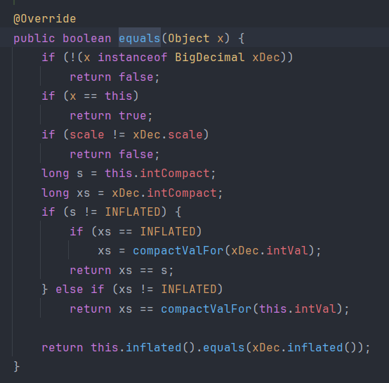

> `compareTo()` 只比较数值，不比较 `scale`

```java
BigDecimal a = new BigDecimal("2.0");
BigDecimal b = new BigDecimal("2.00");

System.out.println(a.compareTo(b) == 0); // true
```

>虽然 `compareTo()` 底层也会判断 `scale` ，不过是在比较之前通过某些方式绕过它，实际上仍然是值的比较，根据是否为 0 判断相等与否

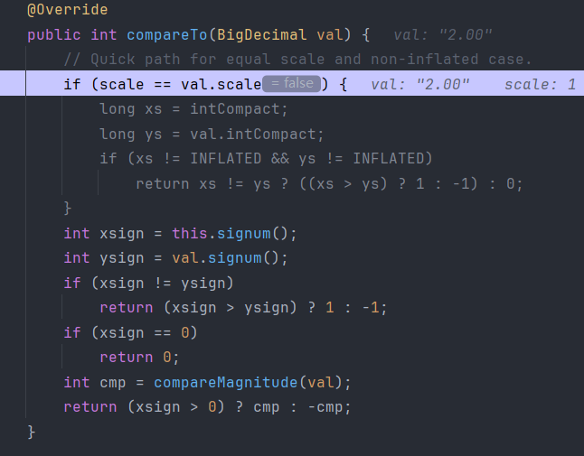

### 6. 保留几位小数

>通过 `setScale`方法设置保留几位小数以及保留规则

```java
BigDecimal m = new BigDecimal("1.255433");
BigDecimal n = m.setScale(3,RoundingMode.HALF_DOWN);
System.out.println(n); // 1.255
```

****
# 三.char

>char类型统一采用Unicode编码,且默认值是\u0000,虽然char和short一样只占两个字节,但是char表示的范围是0~65535,没有负数

>char声明的变量只能放一个字符,并且不能放空字符(也就是里面什么都不写,并不是打一个空格)

>声明char变量时,如果是一个整数型字面量并且没有超过char的范围,那么这个字面量可以当作ASCII码值来处理


>也可以使用Unicode码声明char,\u后面跟的是十六进制,并且要对应Unicode码

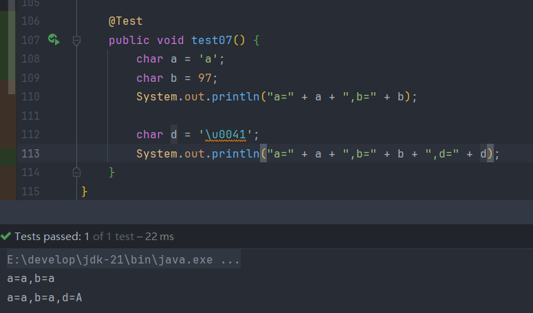

**转义字符**

>因为转义字符比较特殊,所以用char的时候可以拿某些字母和转义字符搭配使用,并不会造成char报错

```
\t:制表符,等于tab键
\n:换行符
\":表示双引号(")
\':表示单引号(')
\\:表示反斜杠(\)
```

**char的运算**

>运算时根据ASCII表将字符解码成二进制,然后Java将这个二进制转换成int类型的数据再运算,如果把算好的值再赋值给char的话,就会把这个值当作ASCII来编码

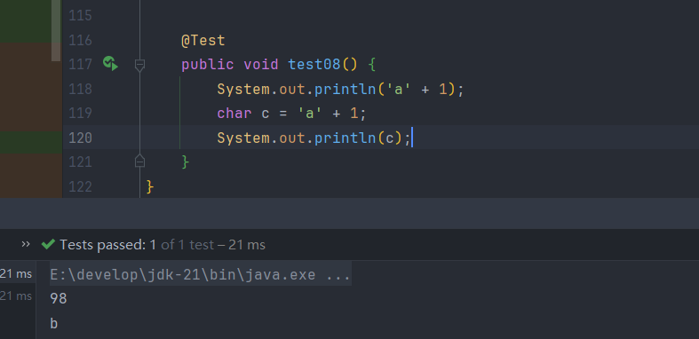

****
# 四.boolean

>boolean只有两个值:true和false,Java中不能直接当作1和0来进行运算,这是boolean和以上类型的最大区别

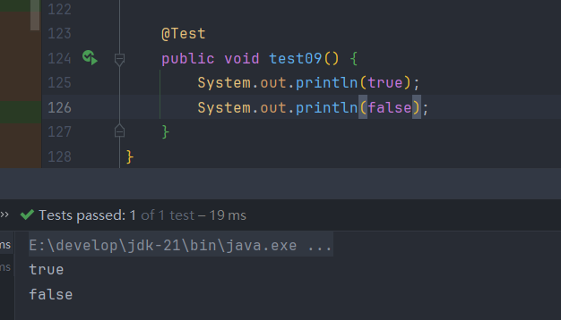

****
# 五.字符编码

>人为规定文字与二进制的转换关系

**ASCII编码**

>用8位二进制进行编码(一个字节)，用于表示控制字符、英文字符、数字字符。因为使用8位二进制编码，所以ASCII编码只能表示256个字符,编号范围为0~255,需要注意的是,这些都是字符,不是int类型  
>常用的:  
>a 对应 ASCII中的 97(b是98...)  
>A 对应 ASCII中的 65(B是66...)  
>0 对应 ASCII中的 48(1是49...)

>'a' -> ASCII编码 -> 97 -> 0110 0001  
>0110 0001 ->ASCII解码 -> 'a'

**Unicode编码**

>Java采用的编码,可以表示所有的语言,采用十六进制,占用两个字节或者四个字节

**utf-8编码**

>基于Unicode编码的可变长度字符编码,使用1~4个字节表示一个字符,是web开发常用的,字母1个字节,汉字3个字节

**gbk编码**

>针对中文设计的编码,用2个字节表示一个汉字

**乱码问题**

>当编码和解码时使用的码表不同,就会产生乱码

****
# 六.数据类型转换

>Java要求等号左边和等号右边的类型要一致，如果不一致，就需要进行数据类型转换,Java中不同的类型之间，在满足数据兼容的条件下可以实现转换.

**自动类型转换**

>容量小的类型自动转换为容量大的数据类型

>byte->short,byte->int,byte->long...以此类推,在这个转换过程,编译不会报错,他会自动把小的类型转换成大的类型

>对于byte,short,char  
>给他们赋值时可以直接写int类型,尽管他们比int小,但是系统会自动给他们转换,也就是只要不超过他们的取值范围,都可以自动转换


**强制类型转换**

>容量大的数据类型转换为容量小的数据类型

```java
long a = 100L;  
int b = (int)a;
```

>byte,short,char进行混合运算时,需要把最总结果转换成int或者long,浮点型同理,不过这也可以看做是java的自动转型

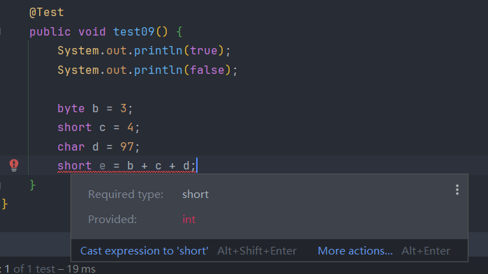

>强制类型转换可能会导致数据丢失或者精度降低,因为原始的数据可能比强转的类型能够储存的容量大,多余的部分自然会丢失,例如double->int,一定会丢失小数的部分

```
int k = 128;
k: 0000 0000 0000 0000 0000 0000 1000 0000
short j = (short)k;
j:                     0000 0000 1000 0000
这里就丢失了前面的两个字节,因为当前的128并没有超过short类型的范围,所以并没有造成实质的数据丢失
```

>看下例,将int类型强转成byte类型,会丢失三个字节的数据,又因为这是有符号的数据,所以最高位是符号位,128就变成了-128

```java
int k = 128;
byte b = (byte)k;
sout(b);//-128
```

```
int k = 128;
k: 0000 0000 0000 0000 0000 0000 1000 0000 = 128
byte b = (byte)k;
j:                               1000 0000 = -128
```

>浮点型强转成整数型,舍弃的是二进制的尾数部分,并不会四舍五入,如果需要可以使用math方法代替

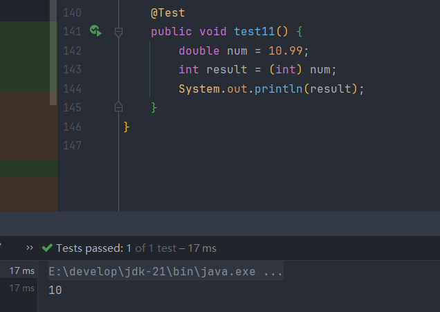

>如果浮点型的值超过了整数型的最大范围,理应会发生溢出,但是Java会直接对其进行赋值,`Integer.MAX_VALUE`或者`Integer.MIN_VALUE`

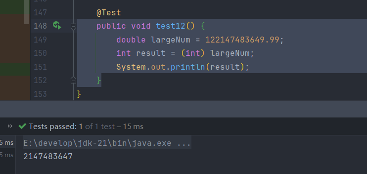