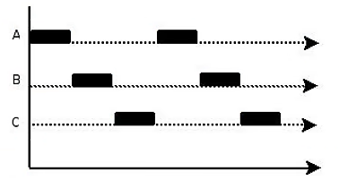
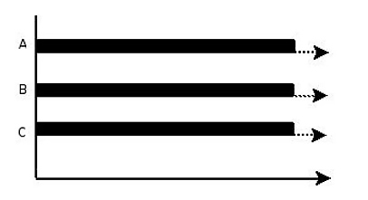
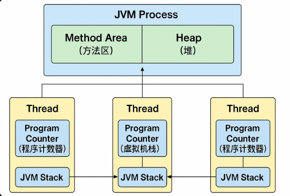

>多线程是一种程序执行方式，指的是在同一个进程中并发执行多个线程，每个线程代表一条独立的执行路径，它们共享同一进程的内存资源  
>
>进程是操作系统中运行的程序的基本单位，是程序的一次执行活动，所以一个软件就是一个进程

# 1. 并发和并行

## 1.1 并发

>并发是能够让操作系统从宏观上看起来同一时间段执行多个任务，但实际上对于单核CPU来说，任意具体时刻都只有一个任务在占用CPU资源，操作系统一般通过CPU时间片轮转来实现并发，也就是在一段时间内让多个进程轮流使用同一个 CPU，每个进程使用相同的时间，这多个进程的“同时运行”就形成了并发

>如上图所示，假设只有一个CPU资源，线程之间要竞争得到执行机会。图中的第一个阶段，在A执行的过程中，B、C不会执行，因为这段时间内这个CPU资源被A竞争到了，同理，第二阶段只有B在执行，第三阶段只有C在执行。  
>
>其实，并发过程中，A、B、C并不是同时进行的（微观角度），但又是同时进行的（宏观角度）。在同一个时间点上，一个CPU只能支持一个线程在执行。但因为CPU运行的速度很快，CPU使用抢占式调度模式在多个线程间进行着高速的切换，因此看起来的感觉就像是多线程一样

****
## 1.2 并行

>​ 在同一时刻多个进程使用各自的 CPU，多个进程形成并行，所以并行需要多个 CPU 支持

>如图所示，在同一时刻ABC都是同时执行的

****
# 2. 多线程

>线程是可独立调度执行的最小指令序列，由操作系统或虚拟机的调度器管理，线程属于进程的一部分，同一进程中的多个线程共享该进程的可访问资源（如堆内存、全局变量），但每个线程有独立的程序计数器和方法调用栈

>在一个程序中，有很多的操作是非常耗时的，如数据库读写操作，IO操作等，如果使用单线程，那么程序就必须等待这些操作执行完成之后才能执行其他操作，但使用多线程的话就可以将耗时任务放在后台继续执行并同时执行其他操作

>假设 P 进程抢占 CPU 后开始执行，如果 P 进程在进行获取网络资源的操作时，用户进行UI 操作，此时 P 进程就不会响应 UI 操作。
>
>如果把 P 进程分为 Ta、Tb 两个线程，Ta 用于获取网络资源，Tb 用于响应 UI 操作。当 Ta 执行获取网络资源的同时让用户进行 UI 操作，此时操作系统就会通过线程调度机制，让 Ta 线程暂时挂起，让 Tb 占用 CPU资源，UI 响应完成后让 Tb 释放 CPU，Ta 继续执行网络资源请求

## 2.1 进程和线程的区别

1、 根本区别：进程是操作系统资源分配的基本单位，而线程是CPU调度和执行的基本单位

2、 在开销方面：每个进程都有独立的代码和数据空间（程序上下文），程序之间的切换会有较大的开销；线程可以看做轻量级的进程，同一类线程共享代码和数据空间，每个线程都有自己独立的运行栈和程序计数器（PC），线程之间切换的开销小

3、 所处环境：在操作系统中能同时运行多个进程（程序）；而在同一个进程（程序）中有多个线程同时执行（通过CPU调度，在每个时间片中只有一个线程执行）

4、 内存分配方面：系统在运行的时候会为每个进程分配不同的内存空间；而对线程而言，除了CPU外，系统不会为线程分配内存（线程所使用的资源来自其所属进程的资源），线程组之间只能共享资源

5、 包含关系：没有线程的进程可以看做是单线程的，如果一个进程内有多个线程，则执行过程不是一条线的，而是多条线（线程）共同完成的；线程是进程的一部分

****
## 2.2 线程调度

>如果多个线程被分配到一个 CPU 内核中执行，则同一时刻只能允许有一个线程能获得 CPU 的执行权

1、 分时调度：所有线程轮流使用 CPU，每个线程分配一个时间片，用完就换下一个；公平、简单

2、 抢占式调度：优先级高的线程优先执行，如果一个高优先级线程变为就绪状态，就会抢占正在运行的低优先级线程

****
# 3.  JVM 中的进程和线程结构
# 3.1 结构

>当运行一个 Java 程序时会创建一个 Java 进程，在这个进程中包含多个线程：

* main 线程：执行 `main()` 方法
* GC 线程：用于垃圾回收
* 编译器线程：用于编译
* ......

>JVM 运行时在操作系统中表现为一个独立进程，它包含以下几块主要内存区域：

* 方法区：存放类结构信息（类、方法、常量等）
* 堆：存放对象和数组

>以上是线程间共享的

* 程序计数器 PC：每个线程独立，记录当前执行的字节码行号
* 虚拟机栈 JVM Stack：每个线程独立，存储方法调用信息（栈帧）
* 本地方法栈 Native Method Stack：调用本地方法时使用

****
## 3.2 每个线程都有自己的程序计数器和 JVM 栈

>程序计数器是线程私有的，它记录着当前线程执行的方法字节码的位置（也就是下一条将要执行的指令地址），当线程切换时，PC 会保存当前线程的执行位置，当轮到下一个线程时，就会恢复线程上次离开的位置

>JVM 栈也是线程私有的，JVM 栈由多个栈帧组成，每一个方法的调用都会产生一个栈帧，每个栈帧中保存了局部变量表（int、引用等）、操作数栈（中间运算数据）、方法返回地址、当前类的运行时常量池引用等，所以 JVM 栈是一种保存了线程运行过程中方法调用的历史记录和数据暂存区

****
# 4. ​ 线程的实现方式

## 4.1  继承Thread类

