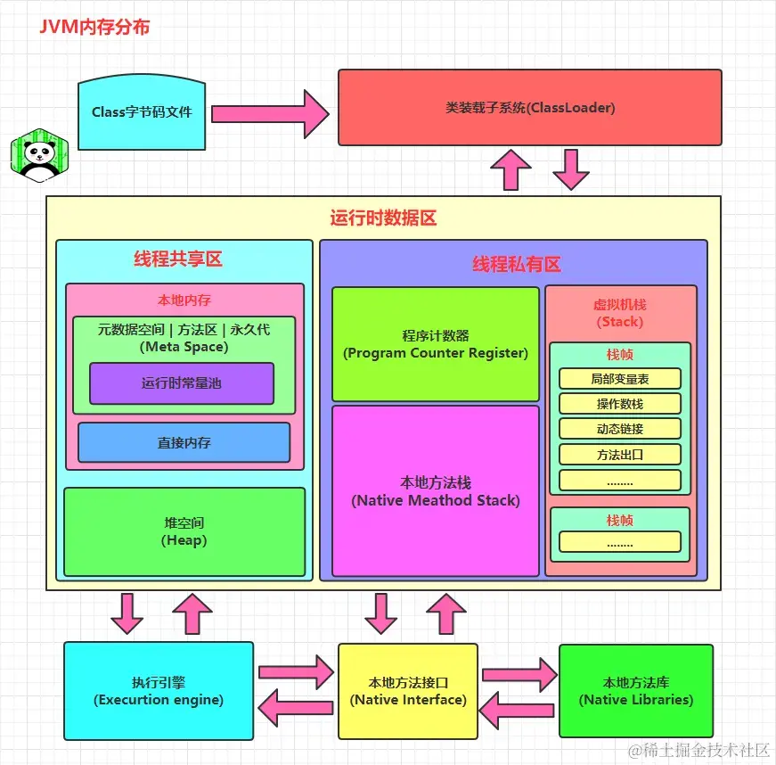
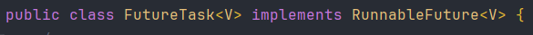
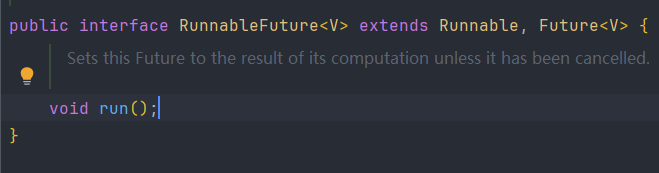
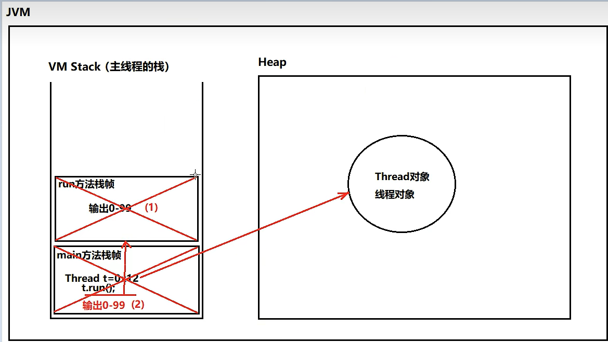
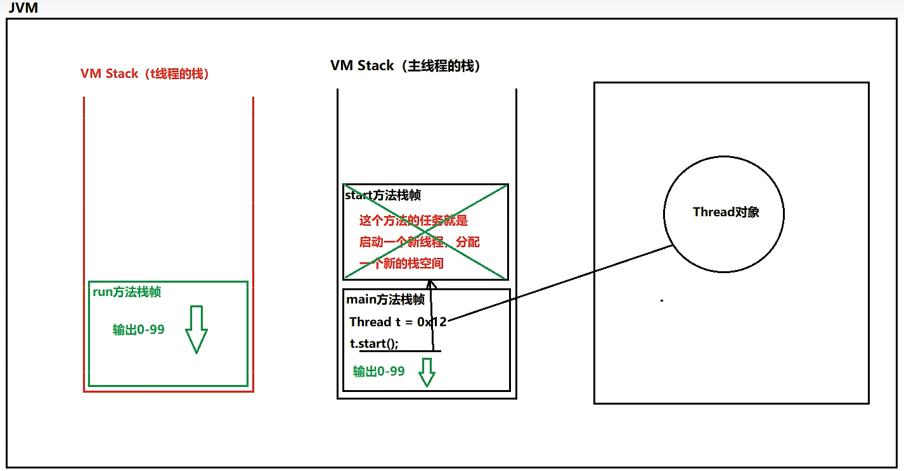
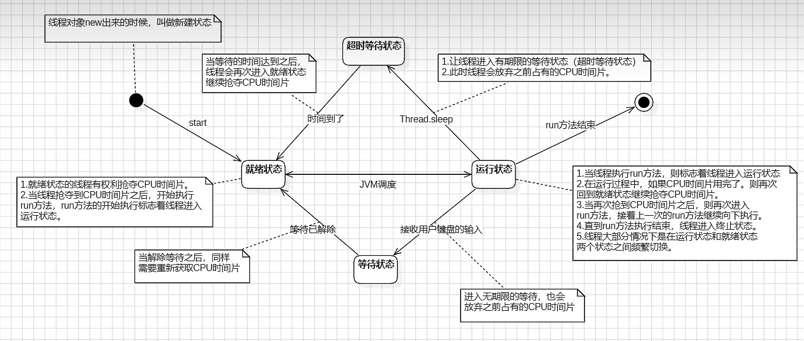
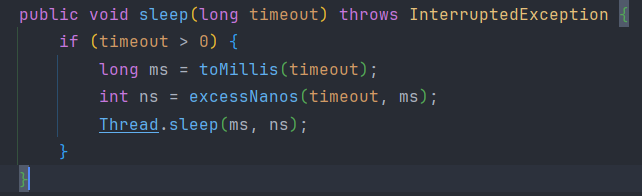
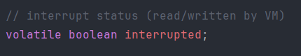
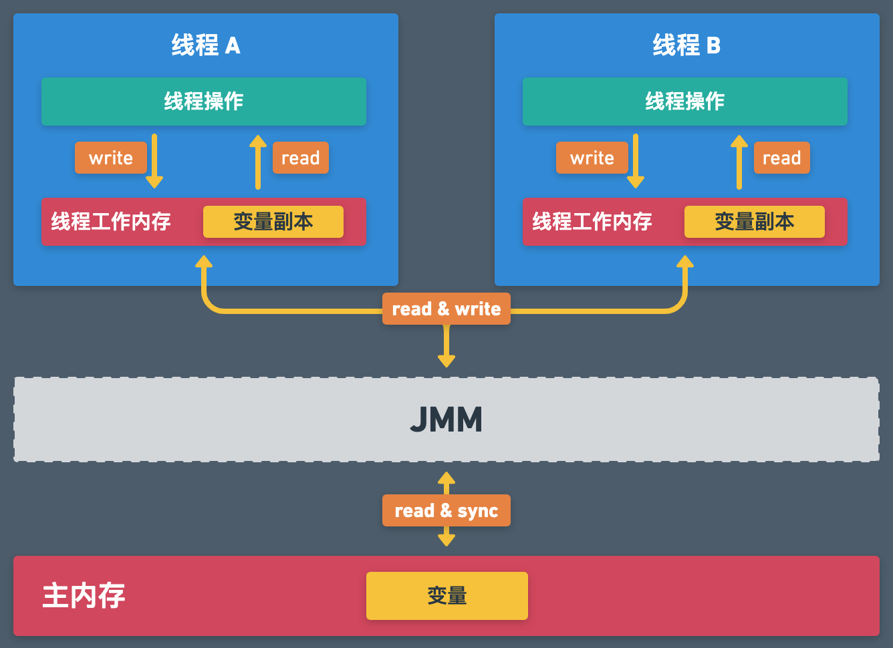
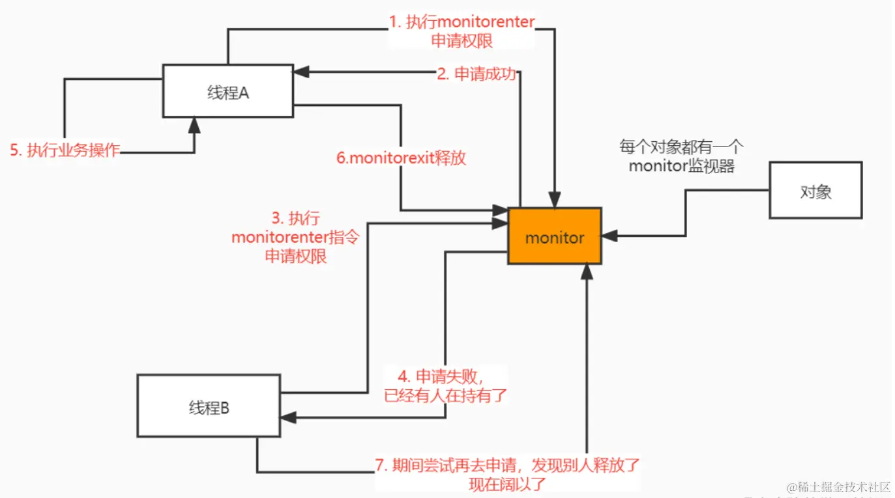

>多线程是一种程序执行方式，指的是在同一个进程中并发执行多个线程，每个线程代表一条独立的执行路径，它们共享同一进程的内存资源  
>
>进程是操作系统中运行的程序的基本单位，是程序的一次执行活动，所以一个软件就是一个进程

# 1. 并发和并行

## 1.1 并发

>并发是能够让操作系统从宏观上看起来同一时间段执行多个任务，但实际上对于单核CPU来说，任意具体时刻都只有一个任务在占用CPU资源，操作系统一般通过CPU时间片轮转来实现并发，也就是在一段时间内让多个进程轮流使用同一个 CPU，每个进程使用相同的时间，这多个进程的“同时运行”就形成了并发


>如上图所示，假设只有一个CPU资源，线程之间要竞争得到执行机会。图中的第一个阶段，在A执行的过程中，B、C不会执行，因为这段时间内这个CPU资源被A竞争到了，同理，第二阶段只有B在执行，第三阶段只有C在执行。  
>
>其实，并发过程中，A、B、C并不是同时进行的（微观角度），但又是同时进行的（宏观角度）。在同一个时间点上，一个CPU只能支持一个线程在执行。但因为CPU运行的速度很快，CPU使用抢占式调度模式在多个线程间进行着高速的切换，因此看起来的感觉就像是多线程一样

****
## 1.2 并行

>​ 在同一时刻多个进程使用各自的 CPU，多个进程形成并行，所以并行需要多个 CPU 支持


>如图所示，在同一时刻ABC都是同时执行的

****
# 2. 多线程

>线程是可独立调度执行的最小指令序列，由操作系统或虚拟机的调度器管理，线程属于进程的一部分，同一进程中的多个线程共享该进程的可访问资源（如堆内存、全局变量），但每个线程有独立的程序计数器和方法调用栈

>在一个程序中，有很多的操作是非常耗时的，如数据库读写操作，IO操作等，如果使用单线程，那么程序就必须等待这些操作执行完成之后才能执行其他操作，但使用多线程的话就可以将耗时任务放在后台继续执行并同时执行其他操作

>假设 P 进程抢占 CPU 后开始执行，如果 P 进程在进行获取网络资源的操作时，用户进行UI 操作，此时 P 进程就不会响应 UI 操作。
>
>如果把 P 进程分为 Ta、Tb 两个线程，Ta 用于获取网络资源，Tb 用于响应 UI 操作。当 Ta 执行获取网络资源的同时让用户进行 UI 操作，此时操作系统就会通过线程调度机制，让 Ta 线程暂时挂起，让 Tb 占用 CPU资源，UI 响应完成后让 Tb 释放 CPU，Ta 继续执行网络资源请求

## 2.1 进程和线程的区别

1、 根本区别：进程是操作系统资源分配的基本单位，而线程是CPU调度和执行的基本单位

2、 在开销方面：每个进程都有独立的代码和数据空间（程序上下文），程序之间的切换会有较大的开销；线程可以看做轻量级的进程，同一类线程共享代码和数据空间，每个线程都有自己独立的运行栈和程序计数器（PC），线程之间切换的开销小

3、 所处环境：在操作系统中能同时运行多个进程（程序）；而在同一个进程（程序）中有多个线程同时执行（通过CPU调度，在每个时间片中只有一个线程执行）

4、 内存分配方面：系统在运行的时候会为每个进程分配不同的内存空间；而对线程而言，除了CPU外，系统不会为线程分配内存（线程所使用的资源来自其所属进程的资源），线程组之间只能共享资源

5、 包含关系：没有线程的进程可以看做是单线程的，如果一个进程内有多个线程，则执行过程不是一条线的，而是多条线（线程）共同完成的；线程是进程的一部分

****
## 2.2 线程调度

>如果多个线程被分配到一个 CPU 内核中执行，则同一时刻只能允许有一个线程能获得 CPU 的执行权

1、 分时调度：所有线程轮流使用 CPU，每个线程分配一个时间片，用完就换下一个；公平、简单

2、 抢占式调度：优先级高的线程优先执行，如果一个高优先级线程变为就绪状态，就会抢占正在运行的低优先级线程

****
# 3.  JVM 中的进程和线程结构
# 3.1 结构

>当运行一个 Java 程序时会创建一个 Java 进程，在这个进程中包含多个线程：

* main 线程：执行 `main()` 方法
* GC 线程：用于垃圾回收
* 编译器线程：用于编译
* ......


>JVM 运行时在操作系统中表现为一个独立进程，它包含以下几块主要内存区域：

* 方法区：存放类结构信息（类、方法、常量等）
* 堆：存放对象和数组

>以上是线程间共享的

* 程序计数器 PC：每个线程独立，记录当前执行的字节码行号
* 虚拟机栈 JVM Stack：每个线程独立，存储方法调用信息（栈帧）
* 本地方法栈 Native Method Stack：调用本地方法时使用

****
## 3.2 每个线程都有自己的程序计数器和 JVM 栈

>程序计数器是线程私有的，它记录着当前线程执行的方法字节码的位置（也就是下一条将要执行的指令地址），当线程切换时，PC 会保存当前线程的执行位置，当轮到下一个线程时，就会恢复线程上次离开的位置

>JVM 栈也是线程私有的，JVM 栈由多个栈帧组成，每一个方法的调用都会产生一个栈帧，每个栈帧中保存了局部变量表（int、引用等）、操作数栈（中间运算数据）、方法返回地址、当前类的运行时常量池引用等，所以 JVM 栈是一种保存了线程运行过程中方法调用的历史记录和数据暂存区


****
# 4. ​ 线程的实现方式

## 4.1  继承Thread类


```java
public class MyThread extends Thread{  
    @Override  
    public void run() {  
        for (int i = 0; i < 30; i++) {  
            System.out.println("mythread ---> " + i);  
        }  
    }  
}
```

```java
public static void main(String[] args) {  
    MyThread t = new MyThread();  
  
    t.start(); // 启动线程，执行 run() 方法  
  
    for (int i = 0; i < 30; i++) {  
        System.out.println("main ----> " + i);  
    }  
}
```

```
mythread ---> 0
mythread ---> 1
mythread ---> 2
mythread ---> 3
mythread ---> 4
mythread ---> 5
mythread ---> 6
mythread ---> 7
mythread ---> 8
main ----> 0
main ----> 1
main ----> 2
mythread ---> 9
```

>可以看到启动另一个线程后 main 方法里的打印和 MyThread 的里的打印是交替进行的

****
## 4.2 实现 Runnable 接口

>1. 定义Runnable接口的实现类，并重写该接口的run()方法，该run()方法的方法体同样是该线程的线程执行体
>
>2. 创建Runnable实现类的实例，并以此实例作为Thread的target来创建Thread对象，该Thread对象才是真正的线程对象
>
>3. 调用线程对象的start()方法来启动线程

```java
public class MyRunnable implements Runnable{  
    @Override  
    public void run() {  
        for (int i = 0; i < 30; i++) {  
            System.out.println("myrunnable ---> " + i);  
        }  
    }  
}
```

```java
public static void main(String[] args) {  
    Thread thread = new Thread(new MyRunnable());  
    thread.start();  
  
    for (int i = 0; i < 30; i++) {  
        System.out.println("main ---> " + i);  
    }  
}
```

**优点**

1、 线程任务类只是实现了Runnable接口，可以继续继承其他类，而且可以继续实现其他接口（避免了单继承的局限性）

2、  同一个线程任务对象可以被包装成多个线程对象

3、  适合多个多个线程去共享同一个资源

4、 实现解耦操作，线程任务代码可以被多个线程共享，线程任务代码和线程独立

5、 线程池可以放入实现Runable或Callable线程任务对象

6、 其实Thread类本身也是实现了Runnable接口的

****
## 4.3 实现Callable接口

>前面的两种方式都没办法拿到线程执行返回的结果，因为run()方法都是void修饰的，但是这种方式是可以拿到线程执行返回的结果

1、 定义一个线程任务类实现 Callable 接口 ， 声明线程执行的结果类型

2、 重写线程任务类的 `call` 方法，这个方法可以直接返回执行的结果

3、 创建一个 Callable 的线程任务对象

4、 把 Callable 的线程任务对象包装成一个未来任务对象

5、 把未来任务对象包装成线程对象

6、 调用线程的start()方法启动线程

```java
public static void main(String[] args) {  
    Callable call = new MyCallable();  
    FutureTask<String> task = new FutureTask<>(call);  
    Thread t = new Thread(task); 
    t.start();  
    for(int i = 1 ; i <= 10 ; i++ ){  
        System.out.println(Thread.currentThread().getName() + " => " + i);  
    }  
  
    try {  
        String rs = task.get(); // 拿到 call() 的返回值
        System.out.println(rs);  
    }  catch (Exception e) {  
        e.printStackTrace();  
    }  
}
```

> `FutureTask<String> task = new FutureTask<>(call);` 可以把这个看作是一个 Runnable 对象，因为它实现了 `RunnableFuture` 接口，而这个接口又继承了 `Runnable` ，所以`FutureTask` 让 `Callable` 看起来像一个 Runnable 一样可以被执行，





```java
class MyCallable implements Callable<String> {  
    // 2.重写线程任务类的call方法！  
    @Override  
    public String call() throws Exception {  
        // 计算1-10的和并返回  
        int sum = 0 ;  
        for(int i = 1 ; i <= 10 ; i++ ){  
            System.out.println(Thread.currentThread().getName()+" => " + i);  
            sum+=i;  
        }  
        return Thread.currentThread().getName() + "执行的结果是：" + sum;  
    }  
}
```

```java
Thread-0 => 1
Thread-0 => 2
main => 1
Thread-0 => 3
main => 2
Thread-0 => 4
main => 3
main => 4
main => 5
Thread-0 => 5
main => 6
main => 7
main => 8
Thread-0 => 6
Thread-0 => 7
Thread-0 => 8
Thread-0 => 9
main => 9
main => 10
Thread-0 => 10
Thread-0执行的结果是：55
```

****
## 4.4 run() 和 start() 的内存分布

**run()方法**

>当直接调用 `MyThread` 的 `run()` 方法时，它就像普通方法一样，在主线程的栈中会进行一次压栈，创建一个栈帧，然后把 `run()` 压进去，当 `run()` 执行完后才会继续执行下面的代码，所以并不会看到交叉打印的效果，即使已经 `MyThread t = new MyThread();` 创建了一个线程对象，但并没有实际的创建一个新的栈出来




**start()方法**

>调用 `start()` 才是真正的启动线程，这时候 JVM 才会创建一个新的栈出来，当线程成功的启动之后，这段代码就结束了，接着就是 `run()` 和 `main` 的并发运行



****
# 5. 生命周期的七大状态



```java
public enum State {  
	NEW,    
	RUNNABLE,  
    BLOCKED,  
    WAITING,  
    TIMED_WAITING,  
    TERMINATED;  
}
```

> `Thread` 类中定义了这六个枚举类型作为线程的状态

- **NEW（新建）**

- **RUNNABLE（就绪）**

- **RUNNING（运行）**（就绪和运行通常分在一起，统称为运行状态）

- **BLOCKED（阻塞）**

- **WAITING（等待）**

- **TIMED_WAITING（计时等待）**

- **TERMINATED（终止）**

>当创建一个线程的时候，也就是 `new Thread` 的时候，此时线程是 `NEW` 状态

```java
// 创建线程 
Thread thread = new Thread(new Runnable() { 
@Override public void run() { 
	// ... 
} }); 
// 获取线程状态 
Thread.State state = thread.getState(); 
System.out.println(state); // NEW
```

>然而调用了线程的 `start` 方法之后，线程的状态就从 `NEW` 变成了 `RUNNABLE`

```java
// 创建线程
Thread thread = new Thread(new Runnable() {
    @Override
    public void run() {
        // 获取到当前执行的线程
        Thread currThread = Thread.currentThread();
        // 获取线程状态
        Thread.State state = currThread.getState();
        // 打印线程状态
        System.out.println(state); // RUNNABLE
    }
});

thread.start();
```

>线程调用 `wait()` 方法之后，就会从 `RUNNABLE` 状态变为 `WAITING` 无时限等待状态

```java
// 创建线程
Thread thread = new Thread(new Runnable() {
    @Override
    public void run() {
        synchronized (this) {
            try {
                // 线程休眠
                this.wait();
            } catch (InterruptedException e) {
                e.printStackTrace();
            }
        }
    }
});
// 启动线程
thread.start();
// 获取线程状态
Thread.State state = thread.getState();
// 打印线程状态
System.out.println("首次获取线程状态：" + state); // RUNNABLE
// 休眠 1s
try {
    Thread.sleep(1000);
} catch (InterruptedException e) {
    e.printStackTrace();
}
// 获取线程状态
state = thread.getState();
// 打印线程状态
System.out.println("第二次获取线程状态：" + state); // WAITING
```

>当调用了 `notify` / `notifyAll` 方法之后，线程会从 `WAITING` 状态变成 `RUNNABLE` 状态

```java
Object lock = new Object();
// 创建线程
Thread thread = new Thread(new Runnable() {
    @Override
    public void run() {
        synchronized (lock) {
            try {
                // 线程休眠
                lock.wait();
                // 获取当前线程状态
                Thread.State state = Thread.currentThread().getState();
                // 打印线程状态
                System.out.println("获取线程状态：" + state); // RUNNABLE
            } catch (InterruptedException e) {
                e.printStackTrace();
            }
        }
    }
});
// 启动线程
thread.start();
// 获取线程状态
Thread.State state = thread.getState();
// 打印线程状态
System.out.println("首次获取线程状态：" + state);
// 休眠 1s
try {
    Thread.sleep(100);
} catch (InterruptedException e) {
    e.printStackTrace();
}
// 获取线程状态
state = thread.getState();
// 打印线程状态
System.out.println("第二次获取线程状态：" + state);

// 唤醒 thread 线程
synchronized (lock) {
    lock.notify();
}
```

>当调用带超时时间的等待方法时，如 `sleep()`，线程会从 `RUNNABLE` 状态变成 `TIMED_WAITING` 有时限状态

```java
// 创建线程
Thread thread = new Thread(new Runnable() {
    @Override
    public void run() {
        try {
            Thread.sleep(1000);
        } catch (InterruptedException e) {
            e.printStackTrace();
        }
    }
});
// 启动线程
thread.start();
// 获取线程状态
Thread.State state = thread.getState();
// 打印线程状态
System.out.println("首次获取线程状态：" + state); // RUNNABLE
// 休眠 1s
try {
    Thread.sleep(100);
} catch (InterruptedException e) {
    e.printStackTrace();
}
// 获取线程状态
state = thread.getState();
// 打印线程状态
System.out.println("第二次获取线程状态：" + state); // TIMED_WAITING
```

>当超过了超时时间之后，线程就会从 `TIMED_WAITING` 状态变成 `RUNNABLE` 状态

```java
// 创建线程
Thread thread = new Thread(new Runnable() {
    @Override
    public void run() {
        try {
            Thread.sleep(1000);
            // 获取当前线程状态
            Thread.State state = Thread.currentThread().getState();
            // 打印线程状态
            System.out.println("获取线程状态：" + state); // RUNNABLE
        } catch (InterruptedException e) {
            e.printStackTrace();
        }
    }
});
// 启动线程
thread.start();
// 获取线程状态
Thread.State state = thread.getState();
// 打印线程状态
System.out.println("首次获取线程状态：" + state); // RUNNABLE
// 休眠 1s
try {
    Thread.sleep(100);
} catch (InterruptedException e) {
    e.printStackTrace();
}
// 获取线程状态
state = thread.getState();
// 打印线程状态
System.out.println("第二次获取线程状态：" + state); // TIMED_WAITING
```

>线程执行完之后，就会从 `RUNNABLE` 状态变成 `TERMINATED` 销毁状态

```java
// 创建线程
Thread thread = new Thread(new Runnable() {
    @Override
    public void run() {
        // 获取当前线程状态
        Thread.State state = Thread.currentThread().getState();
        // 打印线程状态
        System.out.println("获取线程状态：" + state); // RUNNABLE
    }
});
// 启动线程
thread.start();
// 等待 100ms，待线程执行完
try {  
    Thread.sleep(100);  
} catch (InterruptedException e) {  
    e.printStackTrace();  
}
// 获取线程状态
Thread.State state = thread.getState();
// 打印线程状态
System.out.println("线程状态：" + state); // TERMINATED
```

****
# 6. 线程的休眠

>线程休眠指的是让一个线程暂停执行一段时间，这段时间该线程会进入阻塞状态，不会占用 CPU 资源，等到休眠时间结束之后，线程会从阻塞状态变为可运行状态 `RUNNABLE` ，等待 CPU 调度继续执行

>线程休眠的方法有 5 个：`Thread.sleep`、 `TimeUnit.sleep`、 `Object.wait`、 `Condition.await`、 `LockSupport.park`，其中 `Thread.sleep` 和 `TimeUnit.sleep` 是定时休眠，线程在指定时间后自动唤醒，而  `Object.wait`、 `Condition.await`、 `LockSupport.park`  属于可控挂起，必须由其他线程在合适的时机显式唤醒

## 6.1 `Thread.sleep`

>让当前线程暂停执行一段指定时间（以毫秒为单位），在时间到达后线程会自动恢复执行，方法需要传递一个 `long` 类型的毫秒数，表示 n 毫秒之后自动唤醒，或者继续传入 `int` 类型的纳秒数

```java
System.out.println("开始执行");
try {
    Thread.sleep(2000); // 当前线程睡眠2秒
    } catch (InterruptedException e) {
        e.printStackTrace();
    }    
System.out.println("2秒后继续执行");
```

>`Thread.sleep()` 是静态方法，作用在当前线程上，通过其他线程的对象调用这个方法仍然执行的是这段代码处于的线程，例如在 main 方法中调用 `(new Thread()).sleep(1000)`，是将 main 线程睡眠 1 秒

**休眠的中断**

>当一个线程调用了 `Thread.sleep()` 进入休眠状态后，如果另一个线程调用了它的 `interrupt()` 方法，该线程就会被中断唤醒， `Thread.sleep()` 后面的代码也不会执行，并抛出一个 `InterruptedException` 异常

```java
Thread thread = new Thread(new Runnable() {
	@Override
    public void run() {
        try {
        System.out.println("子线程开始休眠...");
        Thread.sleep(5000);
        System.out.println("子线程休眠结束");
	    } catch (InterruptedException e) {
	        System.out.println("子线程在休眠时被中断！");
	    }
	}    
});

thread.start();
try {  
	// 主线程等待2秒后中断子线程
    Thread.sleep(2000);  
} catch (InterruptedException e) {  
    e.printStackTrace();  
}
System.out.println("主线程中断子线程");
thread.interrupt();
```

```
子线程开始休眠...
主线程中断子线程
子线程在休眠时被中断！
```

****
## 6.2 `TimeUnit.sleep`

>本质上是对 `Thread.sleep()` 的封装，在底层仍然会调用 `Thread.sleep` 在处理不同时间单位时更方便（）



```java
System.out.println("开始休眠...");  
try {  
    TimeUnit.SECONDS.sleep(2);  // 休眠 2 秒  
} catch (InterruptedException e) {  
    e.printStackTrace();  
}  
System.out.println("休眠结束！");
```

****
## 6.3 `Object.wait()`

>`Object.wait()` 一种线程协作机制的方法，让线程等待通知，在多线程程序中协调线程执行的顺序，常与 `notify()` 或 `notifyAll()` 一起使用，以实现线程之间的通信

>该方法只能在线程持有该对象的锁时才能使用，否则会抛出：`IllegalMonitorStateException`

。。。。。。

****
## 6.4 `Condition.await`

。。。

****
## 6.5 `Condition.await`

。。。

****
## 6.6 `LockSupport.park()`

>一种线程阻塞工具，让当前线程挂起（休眠）直到被唤醒（unpark）或发生中断等事件

```java
Thread thread = new Thread(() -> {  
    System.out.println("子线程将休眠");  
    LockSupport.park();  // 挂起线程  
    System.out.println("子线程被唤醒");  
});  
  
thread.start();  
  
try {  
    Thread.sleep(2000); // 模拟延迟  
} catch (InterruptedException e) {  
    e.printStackTrace();  
}  
  
System.out.println("主线程将唤醒子线程"); // 注释后：子线程将休眠
										// 主线程将唤醒子线程 
LockSupport.unpark(thread);  // 唤醒线程
```

```
子线程将休眠
（等待两秒）
主线程将唤醒子线程
子线程被唤醒
```

>`park()`：挂起当前线程，直到有许可证为止（线程初始不拥有许可）；  
>
>`unpark(Thread)`：向目标线程发放一个许可证（当这个代码在 `park()` 前调用时会导致线程无法挂起）

****
# 7. 线程的中断

>每个线程都有一个boolean标识，代表着是否有中断请求（该请求可以来自所有线程，包括被中断的线程本身），初始值为 `false`



>Java 的中断是一种协作机制，它不会强制终止线程，而是给线程发送一个中断信号，然后由被中断的线程自己决定是否以及如何处理这个信号，所以中断不是强杀线程，而是一种“请求停止”的建议

| 方法                       | 说明                    |
| ------------------------ | --------------------- |
| `Thread.interrupt()`     | 设置线程的中断标志位（置为 `true`） |
| `Thread.isInterrupted()` | 检查某线程的中断标志（不清除标志）     |
| `Thread.interrupted()`   | 检查当前线程是否被中断，并清除中断标志   |

## 7.1 public void interrupt()

>实例方法，作用是：中断目标线程。谁调用，谁中断目标线程（可看作外部中断），设置目标线程的中断标志位为 `true`，如果线程处于阻塞状态，则会触发中断异常

**源码**

```java
public void interrupt() {
    if (this != Thread.currentThread()) {
        checkAccess(); // 检查当前线程是否有权限中断目标线程

        synchronized (interruptLock) {
            Interruptible b = nioBlocker;
            if (b != null) {
                interrupted = true;      // 设置中断标志位为 true
                interrupt0();            // 通知 JVM 中断线程
                b.interrupt(this);       // 中断可能的 NIO 阻塞操作
                return;
            }
        }
    }
    interrupted = true;  // 设置中断标志位
    interrupt0();        // 通知 JVM 中断线程
}
```

****

```java
Thread thread = new Thread(() -> {  
    while (true) {  
        System.out.println("工作线程正在运行...");  
        try {  
            Thread.sleep(1000);  
        } catch (InterruptedException e) {  
            System.out.println("工作线程被中断，准备退出");  
            break;  
        }  
    }  
});  
  
thread.start();  
  
try {  
    Thread.sleep(3000); // 主线程等待3秒  
} catch (InterruptedException e) {  
    e.printStackTrace();  
}  
  
thread.interrupt(); // 外部中断
```

```
工作线程正在运行...
工作线程正在运行...
工作线程正在运行...
工作线程被中断，准备退出
```
## 7.2 public static boolean interrupted()

>静态方法，作用是：检查并清除当前线程的中断标志位。获取当前线程的中断状态（是否被中断过），调用这个方法后，中断状态会被清除为 `false`（可看作内部中断）

**源码**

```java
public static boolean interrupted() {
    return currentThread().getAndClearInterrupt(); // 获取并清除当前线程的中断状态
}
```

```java
boolean getAndClearInterrupt() {  
    boolean oldValue = interrupted;     
    if (oldValue) {  
        interrupted = false;  
        clearInterruptEvent();  
    }  
    return oldValue; // 最终返回 false 
}
```

****

>根据中断标志来结束循环

```java
Thread worker = new Thread(() -> {  
    while (true) {  
        if (Thread.interrupted()) { // 检查并清除中断标志（当为 false 时进入 if）  
            System.out.println("检测到线程中断，准备退出");  
            break;  
        }  
        System.out.println("线程执行中...");  
        try {  
            Thread.sleep(1000); // sleep 会抛出异常且清除中断标志  
        } catch (InterruptedException e) {  
            System.out.println("sleep中被中断");  
            Thread.currentThread().interrupt(); // 重新设置中断标志  
        }  
    }  
});  
  
worker.start();  
  
try {  
    Thread.sleep(2000); // 主线程等待 2 秒  
} catch (InterruptedException e) {  
    e.printStackTrace();  
}  
  
worker.interrupt(); // 中断工作线程
```

```
线程执行中...
线程执行中...
sleep中被中断
检测到线程中断，准备退出
```

****

**清除中断标志后需要恢复中断**

>当调用一个会被中断打断的方法（比如 `Thread.sleep()`），线程被中断时会抛出 `InterruptedException` 异常，而 JVM 会自动清除线程的中断标志

>恢复中断状态是为了让线程在被中断后仍能保持可被中断的状态，从而在后续流程中做出正确响应

```java
Thread thread = new Thread(() -> {  
    while (true) {  
        try {  
            System.out.println("准备休眠...");  
            Thread.sleep(1000);  
        } catch (InterruptedException e) {  
            System.out.println("捕获中断异常，但没恢复中断标志！");  
            // 忽略了中断标志  
        }  
  
        // 中断标志已经被清除，下面不会退出  
        if (Thread.currentThread().isInterrupted()) {  
            System.out.println("检测到中断标志，准备退出");  
            break;  
        }  
    }  
});  
  
thread.start();  
  
try {  
    Thread.sleep(3000);  
} catch (InterruptedException e) {  
}  
  
thread.interrupt(); // 中断线程  
  
try {  
    thread.join(); // 等待子线程结束  
} catch (InterruptedException e) {  
    e.printStackTrace();  
}  
  
System.out.println("主线程结束");
```

>当没有恢复中断标志并以此作为结束循环的标志时，就无法结束子线程

****
## 7.3 public boolean isInterrupted()

>用来检查当前线程的中断标志是否为 `true`，不会清除中断状态

```java
Thread worker = new Thread(() -> {  
    while (!Thread.currentThread().isInterrupted()) { // 持续检查中断标志  
        try {  
            System.out.println("工作线程正在运行...");  
            Thread.sleep(1000);   
        } catch (InterruptedException e) {  
            // 在 sleep 被中断时捕获异常，并重新检查中断标志  
            System.out.println("工作线程被中断，准备退出");  
            break;  // 退出循环  
        }  
    }  
});
```

****
# 8. 守护线程

>用户线程又叫普通线程，是驱动业务逻辑运转的核心；而守护线程，是守护用户线程的一种线程，运行在后台提供通用服务，因此也叫后台线程或者精灵线程，当用户线程结束时，守护线程也会结束

## 8.1 守护线程的设置

>可以通过 `Thread` 类的 `setDaemon(true)` 方法将一个线程设置为守护线程，必须在 `start()` 方法调用之前设置，否则会抛出 `IllegalThreadStateException`，需要注意的是，守护线程守护的不只是某个特定的线程，而是全局的线程，当所有用户线程都结束了，守护线程就会被 JVM 强制终止

```java
public static void main(String[] args) {  
    Thread t = new Thread(() -> {  
        while (true) {  
            System.out.println("守护线程正在运行...");  
            try {  
                Thread.sleep(1000);  
            } catch (InterruptedException e) {  
                System.out.println("守护线程被中断");  
            }  
        }  
    });  
  
    t.setDaemon(true); // 设置为守护线程  
    t.start();         // 启动线程  
  
    System.out.println("主线程运行 3 秒后结束");  
    try {  
        Thread.sleep(3000);  
    } catch (InterruptedException e) {  
        e.printStackTrace();  
    }  
  
    System.out.println("主线程结束，程序退出");  
}
```

```
守护线程正在运行...
守护线程正在运行...
守护线程正在运行...
主线程结束，程序退出
```

>将 t 线程设置为守护线程，当前程序中只有一个 main 用户线程，当 main 执行完毕后守护线程就自动被 JVM 关闭

****
## 8.2 JVM 与用户线程共存亡

>在 `JavaThread::run()` 中，JVM 启动了 main 线程后会监听线程生命周期，一旦一个线程运行结束，会调用 `Threads::remove()` 移除当前线程

```cpp
// src/hotspot/share/runtime/thread.cpp

void JavaThread::run() {
    ...
    // 调用 Java 层的 run()
    this->entry_point()(this, this);
    ...
    // 线程运行结束后，判断是否退出 JVM
    Threads::remove(this); // 线程移除全局线程列表
    ...
}
```

>remove 之后进行线程数量检查（线程的数量会自动 `--` ），其中 `_number_of_non_daemon_threads` 是 JVM 全局记录的非守护线程数。
>
>当最后一个非守护线程结束（此时该值减为 0），就调用 `signal_vm_shutdown()` 通知 VM 退出

```cpp
void Threads::remove(JavaThread* thread) {
    ...
    // 非守护线程减少后，触发退出条件判断
    if (thread->is_non_daemon() && _number_of_non_daemon_threads-- == 1) {
        // 说明已经没有非守护线程了
        // 通知 VM 退出
        VMThread::signal_vm_shutdown();
    }
}
```

>JVM 中有一个特殊线程 `VMThread`，负责执行一些全局操作（如 GC、安全点、JVM 退出等）。在接收到 `signal_vm_shutdown()` 后，它将执行一个 VM 操作类 `VM_Exit`

```cpp
void VMThread::run() {
    while (true) {
        ...
        if (_should_terminate) {
            VM_Exit op;
            op.evaluate();  // 真正执行退出逻辑
            break;
        }
    }
}
```

>最后 `VM_Exit::doit()` 中调用 `destroy_vm()` 清除资源并退出程序

```cpp
void VM_Exit::doit() {
    ...
    // 真正退出 JVM
    Universe::destroy_vm();  // ≈ destroy_vm()
}
```

```cpp
void Universe::destroy_vm() {
    ...
    // 清理线程、类加载器、运行时数据等
    delete _main_thread_group;
    delete _system_thread_group;
    ...
    exit_globals();
    os::exit(exit_code);  // 调用系统 exit，彻底终止进程
}
```

```
Java 用户线程 run() 结束
        ↓
JavaThread::run() 调用 Threads::remove(this)
        ↓
非守护线程计数 -1
        ↓
为 0 ? → 是 → signal_vm_shutdown()
        ↓
VMThread 检测到信号，执行 VM_Exit
        ↓
VM_Exit::doit() → Universe::destroy_vm()
        ↓
destroy_vm() 清理所有资源 → os::exit()
        ↓
JVM 正式退出
```

>所以 JVM 退出的判断标准不是 main 是否活着，而是依赖于 `_number_of_non_daemon_threads` 是否为 0 （是否还有非守护线程），所以 main 线程通常比子线程先退出

****
# 9. 线程的合并

>线程的合并，通常指的是通过调用某个线程的 `join()` 方法，使当前线程等待另一个线程执行完毕后再继续执行
>
>线程 A 启动了线程 B，然后线程 A 想等 B 干完再继续干自己的事，这时候线程 A 就会调用 `B.join()`

**常用合并操作：**

- 下载文件的多个线程并发处理不同片段，主线程要等它们都下完再合并文件；
    
- 子线程完成计算，主线程再输出总和；
    
- 子线程完成数据库操作，主线程才继续业务处理

****
## 9.1 join()

```java
public static void main(String[] args) throws InterruptedException {
    Thread worker = new Thread(() -> {
        System.out.println("子线程开始执行");
        try {
            Thread.sleep(2000);
        } catch (InterruptedException e) {}
        System.out.println("子线程执行完毕");
    });

    worker.start();
    worker.join(); // 主线程等待子线程结束

    System.out.println("主线程继续执行");
}
```

**多个线程的合并**

```java
Thread t1 = new Thread(() -> System.out.println("线程1"));
Thread t2 = new Thread(() -> System.out.println("线程2"));

t1.start();
t2.start();

// 等待两个线程都结束
t1.join();
t2.join();

System.out.println("主线程：所有子线程已执行完");
```

****
## 9.2 Thread.yeild()


****
# 10. 线程的优先级

>在 Java 中，每个线程都有一个优先级（Priority），用于提示线程调度器决定哪个线程更重要，应当先被分配 CPU 时间片

**优先级的本质是一个整数，范围为：**

- Thread.MIN_PRIORITY = 1
- Thread.NORM_PRIORITY = 5   // 默认值
- Thread.MAX_PRIORITY = 10

>需要注意的是，线程的默认值其实是继承父线程的

```java
Thread.currentThread().setPriority(4);  
Thread thread = new Thread();  
System.out.println(thread.getPriority()); // 4
```

**优先级高的线程 != 一定先执行**

```java
public static void main(String[] args) {  
        PriorityThread low = new PriorityThread("低优先级线程");  
        PriorityThread high = new PriorityThread("高优先级线程");  
  
        // 设置优先级  
        low.setPriority(Thread.MIN_PRIORITY);   // 优先级 = 1        
        high.setPriority(Thread.MAX_PRIORITY);  // 优先级 = 10  
        // 启动线程  
        low.start();  
        high.start();  
    }  
}  
  
class PriorityThread extends Thread {  
    private long count = 0;  
  
    public PriorityThread(String name) {  
        super(name);  
    }  
  
    @Override  
    public void run() {  
        long start = System.currentTimeMillis();  
        while (System.currentTimeMillis() - start < 3000) { // 运行3秒  
            count++;  
        }  
        System.out.println(getName() + " 执行次数: " + count);  
    }
```

```
高优先级线程 执行次数: 897814953
低优先级线程 执行次数: 859001280
```

>可以看到高优先级的执行次数更多，线程优先级只是调度建议，谁先执行，完全取决于操作系统调度器，并且 `start()` 只是触发线程启动，不意味着立即获得 CPU

```java
Thread thread1 = new Thread(() -> {  
    System.out.println("高优先级线程");  
});  
thread1.setPriority(Thread.MAX_PRIORITY);  
  
Thread thread2 = new Thread(() -> {  
    System.out.println("低优先级线程");  
});  
thread2.setPriority(Thread.MIN_PRIORITY);  
  
thread1.start();  
thread2.start();
```

```
低优先级线程
高优先级线程
```

****
# 11. 线程安全问题

## 11.1 什么情况下考虑线程安全

- 多线程的并发环境
- 有共享的数据
- 共享的数据设计修改操作

```java
public class Demo4 {  
    public static void main(String[] args) throws InterruptedException {  
        UnsafeCounter counter = new UnsafeCounter();  
  
        // 创建多个线程同时执行 increment        
        Thread[] threads = new Thread[100];  
        for (int i = 0; i < 100; i++) {  
            threads[i] = new Thread(() -> {  
                for (int j = 0; j < 1000; j++) {  
                    counter.increment();  
                }  
            });  
            threads[i].start();  
        }  
  
        // 等待所有线程结束  
        for (Thread t : threads) {  
            t.join();  
        }  
        // 按理说结果应该是 100 * 1000 = 100000        
        System.out.println("最终计数值：" + counter.getCount()); 
        // 实际结果： 最终计数值：98891 
    }  
}  
  
class UnsafeCounter {  
    private int count = 0;  
  
    public void increment() {  
        count++; // 非线程安全：读-改-写操作不是原子性的  
    }  
  
    public int getCount() {  
        return count;  
    }  
}
```

>多个线程同时执行时，可能这样交叉运行：线程A读取值为 `100`，线程B也读取值为 `100`，A 写入 `101`，B 写入 `101`（覆盖了 A 的结果），最终加了两次，但结果只增加了 1

>因为这一百个线程访问的是同一个对象，这个对象的字段放在堆中，这些数据是共享给所有线程的，所以它们都可以获取到 count，因为每个线程可能随时失去 CPU 的使用权，所以可能有些线程只获取到 count 后还没来得及进行累加，就进入休眠了，而每个线程都有自己的工作内存（类似于 CPU 缓存），访问变量时会从主内存中读取 `count` 的值到自己的工作内存，后续操作都在工作内存上进行，而写回主内存是延迟的，不是实时的，这就导致了唤醒线程后它拿到的值并不知最新的，所以造成了非同步问题

**`count++` 实际是三个步骤**：

1. 从主内存读取 `count`；
    
2. 在工作内存中 `count + 1`；
    
3. 写回主内存。

|时间|线程A|线程B|count 变量值|
|---|---|---|---|
|T1|读取 count = 0||0|
|T2||读取 count = 0|0|
|T3|计算 0 + 1 = 1||0|
|T4||计算 0 + 1 = 1|0|
|T5|写回 count = 1||**1**|
|T6||写回 count = 1|**1**|
****
## 11.2  Java 内存模型 - JMM

### 11.2.1 两个内存

>JMM（Java Memory Model）是一种基于计算机内存模型（定义了共享内存系统中多线程程序读写操作行为的规范），屏蔽了各种硬件和操作系统的访问差异的，保证了Java程序在各种平台下对内存的访问都能保证效果一致的机制及规范，并且 JMM 把内存分为两部分：主内存、工作内存

>由于`JVM`运行程序的实体是线程，每个线程创建时 `JVM` 都会为其分配工作内存，用于存储线程私有的数据。而 `Java` 内存模型中，规定所有变量都存储在主内存，主内存是共享内存区域，所有线程都可以访问。当线程想对一个变量进行赋值/运算等操作时，必须在工作内存中进行。



>线程 A 和线程 B 分别对主内存的变量进行读写操作。其中主内存中的变量为共享变量，也就是说此变量只有一份并再多个线程间共享。但是线程不能直接读写主内存的共享变量，每个线程都有自己的工作内存，线程读写主内存的共享变量时需要先将该变量拷贝一份副本到自己的工作内存，然后在自己的工作内存中对该变量进行操作，线程工作内存对变量副本完成操作之后需要将结果同步至主内存。

****

### 11.2.2 设计初衷

1、**提高性能**：读写速度差异巨大

>主内存访问速度相比 CPU 的寄存器和缓存要慢，如果每一次线程访问变量都要去主内存取值，会拖慢程序执行，引入工作内存，相当于线程拥有自己的变量副本缓存，速度更快

2、**线程隔离与并发效率**

>如果所有线程都直接共享主内存变量，那线程切换、数据读写需要频繁加锁、刷新、同步，开销非常大，工作内存使每个线程只管自己的数据副本，避免产生频繁的冲突。将工作分工，最后再整合，这样效率高

****
### 11.2.3 Java内存模型JMM围绕的三大特性

**1、原子性**

>原子性指的是一个操作是不可中断的，即使是在多线程环境下，一个操作一旦开始就不会被其他线程影响。所以原子性的本质就是一组操作要么全部执行成功，要么就全部失败

>需要注意的是：对于 32 位系统的来说每次原子读写是 32bit ，`byte、short、int、float、boolean、char` 等基本数据类型的读写是原子操作，而 `long、double` 类型的数据是`64bit`的存储单元，所以它们的读写并非原子性的

**2、可见性**

>当一个线程修改了某个共享变量的值，其他线程是否能够马上得知这个修改的值

>在多线程环境中可就不一定了，由于线程对共享变量的操作，都是拷贝到各自的工作内存操作的，操作完成后才返回主内存中，一个线程 `A` 修改了共享变量 `i` 的值，还未写回主内存时，另外一个线程`B`又对主内存中的`i`进行操作，此时`A`线程工作内存中`i`对线程`B`不可见，这种工作内存与主内存之间同步延迟的现象，就造成了可见性问题

**3、有序性**

>对于单线程执行的代码，执行会根据编码的顺序从上往下执行，对于多线程环境，则可能出现乱序现象，因为程序编译成机器码指令后，可能会出现指令重排现象，重排后的指令与原指令的顺序未必一致

****
### 11.2.4 指令重排

**1、编译器优化的重排**

>编译器在不改变单线程程序语义的前提下，可以重新安排语句的执行顺序

```
// 主存的共享变量
int a = 0;
int b = 0;

//线程A                   线程B
代码1：int x = a;         代码3：int y = b;
代码2：b = 1;             代码4：a = 2;
```

>两个线程同时执行，从程序的执行上来看，由于并行执行的原因，按理应该是`x=0、y=0;`这个结果，理论上不会出现`x=2、y=1;`这种结果，但是实际上这种情况是有概率出现的，因为编译器会对一些前后不依赖、耦合度为`0`的代码，进行指令重排优化，假设此时编译器对这段代码进行指令重排优化后，可能出现：

```
//线程A                   线程B
代码2：b = 1;             代码4：a = 2;
代码1：int x = a;         代码3：int y = b;         
```

**2、内存系统的重排**

>指的是由于 CPU 高速缓存（cache）、读写缓冲区（store / load buffer）等机制的存在，导致变量的读写操作在内存中呈现出乱序效果，即写操作没立即写入主内存，读操作没从主内存读取。

。。。。。。

****
## 11.3 JMM 中的 happens-before 原则

### 11.3.1 线程在执行的过程中与内存的交互

>Java 程序在执行的过程中，实际就是 OS 在调度 JVM 的“线程”执行，执行的过程就是与内存的交互操作，而内存交互操作有 8 种（虚拟机实现必须保证每一个操作都是原子的，不可再分割的，对于`double、long` 类型的`load、store、read` 和 `write` 操作在某些平台上允许例外）：

| 操作名      | 含义                         | 示例/说明            |
| -------- | -------------------------- | ---------------- |
| `lock`   | 把一个变量标记为线程独占状态             | 类似于获取互斥锁         |
| `unlock` | 释放一个变量的独占状态，使其可以被其他线程锁定    | 类似于释放互斥锁         |
| `read`   | 从主内存中读取一个变量的值到线程工作内存中（到缓存） | 相当于“主内存 -> 本地缓存” |
| `load`   | 把 `read` 到的值放入线程工作内存中变量副本  | “缓存 -> 工作内存变量”   |
| `use`    | 把工作内存中变量的值传给执行引擎使用         | 执行计算之前要 use 一下   |
| `assign` | 把执行引擎计算结果赋值给工作内存变量         | 操作结果回写到本地副本      |
| `store`  | 把 assign 的值从工作内存变量写到缓存中    | “副本 -> 缓存”       |
| `write`  | 把 store 的值刷新到主内存中          | “缓存 -> 主内存”      |

。。。。。。

****
# 12. synchronized

>`synchronized` 是 Java 中最基本的同步手段，用来保证多线程之间的互斥访问，它可以保证原子性（同一时间只有一个线程执行代码块）、保证可见性（线程释放锁时会刷新主内存）保证有序性（通过内存屏障禁止指令重排）

## 12.1 基本用法

**1、修饰实例方法**

>作用范围为整个方法体，锁对象则是当前的实例对象。
>
>当一个线程正在访问一个对象的 synchronized 实例方法时，其他线程不能访问该对象的所有synchronized 方法（当一个线程获取了该对象的锁之后，其他线程无法获取该对象的锁），如果另一个线程使用的是另一个对象，则可以使用 synchronized 方法，因为两个实例对象的锁并不同相同（每个对象一把锁，互不干扰）

```java
public synchronized void doSomething() {
    // 临界区代码
}

// 等价于

public void doSomething() {
    synchronized (this) {
        // 临界区代码
    }
}
```

**2、修饰静态方法**

>作用范围为整个方法题，锁对象是这个类的 `.class` 对象（也叫类锁），会作用于当前类的所有对象实例，限制类中所有静态方法的并发访问，防止多个线程在同一时刻同时修改共享资源（静态资源），导致数据不一致，与其他静态锁互斥，但不与非静态锁互斥


```java
public static synchronized void doSomething() {
    // ...
}

// 等价于
public static void doSomething() {
    synchronized (类名.class) {
        // ...
    }
}
```

**3、修饰代码块**

>作用范围为指定的代码块，锁对象为自定义对象，如果每次都 new 一个对象作为锁，那这个锁是无效的，因为锁对象并不共享，线程间不会互斥

```java
public void test() {
    Object lock = new Object();
    synchronized (lock) {
        // 临界区代码
    }
}
```

****
## 12.2 对象头与 Monitor 对象



### 12.2.1 对象结构

[4. 对象结构](类和对象.md#4.%20对象结构)

****
### 12.2.2 锁的升级

>无锁（第一次加锁，无竞争） -> 偏向锁（当有其他线程尝试抢夺锁） -> 轻量级锁（自旋失败或竞争激烈） -> 重量级锁
>
>锁一旦升级就不能降级了

1、 初期锁对象刚创建时，还没有任何线程来竞争，锁状态 01，偏向锁标识位是 0（无线程竞争它）

2、 当有一个线程来竞争锁时，先用偏向锁，表示锁对象偏爱这个线程，这个线程要执行这个锁关联的所有代码，但不需要做任何检查和切换，这种竞争不激烈的情况下，效率非常高

3、当有两个线程开始竞争这个锁对象，锁会升级为轻量级锁，两个线程公平竞争，哪个线程先占有锁对象并执行代码，锁对象的 Mark Word 就执行哪个线程的栈帧中的锁记录。轻量级锁在加锁过程中，用到了自旋锁。自旋就是指当有另外一个线程来竞争锁时，这个线程会在原地循环等待，而不是把该线程给阻塞，直到那个获得锁的线程释放锁之后，这个线程就可以马上获得锁的。

```
线程A试图进入 synchronized(obj) 的临界区：
1. 在自己的线程栈帧中创建锁记录 Lock Record；
2. 将锁对象 obj 的 Mark Word 拷贝到线程栈帧的 Lock Record 中（保存原始信息）；
3. 使用 CAS 尝试将 obj 的 Mark Word 指向 Lock Record；
   成功：加锁成功
   失败：说明另一个线程正在竞争，升级为重量级锁
```

4、 如果竞争的这个锁对象的线程更多（当轻量级锁自旋次数过多），导致了更多的切换和等待， JVM 会把该锁对象的锁升级为重量级锁，这个就叫做同步锁，这个锁对象 Mark Word 再次发生变化，会指向一个监视器对象，这个监视器对象用集合的形式，来登记和管理排队的线程。`monitorenter` 指令是在编译后插入到同步代码块的开始位置，而 `monitorexit` 是插入到方法结束处和异常处，JVM 要保证每个 `monitorenter` 必须有对应的 `monitorexit` 与之配对。Monitor 依赖操作系统的 MutexLock(互斥锁) 来实现的， 线程被阻塞后便进入内核调度状态，这个会导致系统在用户态与内核态之间来回切换，严重影响锁的性能。

****
### 12.2.3 Monitor对象

>


