>多线程是一种程序执行方式，指的是在同一个进程中并发执行多个线程，每个线程代表一条独立的执行路径，它们共享同一进程的内存资源  
>
>进程是操作系统中运行的程序的基本单位，是程序的一次执行活动，所以一个软件就是一个进程

# 1. 并发和并行

## 1.1 并发

>并发是能够让操作系统从宏观上看起来同一时间段执行多个任务，但实际上对于单核 CPU 来说，任意具体时刻都只有一个任务在占用 CPU 资源，操作系统一般通过 CPU 时间片轮转来实现并发，也就是在一段时间内让多个进程轮流使用同一个 CPU，每个进程使用相同的时间，这多个进程的“同时运行”就形成了并发


>如上图所示，假设只有一个 CPU 资源，线程之间要竞争得到执行机会。图中的第一个阶段，在 A 执行的过程中，B、C 不会执行，因为这段时间内这个 CPU 资源被 A 竞争到了，同理，第二阶段只有 B 在执行，第三阶段只有 C 在执行。  
>
>其实，并发过程中，A、B、C 并不是同时进行的（微观角度），但又是同时进行的（宏观角度）。在同一个时间点上，一个 CPU 只能支持一个线程在执行。但因为 CPU 运行的速度很快，CPU 使用抢占式调度模式在多个线程间进行着高速的切换，因此看起来的感觉就像是多线程一样

****
## 1.2 并行

>​ 在同一时刻多个进程使用各自的 CPU，多个进程形成并行，所以并行需要多个 CPU 支持


>如图所示，在同一时刻 ABC 都是同时执行的

****
# 2. 多线程

>线程是可独立调度执行的最小指令序列，由操作系统或虚拟机的调度器管理，线程属于进程的一部分，同一进程中的多个线程共享该进程的可访问资源（如堆内存、全局变量），但每个线程有独立的程序计数器和方法调用栈

>在一个程序中，有很多的操作是非常耗时的，如数据库读写操作，IO操作等，如果使用单线程，那么程序就必须等待这些操作执行完成之后才能执行其他操作，但使用多线程的话就可以将耗时任务放在后台继续执行并同时执行其他操作

>假设 P 进程抢占 CPU 后开始执行，如果 P 进程在进行获取网络资源的操作时，用户进行UI 操作，此时 P 进程就不会响应 UI 操作。
>
>如果把 P 进程分为 Ta、Tb 两个线程，Ta 用于获取网络资源，Tb 用于响应 UI 操作。当 Ta 执行获取网络资源的同时让用户进行 UI 操作，此时操作系统就会通过线程调度机制，让 Ta 线程暂时挂起，让 Tb 占用 CPU资源，UI 响应完成后让 Tb 释放 CPU，Ta 继续执行网络资源请求

****
## 2.1 进程

进程是程序的一次执行过程，是系统运行程序的基本单位，因此进程是动态的。系统运行一个程序即是一个进程从创建，运行到消亡的过程。在 Java 中，当启动 main 函数时其实就是启动了一个 JVM 的进程，而 main 函数所在的线程就是这个进程中的一个线程，也称主线程。如下图所示，在 Windows 中通过查看任务管理器的方式，就可以清楚看到 Windows 当前运行的进程（`.exe` 文件的运行）。


****
## 2.2 线程

线程与进程相似，但线程是一个比进程更小的执行单位。一个进程在其执行的过程中可以产生多个线程。与进程不同的是同类的多个线程共享进程的堆和方法区资源，但每个线程有自己的程序计数器、虚拟机栈和本地方法栈，所以系统在产生一个线程，或是在各个线程之间做切换工作时，负担要比进程小得多，也正因为如此，线程也被称为轻量级进程。

****
## 2.3 进程和线程的区别

一个进程中可以有多个线程，多个线程共享进程的堆和方法区 (JDK1.8 之后的元空间)资源，但是每个线程都有自己的程序计数器、虚拟机栈和本地方法栈。

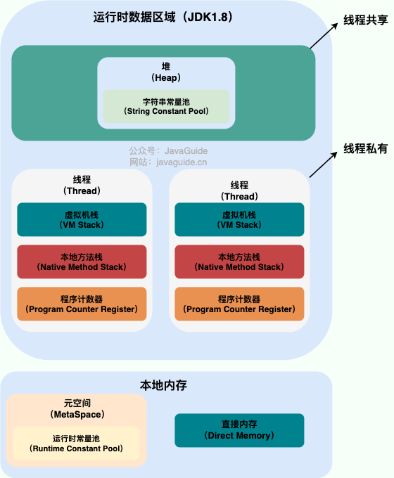

1、 根本区别：进程是操作系统资源分配的基本单位，而线程是 CPU 调度和执行的基本单位。

2、 在开销方面：每个进程都有独立的代码和数据空间（程序上下文），程序之间的切换会有较大的开销；线程可以看做轻量级的进程，同一类线程共享代码和数据空间，每个线程都有自己独立的运行栈和程序计数器（PC），线程之间切换的开销小。

3、 所处环境：在操作系统中能同时运行多个进程（程序）；而在同一个进程（程序）中有多个线程同时执行（通过CPU调度，在每个时间片中只有一个线程执行）。

4、 内存分配方面：系统在运行的时候会为每个进程分配不同的内存空间；而对线程而言，除了CPU 外，系统不会为线程分配内存（线程所使用的资源来自其所属进程的资源），线程组之间只能共享资源。

5、 包含关系：没有线程的进程可以看做是单线程的，如果一个进程内有多个线程，则执行过程不是一条线的，而是多条线（线程）共同完成的；线程是进程的一部分。

****
## 2.4 线程调度

>如果多个线程被分配到一个 CPU 内核中执行，则同一时刻只能允许有一个线程能获得 CPU 的执行权

1、 分时调度：所有线程轮流使用 CPU，每个线程分配一个时间片，用完就换下一个；公平、简单

2、 抢占式调度：优先级高的线程优先执行，如果一个高优先级线程变为就绪状态，就会抢占正在运行的低优先级线程

****
# 3.  JVM 中的进程和线程结构
## 3.1 结构

>当运行一个 Java 程序时会创建一个 Java 进程，在这个进程中包含多个线程：

* main 线程：执行 `main()` 方法
* GC 线程：用于垃圾回收
* 编译器线程：用于编译
* ......


JVM 运行时在操作系统中表现为一个独立进程，它包含以下几块主要内存区域：

* 方法区：存放类结构信息（类、方法、常量等）
* 堆：存放对象和数组

以上是线程间共享的，但下面的内容是每个线程私有的：

* 程序计数器 PC：每个线程独立，记录当前执行的字节码行号，程序计数器主要有下面两个作用：

	- 字节码解释器通过改变程序计数器来依次读取指令，从而实现代码的流程控制，如：顺序执行、选择、循环、异常处理。
	- 在多线程的情况下，程序计数器用于记录当前线程执行的位置，从而当线程被切换回来的时候能够知道该线程上次运行到哪儿了。

* 虚拟机栈 JVM Stack：每个线程独立，存储方法调用信息（栈帧）
* 本地方法栈 Native Method Stack：调用本地方法时使用

	- JVM 栈也是线程私有的，JVM 栈由多个栈帧组成，每一个方法的调用都会产生一个栈帧，每个栈帧中保存了局部变量表（int、引用等）、操作数栈（中间运算数据）、方法返回地址、当前类的运行时常量池引用等，所以 JVM 栈是一种保存了线程运行过程中方法调用的历史记录和数据暂存区
	- 本地方法栈和虚拟机栈所发挥的作用非常相似，区别是：虚拟机栈为虚拟机执行 Java 方法 （也就是字节码）服务，而本地方法栈则为虚拟机使用到的 Native 方法服务。 在 HotSpot 虚拟机中和 Java 虚拟机栈合二为一。所以，为了保证线程中的局部变量不被别的线程访问到，虚拟机栈和本地方法栈是线程私有的。

****
# 4. ​ 线程的实现方式

创建线程有很多种方式，但这些方式其实并没有真正创建出线程。准确点来说，这些都属于是在 Java 代码中使用多线程的方法。严格来说，Java 就只有一种方式可以创建线程，那就是通过`new Thread().start()`创建。不管是哪种方式，最终还是依赖于`new Thread().start()`。

## 4.1  继承 Thread 类


```java
public class MyThread extends Thread{  
    @Override  
    public void run() {  
        for (int i = 0; i < 30; i++) {  
            System.out.println("mythread ---> " + i);  
        }
    }
}
```

```java
public static void main(String[] args) {  
    MyThread t = new MyThread();  
    t.start(); // 启动线程，执行 run() 方法  
    for (int i = 0; i < 30; i++) {  
        System.out.println("main ----> " + i);  
    }  
}
```

```
mythread ---> 0
mythread ---> 1
mythread ---> 2
mythread ---> 3
mythread ---> 4
mythread ---> 5
mythread ---> 6
mythread ---> 7
mythread ---> 8
main ----> 0
main ----> 1
main ----> 2
mythread ---> 9
```

>可以看到启动另一个线程后 main 方法里的打印和 MyThread 的里的打印是交替进行的

****
## 4.2 实现 Runnable 接口

1、定义 Runnable 接口的实现类，并重写该接口的 run() 方法，该 run() 方法的方法体同样是该线程的线程执行体。

2、创建Runnable实现类的实例，并以此实例作为 Thread 的 target 来创建 Thread 对象，该 Thread 对象才是真正的线程对象。

3、调用线程对象的 start() 方法来启动线程。

```java
public class MyRunnable implements Runnable{  
    @Override  
    public void run() {  
        for (int i = 0; i < 30; i++) {  
            System.out.println("myrunnable ---> " + i);  
        }  
    }  
}
```

```java
public static void main(String[] args) {  
    Thread thread = new Thread(new MyRunnable());  
    thread.start();  
    for (int i = 0; i < 30; i++) {  
        System.out.println("main ---> " + i);  
    }  
}
```

**优点**

1、 线程任务类只是实现了 Runnable 接口，可以继续继承其他类，而且可以继续实现其他接口（避免了单继承的局限性）

2、  同一个线程任务对象可以被包装成多个线程对象

3、  适合多个多个线程去共享同一个资源

4、 实现解耦操作，线程任务代码可以被多个线程共享，线程任务代码和线程独立

5、 线程池可以放入实现 Runable 或 Callable 线程任务对象

6、 其实 Thread 类本身也是实现了 Runnable 接口的

****
## 4.3 实现 Callable 接口

>前面的两种方式都没办法拿到线程执行返回的结果，因为 run() 方法都是 void 修饰的，但是这种方式是可以拿到线程执行返回的结果

1、 定义一个线程任务类实现 Callable 接口 ， 声明线程执行的结果类型

2、 重写线程任务类的 `call` 方法，这个方法可以直接返回执行的结果

3、 创建一个 Callable 的线程任务对象

4、 把 Callable 的线程任务对象包装成一个未来任务对象

5、 把未来任务对象包装成线程对象

6、 调用线程的 start() 方法启动线程

```java
public static void main(String[] args) {  
    Callable call = new MyCallable();  
    FutureTask<String> task = new FutureTask<>(call);  
    Thread t = new Thread(task); 
    t.start();  
    for(int i = 1 ; i <= 10 ; i++ ){  
        System.out.println(Thread.currentThread().getName() + " => " + i);  
    }  
    try {  
        String rs = task.get(); // 拿到 call() 的返回值
        System.out.println(rs);  
    }  catch (Exception e) {  
        e.printStackTrace();  
    }  
}
```

> `FutureTask<String> task = new FutureTask<>(call);` 可以把这个看作是一个 Runnable 对象，因为它实现了 `RunnableFuture` 接口，而这个接口又继承了 `Runnable` ，所以`FutureTask` 让 `Callable` 看起来像一个 Runnable 一样可以被执行，


```java
class MyCallable implements Callable<String> {  
    // 2. 重写线程任务类的 call 方法！  
    @Override  
    public String call() throws Exception {  
        // 计算1-10的和并返回  
        int sum = 0 ;  
        for(int i = 1 ; i <= 10 ; i++ ){  
            System.out.println(Thread.currentThread().getName()+" => " + i);  
            sum+=i;  
        }  
        return Thread.currentThread().getName() + "执行的结果是：" + sum;  
    }  
}
```

```java
Thread-0 => 1
Thread-0 => 2
main => 1
Thread-0 => 3
main => 2
Thread-0 => 4
main => 3
main => 4
main => 5
Thread-0 => 5
main => 6
main => 7
main => 8
Thread-0 => 6
Thread-0 => 7
Thread-0 => 8
Thread-0 => 9
main => 9
main => 10
Thread-0 => 10
Thread-0执行的结果是：55
```

****
## 4.4 run() 和 start() 的内存分布

**run()方法**

>当直接调用 `MyThread` 的 `run()` 方法时，它就像普通方法一样，在主线程的栈中会进行一次压栈，创建一个栈帧，然后把 `run()` 压进去，当 `run()` 执行完后才会继续执行下面的代码，所以并不会看到交叉打印的效果，即使已经 `MyThread t = new MyThread();` 创建了一个线程对象，但并没有实际的创建一个新的栈出来


**start()方法**

>调用 `start()` 才是真正的启动线程，这时候 JVM 才会创建一个新的栈出来，当线程成功的启动之后，这段代码就结束了，接着就是 `run()` 和 `main` 的并发运行


****
## 4.5 使用 ExecutorService 线程池

`Executor` 框架是 Java 并发包提供的一组高级 API，用于管理线程池。它可以简化线程的创建、执行和销毁过程。使用 `Executor` 框架，你可以创建不同类型的线程池（如固定大小线程池、缓存线程池等），并提交任务（`Runnable` 或 `Callable`）给线程池执行。

```java
public static void main(String[] args) {
	ExecutorService poolA = Executors.newFixedThreadPool(2);
	poolA.execute(()->{
		System.out.println("4A......");
	});
	poolA.shutdown();

	// 又或者自定义线程池
	ThreadPoolExecutor poolB = new ThreadPoolExecutor(2, 3, 0,
		TimeUnit.SECONDS, new LinkedBlockingQueue<Runnable>(3),
		Executors.defaultThreadFactory(), new ThreadPoolExecutor.AbortPolicy());
	poolB.submit(()->{
		System.out.println("4B......");
	});
	poolB.shutdown();
}
```

****
## 4.6 Java 真实的创建线程方式

```java
public class Thread implements Runnable {
    public synchronized void start() {
        // native 方法，JVM 调用操作系统 API 创建线程
        if (threadStatus != 0)
            throw new IllegalThreadStateException();
        start0(); // native 方法
    }
    private native void start0();
}
```

`start()` 是一个 native 方法的封装，它是 Java 调用操作系统底层线程的唯一标准入口。如果是继承了 Thread，则可以直接写：

```java
public class MyThread extends Thread {
    @Override
    public void run() {
        System.out.println("Thread running");
    }
}
new MyThread().start(); // 直接启动
```

如果是实现了 Runnable：

```java
Runnable r = () -> System.out.println("Runnable running");
new Thread(r).start(); // 手动封装到 Thread 中才能 start()
```

实现 Callable 接口也是：

```java
Callable call = new MyCallable();  
FutureTask<String> task = new FutureTask<>(call);  
Thread t = new Thread(task); 
t.start();  
```

不管是哪种方式，最终都需要在外层包装一个 Thread 类，然后调用 start 方法，所以在`Java`中，创建线程的方式就只有一种：调用`Thread.start()`方法。只有这种形式，才能在真正意义上创建一条线程。而继承 Thread、实现 Runnable 或 Callable，其实都不是在“创建线程”，而是在“定义线程要干什么”（即创建线程体），而它们就是为了给线程提供要执行的代码逻辑，而这个逻辑就是写在 `run()` 或 `call()` 方法中的。

****
## 4.7 线程与线程体的关系

>在 Java 中，线程是一个独立的执行单元，可以被操作系统调度；而线程体仅仅只是一个任务，就类似于一段普通的代码，需要线程作为载体才能运行，线程是执行线程体的容器，线程体是一个可运行的任务（也可以看作是多线程任务）。

Thread 类本身也实现了 Runnable 接口，它也重写了 `run()` 方法，不管是哪种方式，到最后都是依赖于 Runnable 这个类实现的。当调用 `thread.start()` 后，JVM 会创建一条新的线程，然后自动调用该线程对象的 `run()` 方法，而 `run()` 方法中会检查 `target != null`，如果有，就执行 `target.run()`（`target` 是在构造 Thread 时传入的 `Runnable` 对象），也就是自定义的线程体逻辑；如果是直接继承了 Thread，这种方式下 `target == null`，所以父类的 `run()` 不会调用任何外部逻辑，那直接执行子类重写的 `run()` 方法即可。

```java
@Override  
public void run() {  
    Runnable task = holder.task;  
    if (task != null) {  
        Object bindings = scopedValueBindings();  
        runWith(bindings, task); // 调用传入的Runnable对象的run方法 
    }  
}
```

****
# 5. 生命周期的六大状态

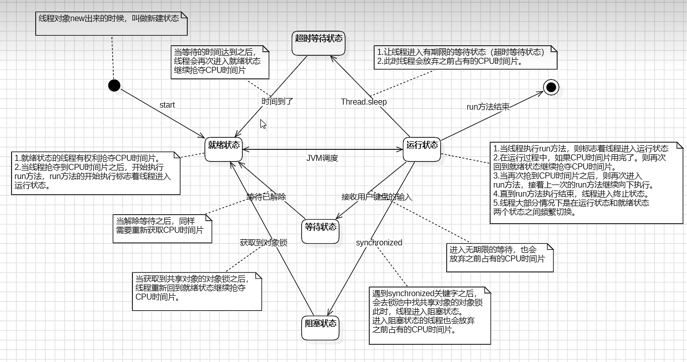

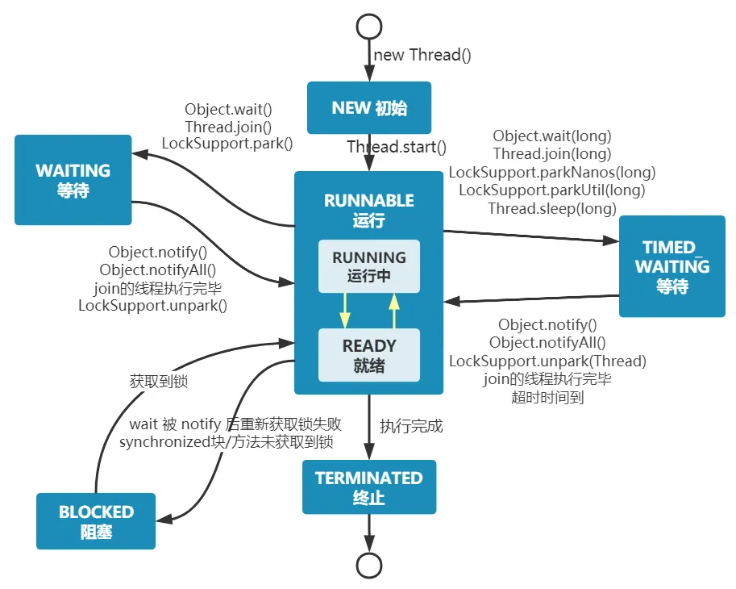

```java
public enum State {  
	NEW,    
	RUNNABLE,  
    BLOCKED,  
    WAITING,  
    TIMED_WAITING,  
    TERMINATED;  
}
```

> `Thread` 类中定义了这六个枚举类型作为线程的状态

- **NEW（新建）**

- **RUNNABLE（就绪）**

- **RUNNING（运行）**（就绪和运行通常分在一起，统称为运行状态 `RUNNABLE`）

- **BLOCKED（阻塞）**

- **WAITING（等待）**

- **TIMED_WAITING（计时等待）**

- **TERMINATED（终止）**

需要注意的是：

在操作系统层面，线程有 READY 和 RUNNING 状态；而在 JVM 层面，只能看到 RUNNABLE 状态，所以 Java 系统一般将这两个状态统称为 RUNNABLE（运行中） 状态 。

为什么 JVM 没有区分这两种状态呢？

1、JVM 是运行在操作系统之上的，它不能直接控制 CPU 什么时候调度哪个线程上 CPU，只能调用操作系统提供的接口来创建、启动、阻塞或终止线程。所以，对于 JVM 而言只要一个线程处于“可以运行”的状态（不是等待、阻塞、终止），它就认为线程是 RUNNABLE，而实际是不是正在 CPU 上运行，这个由操作系统的线程调度器决定，JVM 无法观测到。

2、现代操作系统使用时间片轮转机制，每个线程分配一个很短的 CPU 时间片（比如 10ms），时间片用完后线程就被换下 CPU（进入 ready 状态）等待下次调度。由于切换速度极快（毫秒级甚至微秒级），从 JVM 的视角来看几乎无法精确知道某个线程处于 ready 还是 running，此时还区分这两种状态就没什么意义了。

>当创建一个线程的时候，也就是 `new Thread` 的时候，此时线程是 `NEW` 状态

```java
// 创建线程 
Thread thread = new Thread(new Runnable() { 
@Override public void run() { 
	// ... 
} }); 
// 获取线程状态 
Thread.State state = thread.getState(); 
System.out.println(state); // NEW
```

>然而调用了线程的 `start` 方法之后，线程的状态就从 `NEW` 变成了 `RUNNABLE`

```java
// 创建线程
Thread thread = new Thread(new Runnable() {
    @Override
    public void run() {
        // 获取到当前执行的线程
        Thread currThread = Thread.currentThread();
        // 获取线程状态
        Thread.State state = currThread.getState();
        // 打印线程状态
        System.out.println(state); // RUNNABLE
    }
});

thread.start();
```

>线程调用 `wait()` 方法之后，就会从 `RUNNABLE` 状态变为 `WAITING` 无时限等待状态

```java
// 创建线程
Thread thread = new Thread(new Runnable() {
    @Override
    public void run() {
        synchronized (this) {
            try {
                // 线程休眠
                this.wait();
            } catch (InterruptedException e) {
                e.printStackTrace();
            }
        }
    }
});
// 启动线程
thread.start();
// 获取线程状态
Thread.State state = thread.getState();
// 打印线程状态
System.out.println("首次获取线程状态：" + state); // RUNNABLE
// 休眠 1s
try {
    Thread.sleep(1000);
} catch (InterruptedException e) {
    e.printStackTrace();
}
// 获取线程状态
state = thread.getState();
// 打印线程状态
System.out.println("第二次获取线程状态：" + state); // WAITING
```

>当调用了 `notify` / `notifyAll` 方法之后，线程会从 `WAITING` 状态变成 `RUNNABLE` 状态

```java
Object lock = new Object();
// 创建线程
Thread thread = new Thread(new Runnable() {
    @Override
    public void run() {
        synchronized (lock) {
            try {
                // 线程休眠
                lock.wait();
                // 获取当前线程状态
                Thread.State state = Thread.currentThread().getState();
                // 打印线程状态
                System.out.println("获取线程状态：" + state); // RUNNABLE
            } catch (InterruptedException e) {
                e.printStackTrace();
            }
        }
    }
});
// 启动线程
thread.start();
// 获取线程状态
Thread.State state = thread.getState();
// 打印线程状态
System.out.println("首次获取线程状态：" + state);
// 休眠 1s
try {
    Thread.sleep(100);
} catch (InterruptedException e) {
    e.printStackTrace();
}
// 获取线程状态
state = thread.getState();
// 打印线程状态
System.out.println("第二次获取线程状态：" + state);

// 唤醒 thread 线程
synchronized (lock) {
    lock.notify();
}
```

>当调用带超时时间的等待方法时，如 `sleep()`，线程会从 `RUNNABLE` 状态变成 `TIMED_WAITING` 有时限状态

```java
// 创建线程
Thread thread = new Thread(new Runnable() {
    @Override
    public void run() {
        try {
            Thread.sleep(1000);
        } catch (InterruptedException e) {
            e.printStackTrace();
        }
    }
});
// 启动线程
thread.start();
// 获取线程状态
Thread.State state = thread.getState();
// 打印线程状态
System.out.println("首次获取线程状态：" + state); // RUNNABLE
// 休眠 1s
try {
    Thread.sleep(100);
} catch (InterruptedException e) {
    e.printStackTrace();
}
// 获取线程状态
state = thread.getState();
// 打印线程状态
System.out.println("第二次获取线程状态：" + state); // TIMED_WAITING
```

>当超过了超时时间之后，线程就会从 `TIMED_WAITING` 状态变成 `RUNNABLE` 状态

```java
// 创建线程
Thread thread = new Thread(new Runnable() {
    @Override
    public void run() {
        try {
            Thread.sleep(1000);
            // 获取当前线程状态
            Thread.State state = Thread.currentThread().getState();
            // 打印线程状态
            System.out.println("获取线程状态：" + state); // RUNNABLE
        } catch (InterruptedException e) {
            e.printStackTrace();
        }
    }
});
// 启动线程
thread.start();
// 获取线程状态
Thread.State state = thread.getState();
// 打印线程状态
System.out.println("首次获取线程状态：" + state); // RUNNABLE
// 休眠 1s
try {
    Thread.sleep(100);
} catch (InterruptedException e) {
    e.printStackTrace();
}
// 获取线程状态
state = thread.getState();
// 打印线程状态
System.out.println("第二次获取线程状态：" + state); // TIMED_WAITING
```

>线程执行完之后，就会从 `RUNNABLE` 状态变成 `TERMINATED` 销毁状态

```java
// 创建线程
Thread thread = new Thread(new Runnable() {
    @Override
    public void run() {
        // 获取当前线程状态
        Thread.State state = Thread.currentThread().getState();
        // 打印线程状态
        System.out.println("获取线程状态：" + state); // RUNNABLE
    }
});
// 启动线程
thread.start();
// 等待 100ms，待线程执行完
try {  
    Thread.sleep(100);  
} catch (InterruptedException e) {  
    e.printStackTrace();  
}
// 获取线程状态
Thread.State state = thread.getState();
// 打印线程状态
System.out.println("线程状态：" + state); // TERMINATED
```

****
# 6. 线程的休眠

>线程休眠指的是让一个线程暂停执行一段时间，这段时间该线程会进入阻塞状态，不会占用 CPU 资源，等到休眠时间结束之后，线程会从阻塞状态变为可运行状态 `RUNNABLE` ，等待 CPU 调度继续执行

>线程休眠的方法有 5 个：`Thread.sleep`、 `TimeUnit.sleep`、 `Object.wait`、 `Condition.await`、 `LockSupport.park`，其中 `Thread.sleep` 和 `TimeUnit.sleep` 是定时休眠，线程在指定时间后自动唤醒，而  `Object.wait`、 `Condition.await`、 `LockSupport.park`  属于可控挂起，必须由其他线程在合适的时机显式唤醒

## 6.1 `Thread.sleep`

>让当前线程暂停执行一段指定时间（以毫秒为单位），在时间到达后线程会自动恢复执行，方法需要传递一个 `long` 类型的毫秒数，表示 n 毫秒之后自动唤醒，或者继续传入 `int` 类型的纳秒数

```java
System.out.println("开始执行");
try {
    Thread.sleep(2000); // 当前线程睡眠2秒
    } catch (InterruptedException e) {
        e.printStackTrace();
    }    
System.out.println("2秒后继续执行");
```

>`Thread.sleep()` 是静态方法，作用在当前线程上，通过其他线程的对象调用这个方法仍然执行的是这段代码处于的线程，例如在 main 方法中调用 `(new Thread()).sleep(1000)`，是将 main 线程睡眠 1 秒

**休眠的中断**

>当一个线程调用了 `Thread.sleep()` 进入休眠状态后，如果另一个线程调用了它的 `interrupt()` 方法，该线程就会被中断唤醒， `Thread.sleep()` 后面的代码也不会执行，并抛出一个 `InterruptedException` 异常

```java
Thread thread = new Thread(new Runnable() {
	@Override
    public void run() {
        try {
        System.out.println("子线程开始休眠...");
        Thread.sleep(5000);
        System.out.println("子线程休眠结束");
	    } catch (InterruptedException e) {
	        System.out.println("子线程在休眠时被中断！");
	    }
	}    
});

thread.start();
try {  
	// 主线程等待2秒后中断子线程
    Thread.sleep(2000);  
} catch (InterruptedException e) {  
    e.printStackTrace();  
}
System.out.println("主线程中断子线程");
thread.interrupt();
```

```
子线程开始休眠...
主线程中断子线程
子线程在休眠时被中断！
```

****
## 6.2 `TimeUnit.sleep`

>本质上是对 `Thread.sleep()` 的封装，在底层仍然会调用 `Thread.sleep` 在处理不同时间单位时更方便（）


```java
System.out.println("开始休眠...");  
try {  
    TimeUnit.SECONDS.sleep(2);  // 休眠 2 秒  
} catch (InterruptedException e) {  
    e.printStackTrace();  
}  
System.out.println("休眠结束！");
```

****
## 6.3 `Object.wait()`

>`Object.wait()` 一种线程协作机制的方法，让线程等待通知，在多线程程序中协调线程执行的顺序，常与 `notify()` 或 `notifyAll()` 一起使用，以实现线程之间的通信

>带参数的 `wait()` 方法则会让线程进入 `TIMED_WAITING` 状态

>该方法必须在同步代码块或同步方法中调用，即必须持有该对象的监视器锁（monitor），否则会抛出：`IllegalMonitorStateException`

```java
synchronized(obj) {
    obj.wait();
}
```

**工作流程：**

>当前线程获取对象锁并调用 `wait()` 方法后，线程会释放锁并进入等待状态（进入对象的等待队列），当其他线程调用 `notify()` 或 `notifyAll()` 方法唤醒处于等待队列中的线程，被唤醒的线程重新尝试获取锁，但只有拿到锁后才能继续执行

```
+-------------------+            +---------------------------+
|  线程持有对象锁    | ---wait()-->| 线程进入等待队列（WAITING） |
+-------------------+            +---------------------------+
        ^                                        |
        |                +----------------+      |
        |---notify()---- | 唤醒一个线程    | <----+
        |---notifyAll()--| 唤醒所有线程    |
                         +----------------+
```

```java
public synchronized void produce() throws InterruptedException {
    while (available) {
        wait(); 
    }
    System.out.println("生产资源");
    available = true;
    notify(); 
}

public synchronized void consume() throws InterruptedException {
    while (!available) {
        wait(); 
    }
    System.out.println("消费资源");
    available = false;
    notify();
}
```

>需要注意的是，`notify()` 唤醒的线程与执行的地方无关， JVM 会随机唤醒一个处于 `WAITING` 状态的线程，所以可能会唤醒一个与当前线程进行相同操作的线程，导致互相争夺同一个锁，而使用 `notifyAll()` 后会唤醒所有处于 `WAITING` 状态的线程，它们会进行判断，有的可能会继续陷入等待状态，但是总会有一个是可以进入 `RUNNABLE` 状态，例如：

```java
private static final LinkedList<Integer> queue = new LinkedList<>();  
private static final int MAX_CAPACITY = 1;  
  
public static void main(String[] args) {  
    Object lock = new Object();  
  
    // 启动多个消费者  
    for (int i = 0; i < 2; i++) {  
        new Thread(() -> {  
            while (true) {  
                synchronized (lock) {  
                    while (queue.isEmpty()) {  
                        try {  
                            System.out.println(Thread.currentThread().getName() + " waiting...");  
                            lock.wait();  
                        } catch (InterruptedException e) {  
                            e.printStackTrace();  
                        }  
                    }  
                    int item = queue.removeFirst();  
                    System.out.println(Thread.currentThread().getName() + " consumed: " + item);  
                    lock.notify(); // 错误用法，只唤醒一个线程  
                }  
            }  
        }, "Consumer-" + i).start();  
    }  
  
    // 启动一个生产者  
    new Thread(() -> {  
        int count = 0;  
        while (true) {  
            synchronized (lock) {  
                while (queue.size() == MAX_CAPACITY) {  
                    try {  
                        System.out.println("Producer waiting...");  
                        lock.wait();  
                    } catch (InterruptedException e) {  
                        e.printStackTrace();  
                    }  
                }  
                queue.add(count);  
                System.out.println("Producer produced: " + count++);  
                lock.notify(); // 可能只唤醒一个消费者，而这个消费者依然无法消费（因为其他先消费）  
            }  
        }  
    }, "Producer").start();  
}
```

>当生产者放入一个元素后调用 `notify()`，可能唤醒了 Consumer-0 线程，然后 Consumer-0 抢到锁，开始消费，消费完成后进入 `WAITING` 状态，此时生产者继续生产然后调用 `notify()` ，但此时可能唤醒的就是 Consumer-1 线程了，然后消费，继续唤醒另一个线程，如果此时生产者线程被唤醒，放入元素后唤醒了 Consumer-1 线程，Consumer-1 线程消费后生产者线程可能就进入 `WAITING` 状态了，但是 Consumer-1 线程后续唤醒的线程可能是 Consumer-0 线程，但此时队列中没有元素，所以只能进入 `WAITING` 状态，此时三个线程都在 `WAITING` 状态，没人可以调用 `notify()` ，这就导致程序卡死

>所以更推荐使用 `notifyAll()`，它能唤醒所有等待线程，被唤醒的线程自己判断是否能执行（比如队列是否为空），哪怕唤醒了所有人，只有符合条件的线程能继续，其它线程也会再次进入 `wait()`，避免了所有线程都进入 `WAITING` 状态的现象

****

**丢失唤醒问题（Lost Wake-Up Problem）**

>一个线程发送了唤醒通知 `notify()`，但另一个线程尚未进入等待 `wait()` 状态，结果这个通知就被弄丢了，后续线程永远得不到唤醒，从而导致程序挂起或假死
>
>所以丢失唤醒的本质是判断-等待和通知之间发生了竞态，唤醒通知“跑得太早”，接收方还没准备好

```java
// 生产者
count++;
notify();

// 消费者
while(count <= 0){
    wait();
    count--;
}
```

>如果 `wait()` 和 `notify()` 可以直接放在任何地方使用，就可能造成丢失唤醒问题，所以 Java强制将这些方法放在同步代码块中使用，获取到锁才能调用 `notify()` ，而调用 `wait()` 才会释放锁，并且 Java 推荐使用条件判断与同步控制的联合使用，当资源不可用时才调用 `wait()`，当资源可用是就调用 `notify()`，而最开始资源都是不可用的（生产者还未开始生产），所以最先调用的一定是 `wait()`


****
## 6.4 `Condition.await`

。。。。。。

****
## 6.5 `LockSupport.park()`

>一种线程阻塞工具，让当前线程挂起（休眠）直到被唤醒（unpark）或发生中断等事件

```java
Thread thread = new Thread(() -> {  
    System.out.println("子线程将休眠");  
    LockSupport.park();  // 挂起线程  
    System.out.println("子线程被唤醒");  
});  
  
thread.start();  
  
try {  
    Thread.sleep(2000); // 模拟延迟  
} catch (InterruptedException e) {  
    e.printStackTrace();  
}  
  
System.out.println("主线程将唤醒子线程"); // 注释后：子线程将休眠
										// 主线程将唤醒子线程 
LockSupport.unpark(thread);  // 唤醒线程
```

```
子线程将休眠
（等待两秒）
主线程将唤醒子线程
子线程被唤醒
```

>`park()`：挂起当前线程，直到有许可证为止（线程初始不拥有许可）；  
>
>`unpark(Thread)`：向目标线程发放一个许可证（当这个代码在 `park()` 前调用时会导致线程无法挂起）

****
## 6.6 Thread#sleep() 和 Object#wait() 对比

`sleep()` 方法会暂停当前执行的线程一段指定的时间，时间结束后线程再恢复执行。即使线程在 `sleep` 状态下持有锁，它也不会释放，所以其他线程无法获得该锁。`sleep()` 方法会使线程从运行（RUNNING）状态转换为计时等待（TIMED_WAITING）状态。它是 `Thread` 类的静态方法，调用时通过 `Thread.sleep` 访问。

`wait()` 方法使当前线程等待，直到其他线程调用当前对象的 `notify` 或 `notifyAll` 方法。调用 `wait` 时，线程会释放它持有的锁，并且 `wait()` 方法必须在同步块或同步方法中调用，否则会抛出 `IllegalMonitorStateException`。`wait()` 方法会使线程从运行（RUNNING）状态转换为等待（WAITING）状态（调用方法时如果传入 `timeout`，则会进入 TIME_WAITING 状态），因为它是 `Object` 类的方法，所以任何对象都可以调用。

| 特性         | `sleep`                | `wait`                        |
| ---------- | ---------------------- | ----------------------------- |
| **释放锁**    | 否                      | 是                             |
| 需要在同步块或方法中 | 否                      | 是                             |
| 属于         | `Thread` 类             | `Object` 类                    |
| 引发异常       | `InterruptedException` | `InterruptedException` 引发机制相同 |
| **作用范围**   | 当前调用的线程                | 当前拥有锁的线程                      |
| **线程状态改变** | 变为计时等待（TIMED_WAITING）  | 变为等待（WAITING）                 |
| 典型应用场景     | 暂停线程的一段时间，用于控制节奏或定时操作  | 线程间通信，生产者-消费者模型等              |

****
# 7. 线程的中断

>每个线程都有一个 `boolean` 标识，代表着是否有中断请求（该请求可以来自所有线程，包括被中断的线程本身），初始值为 `false`


>Java 的中断是一种协作机制，它不会强制终止线程，而是给线程发送一个中断信号，然后由被中断的线程自己决定是否以及如何处理这个信号，所以中断不是强杀线程，而是一种“请求停止”的建议

| 方法                       | 说明                    |
| ------------------------ | --------------------- |
| `Thread.interrupt()`     | 设置线程的中断标志位（置为 `true`） |
| `Thread.isInterrupted()` | 检查某线程的中断标志（不清除标志）     |
| `Thread.interrupted()`   | 检查当前线程是否被中断，并清除中断标志   |

## 7.1 public void interrupt()

>实例方法，作用是：中断目标线程。谁调用，谁中断目标线程（可看作外部中断），设置目标线程的中断标志位为 `true`，如果线程处于阻塞状态，则会触发中断异常

**源码**

```java
public void interrupt() {
    if (this != Thread.currentThread()) {
        checkAccess(); // 检查当前线程是否有权限中断目标线程

        synchronized (interruptLock) {
            Interruptible b = nioBlocker;
            if (b != null) {
                interrupted = true;      // 设置中断标志位为 true
                interrupt0();            // 通知 JVM 中断线程
                b.interrupt(this);       // 中断可能的 NIO 阻塞操作
                return;
            }
        }
    }
    interrupted = true;  // 设置中断标志位
    interrupt0();        // 通知 JVM 中断线程
}
```

****

```java
Thread thread = new Thread(() -> {  
    while (true) {  
        System.out.println("工作线程正在运行...");  
        try {  
            Thread.sleep(1000);  
        } catch (InterruptedException e) {  
            System.out.println("工作线程被中断，准备退出");  
            break;  
        }  
    }  
});  
  
thread.start();  
  
try {  
    Thread.sleep(3000); // 主线程等待3秒  
} catch (InterruptedException e) {  
    e.printStackTrace();  
}  
  
thread.interrupt(); // 外部中断
```

```
工作线程正在运行...
工作线程正在运行...
工作线程正在运行...
工作线程被中断，准备退出
```
## 7.2 public static boolean interrupted()

>静态方法，作用是：检查并清除当前线程的中断标志位。获取当前线程的中断状态（是否被中断过），调用这个方法后，中断状态会被清除为 `false`（可看作内部中断）

**源码**

```java
public static boolean interrupted() {
    return currentThread().getAndClearInterrupt(); // 获取并清除当前线程的中断状态
}
```

```java
boolean getAndClearInterrupt() {  
    boolean oldValue = interrupted;     
    if (oldValue) {  
        interrupted = false;  
        clearInterruptEvent();  
    }  
    return oldValue; // 最终返回 false 
}
```

****

>根据中断标志来结束循环

```java
Thread worker = new Thread(() -> {  
    while (true) {  
        if (Thread.interrupted()) { // 检查并清除中断标志（当为 false 时进入 if）  
            System.out.println("检测到线程中断，准备退出");  
            break;  
        }  
        System.out.println("线程执行中...");  
        try {  
            Thread.sleep(1000); // sleep 会抛出异常且清除中断标志  
        } catch (InterruptedException e) {  
            System.out.println("sleep中被中断");  
            Thread.currentThread().interrupt(); // 重新设置中断标志  
        }  
    }  
});  
  
worker.start();  
  
try {  
    Thread.sleep(2000); // 主线程等待 2 秒  
} catch (InterruptedException e) {  
    e.printStackTrace();  
}  
  
worker.interrupt(); // 中断工作线程
```

```
线程执行中...
线程执行中...
sleep中被中断
检测到线程中断，准备退出
```

****

**清除中断标志后需要恢复中断**

>当调用一个会被中断打断的方法（比如 `Thread.sleep()`），线程被中断时会抛出 `InterruptedException` 异常，而 JVM 会自动清除线程的中断标志

>恢复中断状态是为了让线程在被中断后仍能保持可被中断的状态，从而在后续流程中做出正确响应

```java
Thread thread = new Thread(() -> {  
    while (true) {  
        try {  
            System.out.println("准备休眠...");  
            Thread.sleep(1000);  
        } catch (InterruptedException e) {  
            System.out.println("捕获中断异常，但没恢复中断标志！");  
            // 忽略了中断标志  
        }  
  
        // 中断标志已经被清除，下面不会退出  
        if (Thread.currentThread().isInterrupted()) {  
            System.out.println("检测到中断标志，准备退出");  
            break;  
        }  
    }  
});  
  
thread.start();  
  
try {  
    Thread.sleep(3000);  
} catch (InterruptedException e) {  
}  
  
thread.interrupt(); // 中断线程  
  
try {  
    thread.join(); // 等待子线程结束  
} catch (InterruptedException e) {  
    e.printStackTrace();  
}  
  
System.out.println("主线程结束");
```

>当没有恢复中断标志并以此作为结束循环的标志时，就无法结束子线程

****
## 7.3 public boolean isInterrupted()

>用来检查当前线程的中断标志是否为 `true`，不会清除中断状态

```java
Thread worker = new Thread(() -> {  
    while (!Thread.currentThread().isInterrupted()) { // 持续检查中断标志  
        try {  
            System.out.println("工作线程正在运行...");  
            Thread.sleep(1000);   
        } catch (InterruptedException e) {  
            // 在 sleep 被中断时捕获异常，并重新检查中断标志  
            System.out.println("工作线程被中断，准备退出");  
            break;  // 退出循环  
        }  
    }  
});
```

****
# 8. 守护线程

>用户线程又叫普通线程，是驱动业务逻辑运转的核心；而守护线程，是守护用户线程的一种线程，运行在后台提供通用服务，因此也叫后台线程或者精灵线程，当用户线程结束时，守护线程也会结束

## 8.1 守护线程的设置

>可以通过 `Thread` 类的 `setDaemon(true)` 方法将一个线程设置为守护线程，必须在 `start()` 方法调用之前设置，否则会抛出 `IllegalThreadStateException`，需要注意的是，守护线程守护的不只是某个特定的线程，而是全局的线程，当所有用户线程都结束了，守护线程就会被 JVM 强制终止

```java
public static void main(String[] args) {  
    Thread t = new Thread(() -> {  
        while (true) {  
            System.out.println("守护线程正在运行...");  
            try {  
                Thread.sleep(1000);  
            } catch (InterruptedException e) {  
                System.out.println("守护线程被中断");  
            }  
        }  
    });  
  
    t.setDaemon(true); // 设置为守护线程  
    t.start();         // 启动线程  
  
    System.out.println("主线程运行 3 秒后结束");  
    try {  
        Thread.sleep(3000);  
    } catch (InterruptedException e) {  
        e.printStackTrace();  
    }  
  
    System.out.println("主线程结束，程序退出");  
}
```

```
守护线程正在运行...
守护线程正在运行...
守护线程正在运行...
主线程结束，程序退出
```

>将 t 线程设置为守护线程，当前程序中只有一个 main 用户线程，当 main 执行完毕后守护线程就自动被 JVM 关闭

****
## 8.2 JVM 与用户线程共存亡

>在 `JavaThread::run()` 中，JVM 启动了 main 线程后会监听线程生命周期，一旦一个线程运行结束，会调用 `Threads::remove()` 移除当前线程

```cpp
// src/hotspot/share/runtime/thread.cpp

void JavaThread::run() {
    ...
    // 调用 Java 层的 run()
    this->entry_point()(this, this);
    ...
    // 线程运行结束后，判断是否退出 JVM
    Threads::remove(this); // 线程移除全局线程列表
    ...
}
```

>remove 之后进行线程数量检查（线程的数量会自动 `--` ），其中 `_number_of_non_daemon_threads` 是 JVM 全局记录的非守护线程数。
>
>当最后一个非守护线程结束（此时该值减为 0），就调用 `signal_vm_shutdown()` 通知 VM 退出

```cpp
void Threads::remove(JavaThread* thread) {
    ...
    // 非守护线程减少后，触发退出条件判断
    if (thread->is_non_daemon() && _number_of_non_daemon_threads-- == 1) {
        // 说明已经没有非守护线程了
        // 通知 VM 退出
        VMThread::signal_vm_shutdown();
    }
}
```

>JVM 中有一个特殊线程 `VMThread`，负责执行一些全局操作（如 GC、安全点、JVM 退出等）。在接收到 `signal_vm_shutdown()` 后，它将执行一个 VM 操作类 `VM_Exit`

```cpp
void VMThread::run() {
    while (true) {
        ...
        if (_should_terminate) {
            VM_Exit op;
            op.evaluate();  // 真正执行退出逻辑
            break;
        }
    }
}
```

>最后 `VM_Exit::doit()` 中调用 `destroy_vm()` 清除资源并退出程序

```cpp
void VM_Exit::doit() {
    ...
    // 真正退出 JVM
    Universe::destroy_vm();  // ≈ destroy_vm()
}
```

```cpp
void Universe::destroy_vm() {
    ...
    // 清理线程、类加载器、运行时数据等
    delete _main_thread_group;
    delete _system_thread_group;
    ...
    exit_globals();
    os::exit(exit_code);  // 调用系统 exit，彻底终止进程
}
```

```
Java 用户线程 run() 结束
        ↓
JavaThread::run() 调用 Threads::remove(this)
        ↓
非守护线程计数 -1
        ↓
为 0 ? → 是 → signal_vm_shutdown()
        ↓
VMThread 检测到信号，执行 VM_Exit
        ↓
VM_Exit::doit() → Universe::destroy_vm()
        ↓
destroy_vm() 清理所有资源 → os::exit()
        ↓
JVM 正式退出
```

>所以 JVM 退出的判断标准不是 main 是否活着，而是依赖于 `_number_of_non_daemon_threads` 是否为 0 （是否还有非守护线程），所以 main 线程通常比子线程先退出

****
# 9. 线程的合并

>线程的合并，通常指的是通过调用某个线程的 `join()` 方法，使当前线程等待另一个线程执行完毕后再继续执行
>
>线程 A 启动了线程 B，然后线程 A 想等 B 干完再继续干自己的事，这时候线程 A 就会调用 `B.join()`

**常用合并操作：**

- 下载文件的多个线程并发处理不同片段，主线程要等它们都下完再合并文件；
    
- 子线程完成计算，主线程再输出总和；
    
- 子线程完成数据库操作，主线程才继续业务处理

****
## 9.1 join()

```java
public static void main(String[] args) throws InterruptedException {
    Thread worker = new Thread(() -> {
        System.out.println("子线程开始执行");
        try {
            Thread.sleep(2000);
        } catch (InterruptedException e) {}
        System.out.println("子线程执行完毕");
    });

    worker.start();
    worker.join(); // 主线程等待子线程结束

    System.out.println("主线程继续执行");
}
```

**多个线程的合并**

```java
Thread t1 = new Thread(() -> System.out.println("线程1"));
Thread t2 = new Thread(() -> System.out.println("线程2"));

t1.start();
t2.start();

// 等待两个线程都结束
t1.join();
t2.join();

System.out.println("主线程：所有子线程已执行完");
```

****
## 9.2 Thread.yeild()

>Thread 类中的 `yield()` 方法用于将 CPU 资源让给其他线程。当一个线程调用 `yield()` 方法时，它会暂停当前正在执行的任务并让出 CPU 资源，以便其他线程有机会执行。如果没有其他线程需要执行，那么该线程将继续执行。

```java
public class YieldDemo {
    public static void main(String[] args) {
        Runnable task = new Runnable() {
            @Override
            public void run() {
                for (int i = 0; i < 5; i++) {
                    System.out.println(Thread.currentThread().getName() + ": " + i);
                    Thread.yield(); // 主动让出CPU
                }
            }
        };

        Thread t1 = new Thread(task, "Thread-A");
        Thread t2 = new Thread(task, "Thread-B");

        t1.start();
        t2.start();
    }
}
```

```
Thread-A: 0
Thread-B: 0
Thread-A: 1
Thread-B: 1
Thread-A: 2
Thread-B: 2
Thread-A: 3
Thread-B: 3
Thread-A: 4
Thread-B: 4
```

>两条线程交替运行的概率变大了，但并不保证一定交替，这个方法并不会释放锁，也不会导致线程阻塞


****
# 10. 线程的优先级

>在 Java 中，每个线程都有一个优先级（Priority），用于提示线程调度器决定哪个线程更重要，应当先被分配 CPU 时间片

**优先级的本质是一个整数，范围为：**

- Thread.MIN_PRIORITY = 1
- Thread.NORM_PRIORITY = 5   // 默认值
- Thread.MAX_PRIORITY = 10

>需要注意的是，线程的默认值其实是继承父线程的

```java
Thread.currentThread().setPriority(4);  
Thread thread = new Thread();  
System.out.println(thread.getPriority()); // 4
```

**优先级高的线程 != 一定先执行**

```java
public static void main(String[] args) {  
        PriorityThread low = new PriorityThread("低优先级线程");  
        PriorityThread high = new PriorityThread("高优先级线程");  
  
        // 设置优先级  
        low.setPriority(Thread.MIN_PRIORITY);   // 优先级 = 1        
        high.setPriority(Thread.MAX_PRIORITY);  // 优先级 = 10  
        // 启动线程  
        low.start();  
        high.start();  
    }  
}  
  
class PriorityThread extends Thread {  
    private long count = 0;  
  
    public PriorityThread(String name) {  
        super(name);  
    }  
  
    @Override  
    public void run() {  
        long start = System.currentTimeMillis();  
        while (System.currentTimeMillis() - start < 3000) { // 运行3秒  
            count++;  
        }  
        System.out.println(getName() + " 执行次数: " + count);  
    }
```

```
高优先级线程 执行次数: 897814953
低优先级线程 执行次数: 859001280
```

>可以看到高优先级的执行次数更多，线程优先级只是调度建议，谁先执行，完全取决于操作系统调度器，并且 `start()` 只是触发线程启动，不意味着立即获得 CPU

```java
Thread thread1 = new Thread(() -> {  
    System.out.println("高优先级线程");  
});  
thread1.setPriority(Thread.MAX_PRIORITY);  
  
Thread thread2 = new Thread(() -> {  
    System.out.println("低优先级线程");  
});  
thread2.setPriority(Thread.MIN_PRIORITY);  
  
thread1.start();  
thread2.start();
```

```
低优先级线程
高优先级线程
```

****
# 11. 线程安全问题

- 线程安全指的是在多线程环境下，对于同一份数据，不管有多少个线程同时访问，都能保证这份数据的正确性和一致性。
- 线程不安全则表示在多线程环境下，对于同一份数据，多个线程同时访问时可能会导致数据混乱、错误或者丢失。
## 11.1 什么情况下考虑线程安全

- 多线程的并发环境
- 有共享的数据
- 共享的数据设计修改操作

```java
public class Demo4 {  
    public static void main(String[] args) throws InterruptedException {  
        UnsafeCounter counter = new UnsafeCounter();  
  
        // 创建多个线程同时执行 increment        
        Thread[] threads = new Thread[100];  
        for (int i = 0; i < 100; i++) {  
            threads[i] = new Thread(() -> {  
                for (int j = 0; j < 1000; j++) {  
                    counter.increment();  
                }  
            });  
            threads[i].start();  
        }  
  
        // 等待所有线程结束  
        for (Thread t : threads) {  
            t.join();  
        }  
        // 按理说结果应该是 100 * 1000 = 100000        
        System.out.println("最终计数值：" + counter.getCount()); 
        // 实际结果： 最终计数值：98891 
    }  
}  
  
class UnsafeCounter {  
    private int count = 0;  
  
    public void increment() {  
        count++; // 非线程安全：读-改-写操作不是原子性的  
    }  
  
    public int getCount() {  
        return count;  
    }  
}
```

>多个线程同时执行时，可能这样交叉运行：线程 A 读取值为 `100`，线程 B 也读取值为 `100`，A 写入 `101`，B 写入 `101`（覆盖了 A 的结果），最终加了两次，但结果只增加了 1

>因为这一百个线程访问的是同一个对象，这个对象的字段放在堆中，这些数据是共享给所有线程的，所以它们都可以获取到 count，因为每个线程可能随时失去 CPU 的使用权，所以可能有些线程只获取到 count 后还没来得及进行累加，就进入休眠了，而每个线程都有自己的工作内存（类似于 CPU 缓存），访问变量时会从主内存中读取 `count` 的值到自己的工作内存，后续操作都在工作内存上进行，而写回主内存是延迟的，不是实时的，这就导致了唤醒线程后它拿到的值并不知最新的，所以造成了非同步问题

**`count++` 实际是三个步骤**：

1. 从主内存读取 `count`；
2. 在工作内存中 `count + 1`；
3. 写回主内存。

|时间|线程A|线程B|count 变量值|
|---|---|---|---|
|T1|读取 count = 0||0|
|T2||读取 count = 0|0|
|T3|计算 0 + 1 = 1||0|
|T4||计算 0 + 1 = 1|0|
|T5|写回 count = 1||**1**|
|T6||写回 count = 1|**1**|
****
## 11.2  Java 内存模型 - JMM

### 11.2.1 两个内存

>JMM（Java Memory Model）是一种基于计算机内存模型（定义了共享内存系统中多线程程序读写操作行为的规范），屏蔽了各种硬件和操作系统的访问差异的，保证了Java程序在各种平台下对内存的访问都能保证效果一致的机制及规范，并且 JMM 把内存分为两部分：主内存、工作内存

>由于 `JVM` 运行程序的实体是线程，每个线程创建时 `JVM` 都会为其分配工作内存，用于存储线程私有的数据。而 `Java` 内存模型中，规定所有变量都存储在主内存，主内存是共享内存区域，所有线程都可以访问。当线程想对一个变量进行赋值/运算等操作时，必须在工作内存中进行。


>线程 A 和线程 B 分别对主内存的变量进行读写操作。其中主内存中的变量为共享变量，也就是说此变量只有一份并再多个线程间共享。但是线程不能直接读写主内存的共享变量，每个线程都有自己的工作内存，线程读写主内存的共享变量时需要先将该变量拷贝一份副本到自己的工作内存，然后在自己的工作内存中对该变量进行操作，线程工作内存对变量副本完成操作之后需要将结果同步至主内存。

****

### 11.2.2 设计初衷

1、**提高性能**：读写速度差异巨大

>主内存访问速度相比 CPU 的寄存器和缓存要慢，如果每一次线程访问变量都要去主内存取值，会拖慢程序执行，引入工作内存，相当于线程拥有自己的变量副本缓存，速度更快

2、**线程隔离与并发效率**

>如果所有线程都直接共享主内存变量，那线程切换、数据读写需要频繁加锁、刷新、同步，开销非常大，工作内存使每个线程只管自己的数据副本，避免产生频繁的冲突。将工作分工，最后再整合，这样效率高

****
### 11.2.3 Java内存模型JMM围绕的三大特性

**1、原子性**

>原子性指的是一个操作是不可中断的，即使是在多线程环境下，一个操作一旦开始就不会被其他线程影响。所以原子性的本质就是一组操作要么全部执行成功，要么就全部失败

>需要注意的是：对于 32 位系统的来说每次原子读写是 32bit ，`byte、short、int、float、boolean、char` 等基本数据类型的读写是原子操作，而 `long、double` 类型的数据是`64bit`的存储单元，所以它们的读写并非原子性的

**2、可见性**

>当一个线程修改了某个共享变量的值，其他线程是否能够马上得知这个修改的值

>在多线程环境中可就不一定了，由于线程对共享变量的操作，都是拷贝到各自的工作内存操作的，操作完成后才返回主内存中，一个线程 `A` 修改了共享变量 `i` 的值，还未写回主内存时，另外一个线程`B`又对主内存中的`i`进行操作，此时`A`线程工作内存中`i`对线程`B`不可见，这种工作内存与主内存之间同步延迟的现象，就造成了可见性问题

**3、有序性**

>对于单线程执行的代码，执行会根据编码的顺序从上往下执行，对于多线程环境，则可能出现乱序现象，因为程序编译成机器码指令后，可能会出现指令重排现象，重排后的指令与原指令的顺序未必一致

****
### 11.2.4 指令重排

**1、编译器优化的重排**

>编译器在不改变单线程程序语义的前提下，可以重新安排语句的执行顺序

```
// 主存的共享变量
int a = 0;
int b = 0;

//线程A                   线程B
代码1：int x = a;         代码3：int y = b;
代码2：b = 1;             代码4：a = 2;
```

>两个线程同时执行，从程序的执行上来看，由于并行执行的原因，按理应该是`x=0、y=0;`这个结果，理论上不会出现`x=2、y=1;`这种结果，但是实际上这种情况是有概率出现的，因为编译器会对一些前后不依赖、耦合度为`0`的代码，进行指令重排优化，假设此时编译器对这段代码进行指令重排优化后，可能出现：

```
//线程A                   线程B
代码2：b = 1;             代码4：a = 2;
代码1：int x = a;         代码3：int y = b;         
```

**2、内存系统的重排**

>指的是由于 CPU 高速缓存（cache）、读写缓冲区（store / load buffer）等机制的存在，导致变量的读写操作在内存中呈现出乱序效果，即写操作没立即写入主内存，读操作没从主内存读取。

。。。。。。

****
## 11.3 JMM 中的 happens-before 原则

### 11.3.1 线程在执行的过程中与内存的交互

>Java 程序在执行的过程中，实际就是 OS 在调度 JVM 的“线程”执行，执行的过程就是与内存的交互操作，而内存交互操作有 8 种（虚拟机实现必须保证每一个操作都是原子的，不可再分割的，对于`double、long` 类型的`load、store、read` 和 `write` 操作在某些平台上允许例外）：

| 操作名      | 含义                         | 示例/说明            |
| -------- | -------------------------- | ---------------- |
| `lock`   | 把一个变量标记为线程独占状态             | 类似于获取互斥锁         |
| `unlock` | 释放一个变量的独占状态，使其可以被其他线程锁定    | 类似于释放互斥锁         |
| `read`   | 从主内存中读取一个变量的值到线程工作内存中（到缓存） | 相当于“主内存 -> 本地缓存” |
| `load`   | 把 `read` 到的值放入线程工作内存中变量副本  | “缓存 -> 工作内存变量”   |
| `use`    | 把工作内存中变量的值传给执行引擎使用         | 执行计算之前要 use 一下   |
| `assign` | 把执行引擎计算结果赋值给工作内存变量         | 操作结果回写到本地副本      |
| `store`  | 把 assign 的值从工作内存变量写到缓存中    | “副本 -> 缓存”       |
| `write`  | 把 store 的值刷新到主内存中          | “缓存 -> 主内存”      |

。。。。。。

****
# 12. synchronized

## 概述

>`synchronized` 是 Java 中最基本的同步手段，用来保证多线程之间的互斥访问，它可以保证原子性（同一时间只有一个线程执行代码块）、保证可见性（线程释放锁时会刷新主内存）保证有序性（通过内存屏障禁止指令重排）。临界区是访问共享资源（如共享变量、对象等）的代码段，而 `synchronized` 则用来保护这个临界区，防止多个线程同时进入。

在 Java 早期版本中，`synchronized` 属于重量级锁，效率较低。Java 的监视器锁（monitor lock）是依赖底层操作系统的互斥锁（Mutex Lock）来实现的。而 Java 的线程是映射到操作系统的原生线程之上的，如果要挂起或者唤醒一个线程，都需要操作系统帮忙完成，而操作系统实现线程之间的切换时需要从用户态转换到内核态，这个状态之间的转换需要相对比较长的时间，时间成本相对较高。

不过，在 Java 6 之后， `synchronized` 引入了大量的优化如自旋锁、适应性自旋锁、锁消除、锁粗化、偏向锁、轻量级锁等技术来减少锁操作的开销，这些优化让 `synchronized` 锁的效率提升了很多。因此， `synchronized` 就可以在实际项目中使用的，像 JDK 源码、很多开源框架都大量使用了 `synchronized` 。

****
## 12.1 基本用法

`synchronized` 关键字的使用方式主要有下面 3 种：

- 修饰实例方法
- 修饰静态方法
- 修饰代码块

>在 Spring 框架中，默认情况下，所有被自动注入的 Bean（比如用 `@Service`、`@Component`、`@Repository` 等注解的类）都是单例模式（Singleton Scope），也就是说:所有线程访问的其实是同一个对象实例。因此，如果这个 Bean 里面有需要保证线程安全的代码（比如修改成员变量，或者操作必须互斥的共享资源），就需要使用同步锁（`synchronized`、`ReentrantLock` 等）来防止线程安全问题。

**1、修饰实例方法**

>作用范围为整个方法体，锁对象则是当前的实例对象。

当一个线程正在访问一个对象的 synchronized 实例方法时，其他线程不能访问该对象的所有synchronized 方法（当一个线程获取了该对象的锁之后，其他线程无法获取该对象的锁），如果另一个线程使用的是另一个对象，则可以使用 synchronized 方法，因为两个实例对象的锁并不同相同（每个对象一把锁，互不干扰）。并且会自动释放锁，出块即释放，不需要手动释放。

```java
public synchronized void doSomething() {
    // 临界区代码
}

// 等价于

public void doSomething() {
    synchronized (this) {
        // 临界区代码
    }
}
```

**2、修饰静态方法**

>作用范围为整个方法题，锁对象是这个类的 `.class` 对象（也叫类锁），会作用于当前类的所有对象实例，限制类中所有静态方法的并发访问，防止多个线程在同一时刻同时修改共享资源（静态资源），导致数据不一致，与其他静态锁互斥，但不与非静态锁互斥，即其他线程可以调用被锁住的类的非静态的锁方法


```java
public static synchronized void doSomething() {
    // ...
}

// 等价于
public static void doSomething() {
    synchronized (类名.class) {
        // ...
    }
}
```

**3、修饰代码块**

>作用范围为指定的代码块，锁对象为自定义对象，如果每次都 new 一个对象作为锁，那这个锁是无效的，因为锁对象并不共享，不同线程使用的是不同的锁，线程间不会互斥

```java
public void test() {
    Object lock = new Object();
    synchronized (lock) {
        // 临界区代码
    }
}
```

这样写会导致多个线程实际上并没有争用同一个锁，它们各自持有不同的锁对象，锁就失去了意义，不能保证线程安全。正确做法是确保锁对象是所有线程共享的，比如声明为成员变量：

```java
private final Object lock = new Object();

public void test() {
    synchronized (lock) {
        // 临界区代码
    }
}
```

这样，无论多少线程调用 `test()` 方法，都会争用同一个 `lock` 对象，保证互斥。

>需要注意的是：构造方法不能使用 synchronized 关键字修饰，这是 Java 的语法规范。不过，可以在构造方法内部使用 synchronized 代码块。另外，构造方法本身是线程安全的，每次调用都会创建一个新的实例，不存在多个线程同时访问同一个构造方法对应的实例（因为实例还没创建完）。但如果在构造方法中涉及到共享资源的操作，就需要采取适当的同步措施来保证整个构造过程的线程安全。

```java
public class MyClass {
    private static final Object lock = new Object();
    private static int sharedCounter = 0; // 共享静态资源

    public MyClass() {
        synchronized(lock) {
            sharedCounter++; // 修改共享资源，需要同步
        }
    }
}
```

****
## 12.2 对象头与 Monitor 对象


### 12.2.1 对象结构

[对象结构](类和对象.md#4.%20对象结构)

****
### 12.2.2 锁的演变

#### 轻量级锁：CPU CAS

如果 CPU 通过简单的 CAS 能处理加锁/释放锁，这样就不会有上下文的切换，较重量级锁而言自然就轻了很多。但是当竞争很激烈，CAS 尝试再多也是浪费 CPU，权衡一下，不如升级成重量级锁，阻塞线程排队竞争，也就有了轻量级锁升级成重量级锁的过程。

但 HotSpot 的作者经过研究发现，大多数情况下，锁不仅不存在多线程竞争，而且总是由同一个线程多次获得。当同一个线程反复获取锁，并且还按照轻量级锁的方式获取锁（CAS），也是有一定代价的，如何让这个代价更小一些呢？

****
#### 偏向锁

[偏向锁](类和对象.md#4.%20对象结构)实际就是锁对象潜意识偏心同一个线程来访问，让锁对象记住线程 ID，当线程再次获取锁时，亮出身份，如果同一个 ID 直接就获取锁就好了，是一种 `load-and-test` 的过程，相较 CAS 自然又轻量级了一些（避免了 CAS）。可是多线程环境，也不可能只是同一个线程一直获取这个锁，其他线程也是要干活的，如果出现多个线程竞争的情况，也就有了偏向锁升级为轻量级锁的过程。

偏向锁，轻量锁，它们都不会调用系统互斥量（Mutex Lock），只是为了提升性能，多出的两种锁的状态，这样可以在不同场景下采取最合适的策略，其目的显而易见（占用的资源越少，程序执行的速度越快）。所以可以总结性的说：

- 偏向锁：无竞争的情况下，只有一个线程进入临界区，采用偏向锁
- 轻量级锁：多个线程可以交替进入临界区，采用轻量级锁
- 重量级锁：多线程同时进入临界区，交给操作系统互斥量来处理

****
### 12.2.3 锁的升级

```
无锁
 ↓（加锁）
偏向锁
 ↓（有竞争）
撤销偏向锁 → 回到无偏向状态
 ↓（CAS失败）
升级为轻量级锁
 ↓（自旋失败）
升级为重量级锁
```

>锁一旦升级就不能降级了（指从偏向锁升级成轻量级锁或重量级锁）

**详细步骤：**

1、 初期锁对象刚创建时，还没有任何线程来竞争，锁状态 01，偏向锁标识位是 0（无线程竞争它）

2、 当有一个线程来竞争锁时，先用偏向锁，表示锁对象偏爱这个线程，这个线程要执行这个锁关联的所有代码，但不需要做任何检查和切换，这种竞争不激烈的情况下，效率非常高

3、当有两个线程开始竞争这个锁对象，锁会升级为轻量级锁，两个线程公平竞争，哪个线程先占有锁对象并执行代码，锁对象的 Mark Word 就执行哪个线程的栈帧中的锁记录。轻量级锁在加锁过程中，用到了自旋锁。自旋就是指当有另外一个线程来竞争锁时，这个线程会在原地循环等待，而不是把该线程给阻塞，直到那个获得锁的线程释放锁之后，这个线程就可以马上获得锁的。

```
线程A试图进入 synchronized(obj) 的临界区：
1. 在自己的线程栈帧中创建锁记录 Lock Record；
2. 将锁对象 obj 的 Mark Word 拷贝到线程栈帧的 Lock Record 中（保存原始信息）；
3. 使用 CAS 尝试将 obj 的 Mark Word 指向 Lock Record；
   成功：加锁成功
   失败：说明另一个线程正在竞争，升级为重量级锁
```

**CAS：**

>CAS 是一种原子操作，它的主要逻辑是：当且仅当预期值 == 当前值时，才将当前值更新为新值，否则什么都不做

CAS 操作包含三个操作数：CAS (V, E, N)

|参数|说明|
|---|---|
|V|要更新的变量（内存地址）|
|E|预期值（expected value）|
|N|新值（new value）|

>如果 V 当前的值 == E，就将 V 的值设置为 N；否则不做任何操作

4、 如果竞争的这个锁对象的线程更多（当轻量级锁自旋次数过多），导致了更多的切换和等待， JVM 会把该锁对象的锁升级为重量级锁，这个就叫做同步锁，这个锁对象 Mark Word 再次发生变化，会指向一个监视器对象（ Monitor ），这个监视器对象用集合的形式，来登记和管理排队的线程。

| 锁类型  | 优点               | 缺点                  | 典型适用场景                   |
| ---- | ---------------- | ------------------- | ------------------------ |
| 偏向锁  | 加锁极快，几乎没有性能开销    | 多线程竞争时需要撤销偏向，反而影响性能 | 线程无竞争的初始化场景              |
| 轻量级锁 | 自旋提升性能，避免线程挂起与唤醒 | 自旋失败造成 CPU 空转，浪费资源  | 短时间竞争激烈，需快速响应的业务逻辑       |
| 重量级锁 | 安全可靠，支持阻塞唤醒      | 阻塞线程会进入内核态，系统开销大    | 高并发、高锁持有时间的场景（如长任务或IO阻塞） |

**偏向锁的撤销：**

>当此时的线程已经不持有当前的锁时，偏向锁偏向该线程就已经没用了，因为此时的锁已经被其他线程抢占了，所以需要把偏向撤销，恢复为初始状态，重新偏向或者升级，因此，偏向锁并不是一直保持有效的，只有在没有线程竞争的情况下才能有效，否则会根据实际情况撤销并恢复为其他状态。

****
### 12.2.4 Monitor对象

#### 1. 结构

>Monitor 是重量级锁的实现方式，在前面的“偏向锁”和“轻量级锁”阶段，JVM 采用了更轻量、用户态的手段来优化性能（例如 CAS、自旋、线程 ID 比较等），不会立即使用 Monitor 。
>
>一旦进入重量级锁，JVM 会走进操作系统层面的互斥，这时就需要借助 Monitor 来协调线程的阻塞与唤醒，该对象头的 Mark Word 中就被设置指向 Monitor 对象的指针，也就是线程挂起和唤醒所必须依赖的结


**ObjectMonitor 中有五个重要部分，分别为 `_ower` ，`_WaitSet` ，`_cxq` ， `_EntryList` 和 `_count`**

- **`_ower`** ：用来指向持有 Monitor 的线程，它的初始值为 NULL ，表示当前没有任何线程持有 Monitor 。当一个线程成功持有该锁之后会保存线程的 ID 标识，等到线程释放锁后 `_ower` 又会被重置为 NULL ；

- **`_WaitSet`** ：调用了锁对象的 `wait()` 方法后的线程会被加入到这个队列中；

- **`_cxq`** ：是一个阻塞队列，线程被唤醒后根据决策判读是放入`_cxq` 还是 `_EntryList`;

- **`_EntryList`** ：所有尝试获取锁失败的线程，它们处于 `BLOCKED` 状态；

- **`_count`** ：用于记录线程获取锁的次数，成功获取到锁后 `_count` 会加 1 ，释放锁时 `_count` 减 1；

- `synchronized` 控制的是 `Ower` 和 `EntryList` 

****
#### 2. 锁升级为重量级锁的过程（建立关系过程）


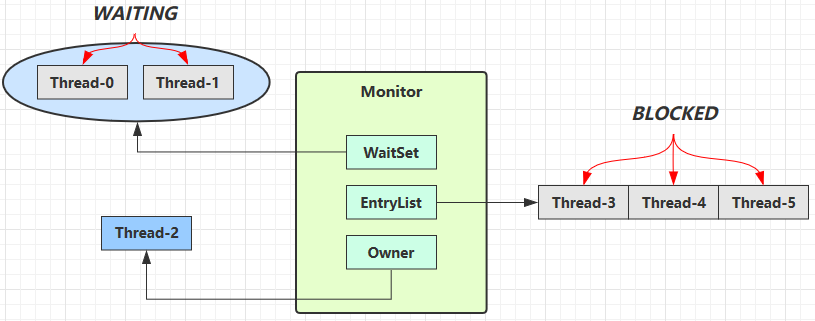

1、线程进入 `EntryList`（`BLOCKED` 状态）

```java
synchronized(obj) {
    // 临界区代码
}
```

>当多个线程尝试执行 `synchronized(obj)`：第一个成功获取锁的线程（ Thread-2）将成为 Monitor 的 `Owner`；后续线程（如 Thread-3、4、5）由于 Monitor 已被占用（`count > 0`），执行 `monitorenter` 失败，无法进入临界区，就会被加入 `EntryList` 中，状态变为 `BLOCKED` ，等待 `Owner` 释放锁时重新参与竞争；因为这些线程没有调用 `wait()`，所以不在 `WaitSet` 中

2、锁释放和竞争过程

>当 `Thread-2` 执行完同步块会执行 `monitorexit`（`count--` 变为 0），它会释放锁（即把 `Owner` 设为 null），此时 `EntryList` 中的线程（Thread-3、4、5）会开始争抢这个锁，谁抢到归谁使用（非公平，不是先进 `EntryList` 先使用），最终一个线程成为新的 `Owner`，进入临界区，其余线程继续等待

3、`WaitSet` 中的线程由 `wait()` 进入

`WaitSet` 用于存放已经获得过锁但因为条件不满足，主动调用了 `wait()` 进入等待状态的线程，它们释放了锁并进入 Monitor 的 `WaitSet` 区域，等待其他线程调用 `notify()` 或 `notifyAll()` 来唤醒它们，唤醒后，它们不会直接变成 `Owner`，而是先转移到 `EntryList` 中重新参与抢锁。

>`wait()` 方法是互斥量（重量级锁）独有的，一旦调用该方法，就会升级成重量级锁

```rust
线程A ---monitorenter---> 成功 ---> 临界区(RUNNING)
               |
               |--> 失败 --> EntryList(BLOCKED)
                             |
                             |<-- 锁释放（monitorexit）
                             |    重新竞争
                             v
                           临界区

线程B (已持有锁) --> wait() --> 释放锁 --> WaitSet(WAITING)
                                     |
                                     |<-- notify() / notifyAll()
                                     |    进入 EntryList
                                     v
                                   重新抢锁
```

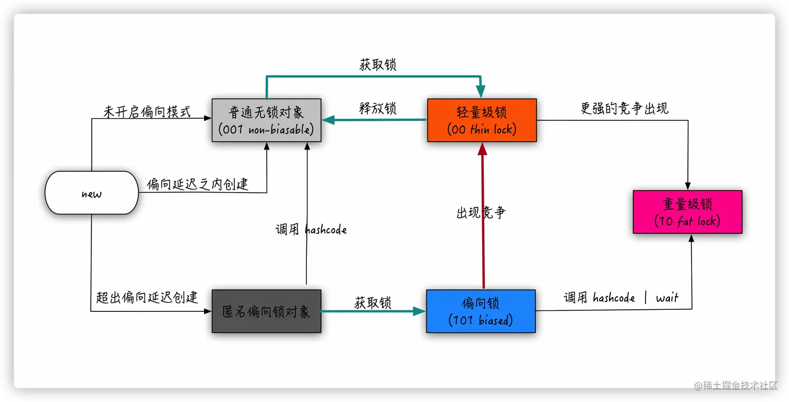

****
### 12.2.5 偏向撤销

在记录前需要明确一个概念：偏向锁撤销和偏向锁释放是两码事。

1. 撤销：当多个线程竞争导致不能再使用偏向模式的时候，告知这个锁对象不能再用偏向模式
2. 释放：对应的就是 `synchronized` 方法的退出或 `synchronized` 块的结束

如果只是一个线程获取锁，再加上偏向的机制，是没有理由撤销偏向的，所以偏向的撤销只能发生在有竞争的情况下。而想要撤销偏向锁，还不能对持有偏向锁的线程有影响，所以就要等待持有偏向锁的线程到达一个 `safepoint` 安全点（这里的安全点是 JVM 为了保证在垃圾回收的过程中引用关系不会发生变化设置的一种安全状态，在这个状态上会暂停所有线程工作）， 在这个安全点会挂起获得偏向锁的线程。但在这个安全点，线程可能还是处在不同状态的：

1. 线程不存活或者活着的线程但退出了同步块，那就直接撤销偏向就好了
2. 活着的线程但仍在同步块之内，那就要升级成轻量级锁

****
# 13. synchronized 实现原理

## 13.1 同步代码块

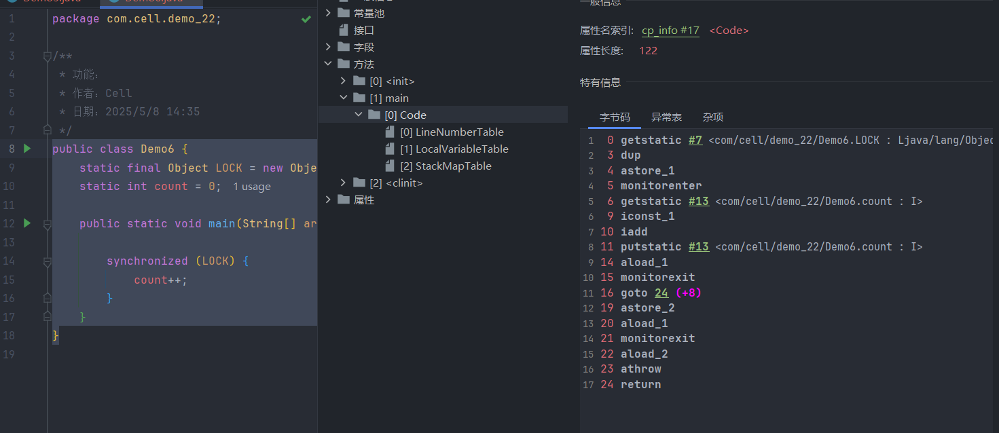

```java
monitorenter   // 尝试获取对象锁（Monitor）
...
monitorexit    // 释放锁，每次释放，锁的重入次数 -1
monitorexit    // 异常处理块中释放锁，当重入次数降为 0，彻底释放锁，Owner = null
```

1、当某个线程第一次执行 `synchronized(obj)` 时，编译器在字节码中插入 `monitorenter` 和 `monitorexit`

2、执行 `monitorenter` 的时候线程尝试通过对象头中的 Mark Word 来加锁，如果是偏向锁、轻量级锁情况，会尝试直接 CAS 修改 Mark Word

3、如果尝试失败或锁直接升级为重量级锁（如多线程竞争），JVM 就会执行 Monitor 绑定操作，此时，锁对象会与一个 Monitor 对象关联起来，对象头（Mark Word）会被修改为指向这个 Monitor 对象的地址，然后 Monitor 中会设置：[1. 结构](多线程.md#1.%20结构)

****
## 13.2 同步方法

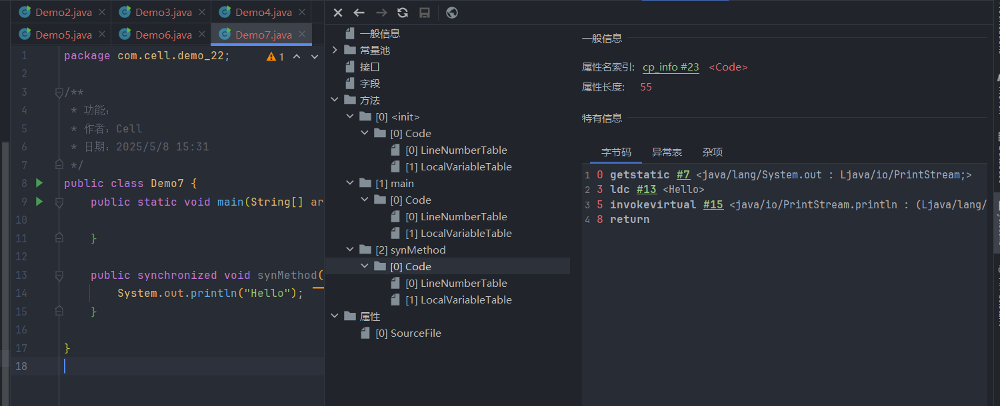

>对于 `synchronized` 方法，并不是依靠 monitorenter 和 monitorexit 指令实现的，被 javap 反汇编后可以看到，`synchronized` 方法和普通方法大部分是一样的，不同在于，这个方法会有一个叫作 ACC_SYNCHRONIZED 的 flag 修饰符，代表需要 Monitor 支持（指明该方法是一个同步方法）。JVM 通过该 `ACC_SYNCHRONIZED` 访问标志来辨别一个方法是否声明为同步方法，从而执行相应的同步调用。如果是实例方法，JVM 会尝试获取实例对象的锁；如果是静态方法，JVM 会尝试获取当前 class 的锁。

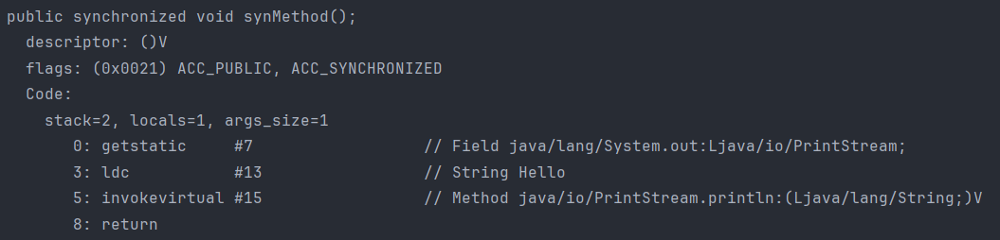

****
## 13.3 总结

>不管是同步代码块还是同步方法，`synchronized` 的底层都依赖 Monitor 机制来实现同步，而真实的锁对象实际是 JVM 中的 ObjectMonitor 对象，但只有在锁升级为重量级锁时才会真正创建 ObjectMonitor 对象，在偏向锁、轻量级锁阶段，并不会创建真正的 ObjectMonitor 实例对象，而是通过对象头 + 栈帧 Lock Record 来“模拟锁状态”，当线程竞争激烈时，锁会升级成重量级锁，此时才会真实的创建 ObjectMonitor 对象。

****
# 14. 死锁

>死锁是指两个或两个以上的进程（线程）在执行过程中，由于竞争资源或者由于彼此通信而造成的一种阻塞的现象，若无外力作用，它们都将无法推进下去。此时称系统处于死锁状态或系统产生了死锁，这些永远在互相等待的进程（线程）称为死锁进程（线程）。

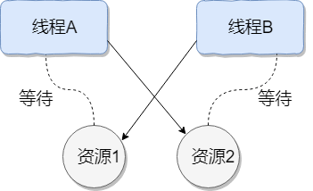

## 14.1 死锁产生的四个必要条件

1、互斥条件：线程对资源的访问是互斥的，一次只有一个线程能使用

互斥虽然是必要的（保证线程安全），但它也是造成死锁的“入口条件”，如果多个线程都对某些资源互斥地访问，就可能形成资源竞争。

2、占有且等待：一个线程已经持有了某些资源（如锁），在不释放这些资源的前提下，继续请求其他资源，而这些资源可能正被其他线程所持有。由于无法立即获得这些新资源，线程就进入了阻塞等待状态

```
线程 A ——持有——> R1 ——等待——> R2  
线程 B ——持有——> R2 ——等待——> R1  
```

只有当线程允许持有已有资源的同时继续申请新资源时，死锁的环路链才可能形成

```java
private static final Object lockA = new Object();  
private static final Object lockB = new Object();  
  
public static void main(String[] args) {  
    Thread t1 = new Thread(() -> {  
        synchronized (lockA) {  
            System.out.println("Thread-1 got lockA");  
            try {  
                Thread.sleep(100);  
            } catch (InterruptedException e) {  
            }            synchronized (lockB) {  
                System.out.println("Thread-1 got lockB");  
            }  
        }  
    });  
  
    Thread t2 = new Thread(() -> {  
        synchronized (lockB) {  
            System.out.println("Thread-2 got lockB");  
            try {  
                Thread.sleep(100);  
            } catch (InterruptedException e) {  
            }            synchronized (lockA) {  
                System.out.println("Thread-2 got lockA");  
            }  
        }  
    });  
    t1.start();  
    t2.start();
}
```

t1 线程占有锁 A 后仍然想要占有锁 B ，但此时 t2 线程已经占有了锁 B 并且也想占用锁 A ，此时这两个线程都在等待对方释放资源

3、不可剥夺：已获得的资源不能被强制剥夺，只能由线程自行释放

如果系统允许强制剥夺资源就可以打破等待链，但实际上 A 等待 B 持有的资源，A 等待 B 持有的资源，而双方都不释放手中的资源


4、循环等待：存在一个线程资源等待环：线程 A 等待线程 B 的资源，线程 B 又等待线程 C 的资源……最终又等待线程 A 的资源

****
## 14.2 死锁预防

>死锁预防是在程序设计或资源分配阶段就彻底阻止死锁发生，通过破坏死锁产生的四个必要条件之一或多个，来确保系统永远不会进入死锁状态

1、破坏占有且等待条件

线程在执行前，一次性申请所有它需要的资源，若不能全部获取到，则不获得任何资源，而是等待重新请求，保证不会处于占有且等待的状态，但可能导致线程等待大量资源，增加系统的资源竞争，降低资源利用率

2、破坏循环等待条件

规定所有资源都有一个固定的顺序，所有线程必须按照顺序申请资源。

3、破坏不可剥夺条件

如果一个线程请求的资源无法满足，则强制回收它已经持有的资源，并将其放入可用资源池中，由其他线程使用


****
# 15. 可重入锁

>可重入锁是一种线程在获取锁之后可以重复获取该锁而不会被阻塞的锁

## 15.1 synchronized 的可重入性

```java
public synchronized void method1() {
    System.out.println("method1");
    method2();  // 这里会再次尝试获取锁
}

public synchronized void method2() {
    System.out.println("method2");
}
```

>同一时间只能有一个线程进入这个对象的 `synchronized` 实例方法，如果另一个线程想要进入这个对象的任何一个 `synchronized` 实例方法（不管是 `method1()` 还是 `method2()`），都必须等待。
>
>当一个线程再次调用另一个 `synchronized` 方法时需要“再次获取锁”，但 JVM 发现持有锁的线程就是自己，于是允许进入，这就是可重入锁的特性。
>
>它使用了对象头中的 Mark Word 来记录锁的拥有者（线程）和重入次数，如果同一线程再次获取锁，JVM 只是将重入计数器 +1，并不会阻塞，所以这也叫隐式可重入性。

****
## 15.2 ReentrantLock 显示锁

```java
ReentrantLock lock = new ReentrantLock();

lock.lock();   // 获取锁
try {
    // 临界区
} finally {
    lock.unlock(); // 释放锁
}
```

>`ReentrantLock` 内部维护了一个 `state` 状态变量， 当某一线程获取锁后，将 `state` 值 +1，并记录下当前持有锁的线程，再有线程来获取锁时，判断这个线程与持有锁的线程是否是同一个线程，如果是，将 `state` 值再 +1，如果不是，阻塞线程。 当线程释放锁时，将 `state` 值 -1，当 `state` 值减为 0 时，表示当前线程彻底释放了锁，然后将记录当前持有锁的线程的那个字段设置为 null，并唤醒其他线程，使其重新竞争锁。

```java
ReentrantLock lock = new ReentrantLock();  
  
new Thread(new Runnable() {  
    @Override  
    public void run() {  
        try {  
            lock.lock();  
            System.out.println("第1次获取锁，这个锁是：" + lock);  
  
            int index = 1;  
            while (true) {  
                try {  
                    lock.lock();  
                    System.out.println("第" + (++index) + "次获取锁，这个锁是：" + lock);  
                    try {  
                        Thread.sleep(1000);  
                    } catch (InterruptedException e) {  
                        e.printStackTrace();  
                    }  
  
                    if (index == 5) {  
                        break;  
                    }  
                } finally {  
                    lock.unlock();  
                }  
  
            }  
  
        } finally {  
            lock.unlock();  
        }  
    }  
}).start();
```

```
第1次获取锁，这个锁是：java.util.concurrent.locks.ReentrantLock@7f70f450[Locked by thread Thread-0]
第2次获取锁，这个锁是：java.util.concurrent.locks.ReentrantLock@7f70f450[Locked by thread Thread-0]
第3次获取锁，这个锁是：java.util.concurrent.locks.ReentrantLock@7f70f450[Locked by thread Thread-0]
第4次获取锁，这个锁是：java.util.concurrent.locks.ReentrantLock@7f70f450[Locked by thread Thread-0]
第5次获取锁，这个锁是：java.util.concurrent.locks.ReentrantLock@7f70f450[Locked by thread Thread-0]
```

>ReentrantLock 和 synchronized 还不一样，ReentrantLock需要手动释放锁，所以使用 ReentrantLock 的时候一定要手动释放锁，并且加锁次数和释放次数要一样，最好在 finally 中jin'x进行锁释放

****

## 15.3 公平锁与非公平锁

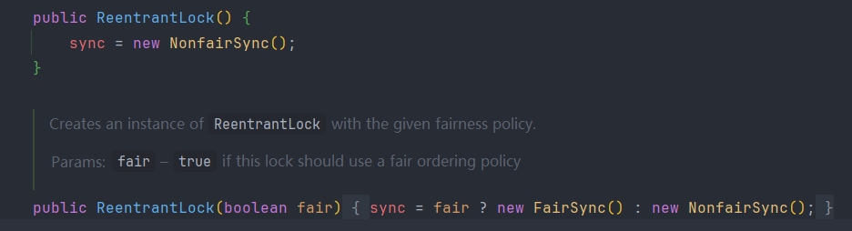

>ReentrantLock 有两个构造函数，无参构造默认使用非公平锁（NonfairSync），有参构造通过 fair 参数指定使用公平锁（FairSync）还是非公平锁（NonfairSync）

**公平锁**

>按照线程请求锁的时间顺序来分配锁，谁先来谁先获得，后来的线程会在等待队列末尾排队；

**非公平锁**

>请求锁的线程可能插队，即使其他线程在等待也可能直接获得锁

```java
static class Worker extends Thread {  
    private ReentrantLock lock;  
  
    public Worker(ReentrantLock lock, String name) {  
        super(name);  
        this.lock = lock;  
    }  
  
    @Override  
    public void run() {  
        for (int i = 0; i < 2; i++) {  
            lock.lock();  
            try {  
                System.out.println(getName() + " 获得锁");  
                Thread.sleep(1000);  
            } catch (InterruptedException e) {  
                e.printStackTrace();  
            } finally {  
                lock.unlock();  
            }  
        }  
    }  
}  
  
public static void main(String[] args) {  
    // 换成 true 看公平锁效果  
    ReentrantLock lock = new ReentrantLock(false); // 非公平锁  
  
    for (int i = 0; i < 3; i++) {  
        new Worker(lock, "线程-" + i).start();  
    }  
}
```

```
线程-1 获得锁
线程-1 获得锁
线程-0 获得锁
线程-2 获得锁
线程-2 获得锁
线程-0 获得锁
```

>此时使用的是非公平锁，最先启动的线程是线程-0，但是第一个抢占到锁的确是线程-1，并且线程-1 还连续抢占到两次

```
线程-0 获得锁
线程-1 获得锁
线程-2 获得锁
线程-0 获得锁
线程-1 获得锁
线程-2 获得锁
```

>当使用公平锁后，主线程会依次创建三个线程 0 1 2，根据创建顺序，它们依次获得锁，走完第一轮 for 循环并释放锁时，下一个线程会获取到锁，而不是继续等 for 循环执行完，等所有线程执行完第一轮 for 循环后继续根据创建顺序执行第二轮...

>公平锁保证顺序但性能低，非公平锁允许插队但吞吐高（可能下一个抢占到锁的还是当前线程，就不需要切换线程，减少了开销），默认非公平，适合大多数业务

****

# 16. 线程池

>线程池是 Java 中一种线程复用机制，它会预先创建一定数量的线程并将任务提交给线程池执行，以此避免频繁创建/销毁线程的性能开销，线程池=线程的“容器”，用来高效执行大量并发任务

```java
public ThreadPoolExecutor(
	int corePoolSize, // 核心线程数
	int maximumPoolSize, // 最大线程数
	long keepAliveTime, //  线程池中非核心线程空闲的存活时间大小
	TimeUnit unit, // 线程空闲存活时间单位
    BlockingQueue<Runnable> workQueue, // 存放任务的阻塞队列
    ThreadFactory threadFactory, // 线程工厂（可定制线程名称等）
    RejectedExecutionHandler handler // 拒绝策略
) 
```

****

## 16.1 任务执行过程

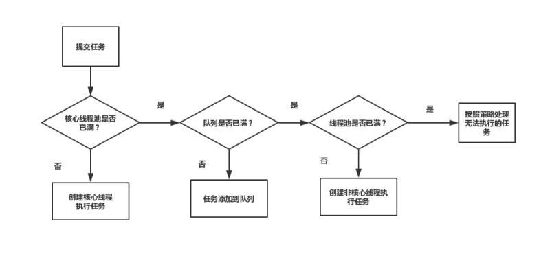

1、核心线程未满，创建新线程处理任务

>如果当前线程池中的线程数（`poolSize`）**小于 `corePoolSize`**，线程池会直接创建一个核心线程来处理这个任务

2、核心线程已满，任务进队列等待

>如果当前线程数已经达到 `corePoolSize`，则任务会被放入任务队列（`BlockingQueue`）中等待执行，线程池不会立刻创建新线程，而是等已有线程空闲下来后从队列中取任务执行

3、核心线程已满、等待队列也满，就尝试创建非核心线程

>如果任务队列也已满（即不能再加入新任务），并且线程池中的线程数还小于 `maximumPoolSize`，这时候线程池会尝试创建一个非核心线程（maximumPoolSize 范围内）来处理该任务

4、线程数达到最大值并且队列已满，执行拒绝策略

>如果线程池中的线程数已经达到了 `maximumPoolSize`，并且任务队列也已经满了，那么新的任务就无法被接受，线程池会执行拒绝策略（`RejectedExecutionHandler`）

**常见的拒绝策略包括：**

| 策略                  | 类名                                       | 行为                 |
| ------------------- | ---------------------------------------- | ------------------ |
| AbortPolicy（默认）     | `ThreadPoolExecutor.AbortPolicy`         | 抛出异常（默认的）          |
| CallerRunsPolicy    | `ThreadPoolExecutor.CallerRunsPolicy`    | 由提交任务的线程执行该任务      |
| DiscardPolicy       | `ThreadPoolExecutor.DiscardPolicy`       | 直接丢弃任务             |
| DiscardOldestPolicy | `ThreadPoolExecutor.DiscardOldestPolicy` | 丢弃队列中最老的任务，尝试提交新任务 |

```java
public static void main(String[] args) {  
    // 创建一个线程池，核心线程数为2，最大线程数为4，队列大小为2  
    ThreadPoolExecutor executor = new ThreadPoolExecutor(  
            2, // 核心线程数  
            4, // 最大线程数  
            60, TimeUnit.SECONDS, // 空闲线程存活时间  
            new ArrayBlockingQueue<>(2), // 有界任务队列，最多放2个等待的任务  
            Executors.defaultThreadFactory(), // 默认线程工厂  
            new ThreadPoolExecutor.AbortPolicy() // 拒绝策略：满了就抛异常  
    );  
  
    // 提交6个任务给线程池执行  
    for (int i = 1; i <= 6; i++) {  
        int taskId = i;  
        executor.execute(() -> {  
            System.out.println("任务 " + taskId + " 由线程 " + Thread.currentThread().getName() + " 执行");  
            try {  
                Thread.sleep(1000); // 模拟任务执行耗时  
            } catch (InterruptedException e) {  
                e.printStackTrace();  
            }  
        });  
    }  
  
    // 关闭线程池（等待所有任务执行完再退出）  
    executor.shutdown();  
}
```

```
任务 6 由线程 pool-1-thread-4 执行
任务 2 由线程 pool-1-thread-2 执行
任务 1 由线程 pool-1-thread-1 执行
任务 5 由线程 pool-1-thread-3 执行
任务 3 由线程 pool-1-thread-1 执行
任务 4 由线程 pool-1-thread-3 执行
```

**线程池中任务执行顺序的本质：**

>核心线程的执行顺序是无序的，提交顺序 != 执行顺序，哪个核心线程先抢到任务，谁就先执行它。

>等待队列是否有序取决于使用的队列类型，只要用的是 FIFO 队列，那么任务出队顺序就是有序的，但执行顺序还是取决于线程调度

| 队列类型             | 类名                      | 是否有序 | 说明                |
| ---------------- | ----------------------- | ---- | ----------------- |
| FIFO 队列          | `LinkedBlockingQueue`   | 有序   | 按任务提交顺序排队         |
| 有界 FIFO          | `ArrayBlockingQueue`    | 有序   | 也是先进先出            |
| 优先级队列            | `PriorityBlockingQueue` | 无序   | 根据任务优先级排序，不保证提交顺序 |
| SynchronousQueue |                         | 无队列  | 任务必须直接交给线程处理，无法排队 |

>当核心线程数已满且任务队列也满了，现在来了一个新任务，这时线程池还没达到最大线程数，那么新任务会被新线程直接执行，队列中的旧任务继续排队，等待被已有线程取出执行

****
