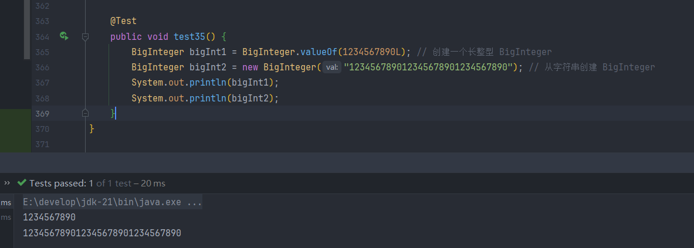
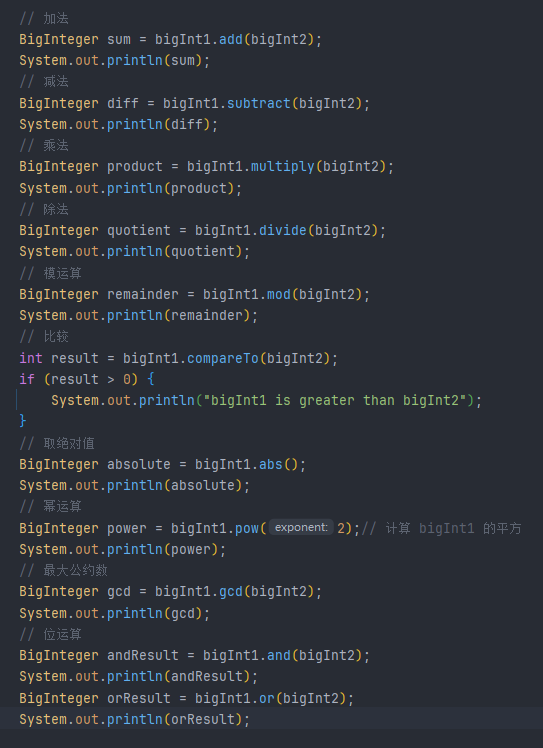
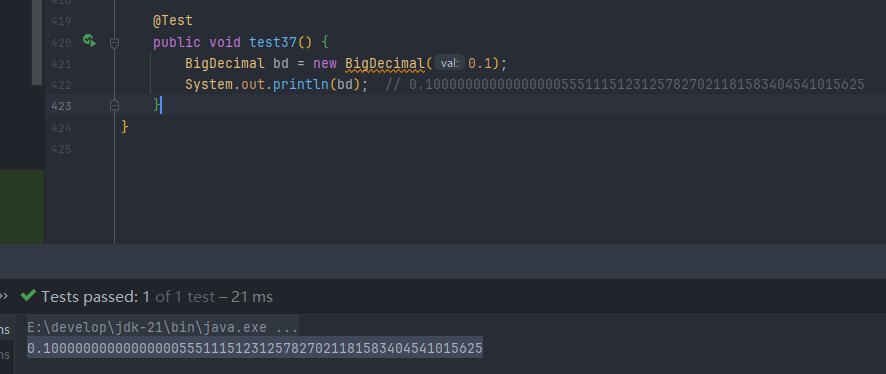

## 1. BigInteger

>`BigInteger` 类用于表示任意精度的整数（整数大小超出 `long` 类型的范围）

### 1.1 特点

> **无限精度**：`BigInteger` 的精度仅受到计算机内存的限制，它可以表示非常大的整数（超过 `long` 类型的最大值）。

> **不可变性**：与 `String` 和 `Integer` 类似，`BigInteger` 是不可变的。一旦创建，就无法修改它的值。任何改变都会返回一个新的 `BigInteger` 对象。

>**常用操作**：`BigInteger` 提供了许多数学操作，如加、减、乘、除、模、取整等，且支持大数的位运算和对数运算。

****
### 1.2 常用方法

****
## 2. BigDecimal

>表示任意精度的浮点数，并且具有极高的精度，特别适用于需要高精度计算的场景（例如金融计算）

### 2.1 特点

>**任意精度**：`BigDecimal` 的精度仅受到内存限制，它可以表示具有非常高精度的小数（例如，很多位的浮点数），所以它不会像 `double` 一样出现 `0.1 + 0.2  != 0.3` 的情况

>**不可变性**：与 `BigInteger` 类似，`BigDecimal` 是不可变的，任何对 `BigDecimal` 对象的操作都会返回一个新的对象

>**精度控制**：`BigDecimal` 提供了控制数值精度和舍入模式的功能，可以非常精确地控制小数点后的位数和舍入方式

>需要注意的是，使用 `double` 或 `float` 可能会产生精度误差，因为使用 `BigDecimal` 保存的实际上是 `double` 类型的二进制表示，并不是真实的 `"0.1"`，所以更推荐使用自带的 `valueOf`

****

## 3. 数字格式化

