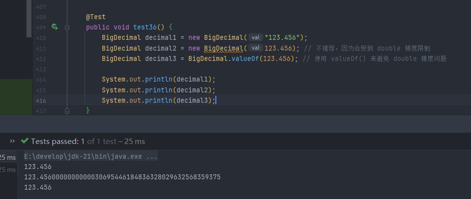

## 1. BigInteger

>`BigInteger` 类用于表示任意精度的整数（整数大小超出 `long` 类型的范围）

### 1.1 特点

> **无限精度**：`BigInteger` 的精度仅受到计算机内存的限制，它可以表示非常大的整数（超过 `long` 类型的最大值）。

> **不可变性**：与 `String` 和 `Integer` 类似，`BigInteger` 是不可变的。一旦创建，就无法修改它的值。任何改变都会返回一个新的 `BigInteger` 对象。

>**常用操作**：`BigInteger` 提供了许多数学操作，如加、减、乘、除、模、取整等，且支持大数的位运算和对数运算。

****
### 1.2 常用方法

****
## 2. BigDecimal

>表示任意精度的浮点数，并且具有极高的精度，特别适用于需要高精度计算的场景（例如金融计算）

### 2.1 特点

>**任意精度**：`BigDecimal` 的精度仅受到内存限制，它可以表示具有非常高精度的小数（例如，很多位的浮点数），所以它不会像 `double` 一样出现 `0.1 + 0.2  != 0.3` 的情况

>**不可变性**：与 `BigInteger` 类似，`BigDecimal` 是不可变的，任何对 `BigDecimal` 对象的操作都会返回一个新的对象

>**精度控制**：`BigDecimal` 提供了控制数值精度和舍入模式的功能，可以非常精确地控制小数点后的位数和舍入方式

>需要注意的是，使用 `double` 或 `float` 可能会产生精度误差，因为使用 `BigDecimal` 保存的实际上是 `double` 类型的二进制表示，并不是真实的 `"0.1"`，所以更推荐使用自带的 `valueOf`

****

## 3. 数字格式化

>`DecimalFormat` 用于将数字转换为格式化的字符串，通过一个格式字符串来控制输出内容的格式

| 字符  | 含义          | 示例                                     |
| --- | ----------- | -------------------------------------- |
| `0` | 必须有数字（不足补0） | `"000.00"`，格式化 `1.2` → `001.20`        |
| `#` | 有数字才显示，无则省略 | `"###.##"`，格式化 `1.2` → `1.2`，`0` → 空   |
| `.` | 小数点         | 控制小数位数                                 |
| `,` | 千位分隔符       | `"#,###"`，格式化 `1234567` → `1,234,567`  |
| `%` | 乘以 100 加百分号 | `"0.00%"`，格式化 `0.1234` → `12.34%`      |
| `¤` | 货币符号        | `"¤#,##0.00"` → ￥1,234.56（随 Locale 变化） |
| `E` | 科学计数法       | `"0.00E0"` → `1.23E3`                  |

**固定小数位数**

**千分位格式化**

**科学计数法**

**百分比**

**货币格式**

****
## 4. 反格式化

>反格式化就是把格式化后变成字符串的数字重新转换成原本的类型，获取到 `Number` 类型的对象后再进行一次封装，封装成对应的类型

>虽然通过 `sout` 输出的对象依然是字符串类型的，但是这只是单纯的打印对象，它在底层调用了 `toString` 方法，本质上还是一个数字，可以参与运算