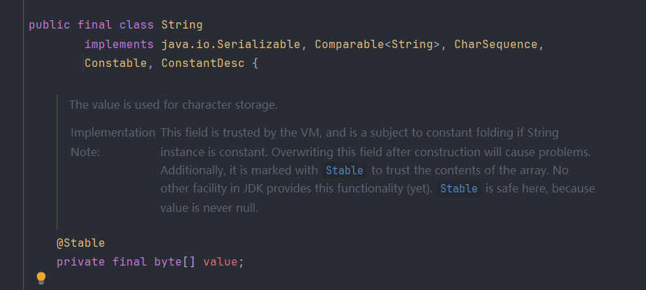

## 1. String类

>String 类代表字符串，Java 程序中的所有字符串字面值（如 "abc" ）都作为此类的实例实现，字符串是常量，它们的值在创建之后不能更改

****
## 2. String的不可变性

>`String` 对象一旦被创建，其内容是不可更改的，就算修改了字符串的值，实际上也是创建了一个新的对象，原对象保持不变，而接收变量的那个引用指向新的对象



>String类是被final修饰的，它不允许被继承，其次`String` 类内部定义了一个用来存储字符串内容的字节数组（在 Java 9 之后为 `byte[]`，在此之前为 `char[]`），该数组被 `private` 和 `final` 修饰，`final` 关键字保证了数组引用在对象创建后不可更改，也就是说它始终指向同一个数组，无法重新赋值，`private` 关键字限制了对数组的直接访问，防止外部程序绕过方法直接修改内容，所以对字符串进行修改操作（如拼接、截取等）时，实际上都会创建一个新的 `String` 对象，而不是在原对象上进行更改

****
## 3. 创建字符串的两种方式

### 3.1 字面量方式创建

```java
String str1 = "hello";
```

>Java 提供了一个字符串常量池（String Constant Pool），当使用双引号创建字符串时 JVM 会先在字符串常量池中查找是否已经存在相同内容的字符串对象，如果存在就直接返回引用，不存在就创建一个新的对象放进去

```java
String str1 = "abc";
String str2 = "abc";
System.out.println(str1 == str2); // true，两个变量引用的是常量池中的同一个对象
```

****
### 3.2 new 方式创建

```java
String str3 = new String("hello");
```

>这种方式会在堆内存中创建一个新的字符串对象，即使常量池中已经有相同内容的字符串，`new` 也会强制创建一个新的实例，此时常量池中就会存在两个相同的字符串，  
>如果常量池中没有，那就在常量池中创建一个，然后再到堆中创建一个 `String` 对象指向常量池中的字符串常量

```java
String str1 = "abc";
String str2 = new String("abc");
System.out.println(str1 == str2); // false，引用地址不同
```