## 1.什么是异常

>Java程序执行过程中出现的意外、错误以及不正常的情况都是异常，而Java 提供了一整套的异常处理机制来保证程序出现错误时不会立即崩溃

**异常是对象的本质**

>Java 中的异常本质上就是一种对象，它是 Java 面向对象机制的一部分，异常对象封装了程序在运行过程中发生错误时的具体信息，例如错误的类型、发生的位置、调用栈等  
>定义一个异常实际上就是在定义一个类，如果发生异常需要通过这个异常类来创建对象，通过对象来封装错误信息和传播错误状态

****

## 2.异常的继承结构


>Java 的异常结构由 Throwable根类延伸出两大分支 Error和Exception，再进一步细化为受检与非受检异常

****
### 2.1 error和exception

>它们都继承自同一个父类，并且在语法上都能被`try-catch` 捕获

**error**

>表示程序运行时发生的严重错误，这类问题通常是 JVM 自身的错误，程序无法恢复或不应试图恢复，编译器不强制处理

**常见错误类**

```
OutOfMemoryError      内存溢出

StackOverflowError    方法递归太深，栈溢出

VirtualMachineError   虚拟机异常

InternalError         JVM 内部错误
```

****

**exception**

>表示程序运行时可预见的、可以处理的问题，例如文件不存在、网络连接失败、空指针等，通常可以通过抛出或捕获异常解决，并且编译器强制要求

#### 2.1.1 受检异常和非受检异常

**受检异常**

>又叫编译时异常，通常用于外部不可控的错误，比如文件、网络、数据库等，它直接继承Exception类，如果不进行处理会导致编译无法通过

**常见受检异常类**

```
IOException               文件读写失败
SQLException              数据库异常
ClassNotFoundException    找不到类
ParseException            日期或格式转换错误
```

****

**非受检异常**

>又称作运行时异常，通常是程序员的逻辑错误或非法输入导致，编译器不强制处理，有时报错也能编译

**常见非受检异常类**

```
NullPointerException              空指针引用
ArithmeticException               除以零等算术错误
ArrayIndexOutOfBoundsException    数组越界
IllegalArgumentException          非法参数
ClassCastException                类型转换错误
```

****

**所有的异常都在运行阶段发生**

>因为异常的特性，想要创建一个异常对象就必须new出来，所以异常的发生一定是在程序运行阶段，但是否必须处理异常是在编译阶段决定的，对于受检异常，编译器在编译时会检查你是否使用了 `try-catch` 或 `throws` 来处理，如果没有处理异常，程序在编译阶段就会报错，无法生成 `.class` 文件，所以它才被称为编译时异常，而并不是真的在编译阶段才发生

****

## 3.异常的发生

>程序运行过程中出现错误或异常情况，JVM 会在某一行代码执行时，自动创建一个异常对象，然后通过“抛出（throw）”这个对象，触发异常处理机制

```java
public class Demo {
    public static void main(String[] args) {
        int result = divide(10, 0);
        System.out.println("结果是：" + result);
    }

    public static int divide(int a, int b) {
        return a / b;
    }
}
```

**执行流程**

>1. 调用 `main` 方法
>2. `main` 方法调用 `divide(10, 0)`
>3. 进入 `divide` 方法，执行 `10 / 0`
>4. JVM 发现非法运算，自动创建 `ArithmeticException` 异常对象
>5. 异常对象被 `throw` 出去
>6. 方法没有 `try-catch` 处理异常，异常向上传递
>7. main` 方法也没有处理 → 最终由 JVM 捕获，打印异常信息，程序终止

**代码模拟**


****

## 4.自定义异常

>Java 提供了很多内置异常类，比如 `NullPointerException`、`IOException` 等，但在实际开发中有时会遇到不适合用现有异常描述的业务错误，此时就可以定义自己的异常类来明确地表达业务逻辑错误

### 4.1自定义异常的分类

**继承Exception**

>调用方法时必须使用 `try-catch` 或 `throws` 处理

**继承RuntimeException**

>调用方法时不强制处理，可选择性捕获

****

### 4.2创建步骤

**1、** 继承一个异常类

**2、** 定义构造方法

>提供一个无参构造器，一个有参构造器

**3、** 在对应的方法里使用自定义的异常

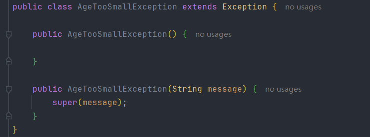

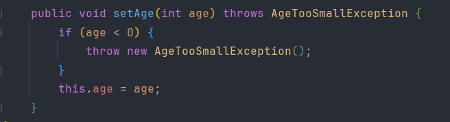

****

## 5.throws

>`throws` 是 Java 中用来声明一个方法可能会抛出哪些异常的关键字，将异常继续往上抛出，不在当前方法中处理

>可以理解为我不知道怎么处理异常，我把这个问题丢给我的调用者来处理，直到有人处理为止，当main方法也继续抛出异常时，JVM就会停止运行，打印异常信息

```java
public void readFile() throws FileNotFoundException {
    FileReader fr = new FileReader("abc.txt");
}

public void doSomething() throws FileNotFoundException {
    readFile(); // 没处理，再往上抛
}

public static void main(String[] args) {
    try {
        new Main().doSomething();
    } catch (FileNotFoundException e) {
        System.out.println("文件没找到：" + e.getMessage());
    }
}
```

>使用 `throws` 可以将异常交由更上层处理，适合底层方法不清楚具体业务逻辑的情况，是一种职责分离的设计方式，但一定要确保最终有一层来负责处理，否则程序就会异常终止

****

## 6.try-catch

>捕获并处理运行时可能出现的异常，防止程序异常崩溃

### 6.1执行代码

```java
try {
    // 可能出错的代码
} catch (异常类型2 变量名) {
    // 出现异常时执行的代码（处理逻辑）
} catch (异常类型2 变量名) {
	// 出现异常时执行的代码（处理逻辑）
} ...

执行顺序从上至下，异常类型从小到大（或者同级别）
```

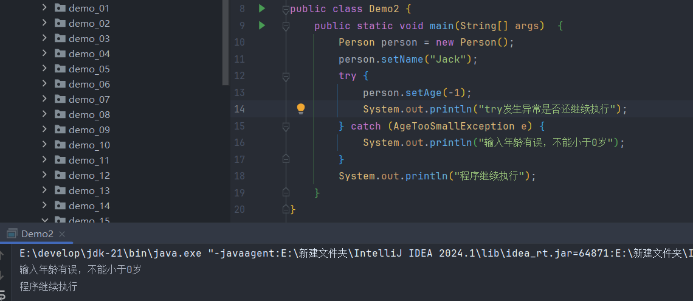

>只要 try 中代码出现异常，**立即跳转到对应的 catch 块**，后续 try 中代码不再执行，异常被 catch 后，程序就不会崩溃，而是继续向下执行

****
### 6.2异常信息打印方式

#### 6.2.1 getMessage()

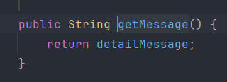

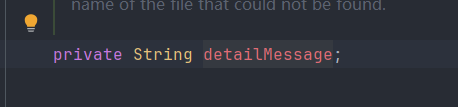

>在父类Throwable中有个getMessage()方法，里面返回了detailMessage，而这个detailMessage是作为Throwable的属性存在的，所以创建异常对象时就会把传入的信息保存在detailMessage中，通过调用该方法返回异常构造方法中的那个错误信息字符串

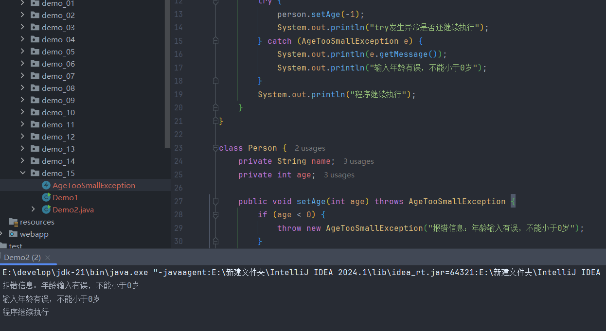

****

#### 6.2.2 toString()

>返回异常的完整类名和错误信息

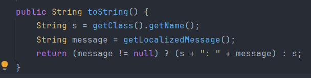

>`getClass().getName()`：获取异常的具体类型（类名）  
>`getLocalizedMessage()`：默认等价于 `getMessage()`  
>拼接得到类似 `java.lang.ExceptionType: message` 的格式

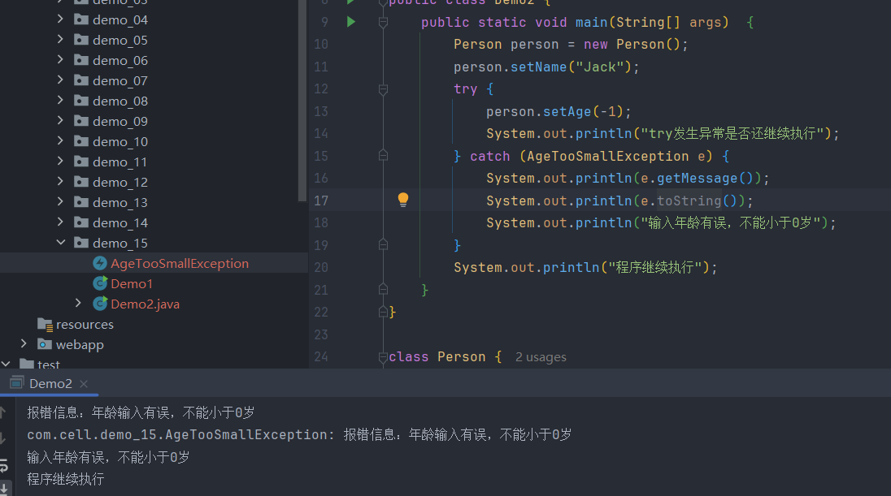

****

#### 6.2.3 printStackTrace()

>打印完整调用栈，将异常的类型、信息、调用栈路径全部打印出来，适合调试用，因为能准确知道异常在哪一行代码、调用链是什么，就跟Java自带的那些异常一样会给出报错信息

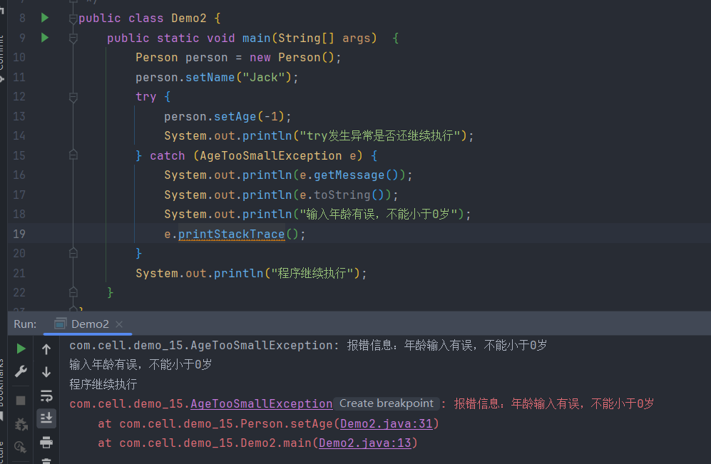

>因为这里面存储的信息是按照栈的结构来的，而方法的调用又是一层调用一层的，所以最先进栈的是main方法，它就会存在栈底，而运行到异常代码处是最后一次调用，所以它会存在栈顶，输出时就会看的比较明显，第一行就是真实出现异常的地方

****

### 6.3 Java7之后try-catch的改进

>Java7之后可以让多个异常用一个 catch 捕获，需要注意的时这些异常类不能存在父子关系

```java
try {
    // 可能抛出 IOException 或 SQLException
} catch (IOException | SQLException e) {
    e.printStackTrace();
}
```

****
## 7.异常传播机制

>当某个方法中抛出异常**但没有处理（即没有 try-catch）**，这个异常就会被**自动抛给它的调用者**，一直向上传播，直到被某一层的 `try-catch` 捕获处理，或者一直传到 `main()`，再由 JVM 处理（通常就是程序终止 + 打印错误信息）

**异常传播的两种情况**

1、 方法中不处理异常，用 `throws` 向上传递

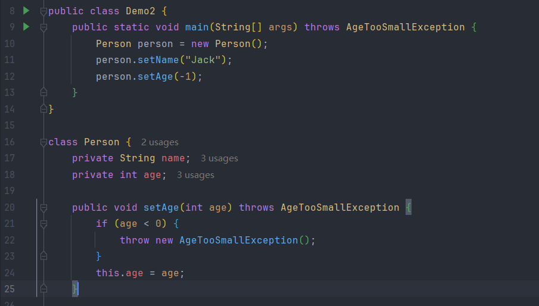

2、调用者选择自己处理或继续抛出

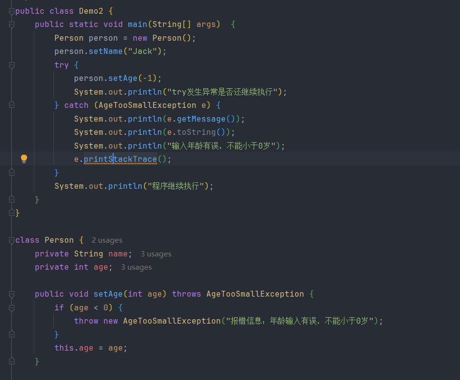

>throws表示方法不处理异常，交给调用者处理，try-catch表示方法自己处理异常，不会继续向上传播，如果一直没有方法捕获异常，最终就会由 JVM 抛出，程序终止

>如果这个异常是由调用者造成的，那就抛给调用者让他知道发生了异常需要处理，如果是程序内部的问题，就捕获它不让调用者知道

****

### 8. finally语句块

>`finally` 是异常处理结构 `try-catch-finally` 的一部分，无论是否发生异常，`finally` 中的代码都会被执行（除极少数情况），通常用于“资源释放、收尾清理”等操作，如果`finally`中发生异常，可以在里面继续写`try-catch`

```java
try {
    // 可能抛出异常的代码
} catch (ExceptionType e) {
    // 异常处理
} finally {
    // 无论是否异常，都会执行的代码
}
```

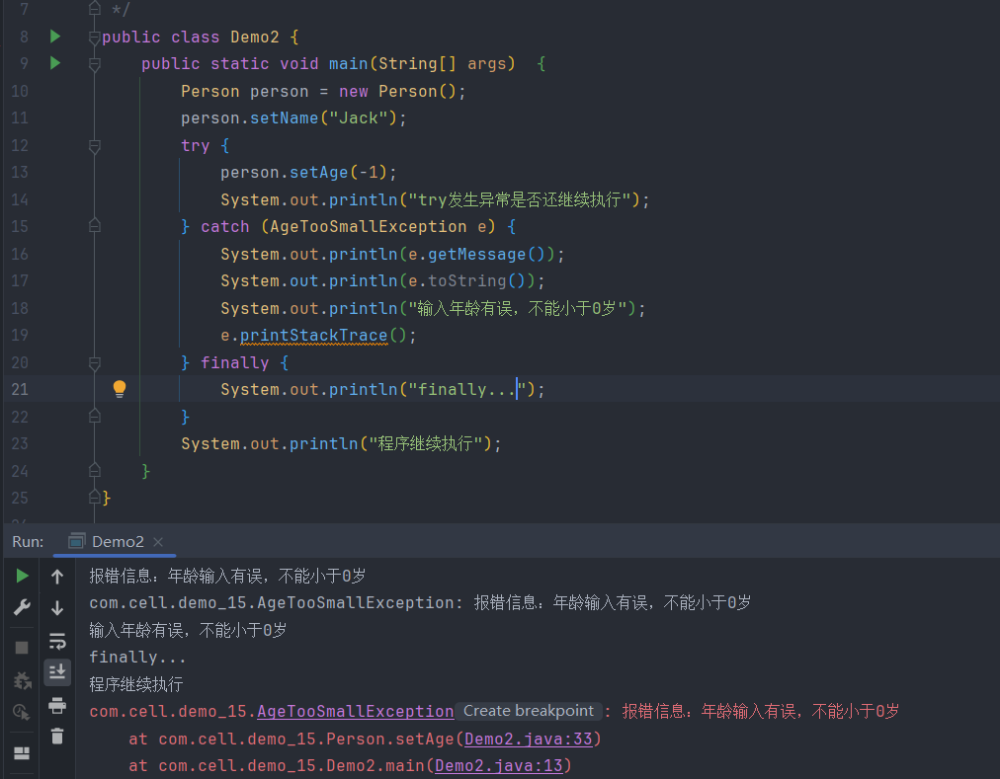

>即使在`try`或 `catch` 中提前 `return`，`finally` 依然会执行，如果`finally`也有 `return`，则会覆盖前面的return

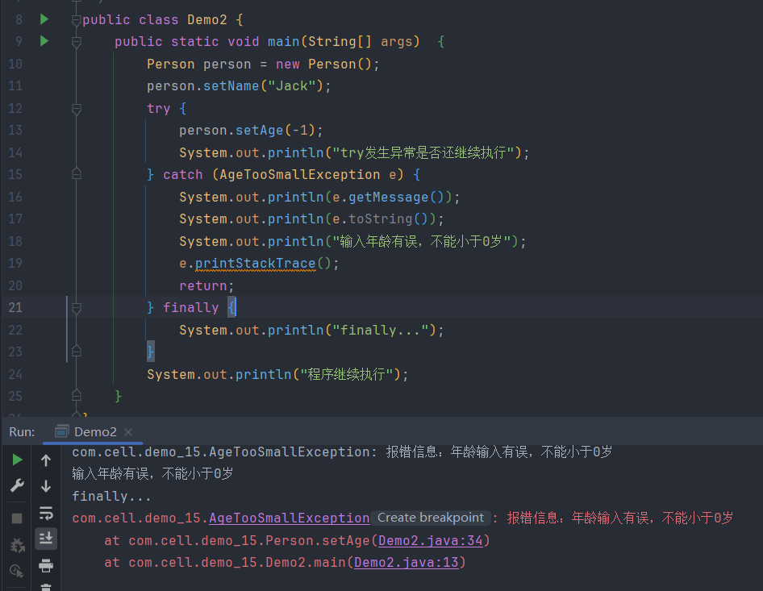

**Java7之后try-catch会自动关闭资源**

>只要资源类实现了 **`AutoCloseable` 接口**（Java 7 新接口），就可以放进 try 里，**系统会自动关闭它**，不管是否发生异常

#todo 学到IO流可深入