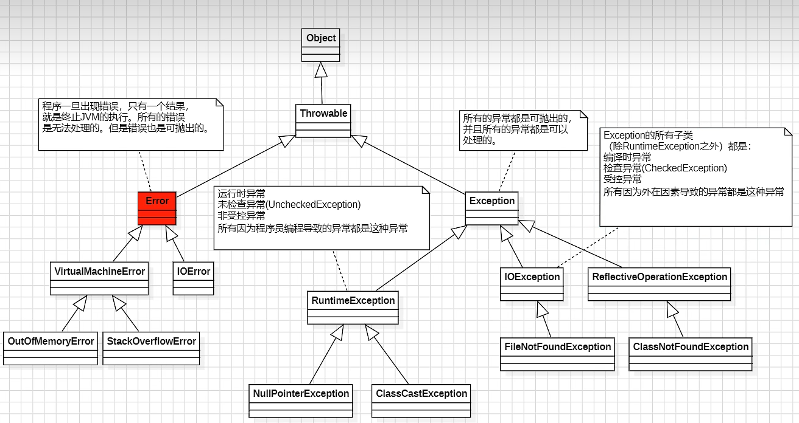
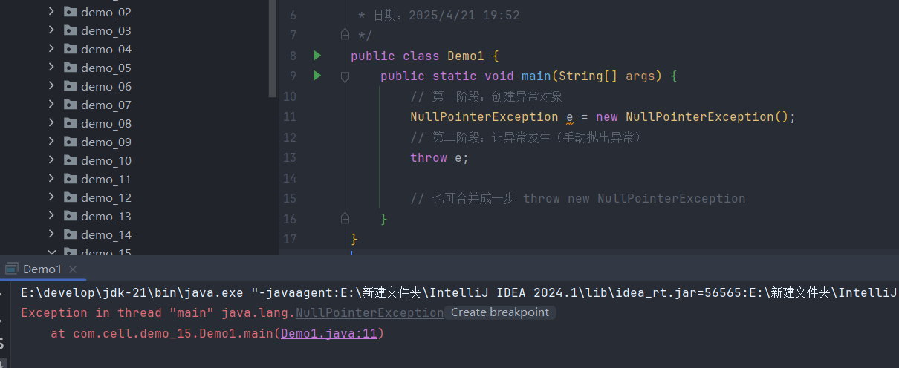

## 1.什么是异常

>Java程序执行过程中出现的意外、错误以及不正常的情况都是异常，而Java 提供了一整套的异常处理机制来保证程序出现错误时不会立即崩溃

**异常是对象的本质**

>Java 中的异常本质上就是一种对象，它是 Java 面向对象机制的一部分，异常对象封装了程序在运行过程中发生错误时的具体信息，例如错误的类型、发生的位置、调用栈等  
>定义一个异常实际上就是在定义一个类，如果发生异常需要通过这个异常类来创建对象，通过对象来封装错误信息和传播错误状态

****

## 2.异常的继承结构



>Java 的异常结构由 Throwable根类延伸出两大分支 Error和Exception，再进一步细化为受检与非受检异常

****
### 2.1 error和exception

>它们都继承自同一个父类，并且在语法上都能被`try-catch` 捕获

**error**

>表示程序运行时发生的严重错误，这类问题通常是 JVM 自身的错误，程序无法恢复或不应试图恢复，编译器不强制处理

**常见错误类**

```
OutOfMemoryError      内存溢出

StackOverflowError    方法递归太深，栈溢出

VirtualMachineError   虚拟机异常

InternalError         JVM 内部错误
```

****

**exception**

>表示程序运行时可预见的、可以处理的问题，例如文件不存在、网络连接失败、空指针等，通常可以通过抛出或捕获异常解决，并且编译器强制要求

#### 2.1.1 受检异常和非受检异常

**受检异常**

>又叫编译时异常，通常用于外部不可控的错误，比如文件、网络、数据库等，它直接继承Exception类，如果不进行处理会导致编译无法通过

**常见受检异常类**

```
IOException               文件读写失败
SQLException              数据库异常
ClassNotFoundException    找不到类
ParseException            日期或格式转换错误
```

****

**非受检异常**

>又称作运行时异常，通常是程序员的逻辑错误或非法输入导致，编译器不强制处理，有时报错也能编译

**常见非受检异常类**

```
NullPointerException              空指针引用
ArithmeticException               除以零等算术错误
ArrayIndexOutOfBoundsException    数组越界
IllegalArgumentException          非法参数
ClassCastException                类型转换错误
```

****

**所有的异常都在运行阶段发生**

>因为异常的特性，想要创建一个异常对象就必须new出来，所以异常的发生一定是在程序运行阶段，但是否必须处理异常是在编译阶段决定的，对于受检异常，编译器在编译时会检查你是否使用了 `try-catch` 或 `throws` 来处理，如果没有处理异常，程序在编译阶段就会报错，无法生成 `.class` 文件，所以它才被称为编译时异常，而并不是真的在编译阶段才发生

****

## 3.异常的发生

>程序运行过程中出现错误或异常情况，JVM 会在某一行代码执行时，自动创建一个异常对象，然后通过“抛出（throw）”这个对象，触发异常处理机制

```java
public class Demo {
    public static void main(String[] args) {
        int result = divide(10, 0);
        System.out.println("结果是：" + result);
    }

    public static int divide(int a, int b) {
        return a / b;
    }
}
```

**执行流程**

>1. 调用 `main` 方法
>2. `main` 方法调用 `divide(10, 0)`
>3. 进入 `divide` 方法，执行 `10 / 0`
>4. JVM 发现非法运算，自动创建 `ArithmeticException` 异常对象
>5. 异常对象被 `throw` 出去
>6. 方法没有 `try-catch` 处理异常，异常向上传递
>7. main` 方法也没有处理 → 最终由 JVM 捕获，打印异常信息，程序终止

**代码模拟**



****

## 4.自定义异常

>Java 提供了很多内置异常类，比如 `NullPointerException`、`IOException` 等，但在实际开发中有时会遇到不适合用现有异常描述的业务错误，此时就可以定义自己的异常类来明确地表达业务逻辑错误

### 4.1自定义异常的分类

**继承Exception**

>调用方法时必须使用 `try-catch` 或 `throws` 处理

**继承RuntimeException**

>调用方法时不强制处理，可选择性捕获