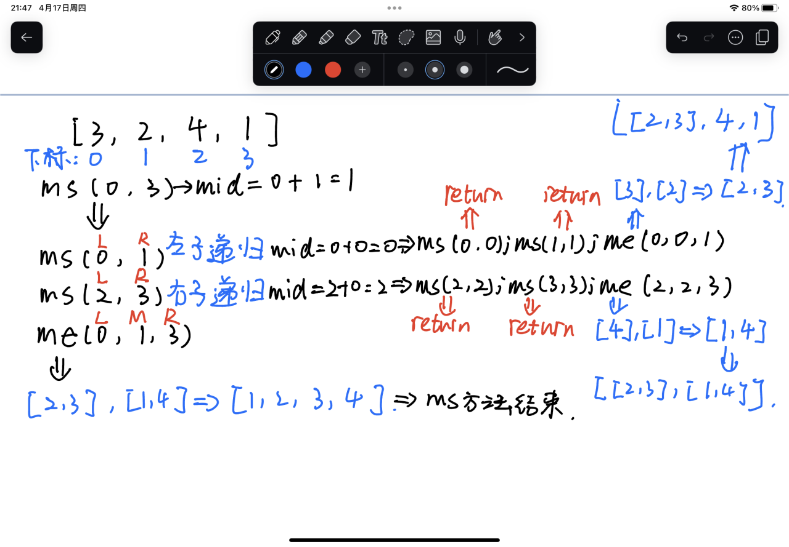
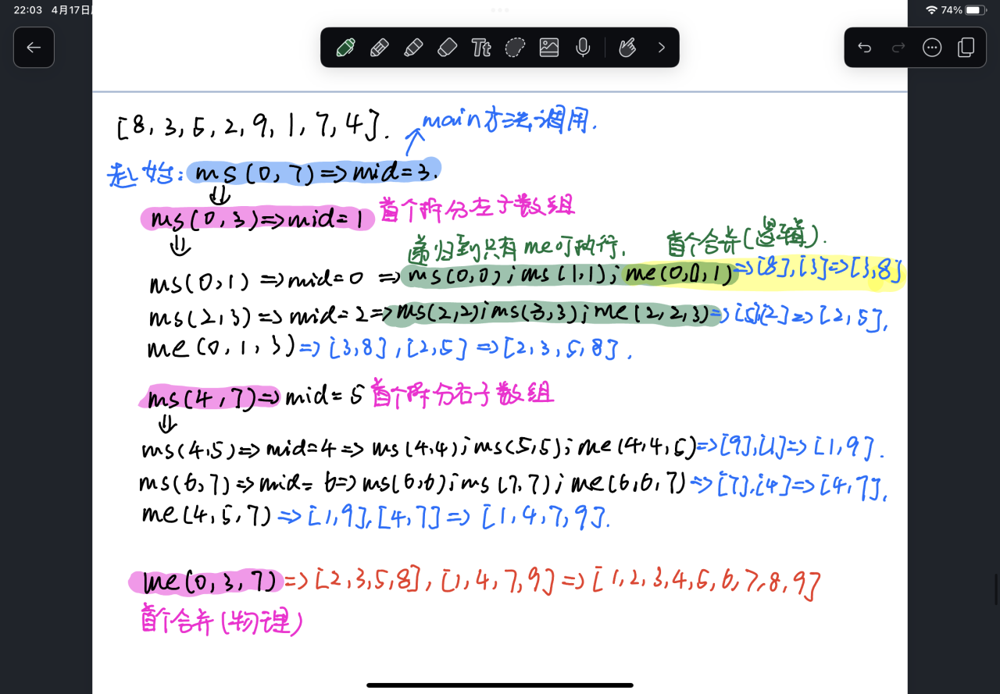

### 1.分治法

>一种解决复杂问题的算法思想，将一个大问题分解成多个小问题，将这些小问题递归地解决后再将它们的结果合并，也就是 分解 → 解决 → 合并

```
归并排序数组：[8, 3, 5, 2, 9, 1, 7, 4]

分解：
[8, 3, 5, 2, 9, 1, 7, 4]
=> [8, 3, 5, 2] | [9, 1, 7, 4]
=> [8, 3] | [5, 2] | [9, 1] | [7, 4]
=> ...

解决：
递归直到每个子数组只有一个元素

合并：
[3, 8], [2, 5], ...
最终合并为：[1, 2, 3, 4, 5, 7, 8, 9]
```

>所以快速排序也可以看作是一种分治法

### 2.归并排序

>把数组不断地“二分”直到无法再分，然后将这些“有序的小数组”逐步合并成“有序的大数组”

```
原始数组：[8, 3, 5, 2, 9, 1, 7, 4]

分解：
[8, 3, 5, 2] | [9, 1, 7, 4]
[8, 3] [5, 2] | [9, 1] [7, 4]
[8] [3] [5] [2] | [9] [1] [7] [4]

合并：
[3, 8] [2, 5] | [1, 9] [4, 7]
[2, 3, 5, 8] | [1, 4, 7, 9]
→ [1, 2, 3, 4, 5, 7, 8, 9]
```

>从两个相邻的有序子数组中选择当前最小的元素放入结果数组中，当一个子数组中元素放完了，另一个子数组可以直接接上

```java
public static void main(String[] args) {  
    int[] arr = {8, 3, 5, 2, 9, 1, 7, 4};  
    mergeSort(arr, 0, arr.length - 1);  
    System.out.println(Arrays.toString(arr));  
}  
  
public static void mergeSort(int[] arr, int left, int right) {  
    if (left >= right) return;//当左右指针指向同一个元素证明当前子数组只有一个元素并已有序，跳出递归  
    int mid = left + (right - left) / 2;//获取中间指针，用来区分左右子数组  
    mergeSort(arr, left, mid);//递归地拆分左子数组，直到每个子数组只剩一个元素  
    mergeSort(arr, mid + 1, right);//递归地拆分有子数组，直到每个子数组只剩一个元素  
    merge(arr, left, mid, right);  
    // 因为前面有两个递归地拆分，所以第一个调用的merge肯定是对两个只有一个元素的子数组进行合并，  
    // 然后依次跳出递归，合并有两个元素的子数组，合并有四个元素的子数组。。。  
}  
  
public static void merge(int[] arr, int left, int mid, int right) {  
    int[] temp = new int[right - left + 1];// 根据子数组的左右指针跨度动态定义临时数组的长度  
    int i = left, j = mid + 1;// left表示左子数组的首元素，mid+1表示有子数组的首元素，用i、j分别作为它们的数组下标  
    int k = 0;//用k记录临时数组的下标  
    while (i <= mid && j <= right) {//当左右子数组的下标小于边界范围时运行  
        if (arr[i] <= arr[j]) {  
            temp[k] = arr[i];//将子数组的最小元素放入临时数组  
            k++;//临时数组存入元素后下标后移，准备存入下一个元素  
            i++;//当前子数组的最小的元素已存入临时数组，所以下标要后移到下一个最小的元素  
        } else {  
            temp[k] = arr[j];  
            k++;  
            j++;  
        }  
    }  
    while (i <= mid) {  
        // 当左子数组的下标没超过边界值时，证明里面还有没有比较完的元素，  
        // 证明这些元素都是比右子数组大的，并且有序，所以可以直接放入临时数组中  
        temp[k] = arr[i];  
        k++;  
        i++;  
    }  
    while (j <= right) {  
        temp[k] = arr[j];  
        k++;  
        j++;  
    }  
    for (int t = 0; t < temp.length; t++) {  
        // 将排好序的临时数组放入原数组的原始位置上  
        arr[left + t] = temp[t];  
    }  
}
```





>因为归并排序的对比是带等号的，并且默认把左边的先放进临时数组，所以这个算法是稳定的，相同的元素排序后仍有原先的前后关系

>归并排序和快速排序一样，都是把数据一分为二，所以它的深度也是`log n`级别的，但是每层的对比次数跟当前数组的元素个数有关，所以每层的操作次数级别是`n`，所以归并排序的时间复杂度是O(n·log n)

**非递归的归并排序**

>归并排序的思想是把数组一分为二，二分为四...然后从底向上合并，非递归的归并排序就是直接在数组中挑取相邻的数组进行排序，也就是从两个元素开始，合并成四个，八个...

```java
public static void mergeSortFor(int[] arr) {  
    int n = arr.length;  
    for (int size = 1; size < n; size += size) {
    // 设置合并的子数组的大小，从1开始，每次扩大一倍，1合并成2，2合并成4...  
        for (int left = 0; left + size < n; left += size + size) {
        // 若是左边界加上子数组大小超过了  
        // 子数组的左指针从0开始遍历，每次加两个子数组的大小进入下两个待合并的子数组的左边界 
        // left + size < n; 当剩下的几个元素构不成size时，就会进入下一次循环再合并，  
        // 直到剩下的几个元素可以作为第n个整数组或者最后一个右子数组为止  
            int mid = left + size - 1;  
            int right;  
            if (left + size + size >= n) {  
            // 当一对需要合并的子数组的大小超过了边界值，证明右子数组的实际大小没有达size， 
            // 所以此时只有两个待合并的数组了，可以直接把右边界给到right  
                right = n - 1;  
            } else {
    // 其余情况证明右子数组的有边界没有超过整个数组的边界，所以把右子数组的有边界设置为right 
                right = left + size + size - 1;  
            }  
            merge(arr, left, mid, right);  
        }  
    }  
}
```

```
arr = [5, 3, 8, 1, 7]
第一轮：
	size = 1
	初始：       [5] [3] [8] [1] [7]
	归并后：     [3,5] [1,8] [7] -> 最后一组[7]只有一个元素，暂时保留

第二轮：
	size = 2
	输入：       [3,5] [1,8] [7]
	归并后：     [1,3,5,8] [7] -> 此时[7]可以作为最后一个右子数组参与合并

第三轮：
	 size = 4

```