>选择一个基数作为比较的对象，通过一趟排序将数据分成两个部分，一部分小于基数，一部分大于基数，此时基数的位置就确定了，然后再对这两部分分别进行排序，重复操作，直到每个基数都确定位置，排序结束


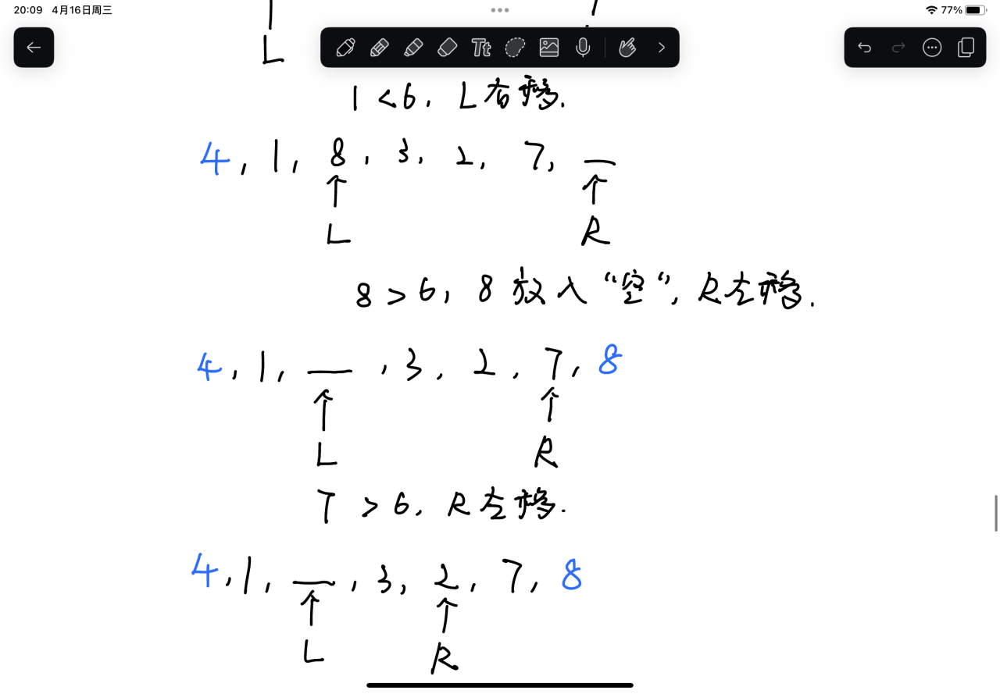

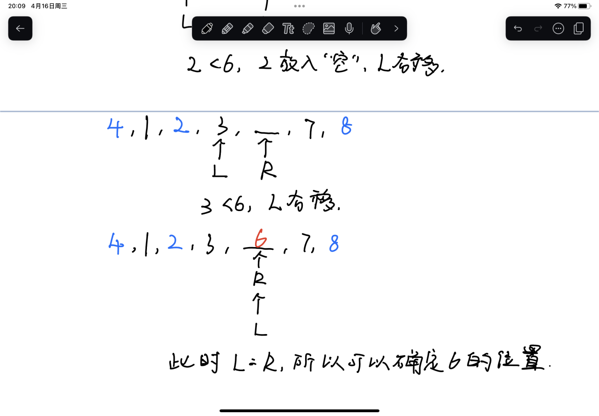

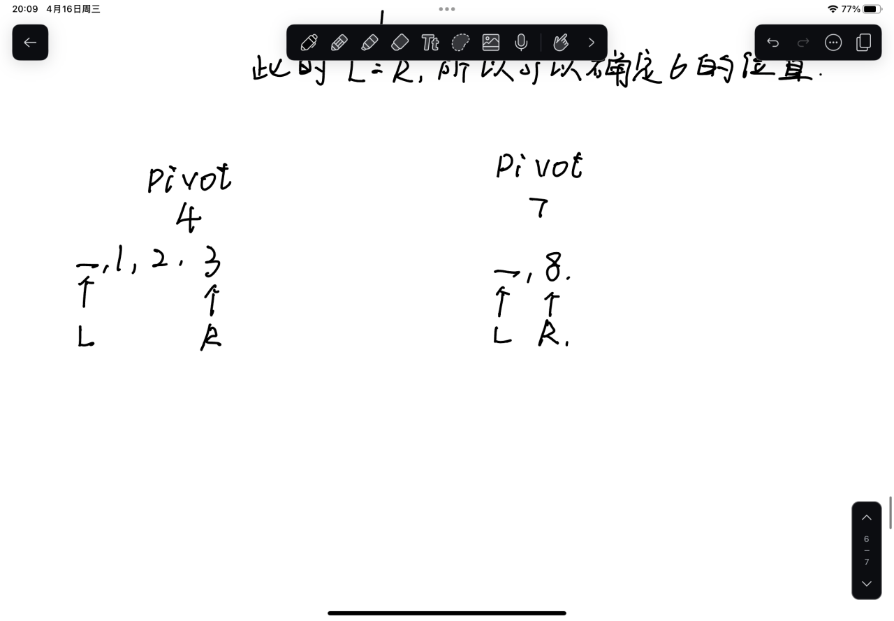

```java
public static void main(String[] args) {  
    int[] arr = {7, 2, 1, 6, 8, 5, 3, 4};  
    quickSort(arr, 0, arr.length - 1);  
    System.out.println(Arrays.toString(arr));  
}  
  
public static void quickSort(int[] arr, int left, int right) {  
    //当左指针和右指针重叠或者超过时，就终止程序，因为此时已经找到了基准值的位置  
    if (left >= right) {  
        return;  
    }  
    int pivot = arr[left];//选取当前子数组最左侧元素作为基准值（pivot）  
    int i = left, j = right;//为了递归时不破坏每个分组的边界值，使用两个指针 i 和 j，
						    //从两端向中间移动，避免直接修改 left 和 right  
    while (i < j) {  
        while (arr[j] > pivot && i < j) {//当右指针指向的元素大于基准值时，将右指针左移 
            j--;  
        }  
        // 找到比基准值小的元素，填入左边的空位（i 所在的位置）  
        if (i < j) {  
            arr[i] = arr[j];  
            i++;//做指针右移，接下来移动做指针  
        }  
        while (arr[i] < pivot && i < j) {  
            i++;  
        }  
        if (i < j) {  
            arr[j] = arr[i];  
            j--;  
        }  
    }  
    //循环结束证明此时 左指针==右指针，此时可以确定当前基准值的位置就是 i==j 的地方  
    arr[i] = pivot;  
    // 递归处理左右子数组，注意递归边界根据当前基准值位置动态变化  
    quickSort(arr, left, i - 1);  
    quickSort(arr, i + 1, right);  
}
```

>需要注意的是不能直接修改`left`和`right`两个指针，而是应该拿一对变量来接收它们，这是因为 `left` 和 `right` 的主要作用是在方法调用中明确表示当前排序区间的边界，它们是递归调用中用来确定左右分区范围的关键参数，如果它们随意改变的话，第一轮的调用就会导致它们无法准确的指向分组的边界，递归也无法正常运行

```java
public static void quickSort(int[] arr, int left, int right) {  
    if (left >= right) {  
        return;  
    }  
    int pivot = arr[left];
    while (left < right) {  
        while (arr[right] > pivot && left < right) {
            right--;  
        }  
        if (left < right) {  
            arr[left] = arr[right];  
            left++; 
        }  
        while (arr[left] < pivot && left < right) {  
            left++;  
        }  
        if (left < right) {  
            arr[right] = arr[left];  
            right--;  
        }  
    }   
    arr[left] = pivot;   
    quickSort(arr, left, i - 1);  
    quickSort(arr, i + 1, right);  
}
```

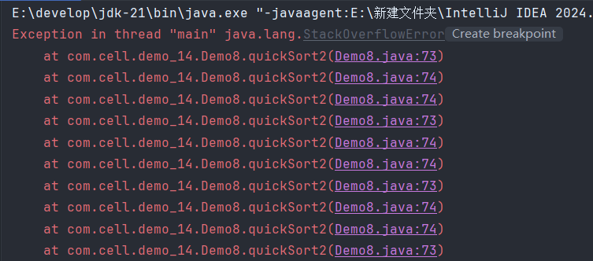

>报错的原因就是进行了错误的递归，导致进入了死循环，debug调试下看看是怎么回事

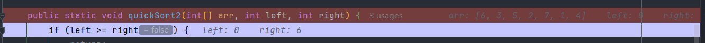

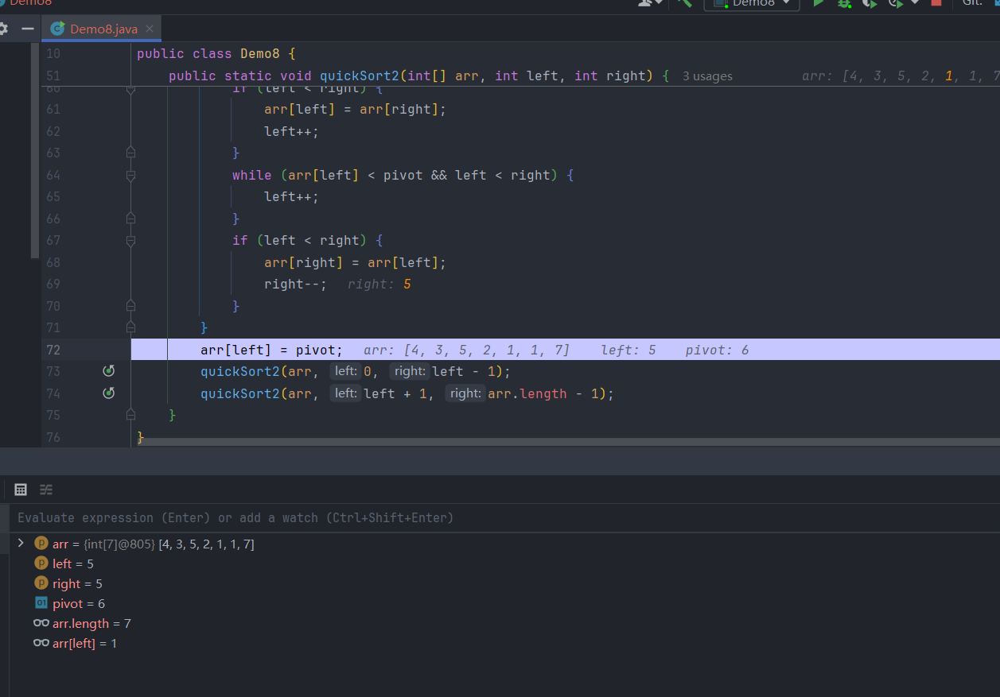

>第二轮

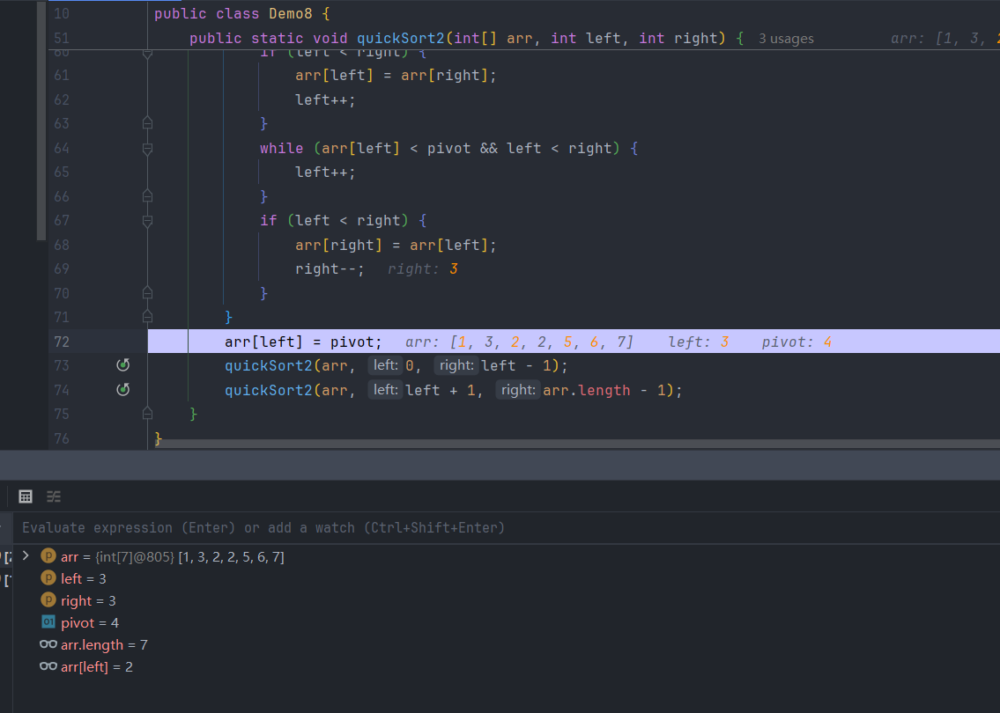

>第三轮

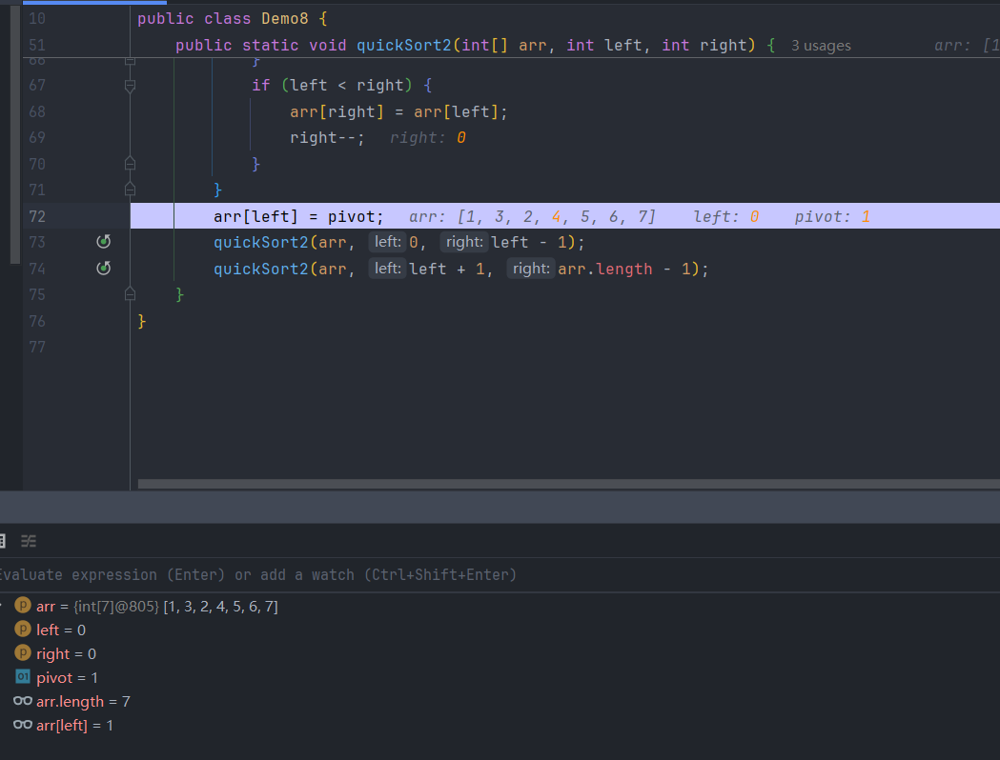

>进入右边递归

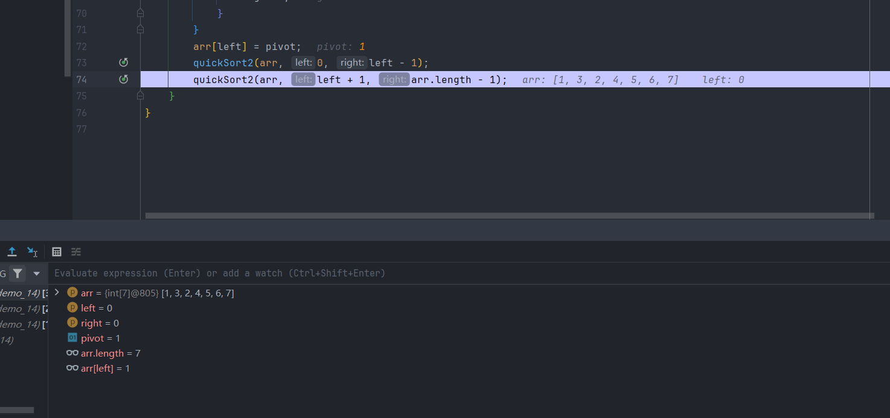

>可以看到此时的数组已经完成了排序，但是仍然会进入递归，因为此时的左指针和右指针很难达到再次相等的情况，又因为递归的层次多了，跳出递归进入下一个递归的时候又会再次循环

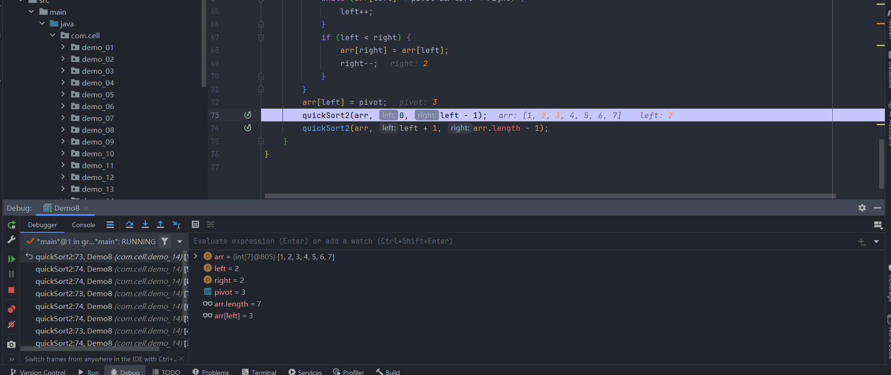


**时间复杂度**

>因为快速排序每次都会将数组分割成两部分，所以可以把它看作是一个二叉树的结构，所以它的深度可以看作是`log n`，因为每层确定基准值的位置需要对比所有的元素，所以每一层会进行n次的对比操作，所以时间复杂度为O(n·log n)，
>
>但是最坏情况下快速排序的时间复杂度会变成O(n<sup>2</sup>)，因为每一次都要比较n次，当选择的基准值恰好是最大或最小值时，整体的深度就会变成n，所以时间复杂度会变高

>所以想要达到最优的情况，就要让基准值恰好是整个数组的中间值，这样两边的深度就会差不多

>因为快排会选择基准值进行对比，所以可能存在捣乱前后关系的情况

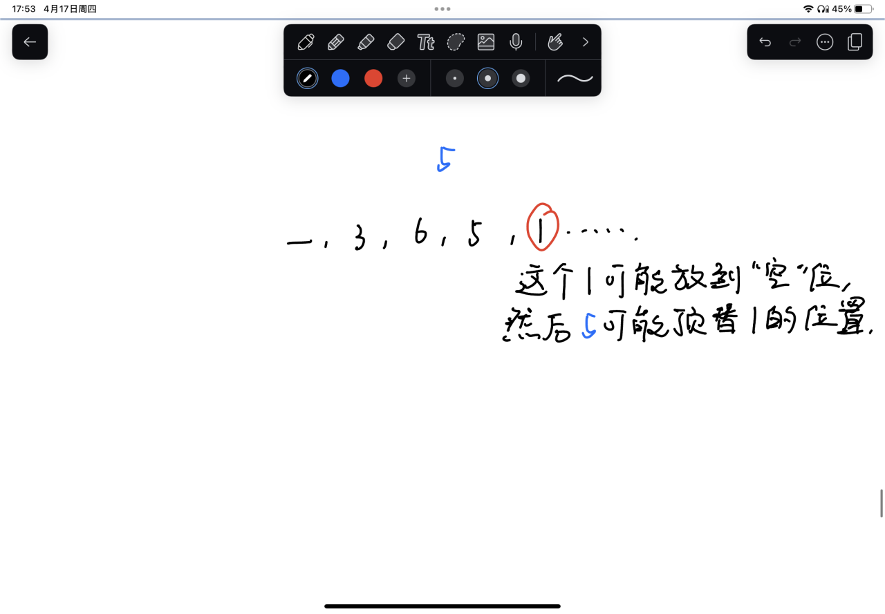

**优化**

**（1）三数取中法**

>选取数组中的三个元素计算其中位数并作为基准值，然后将基准值放到数组的头或尾再使用普通的快速排序，这种方法可以使得基准值一定不是数组中的最大或最小值，并防止数组基本有序时出现分组一边倒的情况，让递归的深度区域平均值

