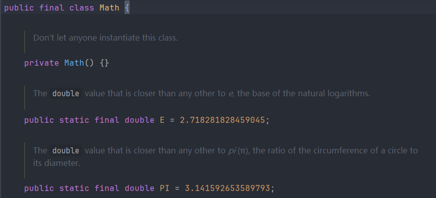

>接口是Java中一种规范,它定义了一组抽象方法和常量,用来描述实现这个接口的类应该具哪些属性和行为,接口和类一样,也是一种引用数据类型

****
# 一.接口的定义

```Java
public interface MyInterface {  
    int CONST = 100;//常量  
    void methodA();//方法  
}
```

**(1) 接口中的默认修饰符**  

>接口中的所有变量都默认被`public static final`修饰(一般被编译器隐含起来),所以接口中的所有变量都是常量,不能被继承/修改,并且不能使用其他修饰符对其进行修饰,但`static`和`final`是可以的,不过依旧默认会补充成`public static final`
>
>因为接口的本质是只定义行为,不存储状态,所以不应该包含可变的字段
>
>在Java8以前,接口中的方法默认`public abstract`修饰,不能使用其他修饰符

****

**(2) 接口不允许实例化**  

>和抽象类不能实例化的原因一致,根本原因其实并不是因为没有构造器,而是因为它的方法只声明,不实现
>
>**接口为什么没有构造器?** 
>
>构造器是用来初始化对象的,而接口中只有常量,因此就没有实例变量可以被初始化的,那么就没有使用构造器的理由了

****

**(3) 接口可作为标记**

>接口里面可以什么都不定义,没有变量和方法,通常用来给类做一个标记,通过`instanceof`来判断类是否实现了某个接口,然后手动执行相应的逻辑,并不是JVM自动执行相应逻辑

```Java
public interface Serializable {}

//Test实现了一个空的Serializable接口
class Test implements Serializable{
	main{
		//判断这个类要实现哪种功能,然后进行相关的操作
		if (Test instanceof Serializable) {
		    //执行序列化操作
		}
	}
}
```

****

**(4) Java8之后接口中允许出现默认方法和静态方法**  

>因为接口中默认的方法是抽象的,所以实现类必须重写这个接口中的所有方法,这就导致当接口中出现新增或者删除方法时,所有实现类都得修改,这就太麻烦了,况且有些方法也许是实现类不需要的,但实现类也无法拒绝,因此引入了新机制,让 接口中允许使用`default`和`static`  
>
>`default`方法的出现可以实现接口向后兼容,在不破坏已有的实现类的情况下新增代码,实现类可以不重写这个方法,那么实现类便会继承这个方法,直接通过 对象.方法名 调用  
>所以接口的实现也可以看作是一种另类的继承(只作为口头理解,不能当作正确概念)

```Java
public interface MyInterface {  
    int CONST = 100;//常量  
    void methodA();//方法  
  
    default void defaultMethod() {  
        System.out.println("defaultMethod is called");  
    }  
}

public class MyInterfaceImpl implements MyInterface {  
    @Override  
    public void methodA() {  
        System.out.println("override methodA");  
    }  
}

MyInterfaceImpl myInterfaceImpl = new MyInterfaceImpl();  
myInterfaceImpl.methodA();//override methodA
myInterfaceImpl.defaultMethod();//defaultMethod is called
```


>`static`方法可以给接口提供一种定义通用工具方法的能力,有了这个方法之后,就可以把接口当作工具类使用,一般的工具类都存在构造器并通过使用`private`来禁用构造器,而接口不存在,虽然调用静态方法会加载类,但都不会创建对象,所以接口和传统工具类并没有实质性的内存差异,它们都只在方法区中保存静态信息,关键在于接口它天生的没有构造器,在使用时更清晰,安全（不用定义私有化构造器与 final class）




****

**(5) Java9之后接口中允许使用`private`修饰方法**

>这一特性的出现,让接口作为新工具类的能力得到了进一步的提升,由于接口中的方法默认是抽象的,所以是无法直接使用的,当我需要写一个工具类时,可能会使用很多代码,这里面肯定存在可以复用的代码,如果没有`private`来修饰方法,那么这些方法就可以被实现类重写或者调用,这明显破坏了Java程序的封装性,它作为接口的复用代码也失去了意义,所以复用代码应该被私有化,无法被实现类继承

****

# 二.接口的实现

**(1) 多接口的实现**

>一个类虽然不能继承多个父类,但可以实现多个接口
>
>接口本质上还是方法的声明,不是具体的实现,并且不涉及字段和内存分布问题,所以接口并不会和继承一样,存在二义性和内存冲突问题(即多父类中相同的方法和字段)

****

**(2) 冲突解决**

>在Java8之前,接口中的方法都是抽象的,它们没有方法的实现,就算多实现的过程出现相同的方法名也没关系,因为具体的实现是交给实现类操作的,但是在Java8之后引入了默认方法,就需要用一些别的手段来控制

```Java
public interface MyInterface {  
    int CONST = 100;//常量  
    void methodA();//方法  
  
    default void defaultMethod() {  
        System.out.println("MyInterface's defaultMethod is called");  
    }  
}

public interface YourInterface {  
    default void defaultMethod() {  
        System.out.println("YourInterface's defaultMethod is called");  
    }  
}
```

```Java
public class MyInterfaceImpl implements MyInterface,YourInterface {  
    @Override  
    public void methodA() {  
        System.out.println("override methodA");  
    }  

	//手动重写
    public void defaultMethod() {  
        System.out.println("override default method");  
    }  
}

MyInterfaceImpl myInterfaceImpl = new MyInterfaceImpl();  
myInterfaceImpl.methodA();  
myInterfaceImpl.defaultMethod();//override default method
```

```Java
```Java
public class MyInterfaceImpl implements MyInterface,YourInterface {  
    @Override  
    public void methodA() {  
        System.out.println("override methodA");  
    }  

	//选择了MyInterface接口的default方法
	@Override  
	public void defaultMethod() {  
	    MyInterface.super.defaultMethod();  
	} 
}

MyInterfaceImpl myInterfaceImpl = new MyInterfaceImpl();  
myInterfaceImpl.methodA();  
myInterfaceImpl.defaultMethod();// MyInterface's defaultMethod is called
```

>当default冲突时,实现类必须选择其中的一个,或者直接手动重写,因为编译器无法自动决定使用哪一个实现

**default方法不是可以选择不重写的吗,为什么出现冲突时必须重写**

>当一个类实现多个接口时会“继承”它们的所有方法声明和 default 方法,虽然这些方法不会像类的方法那样被真正“放进对象的内存布局”中，但在方法调用时 JVM 仍然需要明确知道调用哪个方法,如果多个接口中存在同名同参数的 default 方法,JVM 就无法自动判断该选哪个,所以必须二选一或者手动重写

****

**(3) 接口继承接口**

>接口继承接口和类实现多个接口的目的不同,但最终达到的结果是类似的。接口继承接口主要是为了扩展子接口的能力,让子接口继承父接口的所有方法声明并添加属于自己的方法声明
>
>类实现多个接口的目的是为了给接口提供具体的实现 ,让类具有接口描述的能力
>
>但是最后都是靠实现类来完成所有抽象方法的具体实现,让某个对象具有特定的功能

****
# 三.抽象类和接口类

**(1) 定位不同**

>抽象类是一个类,它具有类的所有结构,但是接口在严格意义上不属于类,因为它没有成员变量和构造器,它只是类的方法的声明,更像是一种最高程度规范

****

**(2) 使用场景不同**

>接口:  
>更偏向于方法的声明,因为不具备正常类的结构,所以一般和一个父类结合使用

>抽象类:  
>当子类和父类存在共同的属性和行为时则需要使用到抽象类,

>接口比抽象类更抽象,抽象类好歹有个属性字段可以和子类共享,但接口只能告诉实现类我有什么方法,你给我实现

****

**(3) 实际运用中两者搭配使用更好**

>接口本身无法处理实例对象的属性,所以必须有一个类来存储对象的字段

>接口通常是作为最顶层的一种规范,它列出所有类的一个需要实现的功能列表,而抽象类实现了接口后可以选择需要重写的方法或者新增方法,要用的我就加上abstract强制子类重写,不用的就重写,这样我的子类就不用强制重写这些方法,但是仍然可以调用

>所以接口是规范,抽象类是中介,实例对象是执行者

```Java
interface Printer {
    void print();
    void scan();
}

abstract class AbstractPrinter implements Printer {
    @Override
    public void print() {
        System.out.println("Printing from AbstractPrinter");
    }

	// 可以只声明，不重写，但加了 abstract 子类必须重写
	@Override
	public abstract void scan();
}

class LaserPrinter extends AbstractPrinter {
    @Override
    public void print() {
        System.out.println("Printing from LaserPrinter");
    }
    
    @Override
	public void scan() {
		System.out.println("Scanning from LaserPrinter");
	}
}

class InkjetPrinter extends AbstractPrinter {
    @Override
    public void print() {
        System.out.println("Printing from InkjetPrinter");
    }
    @Override
	public void scan() {
		System.out.println("Scanning from InkjetPrinter");
	}
}

     // 使用接口作为引用类型
     Printer printer1 = new LaserPrinter();
     printer1.print();//Printing from LaserPrinter
     printer1.scan();//Scanning from LaserPrinter
        
     Printer printer2 = new InkjetPrinter();
     printer2.print();//Printing from InkjetPrinter
     printer2.scan();//Scanning from InkjetPrinter
```