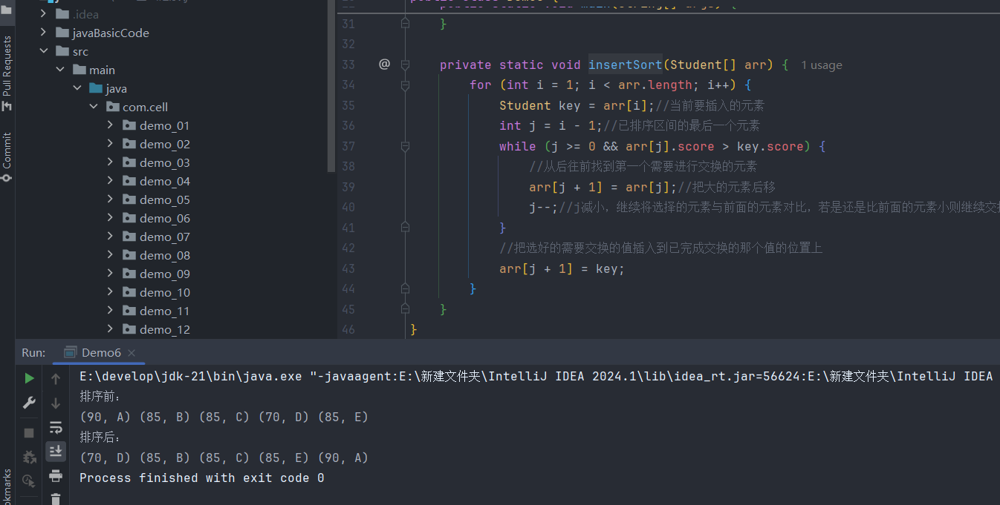

>把一个数从无序区插入到有序区中

```
初始：     [5, 3, 8, 2, 6] 
最初始把第一个元素当作是有序的，因为就它一个，所以第一次插入是选择第二个元素与前面的元素对比
第一轮插入：[3, 5, 8, 2, 6]  5比3大，所以5后移；把3插入0号位置
第二轮插入：[3, 5, 8, 2, 6]  8前面的元素是有序的，所以5和8对比后比8小就不需要再对比了
第三轮插入：[2, 3, 5, 8, 6]  8比2大，8后移；5比2大，5后移；3比2大，3后移；把2插入0号位置
第四轮插入：[2, 3, 5, 6, 8]  8比6大，8后移；5比6小，停止对比；把6插入3号位置
```

```java
private static void insertSort(int[] arr) {  
    for (int i = 1; i < arr.length; i++) {  
        int key = arr[i];//当前要插入的元素  
        int j = i - 1;//已排序区间的最后一个元素  
        while (j >= 0 && arr[j] > key) {  
            //从后往前找到第一个需要进行交换的元素  
            arr[j + 1] = arr[j];//把大的元素后移  
            j--;//j减小，继续将选择的元素与前面的元素对比，若是还是比前面的元素小则继续交换  
        }  
        //把选好的需要交换的值插入到已完成交换的那个值的位置上  
        arr[j + 1] = key;  
    }  
}
```

>插入排序每一轮的操作其实只进行了一次插入操作，但是会进行多次元素后移的操作，它的时间复杂度也是O(n<sup>2</sup>)，但是它在最好的情况下时间复杂度只有O(n)，但冒泡排序和选择排序无论如何时间复杂度都为O(n<sup>2</sup>)，也就是部分有序时，插入排序的效率比起冒泡排序和选择排序是更高的

**插入排序是有序的**

>因为当两个值相等时是不会发生后移操作的，此时前面的元素也是有序的，所以不会发生交换，因此相同的值在插入排序后仍具有原先的前后关系



**优化**

>为了防止数组越界的问题所以在循环判断的地方加上了`j>=0`，但是可以通过一些方法舍去这个判断  
>从数组中找到最小的一个元素并把它放到0号位置充当哨兵，因为它是最小的，所以进入循环的条件只需要判断当前要插入的元素的前一个元素是否比它大就行了，比它大才能进行后移等操作，`j--`后的最小值也只能到0，所以不会出现数组越界的问题，

```java
//找到数组中最小的元素，从后往前遍历
for (int i = arr.length - 1; i > 0; i--) {
    if (arr[i] < arr[i - 1]) {
        int tmp = arr[i];
        arr[i] = arr[i - 1];
        arr[i - 1] = tmp;
    }
}
//因为0号位置已经是最小的元素了，所以从2号位置开始选择插入
for (int i = 2; i < arr.length; i++) {
    int key = arr[i];
    int j = i - 1;
    while (arr[j] > key) {
        arr[j + 1] = arr[j];
        j--;
    }
    arr[j + 1] = key;
}
```