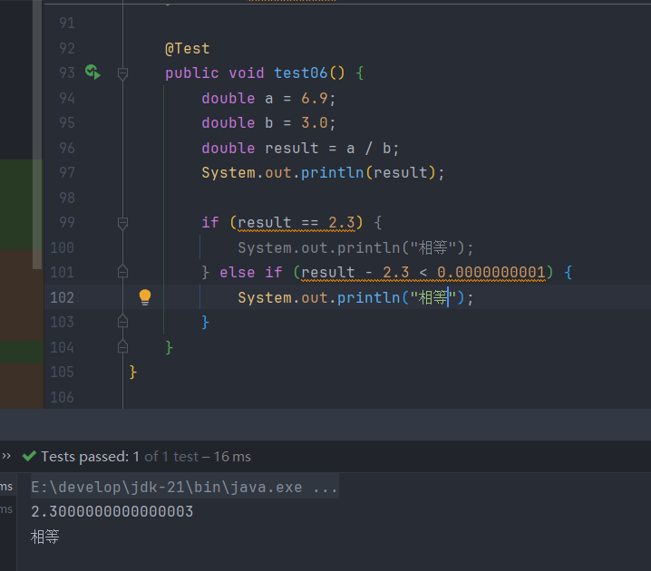

| 数据类型        | 占用字节数 | 取值范围                              | 具体取值范围                                                 | 默认值      |
| ----------- | ----- | --------------------------------- | ------------------------------------------------------ | -------- |
| **byte**    | 1     | \( -2^7 \) ~ \( 2^7-1 \)          | -128 ~ 127                                             | 0        |
| **short**   | 2     | \( -2^{15} \) ~ \( 2^{15}-1 \)    | -32,768 ~ 32,767                                       | 0        |
| **int**     | 4     | \( -2^{31} \) ~ \( 2^{31}-1 \)    | -2,147,483,648 ~ 2,147,483,647                         | 0        |
| **long**    | 8     | \( -2^{63} \) ~ \( 2^{63}-1 \)    | -9,223,372,036,854,775,808 ~ 9,223,372,036,854,775,807 | 0L       |
| **float**   | 4     | 1.4E-45 ~ 3.4028235E38            | 1.4E-45 ~ 3.4028235E38                                 | 0.0f     |
| **double**  | 8     | 4.9E-324 ~ 1.7976931348623157E308 | 4.9E-324 ~ 1.7976931348623157E308                      | 0.0d     |
| **boolean** | 1     | true / false                      | true / false                                           | false    |
| **char**    | 2     | \( 0 \) ~ \( 2^{16}-1 \)          | 0 ~ 65,535                                             | '\u0000' |

==byte<short<int<long<float<double==

所有的引用数据类型.默认值是:null

# 一.整数型

>Java中任何一个整数型变量都会默认被当作int类型处理,例如 `int a = 100`
>
>因为Java中,等号右边先执行,所以100会先被存入一个临时变量,不管怎么样,都给他四个字节的存储空间,因为a是int类型,刚好四个字节,不存在类型转换,但是如果是`long a = 100`,就是把四个字节的内容放到八个字节中,小容量自动赋值给大容量,这就叫自动类型转换

>但是,如果在整数型后面加上了L,Java就会把他识别为long类型,直接给他8个字节的空间,而不是默认类型,那么`long a = 100`就不存在类型转换

>如果这个值超出了int类型的范围,并且后面没有加上L,那么就会报错,因为等号右边先执行,Java把他默认为了int类型,可是这个数超过了范围,那么用int就无法表示,就只能报错了,但并不是long存不下

>两个int类型的数据进行运算后,仍然是int类型  
>==多种类型的数据运算时,先转换成最大的再运算==

>byte 和 short运算时,会各自转换成int类型再运算  
>byte+byte -> int  
>short+short -> int

# 二.浮点型

>浮点型字面量默认被当作double类型处理,想要用float类型就要加上F

>浮点型可以用科学计数法表示:`double a = 1.23E10`=1.23x1010, 123E-2=123x10-2=1.23

**==为什么float的容量比long还要大?==**

>虽然float只有32位,但是这些二进制位表示的东西和long的不同,long的64位全部用来存放二进制,而float的第一位表示正负,2~9位存的是指数位,剩下的23位存位数位,只有这23位是和long一样,虽然放的少,但它以指数级增长,范围肯定更大

>浮点型数据参与运算得出的结果不要与其他值用`==`比较,因为计算机底层存储的浮点型是它的近似值,通常使用极小误差来判断相等

<a id="char-todo">补充</a>