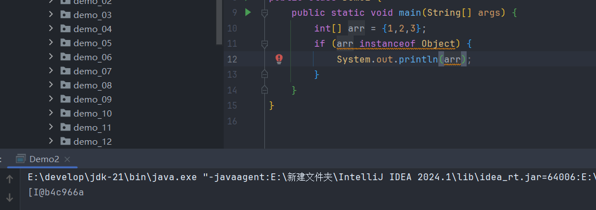
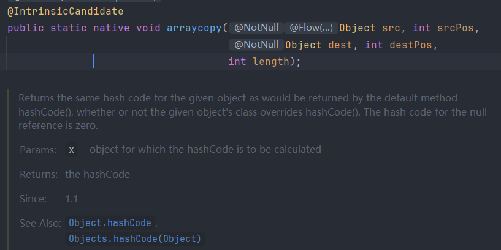
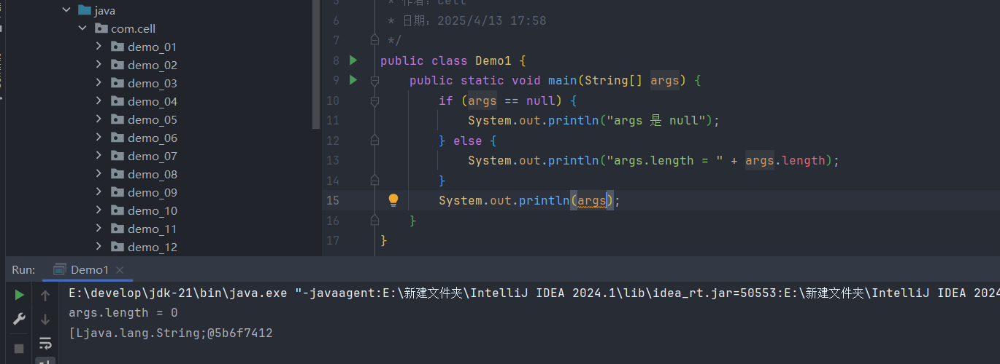
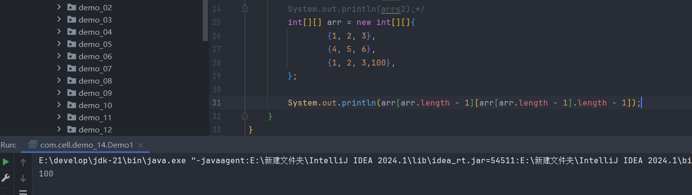
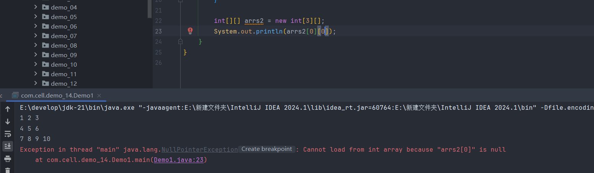
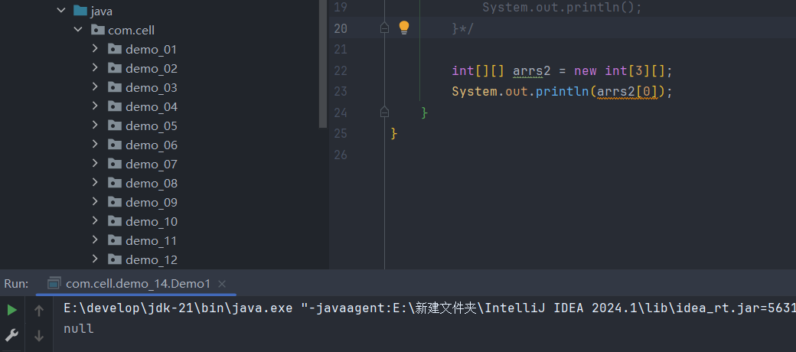

# 一.一维数组

>用于存储相同数据类型元素的容器

****

**(1) 声明与创建**

```Java
int[] arr;
int arr[];//c语言的格式
```

>数据的创建在Java中常用第一种格式,因为数组属于引用类型,声明的变量实际上存储的是堆内存中数组对象的地址,并不是实际的数据,因此第一种格式具有更高的可读性

```Java
int[] arr = new int[5];
```

>数组的创建有点像对象的创建,也是new一个数据类型,由此可见数组本质上就是一个特殊的对象

```Java
int[] arr = new int[]{1,2,3,4,5}
int[] arr = {1,2,3,4,5}
//错误代码
int[] arr = new int[5]{1,2,3,4,5}
```

>需要注意的是,在创建数组的时候是不能同时指定数组长度和初始值的

****

**(2) 内存结构**

>数组本质上是一种特殊的对象,当创建一个数组时JVM 会在堆内存中为其开辟一段连续的内存空间，这段空间的大小由数组的长度与元素类型所占字节数共同决定.由于数组中的所有元素必须是相同类型,因此每个元素所占的内存大小是一致的,这使得数组在物理结构上具备了连续的地址

>但是也因为它这个特点,想要对数组进行增加或删除数据就会变得很困难,增加数据需要把后面的数据全部后移,删除数据就需要把后面的数据全部前移,这大量的移位操作十分耗时,所以数组是不善于新增和删除数据的

>数组的引用存放在JVM虚拟机栈中,指向堆中数组对象的首地址,通过这个首地址可以访问数组的所有信息

>需要注意的是,基本数据类型的数组中的每个元素直接存储在这段连续的空间中,但是引用数据类型的数组中的元素存储的是引用,这些引用在内存中的地址是连续的,但是指向的对象在内存中可能是分布在堆的不同位置的

****

**(3) 数组的本质**

>数组本质上就是一个对象,它具有对象的完整结构,数组中也有对象头,它用来告诉JVM这个数组对象是用来干嘛的,并且有一个专属的`length`字段,它被JVM设置成`final`,一旦创建就完成初始化不能再修改,所以数组的长度是不可变的,最后就是数组中存放数据的元素数据区,这部分的地址空间是连续的,所以数组是不能太大的,毕竟内存中没法找到一个很大的连续的空间给数组用



>这里证明了数组是属于Object类的,证明它也是对象,并且可以调用对象的`toString`方法,只是内部没有重写

****

**(4) 数组的使用**

>数组在创建时会自动初始化为默认值,这个默认值根据声明的类型决定

>数组从`0`号下标开始访问,到`length-1`结束

>通常使用`for`循环来遍历数组中的所有数据,普通的`for`循环可以通过下标访问,而增强`for`的代码更简洁,但是无法用下标访问

****

**(5) 数组的优势**

>因为数组的地址空间连续的原因,访问数组的速度是很快的,当知道数组的首地址后便可以找到这整个数组,因为每个元素所占的内存又是相同的,所以只需要通过首地址加上它的内存大小乘个数便可以找到任何一个元素,所以JVM只需要一个公式就可以花很少的时间找到数据

>当需要声明大量的相同数据时使用数组也很方便,因为数组可以只用一个变量就接收大量的数据,让代码的简洁度更高,当然这种特性也非常容易管理

>数组其实属于一种承上启下的结构,它作为一种基础的结构可以为后续很多的东西做铺垫,因为很多东西都是使用数组实现的

****

**(6) Object[]**

>虽然说数组中的所有元素都是同一个类型的,但是它们仍然可以为"不同的类型",当声明数组的类型是元素的父类时,数组中的元素就可以填写任意类型的子类

```Java
Object[] object = new Object[3];
object[0] = new Person();
object[1] = new Animal();
object[2] = new Car();
```

****

**(7) 数组的扩容**

>严格意义上来讲,数组是不能进行扩容的,但是可以通过一些手动的操作,把原数组的内容放在一个更大的数组中,然后在多的空闲的空间中添加元素,这里使用的是`arraycopy`方法



`System.arraycopy(Object src, int srcPos, Object dest, int destPos, int length)`

 >`src`：源数组，从这个数组复制数据。
 >
> `srcPos`：源数组的起始位置，表示从源数组的哪个位置开始复制。
> 
> `dest`：目标数组，数据将被复制到这个数组。
> 
>`destPos`：目标数组的起始位置，表示将数据复制到目标数组的哪个位置。
>
>`length`：要复制的元素个数。

**(8) 静态与动态初始化**

>静态初始化就是在声明阶段直接确定数组中的元素,这些元素都放在堆内存中的数组中,只有数组的引用变量是放在栈中

```Java
int[] arr = {1,2,3}
```

>动态初始化就是先给数组决定好它的长度(JVM会赋默认值),然后手动的一个个的输入

```Java
//动态初始化：声明数组并指定大小
int[] arr = new int[5];
for (int i : arr) {
	System.out.print(i + " "); //0 0 0 0 0
}
```

****

**(10) main方法的参数String[]**

>main方法是一个方法,所以它可以接收参数,而String[] args就是形参,只不过它是用来接收命令行传来的参数

**大多数情况是用不到args的,为什么还要写呢**

>首先JVM底层设计的就是强制选择带有String[] args 的main方法,也就是说就算重载了main方法,JVM也不会使用重载的,再说如果有两个版本的main方法,JVM寻找入口方法就会更耗时,所以作为整个程序的入口,必须强制规定一些规则

>虽然有时候用不到命令行传来的参数,但是还是存在这种可能的,但是在idea中使用时,这个args并不是`null`的,而是一个长度为0的空数组(new String[0]),它是真实存在内存中的,只是占用很小的空间



****

# 二.二维数组

>二维数组其实是一种特殊的一维数组，它具有一维数组的特性，并且由一维数组组成

****

**（1） 声明与创建**

```Java
int[][] arr;
int arr[][];// C/C++格式
---------------------
int[][] arr = {
    {1, 2, 3},
    {4, 5, 6},
    {7, 8, 9}
};
---------------------
//动态初始化，创建时确定它的长度
int[][] arr = new int[3][4]; // 3行4列
---------------------
//不规则初始化，二维数组中保存的一维数组的长度不提前决定
int[][] arr = new int[3][];
arr[0] = new int[2];
arr[1] = new int[4];
arr[2] = new int[3];
```

****

**（2）内存结构**

>前面有提到二维数组其实是一种特殊的一维数组，它具有一维数组的所有特性，在内存中是连续存放的，唯一和一维数组的区别就是一维数组中的元素可以是基本数据类型或引用类型的变量，而二维数组的元素只能存放一维数组的引用，所以二维数组在本质上并不是一个完整的连续的内存块，而是由多个独立分配的一维数组组成的“数组集合”

>把一维数组的首地址当作元素存在每个元素中，元素的内存大小依然依赖于声明的数据类型，所以二维数组实际是一种 地址 -> 地址 ->元素 的结构

>二维数组的声明是用到两个`[]`，这个和X、Y轴类似，前面的`[]`决定行，后面的`[]`决定列，行由二维数组存放的一维数组构成，列由一维数组的各个元素构成

```
{
	{1，2，3}，
	{4，5，6}，
	{7，8，9，10}
}
```

****

**（3）元素的访问**

>因为二维数组的特性，可以把它看作一种特殊的矩阵，通过详细的坐标访问确切的元素

```
{     0  1  2  4
   	0{1，2，3}，
	1{4，5，6}，
	2{7，8，9，10}
}
```

>当我想得到9这个元素时就需要访问（2，2）这个坐标，写成二维数组的形式就是`arr[2][2]`，所以想用代码的方式访问就一定要用到嵌套循环，外循环访问行，内循环访问列，这样就可以做到先找到二维数组中存放一维数组的那个引用，通过这个引用找到一维数组，然后再通过循环取到一维数组的所有元素

```Java
    int[][] arrs = new int[][]{  
            {1, 2, 3},  
            {4, 5, 6},  
            {7, 8, 9,10}  
    };  
    for (int i = 0; i < arrs.length; i++) {  
        for (int j = 0; j < arrs[i].length; j++) {
        //arrs[i].length指的是当前行的一维数组的长度 
            System.out.print(arrs[i][j] + " ");  
        }  
        System.out.println();  
    }  
}
```

>访问二维数组的最后一个元素



```java
[arr.length - 1]//表示最后一行的一维数组
[arr[arr.length - 1].length - 1]//表示最后一行的一维数组的最后一个元素
```

>所以`arr.length`访问的是二维数组的行数，`arr[n].length`访问的是第n行的列数，也就是一维数组的长度

****

**（4）动态初始化**

>二维数组的动态初始化和一维数组一样，需要提前确定好数组的长度，但是二维数组可以只先确定需要存放的一维数组的个数，也就是第一个`[]`，第二个`[]`可以后续按照一维数组的初始化方式一样静态初始化或者静态初始化，这种情况通常也叫做不规则数组

```Java
int[][] arr = {
    {1},
    {2, 3},
    {4, 5, 6}
};
```

```java
int[][] arr = new int[3][];
arr[0] = new int[1]; // 第0行长度为1
arr[1] = new int[2]; // 第1行长度为2
arr[2] = new int[3]; // 第2行长度为3
```

>需要注意的是，只给二维数组的第一个`[]`定义长度不代表第二个`[]`不用定义长度，只是把定义长度的机会留在了后面，如果不定义后面的`[]`却访问精确的元素就会出现空指针异常



>虽然分配了三行，但是这三行并没有分配内存，所以直接访问的话访问的是一个空地址



****

**（5）二维数组与面向对象编程**

>二维数组本质上是一维数组的数组，它虽然在语法上属于对象的一种（即引用类型），但本身不具备封装性，没有行为和属性，只是一种数据容器，所以二维数组不能算作面向对象思想的直接体现，它更像是一种结构化的数据组织方式，强调的是数据排列的规则性，而不是面向对象所强调的“行为+数据”的封装模型

****

