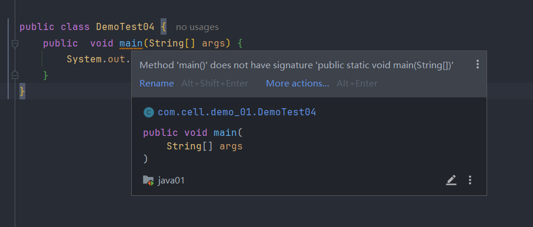

>本质上是一个可重复利用的代码段并且每一个方法都是独立封装好的功能,所以说main方法也会被调用,底层就是jvm来调用的
# 一.方法的定义

**语法格式:**

```
[修饰符列表] 返回值类型 方法名(形式参数列表) {
	方法体;
}
```

**修饰符列表:**

```
常用的就是 public static
```

**返回值类型:**

>可以是Java中的任何一种数据类型,如果方法不返回任何数据时,需要把返回值类型写成void,其他的类型都需要添加return来返回相对应的数据

>需要注意的是,当return后面不加数据的时候,这个return就充当结束方法的作用

```
public static void ... {
	方法体;
}
public static int ... {
	return int;
}
public static String ... {
	return String;
}
public static boolean ... {
	return true/false;
}
```

>没有添加限定条件的情况下,return语句下面不要再写代码了,因为已经把这个数据返回了


# 二.方法调用

>调用返回类型不是void的方法时,需要使用一个变量来接受,并且初始化这个变量使用的数据类型应该和这个方法的类型一致,否则就需要手动转换接收的数据的类型

>当然,在调用方法的时候,也可以定义变量去接收方法传来的数据,只要语法正确就行

```
main {
	int result = add(10,5);
	sout(result);//15
}

public static int add(num1,num2) {
	return num1 + num2;
}
```

**形参:**

>形参是局部变量,方法可以选择0个形参,也可以多个形参,使用逗号隔开,但是起决定作用的是形参的数据类型

```
实参和形参需要一一对应,包括类型和个数
main {
	      这两个传入的值是实参
	method(1,1);
}

                         形参x, 形参y
public static int method(int x, int y) {
	...
}
```

>方法调用时,调用方法者和被调用者处于同一个类中,那么就可以直接使用方法名调用,否则要使用 类名.方法名 调用


# 三.静态方法

>用static修饰的方法就是静态方法

>静态方法是属于类的,这也就是为什么可以通过 类名.方法名 调用方法的原因

**为什么大多的方法前面都有 public static **

>Java是从main方法开始的,程序运行时,jvm会先加载当前这个类,并找到这个类中的static修饰的main方法,然后再执行main方法,为什么加上了static就可以找到main方法,因为在jvm加载完类之后,就可以直接通过这个类名直接调用mian方法(类名.main()),如果没有加上static修饰main方法,那jvm就需要先创建一个类的对象,问题是jvm怎么知道创建哪种类型的对象,就算知道了,那程序员应该也很难理解,因为程序员是无法知道这个对象是如何被jvm创建出来的,所以,要是想让jvm知道我想干什么,就得把我的要求告诉他,或者让他使用简单易懂的方式创建一个容易理解的"默认值",这就是为什么main可以直接被调用,以及为什么程序员可以直接使用main完成一些操作

```Java
//写一个类,里面放一个构造器,我的main方法不用static修饰
public class MyApp {
    public MyApp() {
        System.out.println("无参构造方法被调用了");
    }
    public MyApp(参数) {
	    System.out.println("有参构造方法被调用了");
    }
    public void main(String[] args) {
        System.out.println("这是非静态main方法");
    }
}
```

>看上面的例子,如果jvm要执行main,就要先创建一个MyApp对象(假设jvm可以自动创建对象调用非static的main方法)

```Java
MyApp app = new MyApp(); //JVM自动创建对象
app.main(args);          //JVM自动调用非静态main方法
```

>这就涉及到了一个问题,既然jvm都能自动new一个对象了,那他肯定还能拿这个对象干很多事,并且这些事是程序员不知道的,毕竟这个对象不是程序员自己new的,这样的话程序员就变成了一个看戏的了,我们自己想要进行的操作明明没执行,反而代码底层先发疯了,这就让Java的可读性变得很低,虽然看上去很灵活,但是这更像一个无法由程序员决定该进行什么操作的叛逆语言



>代码的底层还是很聪明的,既然Java是一个可控性很强的语言,那么就应该由程序员决定自己要干什么,而不是让它自己玩魔法

# 四.方法重载机制

>Java允许在一个类中定义多个相同方法名的方法,前提是需要形式参数列表不同(类型,顺序,个数),这就是方法重载

>方法重载是是在编译阶段确定使用哪个方法的,调用时通过使用不同的形参来决定使用哪个

```Java
public static void main(String[] args) {  
    sum(1,2);  
    sum(2.0,3.0);  
    sum(3L,4L);  
}  
  
public static void sum(int a, int b) {  
    System.out.println(a + b);  
}  
  
public static void sum(double a, double b) {  
    System.out.println(a + b);  
}  
  
public static void sum(long a, long b) {  
    System.out.println(a + b);  
}
```

>需要注意的是,如果方法的返回类型不同,但参数列表相同的话,是不属于方法重载的,因为在Java的编译阶段不考虑方法的返回值,所以只能通过参数列表的不同来判断程序员使用的是哪个方法,这也是为什么可以使用一些Java底层的方法来实现很多功能(println,sort等)

```Java
//这也算方法重载
public static int sum(int a, int b);
public static double sum(double a, double b);
```

>方法重载也算一种多态的体现,体现在编译时


**为什么方法重载要选在编译阶段?**

>在之前学习Java的加载与执行时提到,Java在编译阶段会检查代码的语法是否正确,所以Java才会在编译阶段判断程序员使用的是哪个方法,这样才能保证能够生成正常的字节码文件


