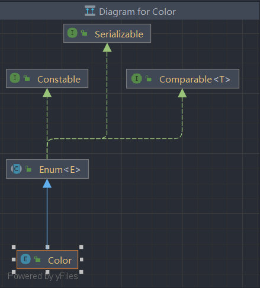

>枚举（Enumeration）是一种特殊的类，它代表一组固定的常量集合  
>例如，一年只有十二个月、性别只有男和女、红绿灯只有红绿黄三种，这些固定的值就非常适合用枚举来表示  
>因为枚举限制变量只能是预先设定好的值，可以减少代码中的一些错误，使错误在编译期间就可以展示出来

## 1. 使用

>枚举类中的声明

```java
访问修辞符 enum 枚举名 {
    枚举成员,
    枚举成员,
    ...
};
```

>普通类中的声明，充当一个内部类

```java
访问修饰符 class 类名 {
    enum 枚举名 {
        枚举成员,
        枚举成员,
        ...
    }
}
```

****
## 2. 底层原理

```java
public enum Color {
    RED, GREEN, BLUE;
}
```



>枚举类会自动继承父类 `Enum`，所以枚举类是不能继承其他类的，并且默认被 `final` 修饰，也无法被继承，每个枚举值在内部都是该枚举类的一个静态常量对象，可以等同于常量

>类加载时会初始化所有枚举实例，即在调用 `Color.class` 的时候，所有 `Color.RED`、`Color.GREEN` 等对象已经初始化完毕

>枚举类提供了一个 `values` 方法，用于返回枚举类中的数据，因为枚举类是不能被修改的，所以它实际返回的是一个副本，

```java
Color[] colors = Color.values();  
for (Color color : colors) {  
    System.out.println(color);  
}
```

****
## 3. 其他用法

>枚举类可以看作是一种特殊的类，它可以像普通类一样写很多东西，例如构造器、静态代码块、方法等

### 3.1 枚举类的构造器

>枚举类的构造器和普通类的不太一样，它直接通过定义的常量进行对象的初始化，当然枚举类也默认自带一个无参的构造器，这种情况就是默认调用了无参构造器

```java
public enum Color {
    RED, GREEN, BLUE;
}
```

>所以枚举类中写了几个常量，就等于自动定义了几个对应的对象（而且是单例对象）

```java 
public enum Color{  
    RED("red", "这是红色"),  
    BLUE("blue", "这是蓝色"),  
    GREEN("green", "这是绿色");  
  
    private final String color;  
    private final String describe;  
  
    Color (String color, String describe){  
        this.color = color;  
        this.describe = describe;  
    }  
  
    public String getColor() {  
        return color;  
    }  
  
    public String getDescribe() {  
        return describe;  
    }  
}
```

>虽然可以写构造方法，但是构造方法默认是私有的，也就是说外部是不能通过 `new` 来创建对象，只能通过类名访问属性值

>枚举类只有 `get` 方法，通过类名得到某个颜色对象，再通过这个颜色对象得到 `get` 方法

```java
String color = Color.RED.getColor();  
String describe = Color.RED.getDescribe();
```

****
### 3.2 枚举类中的方法

```java
public boolean isColor(String color){  
    return this.color.equals(color);  
}
```

>在枚举类中定义一个方法，用于比较传进来的字符串与当前对象的 `color` 属性是相同，相同就判断为同一种颜色，`this` 指的就是当前的对象

```java
System.out.println(Color.RED.isColor("red"));
```

****
### 3.3 静态代码块

```java
static {  
    for (Color c : Color.values()) {  
        System.out.println(c.name());  
    }  
}
```

>枚举类的静态代码块是在枚举常量初始化完成后才初始化的，这就是为什么可以在静态代码块中使用 `Color.values()` 或访问 `Color.RED` 之类的常量，因为它们已经初始化好了

****
### 3.4 枚举常量中定义方法

```java
public enum Operation {
    ADD {
        @Override
        public int apply(int a, int b) {
            return a + b;
        }
    },
    SUB {
        @Override
        public int apply(int a, int b) {
            return a - b;
        }
    },
    MUL {
        @Override
        public int apply(int a, int b) {
            return a * b;
        }
    },
    DIV {
        @Override
        public int apply(int a, int b) {
            if (b == 0) throw new ArithmeticException("Divide by zero");
            return a / b;
        }
    };

    // 抽象方法，要求所有常量都实现它
    public abstract int apply(int a, int b);
}
```

>因为每个枚举常量都相当于一个对象，所以可以在每个常量中单独实现方法， ` public abstract int apply(int a, int b);` 这个就相当于是一个结构，常量相当于类，想要类中实现统一的方法重写就需要实现接口，和这里的结构类似，不然外部是无法找到 `apply` 方法的

```java
System.out.println(Operation.ADD.apply(1, 2)); // 3
```

****
## 4. 枚举类的方法

| 返回值      | 方法                                      | 描述                     |
| -------- | --------------------------------------- | ---------------------- |
| String   | name()                                  | 获取枚举成员的名称              |
| static T | valueOf(Class<T> enumType, String name) | 获取指定枚举成员名称和类型的枚举成员     |
| String[] | values()                                | 获取枚举成员的所有值             |
| int      | compareTo(E o)                          | 根据枚举对象的序数进行比较          |
| int      | hashCode()                              | 获取枚举成员的哈希值             |
| int      | ordinal()                               | 获取枚举成员的序数（第一个枚举成员位置为0） |
| String   | toString()                              | 返回枚举成员名称               |
| Class<E> | getDeclaringClass()                     | 获取枚举成员的类对象             |

****
## 5. 与 switch 语句搭配

```java
public enum Day {
    MONDAY, TUESDAY, WEDNESDAY, THURSDAY, FRIDAY, SATURDAY, SUNDAY;
}

public class Demo {
    public static void main(String[] args) {
        Day today = Day.WEDNESDAY;

        switch (today) {
            case MONDAY:
                System.out.println("Start of the week");
                break;
            case FRIDAY:
                System.out.println("Almost weekend!");
                break;
            case SATURDAY:
            case SUNDAY:
                System.out.println("Weekend!");
                break;
            default:
                System.out.println("Midweek day");
        }
    }
}
```

> `switch` 可以自动识别枚举类， `case` 后面直接写枚举常量，不需要使用类名