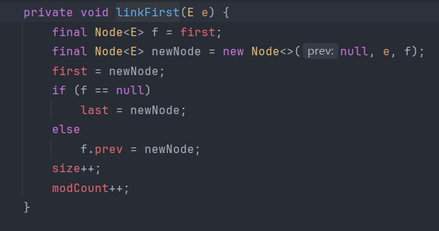
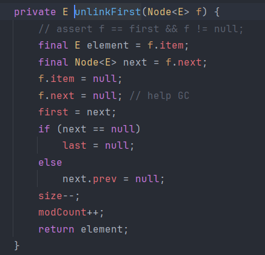
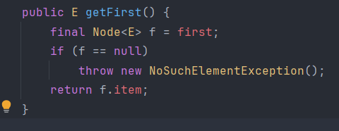
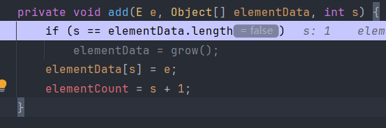
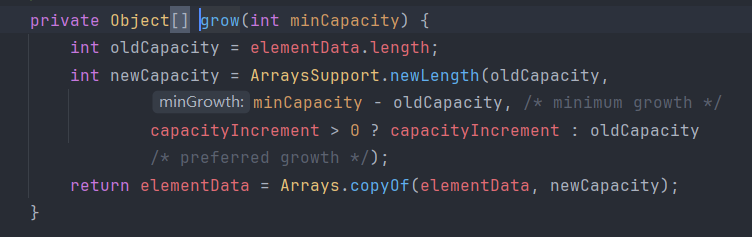
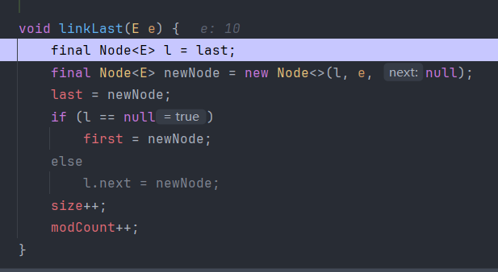

# 1. 栈

>栈是一种特殊的线性表，它只允许在一端进行插入和删除操作，它遵循的原则叫做：后进先出（LIFO, Last In First Out）， 最后压入栈的元素，最先被弹出， 先压入栈的元素，最后才被弹出

## 1.1 基于数组实现

- 用一个数组 `elements` 存储数据。
- 用一个整型变量 `size` 表示当前栈中元素的数量，同时也可以视为**下一个要插入元素的位置**。
- 栈顶就是数组的最后一个元素。
- `push` 往数组后面加，`pop` 从数组后面取

```java 
public class ArrayStack {  
    private int[] elements; // 用数组存元素  
    private int size;       // 当前元素数量  
    private static final int DEFAULT_CAPACITY = 10; // 初始容量  
  
    public ArrayStack() {  
        elements = new int[DEFAULT_CAPACITY];  
    }  
  
    // 扩容方法  
    public void grow() {  
        int[] newArray = new int[elements.length * 2];  
        for (int i = 0; i < elements.length; i++) {  
            newArray[i] = elements[i];  
        }  
        elements = newArray;  
    }  
  
    // 判断栈是否为空  
    public boolean isEmpty() {  
        return size == 0;  
    }  
  
    // 压栈操作  
    public void push(int value) {  
        if (size == elements.length) {  
            grow();  
        }  
        elements[size] = value;  
        size++;  
    }  
  
    // 出栈操作  
    public int pop() {  
        if (size == 0) {  
            throw new RuntimeException("栈为空");  
        }  
        int popElement = elements[size - 1];  
        size--;  
        return popElement;  
    }  
  
    // 查看栈顶元素  
    public int peek() {  
        if (size == 0) {  
            throw new RuntimeException("栈为空");  
        }  
        return elements[size - 1];  
    }  
  
    // 栈中元素个数  
    public int size() {  
        return size;  
    }  
}
```

>用数组实现栈的结构比较好理解，因为数组自带下标，所以出栈时直接访问最后一个下标的位置即可

```java
ArrayStack stack = new ArrayStack();  
  
System.out.println("开始入栈：");  
stack.push(10);  
stack.push(20);  
stack.push(30);  
System.out.println("当前栈顶元素是：" + stack.peek()); // 30  
  
System.out.println("出栈元素：" + stack.pop()); // 弹出 30
System.out.println("当前栈顶元素是：" + stack.peek()); // 20  
  
System.out.println("继续入栈：");  
stack.push(40);  
System.out.println("当前栈顶元素是：" + stack.peek()); // 40  
  
System.out.println("全部出栈：");  
while (!stack.isEmpty()) {  
    System.out.println(stack.pop());  
}
```

****
## 1.2 基于链表实现

```java
public class LinkedStack {  
    private static class Node {  
        int value;  
        Node next;  
  
        Node(int value, Node next) {  
            this.value = value;  
            this.next = next;  
        }  
    }  
  
    private Node top; // 栈顶  
    private int size; // 栈大小  
  
    public LinkedStack() {  
        top = null;  
        size = 0;  
    }  
  
    // 入栈（头插法）  
    public void push(int value) {  
        Node newNode = new Node(value, top);  
        top = newNode;  
        size++;  
    }  
  
    // 出栈  
    public int pop() {  
        if (top == null) {  
            throw new RuntimeException("栈为空");  
        }  
        int value = top.value;  
        top = top.next; // 类似于删除头节点，然后把下一个节点作为新的头节点  
        size--;  
        return value;  
    }  
  
    // 查看栈顶元素  
    public int peek() {  
        if (top == null) {  
            throw new RuntimeException("栈为空");  
        }  
        return top.value;  
    }  
  
    // 栈的大小  
    public int size() {  
        return size;  
    }  
}
```

```java
LinkedStack stack = new LinkedStack();  
  
System.out.println("开始入栈：");  
stack.push(100);  
stack.push(200);  
stack.push(300);  
System.out.println("当前栈顶元素是：" + stack.peek()); // 300  
  
System.out.println("出栈元素：" + stack.pop()); // 300  
System.out.println("当前栈顶元素是：" + stack.peek()); // 200  
  
System.out.println("继续入栈：");  
stack.push(400);  
System.out.println("当前栈顶元素是：" + stack.peek()); // 400  
  
System.out.println("全部出栈：");  
while (stack.size() != 0) {  
    System.out.println(stack.pop());  
}
```

****
## 1.3 LinkedList 实现栈

>`LinkedList` 是双向链表，可以在表头（也就是 index=0 的地方）快速进行插入删除，可以把 LinkedList 的表头当成栈顶，就能很快实现栈的功能

- `addFirst(E e)`：往头部加元素 -> 对应栈的 `push`
- `removeFirst()`：移除头部元素 -> 对应栈的 `pop`
- `getFirst()`：查看头部元素 -> 对应栈的 `peek`



>可以看到这个方法就是普通的头插法，只是正好把头节点对应成栈顶



>这个方法就是删除头节点，正好对应了栈的删除栈顶，



>这个就是获取头节点元素

```java
public class LinkedListStack {  
    private LinkedList<Integer> list = new LinkedList<>();  
  
    // 压栈  
    public void push(int value) {  
        list.addFirst(value);  
    }  
  
    // 出栈  
    public int pop() {  
        if (isEmpty()) {  
            throw new RuntimeException("栈为空，不能出栈！");  
        }  
        return list.removeFirst();  
    }  
  
    // 查看栈顶元素  
    public int peek() {  
        if (isEmpty()) {  
            throw new RuntimeException("栈为空，不能查看栈顶元素！");  
        }  
        return list.getFirst();  
    }  
  
    // 栈是否为空  
    public boolean isEmpty() {  
        return list.isEmpty();  
    }  
  
    // 栈元素数量  
    public int size() {  
        return list.size();  
    }  
}
```

****
# 1.4 Stack 类

>`Stack` 类继承自 `Vector` 类，所以它会继承 `Vector` 类中的一些方法，例如 `add`、`remove` 等。不过，栈本身的操作主要是通过以下几个方法来进行的

| 方法名                | 描述                     | 示例                  |
| ------------------ | ---------------------- | ------------------- |
| `push(E item)`     | 将元素压入栈顶                | `stack.push(10);`   |
| `pop()`            | 移除栈顶元素并返回它             | `stack.pop();`      |
| `peek()`           | 查看栈顶元素但不移除             | `stack.peek();`     |
| `isEmpty()`        | 判断栈是否为空                | `stack.isEmpty();`  |
| `search(Object o)` | 查找元素在栈中的位置，栈顶为 1，越靠下越大 | `stack.search(10);` |



>可以看到压栈操作是对一个数组进行添加元素然后下标后移，所以 Stack 类的底层其实是数组，由数组实现的栈



>因为底层是数组，所以有扩容操作，这个代码和 `ArrayList` 的扩容机制一样，所以也是扩容 1.5 倍

****
# 2. 队列

>队列是一种特殊的线性数据结构，它的特点是先进先出（FIFO, First In First Out）

## 2.1 基于数组实现

```java 
public class ArrayQueue {  
    private int[] elements;  
    private int front;  
    private int rear; // 指向下一个可以插入数据的位置  
    private static final int DEFAULT_CAPACITY = 10;  
  
    public ArrayQueue() {  
        elements = new int[DEFAULT_CAPACITY];  
        front = 0;  
        rear = 0;  
    }  
  
    // 扩容  
    public void grow() {  
        int[] newElements = new int[elements.length * 2];  
        for (int i = 0; i < elements.length; i++) {  
            newElements[i] = elements[i];  
        }  
        elements = newElements;  
    }  
  
    // 入队  
    public void enQueue(int value) {  
        if (rear == elements.length - 1) {  
            grow();  
        }  
        elements[rear] = value;  
        rear++;  
    }  
  
    // 出队  
    public int deQueue() {  
        if (front == rear) {  
            throw new RuntimeException("队列为空");  
        }  
        int value = elements[front];  
        front++;  
        return value;  
    }  
  
    // 查看对头  
    public int peek() {  
        if (front == rear) {  
            throw new RuntimeException("队列为空");  
        }  
        return elements[front];  
    }  
  
    // 队列长度  
    public int size() {  
        return rear - front;  
    }  
}
```

```java
ArrayQueue queue = new ArrayQueue();  
  
queue.enQueue(10);  
queue.enQueue(20);  
queue.enQueue(30);  
  
System.out.println(queue.deQueue()); // 10  
System.out.println(queue.peek());    // 20  
System.out.println(queue.deQueue()); // 20  
System.out.println(queue.size());    // 1
```

****
## 2.2 基于链表实现

```java
public class LinkedQueue {  
    private static class Node {  
        int value;  
        Node next;  
        Node(int value) {  
            this.value = value;  
            this.next = null;  
        }  
    }  
  
    private Node front; // 队头  
    private Node rear;  // 队尾  
    private int size;  
  
    public LinkedQueue() {  
        front = rear = null;  
        size = 0;  
    }  
  
    // 入队（尾插法）  
    public void enQueue(int value) {  
        Node newNode = new Node(value);  
        if (front == null) {  
            front = rear = newNode;  
        } else {  
            rear.next = newNode;  
            rear = newNode;  
        }  
        size++;  
    }  
  
    // 出队  
    public int deQueue() {  
        if (size == 0) {  
            throw new RuntimeException("队列为空");  
        }  
        int value = front.value;  
        front = front.next;  
        if (front == null) {  
            // 出队后队列为空则需要把队尾也置空  
            rear = null;  
        }  
        size--;  
        return value;  
    }  
  
    // 查看队头  
    public int peek() {  
        if (size == 0) {  
            throw new RuntimeException("队列为空");  
        }  
        return front.value;  
    }  
  
    // 队列长度  
    public int size() {  
        return size;  
    }  
}
```

```java
LinkedQueue queue = new LinkedQueue();  
  
queue.enQueue(100);  
queue.enQueue(200);  
queue.enQueue(300);  
  
System.out.println(queue.deQueue()); // 100  
System.out.println(queue.peek());    // 200  
System.out.println(queue.deQueue()); // 200  
System.out.println(queue.size());    // 1
```

****
## 2.3 循环数组实现队列

>数组遍历到尾部时就回到数组头部的位置，利用已出队的空数组，核心的思想就是利用 `front` 和 `rear` 下标循环访问数组
>*  `rear = (rear + 1) % 数组长度`
>* `front = (front + 1) % 数组长度`

```java
public class CircularArrayQueue {  
    private int[] elements;  
    private int front;  
    private int rear;  
    private int size;  
    private static final int DEFAULT_CAPACITY = 10;  
  
    public CircularArrayQueue() {  
        elements = new int[DEFAULT_CAPACITY];  
        front = 0;  
        rear = 0;  
        size = 0;  
    }  
  
    // 入队  
    public void enQueue(int value) {  
        if (size == elements.length) {  
            throw new RuntimeException("队列已满");  
        }  
        elements[rear] = value;  
        rear = (rear + 1) % elements.length; 
        // 循环插入数据，指针后移后再对数组的长度取模  
        size++;  
    }  
  
    // 出队  
    public int deQueue() {  
        if (size == 0) {  
            throw new RuntimeException("队列为空");  
        }  
        int value = elements[front];  
        front = (front + 1) % elements.length;  
        size--;  
        return value;  
    }  
  
    // 查看对头  
    public int peek() {  
        if (size == 0) {  
            throw new RuntimeException("队列为空");  
        }  
        return elements[front];  
    }  
  
    // 队列长度  
    public int size() {  
        return size;  
    }  
}
```

```java
CircularArrayQueue queue = new CircularArrayQueue();  
  
queue.enQueue(1);  
queue.enQueue(2);  
queue.enQueue(3);  
queue.enQueue(4);  
queue.enQueue(5);  
  
System.out.println(queue.deQueue()); // 1  
System.out.println(queue.deQueue()); // 2  
  
queue.enQueue(6);  
queue.enQueue(7);  
  
System.out.println(queue.peek());    // 3  
System.out.println(queue.deQueue()); // 3  
System.out.println(queue.size());    // 4
```

****
## 2.4 LinkedList 实现队列

>`LinkedList` 实现了 `Queue` 接口，并且它基于双向链表结构，提供了高效的插入和删除操作，所以可以实现队列

- **`offer(E e)`**：将元素添加到队列的尾部。
- **`poll()`**：移除并返回队列的头部元素。如果队列为空，返回 `null`。
- **`peek()`**：查看队列的头部元素，但不移除。如果队列为空，返回 `null`。
- **`isEmpty()`**：判断队列是否为空。



>虽然提供的队列的方法是 `offer` ，但实际上底层会进入 `linkLast` 方法，也就是尾插法

****
