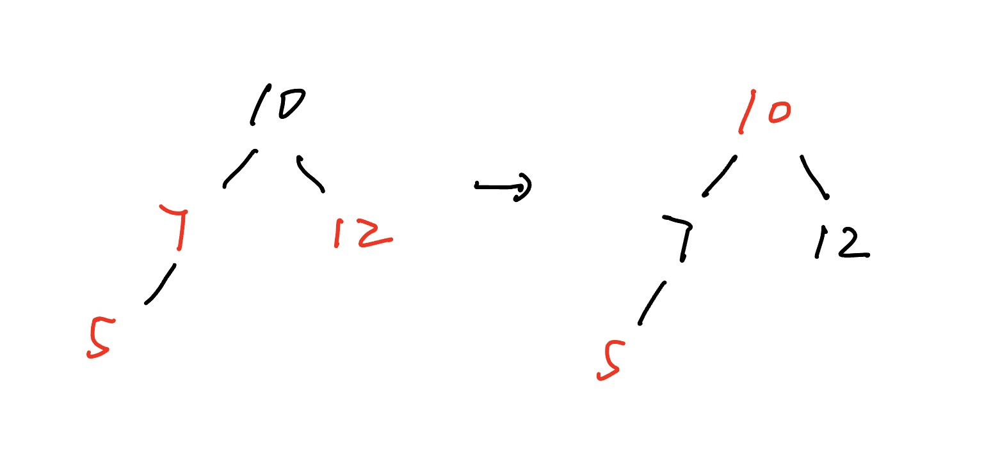
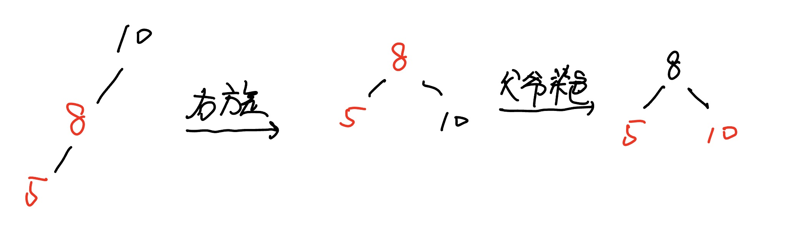

# 1. 二叉树

>二叉树是一个递归的数据结构，每个节点最多有两个子节点，通常二叉树是一种排序二叉树，每个节点的值大于或者等于在它左子树节点上的值，小于或者等于在它右子树节点上的值

```java
public class BinaryTree {  
    static class TreeNode{  
        int value;  
        TreeNode left;  
        TreeNode right;  
        public TreeNode(int value) {  
            this.value = value;  
        }  
    }  
  
    TreeNode root;  
  
    // 插入入口  
    public void insert(int val) {  
        root = insert(root, val);  
    }  
  
    // 插入（构建二叉搜索树）  
    public TreeNode insert(TreeNode node, int value) {  
        // 递归找到空位置时创建节点  
        if (node == null) {  
            return new TreeNode(value);  
        }  
  
        if (value < node.value) {  
            // 当前节点的值小于根节点就向左递归  
            node.left = insert(node.left, value);  
        } else if (value > node.value) {  
            // 当前节点的值大于根节点就向右递归  
            node.right = insert(node.right, value);  
        }  
        return node;  
    }  
  
    // 查找元素  
    public boolean search(TreeNode node, int value) {  
        if (node == null) {  
            return false;  
        }  
        if (value == node.value) {  
            return true;  
        }  
        if (value < node.value) {  
            return search(node.left, value);  
        } else {  
            return search(node.right, value);  
        }  
    }  
  
    // 前序遍历：根 -> 左 -> 右  
    public void preOrder(TreeNode node) {  
        if (node == null) {  
            return;  
        }  
        System.out.print(node.value + " ");  
        preOrder(node.left);  
        preOrder(node.right);  
    }  
  
    // 中序遍历：左 -> 根 -> 右（BST 中序遍历有序）  
    public void inOrder(TreeNode node) {  
        if (node == null) {  
            return;  
        }  
        inOrder(node.left);  
        System.out.print(node.value + " ");  
        inOrder(node.right);  
    }  
  
    // 后序遍历：左 -> 右 -> 根  
    public void postOrder(TreeNode node) {  
        if (node == null) {  
            return;  
        }  
        postOrder(node.left);  
        postOrder(node.right);  
        System.out.print(node.value + " ");  
    }  
  
    // 求树的高度  
    public int getHeight(TreeNode node) {  
        if (node == null) {  
            return 0;  
        }  
        int leftHeight = getHeight(node.left);  
        int rightHeight = getHeight(node.right);  
        int maxHeight;  
        if (leftHeight > rightHeight) {  
            maxHeight = leftHeight;  
        } else {  
            maxHeight = rightHeight;  
        }  
        return maxHeight + 1;  
    }  
  
    // 节点个数  
    public int countNodes(TreeNode node) {  
        if (node == null) {  
            return 0;  
        }  
        int leftCount = countNodes(node.left);  
        int rightCount = countNodes(node.right);  
        return leftCount + rightCount + 1;  
    }  
}
```

```java
BinaryTree tree = new BinaryTree();  
  
// 插入元素构建二叉搜索树  
int[] nums = {7, 4, 9, 2, 5, 8, 10};  
for (int num : nums) {  
    tree.insert(num);  
}  
  
System.out.print("前序遍历: ");  
tree.preOrder(tree.root); // 前序遍历: 7 4 2 5 9 8 10   
System.out.println();  
  
System.out.print("中序遍历: ");  
tree.inOrder(tree.root); // 中序遍历: 2 4 5 7 8 9 10 
System.out.println();  
  
System.out.print("后序遍历: ");  
tree.postOrder(tree.root); // 后序遍历: 2 5 4 8 10 9 7 
System.out.println();  
  
System.out.println("树的高度: " + tree.getHeight(tree.root)); // 树的高度: 3 
System.out.println("节点总数: " + tree.countNodes(tree.root)); // 节点总数: 7 
System.out.println("是否包含 5: " + tree.search(tree.root, 5)); // 是否包含 5: true 
System.out.println("是否包含 15: " + tree.search(tree.root, 15)); // 是否包含15:false
```

>因为每个节点的左节点小，右节点大，所以中序遍历出来的顺序正好就是所有元素排序后的顺序

****
# 2. 平衡二叉树

>平衡二叉树是一种特殊的二叉排序树，其中每一个节点的左子树和右子树的高度差至多等于1，它是一种高度平衡的二叉排序树，高度平衡就是要么它是一颗空树，要么它的左子树和右子树都是平衡二叉树，且左子树和右子树的深度只差的绝对值绝对不超过1

>将二叉树上节点的左子树深度减去右子树深度的值称为平衡因子BF，则平衡二叉树上所有节点的平衡因子只可能是1，-1，0

>最小不平衡子树：距离插入节点最近的，且平衡因子的绝对值大于1的节点为根的子树，称为最小不平衡子树

**实现原理**

>平衡二叉树构建的基本思想就是在构建二叉排序树的过程中，每当插入一个节点时，先检查是否因插入而破坏了树的平衡性，如果是，就找出最小不平衡树，并且在保持二叉排序树特性的前提下，调整最小不平衡子树中各节点之间的链接关系，进行相应的旋转，使之成为新的平衡子树

**旋转操作**

- 右单旋：插入在左子树的左侧导致不平衡
>当前节点的左孩子会作为新树的根节点，而当前节点则作为新树的根节点的右孩子
- 左单旋：插入在右子树的右侧导致不平衡
>当前节点的右子树会作为新树的根节点，而当前节点则作为新树的根节点的左子树
- 左右旋：插入在左子树的右侧导致不平衡
- 右左旋：插入在右子树的左侧导致不平衡

>如果新的树根原来有左子树，那这个原来的左子树就会作为当前节点（就根节点）的右子树

**LL型右旋**

```
        y
       /
      x
     / \
   T1   T2

```

```
      x
     / \
   T1   y
       / \
     T2   ?

```

>右旋后 y 会成为 x 的右孩子， T1 仍然是 x 的左孩子，不过 T2 会成为 y 的左孩子，为什么呢？因为二叉排序树的特性， x < T2 < y ，所以右旋后没地方可以去的 T2 只能成为 y 的左孩子

**RR型左旋**

```
  z
   \
    y
     \
      x

```

```
    y
   / \
  z   x
```

**LR型先左后右**

```
      z
     /
   y 
     \
       x
```

先对左子树进行左旋拉成 LL 型

```
      z
     /
    x
   /
  y
```

右旋

```
    x
   / \
  y   z
```

**RL型先右后左**

```
  z
   \
     y
   /
 x

```

先对右子树右旋拉成RR型

```
  z
   \
    x
     \
      y

```

左旋

```
    x
   / \
  z   y
```

**代码实现**

```java
public class AVLTree {  
    class AVLNode {  
        int value;  
        int height;  
        AVLNode left, right;  
        public AVLNode(int value) {  
            this.value = value;  
        }  
    }  
  
    // 创建根节点  
    private AVLNode root;  
  
    // 获取节点高度  
    public int height(AVLNode node) {  
        if (node == null) return 0;  
        return node.height;  
    }  
  
    // 计算平衡因子  
    private int getBalance(AVLNode node) {  
        if (node == null) return 0;  
        return height(node.left) - height(node.right);  
    }  
  
    // 右旋操作  
    private AVLNode rightRotate(AVLNode y) {  
        // 初始化孩子节点  
        AVLNode x = y.left;  
        AVLNode T2 = x.right;  
  
        // 右旋操作  
        x.right = y;  
        y.left = T2;  
  
        // 更新高度  
        y.height = Math.max(height(y.left), height(y.right)) + 1;  
        x.height = Math.max(height(x.left), height(x.right)) + 1;  
  
        return x;  
    }  
  
    // 左旋操作  
    private AVLNode leftRotate(AVLNode y) {  
        AVLNode x = y.right;  
        AVLNode T1 = x.left;  
  
        x.left = y;  
        y.right = T1;  
  
        y.height = Math.max(height(y.left), height(y.right)) + 1;  
        x.height = Math.max(height(x.left), height(x.right)) + 1;  
  
        return x;  
    }  
  
    // 插入节点并保持平衡  
    private AVLNode insert(AVLNode node, int value) {  
        // 排序二叉树的插入方式  
        if (node == null) {  
            return new AVLNode(value);  
        }  
        if (value < node.value) {  
            node.left = insert(node.left, value);  
        } else if (value > node.value) {  
            node.right = insert(node.right, value);  
        } else {  
            return node; // 不允许重复插入  
        }  
  
        // 更新当前节点高度  
        node.height = Math.max(height(node.left), height(node.right)) + 1;  
        // 获取平衡因子  
        int balance = getBalance(node);  
  
        // 插入后判断是否平衡  
        // LL型：右旋
        if (balance > 1 && value < node.left.value) {  
            return rightRotate(node);  
        }  
  
        // RR型：右旋  
        if (balance < -1 && value > node.right.value) {  
            return leftRotate(node);  
        }  
  
        // LR型：先左后右  
        if (balance > 1 && value > node.left.value) { 
	        // 先对左子树进行左旋，将返回的新节点赋值给当前节点的左子树 
            node.left = leftRotate(node.left); 
            return rightRotate(node);  
        }  
  
        // RL型：先右后左  
        if (balance < -1 && value < node.right.value) {  
            node.right = rightRotate(node.right);  
            return leftRotate(node);  
        }  
  
        // 走到这证明不需要调整平衡  
        return node;  
    }  
  
    public void insert(int value) {  
        root = insert(root, value);  
    }  
  
    // 中序遍历  
    public void inOrder(AVLNode node) {  
        if (node == null) return;  
        inOrder(node.left);  
        System.out.print(node.value + " ");  
        inOrder(node.right);  
    }  
  
    // 获取根节点  
    public AVLNode getRoot() {  
        return root;  
    }  
  
}
```

```java
AVLTree tree = new AVLTree();  
int[] values = {10, 20, 30, 40, 50, 25};  
  
for (int value : values) {  
    tree.insert(value);  
}  
  
System.out.print("中序遍历结果: ");  
tree.inOrder(tree.getRoot()); // 10 20 25 30 40 50
```

>`balance > 1 && value < node.left.value` 这段代码是用来判断是否为 LL 型的，`balance > 1` 代表左边的高度大于右边，即左子树不平衡，`value < node.left.value` 这段代码就是判断当前插入的值是插入左子树的左边还是右边，小于证明插入的是左子树的左边，即 LL 型，其余类型同理

****
# 3. 红黑树(简版)

>红黑树是在每个节点上增加一个存储位来表示节点的颜色，可以是红色或黑色，并通过一组规则保持树的“近似平衡”，从而保证最坏情况下的查找时间为 `O(log n)`

**规则**

- 每个节点是红色或黑色
- 根节点是黑色
- 每个叶子节点（NIL/null）都是黑色
- 红色节点的子节点必须是黑色（即不能有两个连续的红色节点）
- 从任一节点到其所有后代叶子节点的路径上，都包含相同数量的黑色节点（称为“黑高”）

>在 JDK 1.7 及之前的版本，`HashMap` 中存储冲突的元素时，是用链表来解决哈希冲突的，当哈希冲突严重时链表长度会很长，查找效率退化到 O(n)，性能严重下降，后面研发出了平衡二叉树，让整体的查找效率始终维持在 O(log n)，但是每次插入、删除都要频繁旋转和更新高度，最后选择了红黑树，它是弱平衡的二叉搜索树，使得插入、删除旋转的 次数更少，但整体平衡性并没有丧失多少

## 3.1 插入逻辑

- 按照 BST 插入规则插入新节点，初始颜色为红色
- 如果插入后不违反红黑性质，操作结束
- 否则，进行插入修复，根据当前节点、父节点和叔父节点的颜色决定如何处理

**插入修复**

>新节点若非根则染红，若插入后造成连续红则根据叔节点的颜色进行修复

**1、** 叔节点是红色（颜色调整）

>当新插入的节点的父节点和叔节点都是红色时，直接修改叔父爷的节点颜色，然后爷作为新的根节点，在插入过程的最后会强制将根节点置为黑色



****

**2、叔节点是黑色（或 null）-> 结构调整（旋转 + 变色）**

2.1 LL 型：右单旋，父、爷染色



>父指的是 8，爷指的是 10

2.2 RR 型：左单旋，父、爷染色

