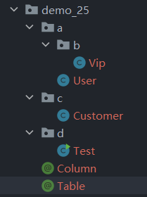

>注解本质上就是代码中的“标记”或“说明”，这些信息可以被编译器、开发工具、运行时环境读取并处理。

# 1. 自定义注解

```java
public @interface 注解名 {
    // 属性定义
    数据类型 属性名() default 默认值;
}
```

>使用 @interface 自定义注解时，自动继承了 java.lang.annotation.Annotation 接口，JVM 会自动将其编译成接口；在定义注解时，不能继承其他的注解或接口；@interface 用来声明一个注解，其中的每一个方法实际上是声明了一个配置参数，方法的名称就是参数的名称，返回值类型就是参数的类型，并且可以通过 default 来声明参数的默认值。

## 1.1 自定义注解的属性

| 类型类别          | 示例                                                                   |
| ------------- | -------------------------------------------------------------------- |
| 所有基本数据类型      | `int`, `float`, `double`, `boolean`, `long`, `short`, `byte`, `char` |
| `String` 类型   | 如：`String name()`                                                    |
| `Class<?>` 类型 | 如：`Class clazz()`                                                    |
| 枚举类型（`enum`）  | 如：`MyEnum type()`                                                    |
| 注解类型（嵌套注解）    | 如：`OtherAnnotation config()`                                         |
| 上述类型的数组形式     | 如：`String[] tags()`、`int[] values()`                                 |

>每个属性可以使用 `default` 关键字指定默认值，如果不给某个属性设置默认值，那么使用注解时必须显式为它赋值，否则系统会报错。
>
>注解不能有 null 值，也不支持 Map、List 。
>
>当某个属性是数组时，需要这样写 `@MyAnnotation(tags = {"A", "B", "C"})` ，只有一个元素时则可以省略大括号，`@MyAnnotation(tags = "A")` 

```java
public enum HttpMethod {  
    GET, POST, PUT, DELETE  
}

// 定义嵌套注解数组
public @interface Param {  
    String name();  
    Class<?> type();  
}

@Retention(RetentionPolicy.RUNTIME) // 告诉编译器 & JVM：这个注解在运行时也要保留，这样才可以在运行时通过反射拿到它  
@Target(ElementType.METHOD) // 让自定义的注解只能加在方法上  
public @interface MyAnnotation {  
    String author();                          // 字符串类型  
    int version() default 1;                  // 基本类型 + 默认值  
    boolean deprecated() default false;       // boolean 类型  
    HttpMethod method();                      // 枚举类型  
    Class<?> returnType();                    // Class 类型  
    Param[] params() default {};              // 嵌套注解数组  
}
```

>在方法上使用自定义的注解

```java
public class UserController {  
    @MyAnnotation(  
            author = "Cell",  
            version = 2,  
            deprecated = false,  
            method = HttpMethod.POST,  
            returnType = String.class,  
            params = {  
                    @Param(name = "userId", type = Integer.class),  
                    @Param(name = "userName", type = String.class)  
            }    )  
    public String createUser(int userId, String userName) {  
        return "User Created";  
    }  
}
```

****
## 1.2 通过反射机制获取注解信息

```java
public static void main(String[] args) throws Exception {  
    // 获取 UserController 类中名为 createUser 的方法，参数类型是 int 和 String    
    Method method = UserController.class.getMethod("createUser", int.class, String.class);  
    // 判断这个方法上是否有 @MyAnnotation 注解  
    if (method.isAnnotationPresent(MyAnnotation.class)) {  
        // 获取注解实例  
        MyAnnotation myAnnotation = method.getAnnotation(MyAnnotation.class);  
        System.out.println("作者: " + myAnnotation.author());  
        System.out.println("版本: " + myAnnotation.version());  
        System.out.println("方法类型: " + myAnnotation.method());  
        System.out.println("返回类型: " + myAnnotation.returnType().getSimpleName());  
  
        for (Param p : myAnnotation.params()) {  
            System.out.println("参数: " + p.name() + " - 类型: " + p.type().getSimpleName());  
        }  
    }  
}
```

| 方法名                                                                | 用途            | 说明                                     |
| ------------------------------------------------------------------ | ------------- | -------------------------------------- |
| `getAnnotation(Class<T> annotationClass)`                          | 获取指定类型的单个注解   | 没有该注解返回 `null`                         |
| `getAnnotationsByType(Class<T> annotationClass)`                   | 获取指定类型的所有注解   | 支持 `@Repeatable`，返回数组                  |
| `getAnnotations()`                                                 | 获取所有注解（包括继承的） | 返回的是 `Annotation[]`，包含 `@Inherited` 注解 |
| `getDeclaredAnnotation(Class<T>)`                                  | 获取该元素上声明的指定注解 | 不包含继承                                  |
| `getDeclaredAnnotations()`                                         | 获取该元素上声明的所有注解 | 不包含继承                                  |
| `isAnnotationPresent(Class<? extends Annotation> annotationClass)` | 判断是否存在某个注解    | 返回布尔值，推荐用于快速判断                         |

****
# 2. 元注解

>注解本身是通过 `@interface` 定义的类，但这些注解也可以被其他注解修饰，那些专门用于修饰注解的注解就叫做元注解

**四个常见的元注解：**

|元注解|作用|
|---|---|
|`@Target`|指定注解可以应用于哪些 Java 元素上|
|`@Retention`|指定注解在生命周期中的保留策略（源码、编译、运行）|
|`@Documented`|指定注解是否被 javadoc 文档包含|
|`@Inherited`|指定注解是否可以被子类继承|

****
## 2.1 @Target

```java
@Target(ElementType.METHOD)
```

**`ElementType` 可选值：**

|枚举常量|说明|
|---|---|
|`TYPE`|类、接口、枚举、注解|
|`FIELD`|成员变量（字段）|
|`METHOD`|方法|
|`PARAMETER`|方法参数|
|`CONSTRUCTOR`|构造器|
|`LOCAL_VARIABLE`|局部变量|
|`ANNOTATION_TYPE`|其他注解（用于嵌套注解）|
|`PACKAGE`|包|

```java
@Target({ElementType.METHOD, ElementType.TYPE})
```

>表示注解可以同时用在方法和类上


****
## 2.2 @Retention

```java
@Retention(RetentionPolicy.RUNTIME)
```

>表示注解会一直保留到程序运行时，并可通过反射读取

| 常量        | 生命周期        | 说明                       |
| --------- | ----------- | ------------------------ |
| `SOURCE`  | 仅存在于源码中     | 编译后丢弃，无法通过反射读取           |
| `CLASS`   | 编译时保留，运行时丢弃 | `.class` 文件中存在，但 JVM 不加载 |
| `RUNTIME` | 运行时保留       | 可反射读取                    |

****
## 2.3 @Documented

>使用该注解的类或方法在生成 Javadoc 时，该注解也会被包含进文档中（默认情况下注解不会出现在 Javadoc 中）

****
## 2.4 @Inherited

>某个类使用了该注解，那么它的子类自动继承这个注解

****
## 2.5 @Repeatable

1、**创建容器注解**：首先需要创建一个容器注解（例如 `Roles`），它的作用是保存多个相同类型的注解

2、**使用 `@Repeatable` 标记原注解**：使用 `@Repeatable` 元注解标记原注解（例如 `Role`），并指定该注解的容器注解类型（即 `Roles.class`）。

3、**应用多个注解**：可以在同一位置应用多个相同类型的注解（例如 `@Role("Admin")` 和 `@Role("User")`）

```java
@Retention(RetentionPolicy.RUNTIME)  
public @interface Roles {  
    Role[] value(); // 容器注解，包含多个 Role 注解  
}

@Repeatable(Roles.class) // 标记为可重复注解，指定其容器注解为 Roles
public @interface Role {  
    String value();  // 注解的属性，表示角色名  
}

public class RepeatableDemo {  
    @Role(value = "ADMIN")  
    @Role(value = "USER")  
    public void chooseRoel() {  
        System.out.println("I get two roles");  
    }  
}
```

****
# 3. 通过反射机制构造简易的框架

```java
/**  
 * 类中被 @Column 标注的属性要参与建表  
 */  
@Target(ElementType.FIELD)  
@Retention(RetentionPolicy.RUNTIME)  
public @interface Column {  
    // 字段的名字  
    String name();  
    // 字段的类型  
    String type() default "varchar";  
}
```

```java
/**  
 * 被 @Table 标注的类要生成建表语句  
 */  
@Target(ElementType.TYPE)  
@Retention(RetentionPolicy.RUNTIME)  
public @interface Table {  
    // 指定表的名字  
    String value();  
}
```

```java
public class Test {  
    private static String decodedPath;  
    private static StringBuilder sb = new StringBuilder();  
  
    public static void main(String[] args) throws Exception {  
        // 扫描类路径当中的所有文件，找到所有的 .class 结尾的文件  
        // 通过 .class 文件找到对应的全限定类名（带包名的）  
        // 获取当前线程的类加载器，使用类加载器获取当前类路径下的根目录，然后转换成 String 类型  
        String encodedPath  = Thread.currentThread().getContextClassLoader().getResource("com/cell/demo_25").getPath();  
        System.out.println("解码前路径：" + encodedPath );  
  
        // 使用 UTF-8 进行解码  
        decodedPath = URLDecoder.decode(encodedPath, StandardCharsets.UTF_8);  
        System.out.println("解码后路径: " + decodedPath);  
  
        // 创建 File 对象(目录)  
        File file = new File(decodedPath);  
        generateCreateStatement(file);  
        System.out.println(sb);  
    }  
  
    private static void generateCreateStatement(File file) throws Exception {  
        if (file.isFile()) { // 当 file 为文件时结束递归  
            String absolutePath = file.getAbsolutePath();  
            if (absolutePath.endsWith(".class")) {  
                // System.out.println(absolutePath);  
            }  
            // 将路径变成 . 的方式  
            String substring = absolutePath.substring(decodedPath.length(), absolutePath.length() - ".class".length());  
            // System.out.println(substring);  
            String className = "com.cell.demo_25." + substring.replace("\\", ".");  
            //System.out.println(substring.replace("\\", "."));  
            Class<?> clazz = Class.forName(className);  
  
            // 判断类上是否有 @Table 注解  
            if (clazz.isAnnotationPresent(Table.class)) {  
                Table table = clazz.getAnnotation(Table.class);  
                // 获取表的名字  
                String tableName = table.value();  
                //System.out.println(tableName);  
  
                sb.append("create table ").append(tableName).append(" (");  
  
                // 获取所有属性  
                Field[] declaredFields = clazz.getDeclaredFields();  
                for (Field field : declaredFields) {  
                    // 判断字段上是否有 @Column 注解  
                    if (field.isAnnotationPresent(Column.class)) {  
                        // 获取字段上的注解  
                        Column columnAnnotation = field.getAnnotation(Column.class);  
                        // 字段名  
                        String columnName = columnAnnotation.name();  
                        //System.out.println(columnName);  
                        // 字段类型  
                        String columnType = columnAnnotation.type();  
                        //System.out.println(columnType);  
  
                        sb.append(columnName).append(" ").append(columnType).append(",");  
  
                    }  
                }  
                // 删除最后一个逗号  
                sb.deleteCharAt(sb.length() - 1);  
                sb.append(");\n");  
            }  
  
            return;  
        }  
        File[] files = file.listFiles(); // 通过目录拿到所有的子文件  
        for (File f : files) {  
            generateCreateStatement(f);  
        }  
  
    }  
}
```

```
create table t_vip (id varchar,name varchar,grade int);
create table t_user (id varchar,name varchar,password varchar,age int);
create table t_customer (id varchar,name varchar,age int,address varchar);
```



****
