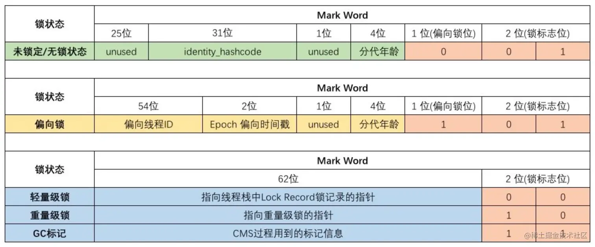

# 一.类

>类是对象的设计图,定义了对象的属性和行为,描述一类对象的共同特征,类是某中事物的抽象定义

## 1. 类的加载
### 1.1 类的装载

>这个过程是 jvm 将 .class 文件读进内存的过程

>jvm 会先找到 .class 文件,然后把这个文件存入方法区或运行时数据区,将 .class 文件转换成 Class 对象

>jvm 读取 .class 文件的内容,把类中的信息存放在方法区(Java8之前)/元空间(Java8之后)中,然后把创建好的 Class 对象存放在堆内存中

>所以说类的创建本身也是一种对象的创建,程序员写的类在加载时都会被加载成一个Class<类>类型的对象,这个对象就代表它本身这个类的结构和行为

```
例如创建一个Person类
class Person {
}

底层运行
Class<Person> 
```

>既然每个类在加载时都会被创建成一个Class类型的对象,那证明多个对象共享一个Class,就跟创建一个普通的对象一样,可以new很多个

**Class对象怎么来的?**

>Class 也是个普通的类,只不过是由官方写出来的,在编译时也是个 .class 文件,目前只知道这个应该够了...

****
### 1.2 类的连接

>验证字节码是否合法,给静态变量分配内存空间并设置默认值

1、验证

>确保 class 文件格式正确、合法，防止 JVM 崩溃，包括字节码验证、符号引用验证等

2、准备

>为类的静态变量分配内存，并设置默认值（不是初始化值）

3、解析

>将常量池中的符号引用（类名、方法名）解析为直接引用（内存地址指针）

****
### 1.3 类的初始化

>执行类的静态初始化块和静态变量赋初值

```
1. 调用类       --> Class.forName("...")
2. 检查缓存     --> 已加载则直接返回 Class 对象
3. 加载类字节码 --> 来自磁盘 / Jar / 模块系统 / CDS
4. 验证字节码   --> 格式、版本、符号检查等
5. 准备静态区   --> 分配内存，设置默认值（0/null）
6. 解析引用     --> 字符串 -> 类对象、字段、方法
7. 执行初始化   --> static {}、静态变量赋值
8. 完成         --> 类已加载、初始化，返回 Class 实例
```

****
# 2. 类的加载器

| 类加载器       | Java类名                                 | 加载内容                                        |
| ---------- | -------------------------------------- | ------------------------------------------- |
| **启动类加载器** | BootstrapClassLoader（C++ 实现，不是 Java 类） | 加载 `jre/lib` 下的核心类库（如 `rt.jar`）             |
| **扩展类加载器** | `sun.misc.Launcher$ExtClassLoader`     | 加载 `jre/lib/ext/*.jar` 或 `java.ext.dirs` 路径 |
| **应用类加载器** | `sun.misc.Launcher$AppClassLoader`     | 加载 `classpath` 指定路径中的类                      |

>


****
# 二.对象

>类的实例化,具有类的属性和方法

## 1.jvm内存分布(简易版)

>jvm主要的三个空间为:虚拟机栈,堆,方法区的实现(元空间)

**虚拟机栈**

>用来存储调用的方法的信息,每调用一个方法就会入栈一个栈帧,方法执行完就出栈,栈帧中包含了方法中的局部变量,操作数栈等东西

```
int i = 10;
Person p1 = new Person();
这两个都是局部变量,全部储存在栈帧中,只不过基本数据类型储存的就是值,而引用数据类型储存的却是一个地址,这个地址用来指向存放在堆中的信息
```

**堆**

>主要用来存放实例变量,也就是new出来的东西,这个变量里面会存储类的属性和方法,想要访问这些数据就需要知道这个变量的地址,也就是在栈帧中存储这个对象的地址,这也是为什么引用数据类型可以在方法中更改数据不受局部变量影响

**元空间**

>元空间存储的是类的元信息和字节码等,使用的是本地的内存,所有类的结构信息都会放进这里,并不只是new出来的才放进来,而大家共享的Class对象也在这个地方

## 2.创建对象

>通常使用new来创建一个实例对象

```
Person person = new Person();
这个person是引用变量,不存储真实的Person信息,它指向堆内存中的Person对象
```

>所以需要区分,放在栈中的是引用,放在堆中的是对象,引用是保存对象地址的变量,对象是被new出来的,需要借助 对象名(引用).属性名/方法名 来访问对象的信息

**Person person = new Person()**

>创建时首先会寻找.class文件,先从文件路径中找,也就是那个默认的地方,然后再从类路径中找,也就是各种导入和jar包,找到后就转换成Class对象,转换成Class对象后jvm就知道了你这个Person对象的结构是什么样的了,然后就可以通过类中的构造器来初始化字段(各种信息)然后才会放进堆中,最后把这个对象的地址返回给引用变量

**构造方法**

>jvm怎么知道我new的对象的构造方法是什么的呢?使用类中的方法不应该用 对象.方法名 来访问吗?

```Java
//编译器的转换字节码阶段
new           #2   → 从常量池加载类（Class 对象）,创建一个半成品对象,还没初始化
dup                 → 复制对象引用，为构造器调用准备
invokespecial #3   → 执行 `<init>` 方法（也在常量池,也就是元空间中）
```

```Java
person.sayHi();//调用对象的方法

aload_1              //把 person 对象加载到栈顶
invokevirtual #5     //从常量池调用 sayHi() 方法,#5 是常量池中 sayHi 方法的描述信息
```

>通过以上代码,可以看到,jvm在初始化或者调用对象的方法时,根本不是根据 对象名.方法名 来找到某个方法的,而是通过 对象名 这个引用变量(存放的真实对象的地址) 来找到堆中的信息,所以new对象时写的那个引用变量实际没什么用,写成person只是更好的知道当前创建的是Person对象

>所以调用构造器时,根据里面的参数列表,决定需要初始化的字段,没有的就使用成员变量的默认值,有的就根据里面的 this.name = "jack" 来赋值

```
修饰符 构造器名(参数列表)
需要注意的是,构造器不需要写返回类型,也不需要写return语句,但是他可以返回创建的对象的内存地址
这是和普通方法的最大区别,当没有手动写一个带参数的构造器时,系统会默认创建一个无参的构造器
```

**构造代码块**

>每一次new对象都会先执行一次代码块,并且在构造方法执行前执行的,调用方法时不会调用

```
{
	代码;
}
```

>构造代码块通常是用于多个构造器之间的统一初始化逻辑,例如打印日志,安全检查等,但是如果多个构造器的初始化逻辑不同,就不适用

## 3.对象也可以作为另一个对象的属性

>对象本体保存在堆内存中，而引用变量保存在Java虚拟机栈中。引用变量通过“地址”指向堆中的对象，访问对象属性时就是通过引用一步步“跳”到对应的堆地址，再取出属性值。如果一个对象作为另一个对象的属性，那属性本身是一个引用，也保存在堆中原对象的结构中，通过引用继续访问属性对象。

```Java
class School {
    Student student;
}

class Student {
    String name;
}

School school = new School();
school.student = new Student();//通过引用访问另一个引用指向的地址
```

****
## 4. 对象结构

>在 HotSpot 虚拟机中，每个 Java 对象的内存布局一般分为三部分：

```
-------------------------------------- 
| 对象头 | 实例数据(成员变量) | 对齐填充 |  
--------------------------------------
```

### 4.1 对象头

>对象头由 Mark Word 和 一个指向一个类对象的指针组成，在 64 位 JVM 中：

| 组成部分              | 字节数  | 说明                    |
| ----------------- | ---- | --------------------- |
| **Mark Word**     | 8 字节 | 存储对象的运行时数据（如哈希码、锁状态等） |
| **Klass Pointer** | 4 字节 | 指向对象的类型               |
| **数组长度字段**        | 4 字节 | 仅在数组对象中存在             |

- 普通对象头：`8 + 4 = 12` 字节，再加对齐填充（对齐到 8 的倍数）-> 最终为 16 字节

- 数组对象头：`8 + 4 + 4 = 16` 字节 -> 正好对齐，无需额外补齐

>因为 JVM 中的对象访问、对象分配等都依赖于 8 字节对齐规则（对象起始地址必须是 8 的倍数），否则访问效率会降低甚至导致错误

>当实例对象被 synchronized 关键字当成同步锁时，和锁相关的一系列操作都与 Mark Word 有关



1、最后两位是锁标志位，分别标识处于不同的锁模式，倒数第三位是偏向锁标志，剩余高位存储锁相关数据（如线程ID、锁记录指针、哈希码等）

2、无锁状态

| 字段                | 位数   | 含义                    |
| ----------------- | ---- | --------------------- |
| unused            | 25 位 | 空位或其他内部用途             |
| identity_hashcode | 31 位 | 存储对象的 hashCode        |
| unused            | 1 位  | 未使用                   |
| 分代年龄（age）         | 4 位  | 表示该对象在 JVM 中经历的 GC 次数 |
| 偏向锁位              | 1 位  | 0 表示未偏向               |
| 锁标志位              | 2 位  | 01 表示无锁状态             |

>这是对象默认状态下的 Mark Word，包含对象的一般运行信息

3、偏向锁状态

| 字段         | 位数   | 含义               |
| ---------- | ---- | ---------------- |
| 偏向线程ID     | 54 位 | 当前持有锁的线程 ID      |
| Epoch（时间戳） | 2 位  | 偏向锁的时间戳，用于判断是否失效 |
| unused     | 1 位  | 未使用              |
| 分代年龄       | 4 位  | GC 用             |
| 偏向锁位       | 1 位  | 1 表示开启偏向锁        |
| 锁标志位       | 2 位  | 01 表示偏向锁状态       |

>偏向锁是一种优化单线程加锁性能的机制，如果一个对象总是被同一个线程加锁，可以偏向这个线程，从而避免加解锁的开销

4、轻量级锁状态

| 字段                  | 位数   | 含义                     |
| ------------------- | ---- | ---------------------- |
| 锁记录的指针（Lock Record） | 62 位 | 指向当前线程栈帧中的 Lock Record |
| 锁标志位                | 2 位  | 00 表示轻量级锁              |

>当多个线程竞争一个对象锁时，JVM 会把偏向锁撤销，升级为轻量级锁

5、重量级锁状态

| 字段        | 位数   | 含义                |
| --------- | ---- | ----------------- |
| 指向重量级锁的指针 | 62 位 | 指向 monitor（互斥量）对象 |
| 锁标志位      | 2 位  | 10 表示重量级锁         |

>当轻量级锁竞争失败后，JVM 会把锁升级为重量级锁，线程会进入阻塞状态，等待操作系统调度

6、GC 标记状态

| 字段       | 位数   | 含义                          |
| -------- | ---- | --------------------------- |
| CMS 标记信息 | 62 位 | Concurrent Mark Sweep GC 使用 |
| 锁标志位     | 2 位  | 11 表示 GC 标记状态               |

>某些垃圾回收器会使用对象头中的 Mark Word 存储 GC 标记信息，用于标记清除或其他 GC 步骤

****

