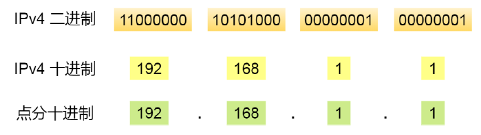
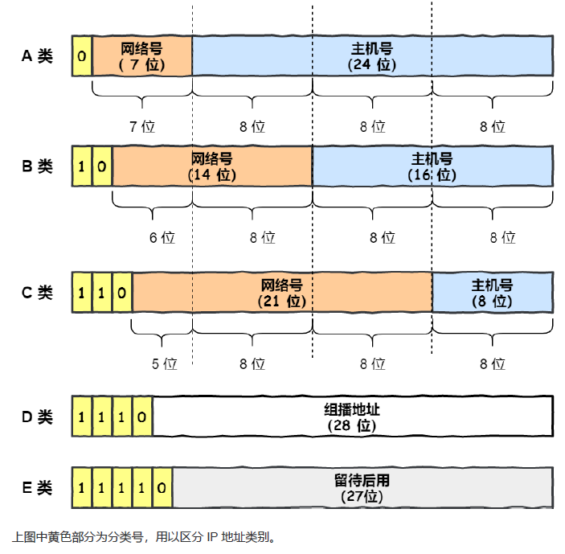
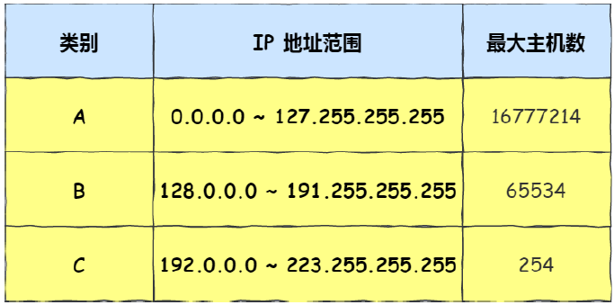
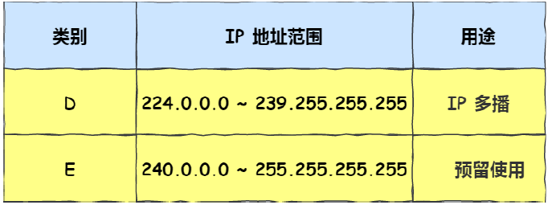
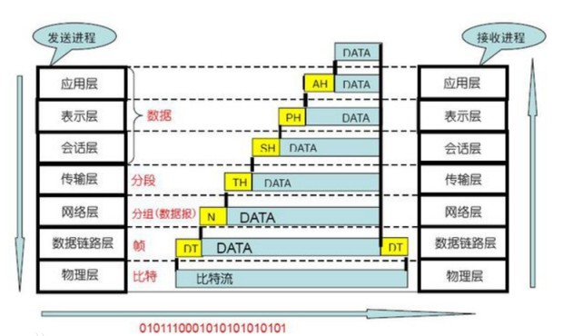
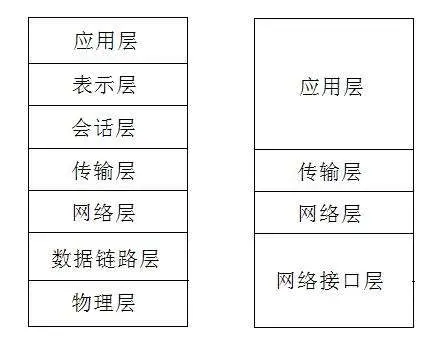
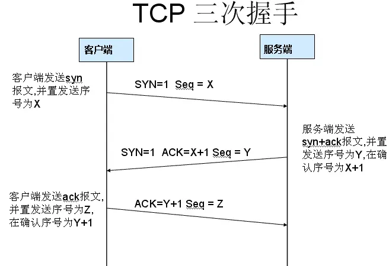
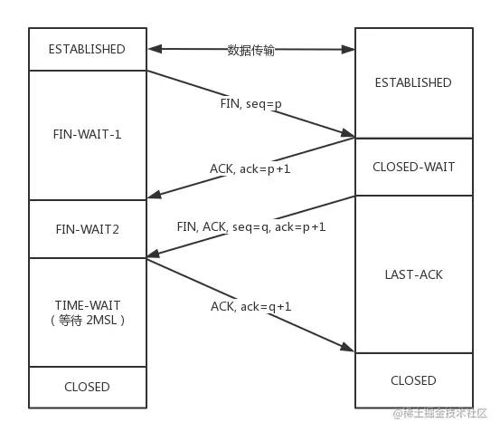
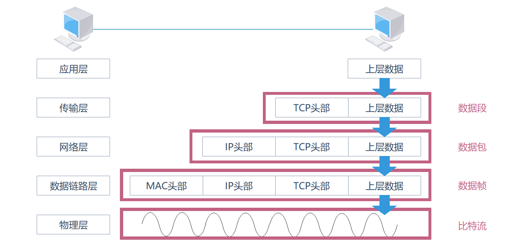

>利用计算机网络实现程序之间的一种编程方式，在网络编程中程序需要通过网络协议（如TCP/IP）进行通信，以实现不同计算机之间的数据传输和共享。

# 1. IP 地址

>IP 地址是为网络中的每一个设备分配的唯一地址，使其能够通过网络进行通信，每个 IP 地址必须在同一网络中是唯一的。

## 1.1 IP 地址的格式

>IPv4 地址是一个 32 位（bit）二进制数，而为了方便记忆采用了点分十进制的标记方式（xxx . xxx . xxx），也就是将 32 位 IP 地址以每 8 位为组，共分为 4 组，每组以 `.` 隔开，再将每组转换成十进制，每一个 `xxx` 的取值范围是 0 ~ 255，组合起来可以达到 2<sup>8</sup> · 2<sup>8</sup> ·2<sup>8</sup>  = 2<sup>32</sup> = 4294967296 个。




>IPv6 使用16个字节（1 个十六进制为 4 个二进制，即半个字节）表示 IP 地址（128位），总共分为八组，每组之间用 `:` 隔开，一组就是 4 位 16 进制（即 2 字节），通常前导 0 可以省略

```
2001:0db8:0000:0000:0000:ff00:0042:8329
即
2001:db8:0:0:0:ff00:42:8329
连续的 0 用 :: 表示（只能使用一次）
2001:db8::ff00:42:8329
```


****
## 1.2 IP 地址的组成

1、网络号（Net ID / 网络地址）

>网络号用于标识“设备所属的网络（网段）”，所有位于同一网段的设备，其网络号必须一致，不同网络号 = 不同网段，例如：192.168.1.0/24 中的 `192.168.1` 就是网络号。
>
>如果两个设备 IP 网络号不同，就算物理连着也不能通信，需要依赖三层设备（如路由器）来转发。

2、主机号（Host ID / 主机地址）

>用于标识“该网络中的某台具体设备”，同一个网段中的每个主机号必须唯一，不能重复，例如：192.168.1.10 中的 `10` 就是主机号部分

**假设有一个 IP 地址：`192.168.1.25/24`**

>`/24` 表示前 24 位是网络号（即：192.168.1），剩下的 8 位是主机号，所以网络号是：`192.168.1.0`，主机号是：`25`

>在这个网段中，合法主机号范围是：`192.168.1.1 ~ 192.168.1.254` （其中 `192.168.1.0` 是网络地址，`192.168.1.255` 是广播地址）

****
## 1.3 IP 地址分类

>互联网诞生之初，IP 地址显得很充裕，它被分类成了 5 种类型。



>A、B、C 类主要分为两个部分，分别是网络号和主机号。而 D 类和 E 类地址是没有主机号的，所以不可用于主机 IP，D 类常被用于多播，E 类是预留的分类，暂时未使用。





**IP 地址分类的优点：**

1、不同类型的网络有不同的地址需求。

- **A 类地址**适用于需要大量地址的组织（例如大型公司或 ISP）。

- **B 类地址**适用于中等规模的网络（例如中型公司或学校）。

- **C 类地址**适用于小型网络（如小企业或家庭网络）。

- **D 类和 E 类地址**则用于特定应用，如多播和保留地址。

2、通过 IP 地址的分类，可以确保每类地址在特定的网络需求下分配合适的数量，通过将 A、B、C 类地址区分开，能够避免小型网络占用过多的 IP 地址资源。

3、不同网络使用不同的地址类别可以有效避免地址冲突，特别是在较大的网络中，如果所有设备都使用相同的地址空间（没有分类）就可能导致地址重复，从而发生网络通信错误。IP 地址分类帮使得不同的网络设备在不同的地址范围内操作，从而避免冲突。

****
## 1.4 域名和 DNS

### 1.4.1 域名

>域名是互联网上某个服务器的可读名字，它本质上是对 IP 地址的一种别名，让 IP 地址以一种更好读的形式呈现

| 域名                                       | 对应 IP 地址      |
| ---------------------------------------- | ------------- |
| [www.baidu.com](http://www.baidu.com/)   | 110.242.68.3  |
| [www.google.com](http://www.google.com/) | 142.250.204.4 |

```
www.baidu.com
│    │     │
│    │     └── 顶级域（.com）
│    └─────── 二级域（baidu）
└─────────── 三级域（www）
```

****
### 1.4.2 DNS

>DNS 是域名系统，它的作用是将域名解析为 IP 地址，当在浏览器输入 `www.baidu.com` 时，DNS 会查出它的实际 IP 地址，然后浏览器就能访问到这个服务器。

****
# 2. 端口号（port）

>在计算机中，不同的应用程序是通过端口号区分的，端口号是一个 16 位的整数（2 个字节，无符号），范围从 0 到 65535，通常情况下服务器使用固定的端口号监听客户端的请求，而客户端则使用随机的端口连接服务器，必须同时指定 IP 地址和和端口号才能正确的发送数据

1、公认端口：

>范围：0 ~ 1023，这些端口号通常被操作系统和网络应用预留，用于常见的服务

2、注册端口

>范围：1024 ~ 49151，这些端口通常被应用程序使用，可以通过 IANA 注册，它们不如公认端口普遍，但仍有特定的应用程序使用

3、动态/私有端口

>范围：49152 ~ 65535，这些端口通常由客户端应用程序动态分配使用，尤其在进行短期或临时的连接时。


**在选择端口号时，通常需要考虑以下几个方面：**

- **避免使用已知的端口号**：如 80、443、21 等，它们是被操作系统或常见应用程序使用的。

- **选择一个高位端口**：一般来说，选择 1024 ~ 49151 之间的端口会更合适，避免和操作系统或常见服务冲突。

- **避免端口冲突**：确保应用程序监听的端口没有被其他程序占用。

- **考虑防火墙和网络配置**：某些端口可能会被防火墙阻挡，选择合适的端口避免网络问题。

**常见的端口号**

| 服务类型       | 端口号  |
| ---------- | ---- |
| HTTP       | 80   |
| HTTPS      | 443  |
| FTP        | 21   |
| SSH        | 22   |
| SMTP       | 25   |
| MySQL      | 3306 |
| PostgreSQL | 5432 |
| RDP (远程桌面) | 3389 |
| DNS        | 53   |
| Telnet     | 23   |
| POP3       | 110  |
| IMAP       | 143  |
| Tomcat     | 8080 |
****
# 3. 通信协议

1、通过计算机网络可以使多台计算机实现连接，位于同一个网络中的计算机在进行连接和通信时需要遵守一定的规则。就像两个人想要顺利沟通就必须使用同一种语言一样，如果一个人只懂英语而另外一个人只懂中文，这样就会造成没有共同语言而无法沟通。


2、在计算机网络中，这些连接和通信的规则被称为网络通信协议，它对数据的传输格式、传输速率、传输步骤等做了统一规定，通信双方必须同时遵守才能完成数据交换。


3、在计算机网络中，常用的协议有TCP、UDP、HTTP、FTP等。这些协议规定了数据传输的格式、传输方式和传输顺序等细节。其中，TCP（传输控制协议）是一种可靠的面向连接的协议，它提供数据传输的完整性保证；而UDP（用户数据报协议）则是一种无连接的协议，传输效率高。在网络编程中，需要选取合适的协议类型来实现数据传输。

****
# 4. OSI 七层模型

>OSI 七层模型（Open Systems Interconnection Model，开放式系统互联参考模型）是由国际标准化组织（ISO） 提出的一种网络通信模型标准，它将网络通信过程划分为七个层次，每一层都承担特定的功能，并为其上一层提供服务。



>第一层是物理层，第七层是应用层，发送方从最高层开始（应用层），从上到下按顺序传输数据，每一层都会对上层传下来的数据进行处理，并加上本层的首部信息，形成封装后的数据。而接收端则将顺序反过来，从首层开始（物理层），将数据的内容与该层对应的首部拆开，传给上一层。
>
>A 要将一件易碎品寄送给 B ，A 所在的快递站有一个由七人组成的打包小组，每个人只负责接收上一个人交过来的包裹，并在其外面再套上一层更大的盒子。最先处理的是第一位打包员（对应应用层），他将原始物品包好后交给第二位打包员（表示层），如此重复，直到第七位（物理层）完成了最终打包并送出包裹。当包裹送达 B 所在的快递站后，同样有七人负责拆包，他们按顺序每人只拆掉最外层的包装，然后交给下一个人处理，直到第七人（应用层）最终取出包裹中的原始物品交给B。

****
## 4.1 应用层（第 7 层）

>应用层是OSI七层模型中的第七层，也是最靠近用户的一层，它直接面向应用程序，提供用户与网络之间的接口。换句话说，用户通过应用层来使用网络，实现诸如发送电子邮件、浏览网页、文件传输等功能。**注意：应用层并不等同于应用程序，而是操作系统或网络框架中为应用程序提供网络服务的一层协议集合。**

### 4.1.1 应用层的作用

1、**为应用程序提供网络服务接口**  

>应用层协议定义了应用程序之间通信的规则，使不同主机上的应用程序可以进行数据交换。

2、**提供数据表示、加密和会话管理支持（部分与表示层/会话层重叠）**  

>在现实的网络模型（如TCP/IP）中，很多功能合并到了应用层中，例如数据的编码和格式转换（表示层的功能）、用户身份验证、访问控制等（会话层的功能）

3、**完成具体的网络功能，如邮件、文件传输、远程登录等**

****
### 4.1.2 常见应用层的协议

| 协议名称   | 全称                                  | 主要用途     |
| ------ | ----------------------------------- | -------- |
| HTTP   | HyperText Transfer Protocol         | 浏览网页     |
| HTTPS  | HTTP Secure                         | 加密网页传输   |
| FTP    | File Transfer Protocol              | 文件上传与下载  |
| SMTP   | Simple Mail Transfer Protocol       | 发送邮件     |
| POP3   | Post Office Protocol v3             | 接收邮件     |
| IMAP   | Internet Message Access Protocol    | 更复杂的邮件管理 |
| DNS    | Domain Name System                  | 域名解析     |
| DHCP   | Dynamic Host Configuration Protocol | 动态获取IP地址 |
| Telnet | 远程登录协议                              | 命令行远程访问  |
| SSH    | Secure Shell                        | 加密的远程登录  |

>这些协议负责解决“要干什么”，而不是“怎么传”或“怎么保证不丢”

****
### 4.1.3 应用层通信基本流程

1、在浏览器中输入网址 `https://www.baidu.com`

2、浏览器调用 DNS 协议，将域名转换为IP地址

3、建立与服务器的 TCP 连接（由下层完成）

4、浏览器使用 HTTP 或 HTTPS 协议，发送请求数据

5、服务器使用 HTTP 协议返回网页内容

6、浏览器解析内容并展示

****
## 4.2 表示层（第 6 层）

>表示层是第六层，它的主要解决通信双方在数据表示上的差异，确保发送方和接收方能够正确理解数据的格式和内容，应用层负责“做什么”，而表示层负责“怎么表达”。

### 4.2.1 核心功能

1、数据格式转换

>不同的计算机系统可能使用不同的数据表示方式（如字符编码、浮点表示等），表示层负责统一格式，使双方能正确解析数据。

2、数据压缩

>为了提高网络传输效率，表示层可以对数据进行压缩，减少传输的数据量。

3、数据加密与解密

>表示层可以在数据传输前进行加密，接收方在此层进行解密，从而确保通信的安全性。

| 功能      | 举例说明                                  |
| ------- | ------------------------------------- |
| 编码转换    | 发送方用 UTF-8 编码字符串，接收方用 GBK，需要转换        |
| 图像/音频压缩 | 视频会议中压缩音频和视频流，如 H.264 编码              |
| 加密处理    | 使用 SSL/TLS 加密网页传输数据                   |
| 数据结构转换  | 如结构体、对象的序列化与反序列化（Java 中的 JSON/XML 解析） |
****
### 4.2.2 基本流程

1、浏览器发送请求，请求一个网页（应用层）

2、表示层将网页内容以 UTF-8 编码、GZIP 压缩、SSL 加密（这一步由浏览器+协议共同完成）

3、数据下传到传输层、网络层等，最终通过物理链路传送

4、服务器接收数据后，反向进行 SSL 解密 -> GZIP 解压缩 -> UTF-8 解码 -> 交给应用程序处理

****
## 4.3 会话层（第 5 层）

>用来建立、管理、维护和终止通信双方之间的“会话”（Session）

### 4.3.1 主要功能

1、会话的建立、管理与终止

>确保通信双方知道“什么时候开始通话，什么时候结束通话”，类似于打电话：要先拨号接通（建立会话）、交谈（会话管理）、挂断（会话终止）

2、会话控制（同步与对话管理）

>控制通信方式（单向/双向、轮流/同时）：半双工（你说我听）；全双工（我们同时说）

3、会话恢复

>提供同步点（Sync Point）：在数据传输过程中设置检查点，当出错时从检查点恢复，而不是从头开始

****
## 4.4 传输层（第 4 层）

>传输层起着可靠传输的作用，只在通信双方节点进行处理，而不需在路由器上处理，此层有两个具有代表性的协议： `TCP` 与 `UDP` 

### 4.4.1 核心功能

1、端到端通信

>不像网络层只关注主机与主机之间的通信，传输层进一步关注主机中具体哪个应用程序之间的通信，通过端口号进行标识，实现应用到应用的通信。例如服务器可能同时支持 HTTP、FTP、TELNET 等多种服务，具体使用哪种服务，并不能单靠 IP 地址判断，而是根据客户端请求的端口号来区分。例如，访问端口 80 就表示客户端希望使用 HTTP 协议，服务器便会将数据交给 HTTP 服务程序处理。

2、可靠的数据传输

- **数据分段与重组**（Segmenting and Reassembly）

- **确认应答机制（ACK）**

- **重传机制（Timeout & Retransmission）**

- **序号与乱序重排（Sequencing）**

- **差错检测（如校验和）**

3、流量控制

>解决发送方太快、接收方太慢的问题，控制发送速率，防止接收方缓冲区溢出

****
### 4.4.2 基本流程（TCP 协议）

1、连接建立 -- 三次握手

>客户端与服务器通过三次消息交互建立连接，确认彼此的发送与接收能力

2、数据传输 -- 数据包段处理、排序、校验

>传输中进行编号、确认、差错检测与重传等，确保数据可靠送达

3、连接终止 -- 四次挥手

>传输完成后，由双方协商关闭连接，释放资源

****
## 4.5 网络层（第 3 层）

>网络层负责将数据传输到目标地址，目标地址可以使多个网络通过路由器连接而成的某一个地址。因此这一层主要负责寻址和路由选择，主要由 `IP`、`ICMP` 两个协议组成。

### 4.5.2 核心功能

1、路由选择

>网络层决定数据包从源设备到目标设备的路径，它通过路由器（Router）来转发数据包，选择一条最佳路径。路由选择的依据是路由表，路由器根据路由表的内容来决定如何将数据包传递到下一个网络。

2、逻辑寻址

>网络层使用 IP 地址来标识设备，确保数据包能够跨越不同的网络传输，IP 地址是网络层的逻辑地址，与物理地址（如MAC地址）不同，IP地址具有可路由性，只要知道其 IP 地址，就可以通过网络层找到它。

3、数据包封装与解封装

>网络层负责将上层传递的数据（如传输层的数据段）封装为数据包，数据包中会包含源 IP 地址和目标 IP 地址，这样在转发过程中，路由器可以通过这些信息进行路由选择。

****
## 4.6 数据链路层（第 2 层）

>它的主要任务是确保在同一物理网络内的设备之间能够可靠地传输数据。换句话说，数据链路层负责将来自网络层的数据封装成可以在物理介质（如电缆、光纤、无线信号）上可靠传输的帧。

****
## 4.7 物理层（第 1 层）

>将数据的 0、1 转换成电信号或者光信号。通过光纤、双绞线甚至是无限电波等介质传输到指定的地址，而传输过程中的集线器、中继器、调制解调器等，也属于物理层的传输介质。

****
# 5. TCP/IP

## 5.1 TCP/IP 模型

>TCP/IP 协议模型（Transmission Control Protocol/Internet Protocol），包含了一系列构成互联网基础的网络协议，是 Internet 的核心协议。基于 TCP/IP 的参考模型将协议分成四个层次，它们分别是网络接口层（链路层）、网络层、传输层和应用层。



1、网络接口层（对应 OSI 模型：物理层 + 数据链路层）

>负责物理设备之间的数据传输，如以太网/Wi-Fi，包含硬件地址（如 MAC 地址）、帧格式、校验等，不同类型的网络都在这一层统一抽象，隐藏物理差异。

2、网络层（对应 OSI 模型：网络层）

[4.5 网络层](网络编程.md#4.5%20网络层)

3、传输层（对应 OSI 模型：传输层）

[4.4 传输层](网络编程.md#4.4%20传输层)

4、应用层（对应 OSI 模型：会话层 + 表示层 + 应用层）

>应用层定义了通信双方在应用程序中如何交互，它负责通信双方之间“要做什么”。

| 功能       | 说明                              |
| -------- | ------------------------------- |
| 提供服务接口   | 向用户程序提供访问网络的接口，如浏览网页、收发邮件等      |
| 协议定义     | 规定通信双方在应用层交互时的规则，比如数据格式、命令语法    |
| 数据封装     | 把应用数据打包成规定的格式，再交给传输层处理          |
| 安全控制（部分） | 某些协议支持认证、加密等（如 HTTPS、SMTP AUTH） |
| 服务标识     | 使用端口号标识服务（如 HTTP 的 80 端口）       |

****
## 5.2 TCP 和 UDP 的区别

>TCP 是一个面向连接的、可靠的、基于字节流的传输层协议，而 UDP 是一个面向无连接的传输层协议

### 5.2.1 TCP 的特性

1、面向连接

>TCP 需要三次握手建立连接：客户端 -> 服务端 -> 客户端 -> 服务端，这种机制确保双方通信之前彼此准备好了，断开连接也需要四次挥手

2、可靠传输

- 数据确认：每个收到的数据包都要确认
- 超市重传：丢包后自动重发
- 流量控制：使用滑动窗口限制发送方速率，防止接收方来不及处理（在发送数据时发送方不能想发多少就发多少，必须根据接收方的处理能力（接收缓冲区大小）来限制自己一次性能发多少数据）
- 拥塞控制：根据网络情况动态调整速率，避免网络拥堵
- 顺序到达：有序编号，接收方按顺序组装数据

3、面向字节流

>虽然应用程序和 TCP 的交互是一次一个数据块（大小不等），但 TCP 把数据看作无边界的连续字节流，程序写入的数据会被划分成合适大小的数据段，接收方要自己分割出完整数据（如一条消息可能分成两包）

>报文段是 TCP 实际在网络上传输的数据单位，在网络上传输时，必须把字节流切割为报文段才能发送控制信息或数据

****
### 5.2.2 UDP 的特性

1、无连接

>发送前不建立连接，直接发数据，没有三次握手、没有状态记录，适合快速、简洁的通信

2、不可靠

>不保证是否到达，也不确认接收；没有顺序编号，可能乱序；没有拥塞控制，不考虑网络负载

3、面向报文

>一次发送一个数据报，报文边界明确：一次 `send()` 对应一次 `recv()` ，接收方一次最多接收一个完整报文，不能自动拼接多个数据包

****
### 5.2.3 通信协议的选择

1、当对网络通讯质量有要求的时候，比如：整个数据要准确无误的传递给对方，这往往用于一些要求可靠的应用，比如 HTTP、HTTPS、FTP 等传输文件的协议，POP、SMTP 等邮件传输的协议

2、当对网络通讯质量要求不高的时候，要求网络通讯速度能尽量的快，这时就可以使用UDP，比如 DNS、视频通讯等

****
## 5.3 TCP连接的建立与终止

### 5.3.1 三次握手

#### 1. 流程



1、第一次握手：

>建立连接，客户端向服务器发送连接请求并发送一个 SYN 报文段，报文中将 `SYN = 1`（表示请求建立连接），`Sequence Number = x`（客户端未来发送数据的序号从 x 开始，虽然当前报文没有数据，但 SYN 报文本身也占用一个序号），发送完毕后，客户端进入 `SYN_SENT` 状态，等待服务器响应

2、第二次握手：

>服务器收到客户端的 SYN 报文段，表示接收到连接请求，然后对客户端的 SYN 报文进行确认：`Acknowledgment Number = x + 1`，（已经收到了客户端 x 的 SYN 报文，并期望下一个接收的是 x + 1，即客户端正式发送数据时的第一个字节），同时向客户端发送自己的 SYN 报文：`SYN = 1`，`Sequence Number = y`，这两个信息是封装在同一个报文段中的（SYN + ACK），此时服务器进入 `SYN_RECEIVED` 状态，等待客户端的最终确认

3、第三次握手：

>客户端收到服务器发来的 SYN + ACK 报文段后，确认成功，然后向服务器发送一个 ACK 报文段：`ACK = 1`、`Acknowledgment Number = y + 1`，客户端此时进入 `ESTABLISHED` 状态，当服务器收到 ACK 后，进入 `ESTABLISHED` 状态，连接建立成功，双方可以开始数据通信

****
#### 2. 序列号（`Sequence Number`）和确认号（`Acknowledgment Number`）

1、**序列号**（`Sequence Number`）

>用于标记发送的数据字节的位置，每个字节都有一个唯一的序列号，**SYN** 标志也占用一个序列号，但它本身没有数据
>
>在三次握手中，序列号用于标识数据包的顺序，确保数据按序到达。即使某些包丢失或延迟，接收方也能根据序列号对数据包进行排序

2、**确认号**（`Acknowledgment Number`）

>它告诉对方自己已经收到哪个数据包，并且下一次期望接收到哪个数据包（下一个接收到的字节的序列号）

****
#### 3. 三次握手保证了通信的双向可达性

```
第一次握手：客户端(SYN_SENT) -> 服务器(LISTEN)，希望建立连接并确认服务器能接收

第二次握手：服务器(ESTABLISHED) -> 客户端(SYN_RECEIVED)，服务器确认能接收并需要确认客户端也能接收

第三次握手：客户端(ESTABLISHED) -> 服务器(ESTABLISHED)，客户端确认能接收，此时可以传递信息
```

>每一次的确认都涉及双方的状态，只有在双方都确认彼此可以互相发送和接收数据后，连接才会真正建立，通信才能开始

****
#### 4. 为什么是三次？

**1、如果是两次握手**

>客户端和服务器分别发送和确认连接请求，但客户端无法确认是否能够接收到服务器的响应，因为客户端只发送了请求报文（SYN），如果该请求包在网络中滞留或丢失，服务器就会错误地认为客户端未能发起连接请求，此时客户端就会重新发送报文，如果第一次的请求包又到达了服务器中，服务器就又会认为要建立连接，但此时的客户端可能已经断开了，就会造成资源的浪费，只有三次握手时，进行第三次的确认，才会发送后续的数据

2、如果是四次握手

>虽然四次握手也可以完成同样的目标，但并没有额外的好处，多余的握手反而会浪费更多的时间和资源，每一次握手都会带来一定的延迟，如果握手次数过多就会明显的影响连接的建立

****
### 5.3.2 四次挥手



#### 1. 流程

1、第一次挥手：

>客户端发送一个 FIN 报文段，该报文段包含 `FIN = 1` 和 `Sequence Number = x`，表示客户端已经没有数据要发送了，准备关闭连接并进入 **`FIN_WAIT_1`** 状态，等待服务器确认关闭请求

2、第二次挥手：

>服务器接收到客户端发送的 FIN 报文段后确认收到了关闭请求，并向客户端发送一个 ACK 报文段 `Acknowledgment Number = x + 1`（此时服务器仍然可以继续发送数据，连接未完全关闭），客户端进入 **`FIN_WAIT_2`** 状态，等待服务器的关闭请求，服务器进入 **`CLOSE_WAIT`** 状态，表示它同意关闭连接，但可能还会继续发送数据

3、第三次挥手：

>服务器准备关闭连接，向客户端发送 **FIN** 报文段，该报文段包含 `FIN = 1` 和 `Sequence Number = y` ，服务器进入 **`LAST_ACK`** 状态，等待客户端的最终确认

4、第四次挥手：

>客户端收到服务器发送的 **FIN** 报文段后，发送 **ACK** 报文段 `Acknowledgment Number = y + 1`，确认接收到服务器的 `FIN` 请求，客户端进入 **`TIME_WAIT`** 状态，客户端等待 2MSL（最大报文段寿命）后才关闭连接，确保服务器能够收到 ACK 报文段。服务器收到客户端的 **ACK** 报文段后，连接完全关闭，进入 **`CLOSED`** 状态

**在挥手过程中，序列号用于标识关闭连接的顺序，确保双方都按照正确的步骤关闭连接。确认号用于告知对方已收到关闭连接请求，确保双方都同意关闭连接**

****
#### 2. 等待 2MSL 的意义

>MSL 是一个 TCP 报文在网络中可能存在的最长时间，TCP 协议要求一个 TCP 报文在网络中最多存活 MSL 时间，而 2MSL 就是这个时间的两倍

>如果主动关闭方（客户端）发送 ACK 报文在传输过程中丢失，被动关闭方就会重新发送 FIN 报文（表示服务器即将关闭），如果客户端没有等待，那么就无法接收到 FIN 报文并返回 ACK 报文，那么服务器就永远无法关闭

****
#### 3. 为什么是四次？

>因为服务器在接收到 `FIN` ，往往不会立即返回 `FIN` ， 必须等到服务端所有的报文都发送完毕了，才能发 `FIN`。因此先发一个 `ACK` 表示已经收到客户端的 `FIN`，延迟一段时间才发 `FIN`。这就造成了四次挥手。

**如果是三次挥手会有什么问题？**

>等于说服务器将`ACK` 和 `FIN` 的发送合并为一次挥手，这个时候长时间的延迟可能会导致客户端误以为`FIN`没有到达客户端，从而让客户端不断的重发`FIN`。

****
# 6. 数据包的封装



1、应用层

>将用户输入的请求（比如浏览网页）变成符合协议格式的数据，并转交给传输层。浏览器负责组织出一个 HTTP 请求（如 GET /image.png，本质上是一串字符串），然后调用操作系统底层的网络 API 将字符串编码成二进制，此时应用层的输出：结构化协议数据（如 HTTP 请求头 + body），编码后的一串二进制字节流

2、传输层

>在传输层，上层数据被分割成小的数据段，并为每个分段后的数据封装 TCP 报文头部。在 TCP 头部有一个关键的字段信息 —— 端口号，它用于标识上层的协议或应用程序，确保上层应用数据的正常通信。

3、网络层

>给 TCP 报文段加上 IP 头，形成 IP 包，标明发送者与接收者的地址。在 IP 头部中包含目标 IP 地址和源 IP 地址，在网络传输过程中的一些中间设备，如路由器，会根据目标IP地址来进行逻辑寻址，找到正确的路径将数据转发到目的端主机。如果中间的路由设备发现目标的 IP 地址是不可能到达的，它将会把该消息传回发送端主机，因此在网络层需要同时封装目标 IP 和源 IP 。

4、数据链路层

>给 IP 包加上 MAC 地址等信息，生成帧，适配本地物理链路通信。

5、物理层

>将最终的二进制比特流转成真正可传输的电信号、光信号或无线信号。

****
# 7. Http 协议

## 7.1 Http 报文结构


